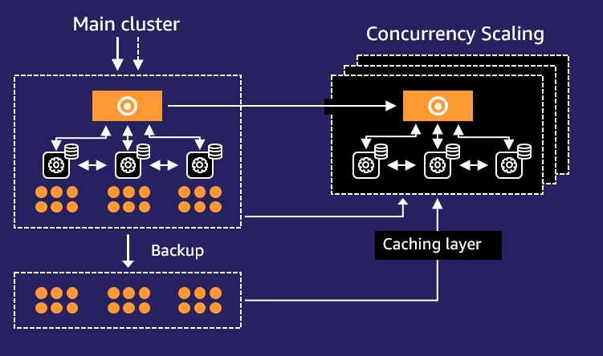

## Question 

With ``AWS Glue``, you only pay for the time your ETL job takes to run. You are charged an hourly rate based on the number of Data Processing Units (DPU) to run your ETL job. A Data Processing Unit can also be referred to as a worker, which is the processing power of your ETL job.

The graph illustrates the maximum number of allocated executors, represented by a horizontal red line, which correlates with the number of Data Processing Units (DPUs) designated for the job; in this scenario, 10 DPUs are allocated. The AWS Glue console presents job metrics, including executor allocation based on DPUs for each job run. For in-depth analysis, select a job run and opt for ‘View run metrics’ to examine detailed performance data.

You can use the ``Job Run Monitoring`` section in the AWS Glue console **to determine the appropriate DPU capacity needed**. The job monitoring section of the ``AWS Glue`` console **uses the results of previous job runs to specify the proper DPU capacity**.

1. [Monitoring for DPU capacity planning](https://docs.aws.amazon.com/glue/latest/dg/monitor-debug-capacity.html)
2. [Continuous logging for AWS Glue jobs](https://docs.aws.amazon.com/glue/latest/dg/monitor-continuous-logging.html)

## Question 

``Amazon Redshift`` is a fully managed cloud data warehouse that makes analyzing all your data simple and cost-effective. Using ``Amazon Redshift Spectrum`` can efficiently query and retrieve structured and semi-structured data from files in Amazon S3 without having to load the data into ``Amazon Redshift`` Tables.

``Amazon S3 Glacier storage`` classes are purposely built for data archiving that provides the highest performance and the lowest cost archive storage in the cloud.

1. [Managing your storage lifecycle](https://docs.aws.amazon.com/AmazonS3/latest/userguide/object-lifecycle-mgmt.html)

## Question 

In ``Amazon SQS``, **several events can lead to the removal of messages**, which is crucial for ensuring the queue’s efficiency and reliability. 
* A ``DeleteMessage API`` call is a direct method to remove a message from the queue, typically after it has been processed by a consumer. This ensures that messages are not processed more than necessary. 
* Reaching the ``maxReceiveCount`` for a message is another way messages are removed; this occurs when a message has been received a specified number of times but not deleted, indicating processing issues and usually results in the message being sent to a dead-letter queue. 
* Furthermore, ``performing a purge operation on the queue`` instantly clears all messages, useful for resetting or troubleshooting the queue.
1. [Working with Amazon SQS messages](https://docs.aws.amazon.com/AWSSimpleQueueService/latest/SQSDeveloperGuide/working-with-messages.html)
2. [Amazon SQS dead-letter queues](https://docs.aws.amazon.com/AWSSimpleQueueService/latest/SQSDeveloperGuide/sqs-dead-letter-queues.html)
3. [Purging messages from an Amazon SQS queue (console)](https://docs.aws.amazon.com/AWSSimpleQueueService/latest/SQSDeveloperGuide/sqs-using-purge-queue.html)

## Question 

Using an ephemeral volume provided by the node’s RAM in ``Amazon EKS`` is the most efficient approach for achieving the lowest latency. ``Amazon EKS``, a managed Kubernetes service, **orchestrates container deployment on nodes, which can be ``EC2 instances`` or managed through ``AWS Fargate``**. Ephemeral volumes, tied to the pod’s lifecycle, can swiftly access the node’s local resources like drives or RAM. Since the requirement does not involve data sharing between containers and focuses on low-latency access, local storage like node RAM is ideal.

1. [Storage](https://docs.aws.amazon.com/eks/latest/userguide/storage.html)
2. [Persistent storage for Kubernetes ](https://aws.amazon.com/blogs/storage/persistent-storage-for-kubernetes/)
3. [Amazon EKS nodes](https://docs.aws.amazon.com/eks/latest/userguide/eks-compute.html)

## Question 

``Amazon Elastic File System`` is a scalable file storage service you can integrate with AWS Lambda or other compute options. ``Amazon EFS`` is a serverless solution that allows your compute resources in AWS to share data without provisioning or managing storage capacity and performance.

``Amazon EFS`` offers a seamless, scalable, and fully managed NFS file system that perfectly aligns with the requirements for shared access and concurrent processing capabilities needed for AWS Lambda functions. While other storage solutions offer access sharing, Amazon EFS is the best solution for the scenario since the company must host the migrated data in an NFS file system.

1. [What is Amazon Elastic File System?](https://docs.aws.amazon.com/efs/latest/ug/whatisefs.html)
2. [Choosing an Amazon FSx File System](https://aws.amazon.com/fsx/when-to-choose-fsx/)
3. [Configuring file system access for Lambda functions](https://docs.aws.amazon.com/lambda/latest/dg/configuration-filesystem.html)
   
## Question 

``Amazon AppFlow`` is a fully-managed integration service **that enables you to securely exchange data between software as a service (SaaS) applications, such as Salesforce, and AWS services, such as Amazon Simple Storage Service (Amazon S3) and Amazon Redshift**. For example, you can ingest contact records from Salesforce to Amazon Redshift or pull support tickets from Zendesk to an Amazon S3 bucket.

``AppFlow`` relieves you from investing significant time and highly skilled developer staff to build and maintain custom API connectors for AWS services to exchange data with SaaS applications. SaaS application administrators and business analysts can quickly implement most of the integrations they need without waiting months for IT to finish integration projects.

1. [What is Amazon AppFlow?](https://docs.aws.amazon.com/appflow/latest/userguide/what-is-appflow.html)
2. [Amazon AppFlow](https://aws.amazon.com/appflow/)

## Question 

``Amazon EMR`` **uses an external database to store metadata about the tables, schema, and other Hive data structures**. The company’s data engineers would need to create an ``Amazon Aurora`` **database (either MySQL or PostgreSQL) that will serve as the Hive metastore**. This is a crucial step because the Hive metastore is a central repository of Hive metadata. It persists metadata for Hive tables and partitions in a relational database, and provides high availability, and ease of use.

``Hive`` uses ``JDBC to connect to the metastore database``. The data engineers would need to **modify the security groups of both the ``Amazon EMR`` cluster and the ``Amazon Aurora database`` to allow these connections**. This is important because the security group acts like a virtual firewall that controls the traffic for one or more instances. When you launch an instance, you can associate one or more security groups with the instance. You add rules to each security group that allow traffic to or from its associated instances.

Set JDBC configuration values in ``hive-site.xml``. This involves creating a configuration file called ``hiveConfiguration.json`` containing edits to ``hive-site.xml``. This file specifies the JDBC connection parameters that Hive uses to connect to the metastore database. The data engineers would need to set the appropriate JDBC configuration values in this file to point to the Amazon Aurora database. This is necessary because the ``hive-site.xml`` file **is where Hive reads the configuration for the metastore connection, among other settings**. The JDBC connection parameters that Hive uses to connect to the metastore database are defined in this file.

You have two options for an **external metastore**:

* ``AWS Glue Data Catalog`` (Amazon EMR release 5.8.0 or later only).
* ``Amazon RDS`` or ``Amazon Aurora``.

1. [Using an external MySQL database or Amazon Aurora](https://docs.aws.amazon.com/emr/latest/ReleaseGuide/emr-hive-metastore-external.html)
2. [Configuring an external metastore for Hive](https://docs.aws.amazon.com/emr/latest/ReleaseGuide/emr-metastore-external-hive.html)
3. [Migrate and deploy your Apache Hive metastore on Amazon EMR](https://aws.amazon.com/blogs/big-data/migrate-and-deploy-your-apache-hive-metastore-on-amazon-emr/)

## Question 8

``Amazon Redshift’s Concurrency Scaling`` feature **allows you to automatically add additional cluster capacity to handle an increase in concurrent queries**. **This feature is designed to support thousands of concurrent users and concurrent queries with consistently fast query performance**. When you turn on concurrency scaling, ``Amazon Redshift`` automatically adds additional cluster capacity to process an increase in both read and write queries. This means that users see the most current data, whether the queries run on the main cluster or a concurrency-scaling cluster.

By configuring a separate ``WLM`` queue for the long-running query, **you can ensure that this query does not block other queries from executing**. ``Amazon Redshift workload management (WLM)`` **enables users to flexibly manage priorities within workloads so that short, fast-running queries won’t get stuck in queues behind long-running queries**. When you run a query, ``WLM`` assigns the query to a queue according to the user’s user group or by matching a query group that is listed in the queue configuration with a query group label that the user sets at runtime.

1. [Configuring concurrency scaling queues](https://docs.aws.amazon.com/redshift/latest/dg/concurrency-scaling-queues.html)
2. [Implementing workload management](https://docs.aws.amazon.com/redshift/latest/dg/cm-c-implementing-workload-management.html)
3. [Scale read and write workloads with Amazon Redshift](https://aws.amazon.com/blogs/big-data/scale-read-and-write-workloads-with-amazon-redshift/)

## Question 9

## Question 10