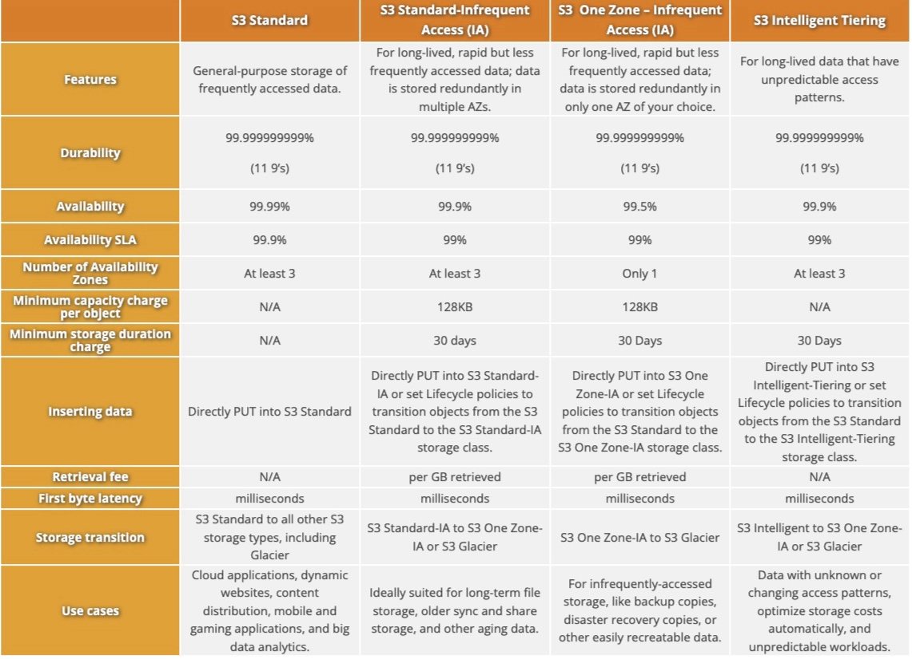

## 1.

* ``S3 Standard-Infrequent Access`` is designed **for data accessed less frequently but requires rapid access when needed**. It offers a lower storage price point than ``S3 Standard``, making it an economical choice for storing data that are not accessed daily but are important enough to require rapid access when requested.
* ``S3 Standard - General purpose`` storage for **any type of data, typically used for frequently accessed data.**
* ``S3 Intelligent - Tiering`` - Automatic cost savings **for data with unknown or changing access patterns.**
* ``S3 Express One Zone`` - High-performance storage **for your most frequently accessed data.**
* ``S3 Glacier Instant Retrieval`` - For **long-lived archive data accessed once a quarter with instant retrieval in milliseconds**
* ``S3 Glacier Flexible Retrieval`` - For **long-term backups and archives with retrieval option from 1 minute to 12 hours.**
* ``S3 Glacier Deep Archive`` - For **long-term data archiving that is accessed once or twice in a year and can be restored within 12 hours.**
* ``S3 One Zone - Infrequent Access`` - For **re-creatable infrequently accessed data that needs millisecond access.**

## 2.
   

``Change data capture (CDC)``, is employed by AWS DMS when replicating ongoing changes from a source data store. The ``CDC`` **process works by collecting changes to the database logs using the database engine’s native API**.

1. [Migrate an on-premises Microsoft SQL Server database to Amazon RDS for SQL Server](https://docs.aws.amazon.com/prescriptive-guidance/latest/patterns/migrate-an-on-premises-microsoft-sql-server-database-to-amazon-rds-for-sql-server.html)
2. [Using a Microsoft SQL Server database as a source for AWS DMS](https://docs.aws.amazon.com/dms/latest/userguide/CHAP_Source.SQLServer.html#CHAP_Source.SQLServer.Prerequisites)

## 3.

``AWS Glue`` is a fully managed extract, transform, and load (ETL) service that makes it easy for customers to prepare and load data for analytics. **It provides capabilities for schema detection, ETL jobs, and crawlers** that make it useful for working with dynamic or changing schemas.

``AWS Glue`` crawlers **automatically detect schemas for data sources**. Glue crawlers scan data sources, detect schemas, and store the associated metadata in the AWS Glue Data Catalog. This enables Glue to handle changing schemas without requiring code changes. The crawlers run periodically to detect new or changed data.

## 4. 

``Amazon Redshifts data sharing`` provides two powerful capabilities:
* **Read-only access** to data across multiple ``Amazon Redshift clusters``.
* **Read live** data without manually moving or copying data.

## 5. 

``AWS Cost Explorer`` is a tool designed to provide a comprehensive view of your AWS costs and usage over time, helping you better manage your AWS resources. It provides the following benefits:

* **Custom reporting** – You can create custom reports to analyze your cost and usage data at different levels of granularity, like total costs across all accounts or specific costs by service, region, etc. This allows you to gain insights into your spending patterns.

* **Cost optimization** – Cost Explorer provides visibility into your usage at different levels, which helps you identify opportunities to optimize costs, like reducing the usage of underutilized resources.

* **Trend analysis** – With Cost Explorer, you can analyze cost and usage trends over multiple years at monthly granularity. This helps understand fluctuations and plan budgets accordingly.

* **Resource level data** – It provides cost attribution down to the individual resource level, like EC2 instances, allowing you to pinpoint expensive resources consuming the most costs.

1. [Extended history and more granular data available within AWS Cost Explorer](https://aws.amazon.com/blogs/aws-cloud-financial-management/extended-history-and-more-granular-data-available-within-aws-cost-explorer/)
2. 
## 6.

``Amazon Redshift Spectrum`` stands out as a highly efficient solution for querying data across Amazon S3 and Amazon Redshift. It leverages the benefits of low-cost storage and open data formats, along with Redshift’s advanced query optimization and fast access to local disks. ``Redshift Spectrum’s serverless`` architecture aligns with Amazon Athena’s, negating the need for resource provisioning and management.

1. [Amazon Redshift Spectrum Extends Data Warehousing Out to Exabytes—No Loading Required](https://aws.amazon.com/blogs/big-data/amazon-redshift-spectrum-extends-data-warehousing-out-to-exabytes-no-loading-required/)
## 7.

## 8.

``Partitioning`` data in Amazon S3 and utilizing Amazon Athena for querying can significantly reduce the amount of data scanned, lowering costs. 

``Partitioning`` enables Athena to scan only the relevant partitions of data for a query rather than the entire dataset. This method is highly recommended for large datasets stored in S3, where queries often target a subset of the data based on specific columns like date, region, or department.

## 9. 

The ``Lock`` command **restricts access to the database table**. This command enables the acquisition of a table-level lock in **ACCESS EXCLUSIVE** mode. It waits, if necessary, for any conflicting locks to be released. Explicitly locking a table in this way causes other transactions or sessions to wait when attempting to read or write to the table.

1. [Lock](https://docs.aws.amazon.com/redshift/latest/dg/r_LOCK.html)
2. [Serializable isolation](https://docs.aws.amazon.com/redshift/latest/dg/c_serial_isolation.html)

## 10.

The ``UNLOAD`` command in ``Amazon Redshift`` allows you to unload the result of a query to Amazon S3. This command is particularly useful for exporting data that is not frequently accessed, thereby saving storage space in Redshift and reducing costs.

The ``UNLOAD`` command supports exporting data in various formats, including CSV, JSON, and Parquet. Parquet is an efficient open columnar storage format for analytics. It is up to 2x faster to unload and consumes up to 6x less storage in Amazon S3 compared to text formats. This makes Parquet a good choice for storing large volumes of infrequently accessed data.

1. [UNLOAD](https://docs.aws.amazon.com/redshift/latest/dg/r_UNLOAD.html)
## 11.

``AWS Glue DataBrew`` is a visual data preparation tool that helps data analysts with data preparation tasks such as data profiling, cleaning, and normalizing all without the need to write any code.

You can create your own data quality rules to validate business requirements for specific datasets. These rules enable you to check for issues such as **duplicate values** in columns or to ensure uniqueness between columns. You can manage these rules by **grouping them into rule sets** and applying them during profile jobs. 

The system **displays the results on a dashboard**, offering a clear and concise view of how well the data complies with the set business rules.

1. [Build event-driven data quality pipelines with AWS Glue DataBrew](https://aws.amazon.com/blogs/big-data/build-event-driven-data-quality-pipelines-with-aws-glue-databrew/)
   
## 13. 

In ``Feature Store``, features are stored in a collection called a feature group. You can visualize a feature group as a table in which each column is a feature, with a unique identifier for each row. In principle, a feature group is composed of features and values specific to each feature. 

A ``Record`` is a collection of values for features that correspond to a unique ``RecordIdentifier``. Altogether, a ``FeatureGroup`` **is a group of features defined in your ``FeatureStore`` to describe a ``Record``**.

You can use Feature Store in the following modes:

* **Online** – In online mode, features are read with low latency (milliseconds) reads and used for high throughput predictions. This mode requires a feature group to be stored in an online store..

* **Offline** – In offline mode, large streams of data are fed to an offline store, which can be used for training and batch inference. This mode requires a feature group to be stored in an offline store. The offline store uses your S3 bucket for storage and can also fetch data using Athena queries.

* **Online and Offline** – This includes both online and offline modes

1. [Create, store, and share features with Amazon SageMaker Feature Store](https://docs.aws.amazon.com/sagemaker/latest/dg/feature-store.html)
2. [Simplify iterative machine learning model development by adding features to existing feature groups in Amazon SageMaker Feature Store](https://aws.amazon.com/blogs/machine-learning/simplify-iterative-machine-learning-model-development-by-adding-features-to-existing-feature-groups-in-amazon-sagemaker-feature-store/)