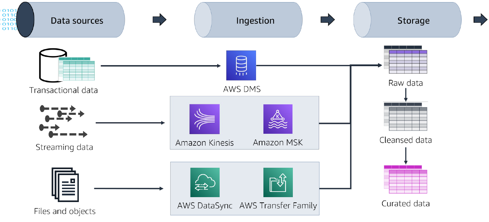
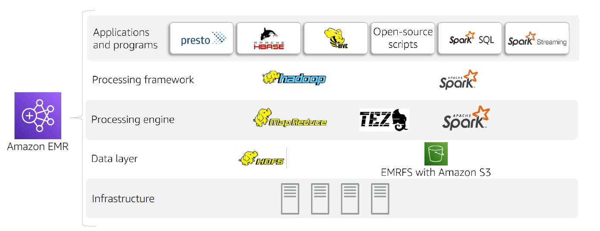

# A- Building  Batch Data Analytics Solutions on AWS
- [A- Building  Batch Data Analytics Solutions on AWS](#a--building--batch-data-analytics-solutions-on-aws)
  - [A.1 Module A: Overview of Data Analytics and the Data Pipeline](#a1-module-a-overview-of-data-analytics-and-the-data-pipeline)
  - [A.2 Module 1: Introduction to Amazon EMR](#a2-module-1-introduction-to-amazon-emr)
    - [A.1.1 Benefits of Hadoop on Amazon EMR](#a11-benefits-of-hadoop-on-amazon-emr)
  - [A.2 Amazon EMR cluster components](#a2-amazon-emr-cluster-components)

## A.1 Module A: Overview of Data Analytics and the Data Pipeline
<figure>
  
</figure>

* Data analytics use cases
* Using the data pipeline for analytics
  * Ingesting and storing data for analytics
  * Storage architectures
  * Storage architectures

Best practice is to optimize for data querying:
* File Format
* File Partitioning
* File Compression
## A.2 Module 1: Introduction to Amazon EMR
<figure>
  
</figure>

### A.1.1 Benefits of Hadoop on Amazon EMR
* Speed and agility
* Flexible capacity
* Integration with AWS services
* Pay for clusters only when you use them
* Improved availability and disaster recovery
* Fully managed

## A.2 Amazon EMR cluster components

