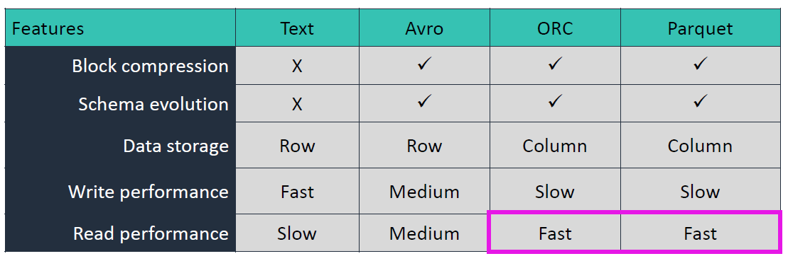
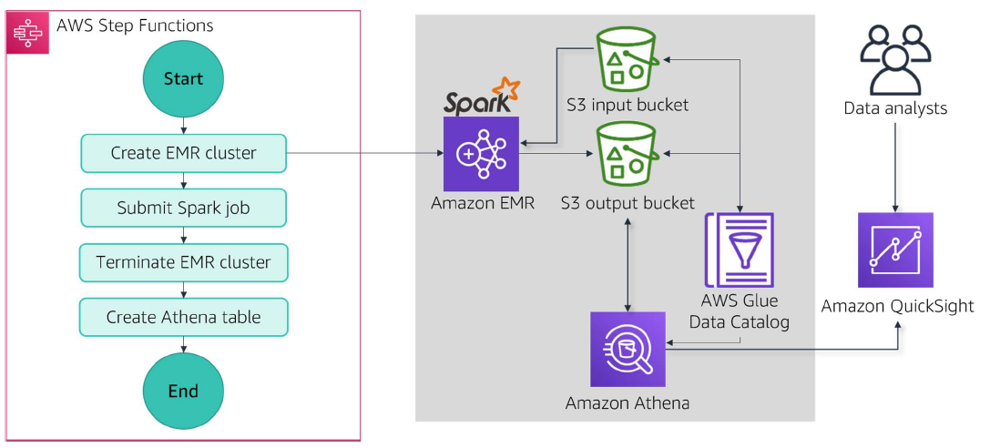

# A- Building  Batch Data Analytics Solutions on AWS
- [A- Building  Batch Data Analytics Solutions on AWS](#a--building--batch-data-analytics-solutions-on-aws)
  - [A.1 Module A: Overview of Data Analytics and the Data Pipeline](#a1-module-a-overview-of-data-analytics-and-the-data-pipeline)
    - [A.1.1 Module 1: Introduction to Amazon EMR](#a11-module-1-introduction-to-amazon-emr)
      - [A.1.1.1 Benefits of Hadoop on Amazon EMR](#a111-benefits-of-hadoop-on-amazon-emr)
    - [A.1.2 Amazon EMR cluster architecture](#a12-amazon-emr-cluster-architecture)
      - [A.1.2.1 Single Leader node](#a121-single-leader-node)
      - [A.1.2.2 Three Leader node](#a122-three-leader-node)
    - [A.1.3 Options for deploying Hadoop in AWS](#a13-options-for-deploying-hadoop-in-aws)
    - [A.1.4 Cost management strategies](#a14-cost-management-strategies)
  - [A.2 Ingestion and Storage](#a2-ingestion-and-storage)
    - [A.2.1 Storage choices with Amazon EMR](#a21-storage-choices-with-amazon-emr)
    - [A.2.2 Optimizing storage for performance](#a22-optimizing-storage-for-performance)
      - [A.2.2.1 Partitioning and Bucketing](#a221-partitioning-and-bucketing)
      - [A.2.2.2 Formatting](#a222-formatting)
      - [A.2.2.3 Compression](#a223-compression)
      - [A.2.2.4 File size](#a224-file-size)
    - [A.2.3 Data ingestion techniques](#a23-data-ingestion-techniques)
      - [A.2.3.1 Using Amazon EMR connectors](#a231-using-amazon-emr-connectors)
      - [A.2.3.2 Ingesting data into Amazon EMR](#a232-ingesting-data-into-amazon-emr)
  - [A.3 High-Performance Batch Data Analytics Using Apache Spark on Amazon EMR](#a3-high-performance-batch-data-analytics-using-apache-spark-on-amazon-emr)
    - [A.3.1 Spark concepts](#a31-spark-concepts)
  - [A.4 Transformation, processing, and analytics](#a4-transformation-processing-and-analytics)
    - [A.4.1 Spark data processing orchestration](#a41-spark-data-processing-orchestration)
    - [A.4.2 Using notebooks with Amazon EMR](#a42-using-notebooks-with-amazon-emr)
  - [A.5 Processing and Analyzing Batch Data with Amazon EMR and Apache Hive](#a5-processing-and-analyzing-batch-data-with-amazon-emr-and-apache-hive)
    - [A.5.1 Sample migration to Amazon EMR](#a51-sample-migration-to-amazon-emr)
    - [A.5.2 Using open-source applications on Amazon EMR](#a52-using-open-source-applications-on-amazon-emr)
    - [A.5.3 Transformation, processing, and analytics](#a53-transformation-processing-and-analytics)
      - [A.5.3.1 Transforming data in Amazon EMR](#a531-transforming-data-in-amazon-emr)
      - [A.5.3.2 Using Hive for interactive queries](#a532-using-hive-for-interactive-queries)
      - [A.5.3.3 Using Amazon S3 Select in Hive queries](#a533-using-amazon-s3-select-in-hive-queries)
      - [A.5.3.4 Batch processing with Hive SQL scripts](#a534-batch-processing-with-hive-sql-scripts)

## A.1 Module A: Overview of Data Analytics and the Data Pipeline
<figure>
  
</figure>

* Data analytics use cases
* Using the data pipeline for analytics
  * Ingesting and storing data for analytics
  * Storage architectures
  * Storage architectures

Best practice is to optimize for data querying:
* File Format
* File Partitioning
* File Compression
### A.1.1 Module 1: Introduction to Amazon EMR
<figure>
  
</figure>

#### A.1.1.1 Benefits of Hadoop on Amazon EMR
* Speed and agility
* Flexible capacity
* Integration with AWS services
* Pay for clusters only when you use them
* Improved availability and disaster recovery
* Fully managed

### A.1.2 Amazon EMR cluster architecture
#### A.1.2.1 Single Leader node
<figure>
  
</figure>

> **One cluster equal EMR instance** and one ``EMR`` instance can have **multiple nodes within it called nodes**
>
> By default ``Hadoop`` is using ``HDFS`` as it main storage component and ``EBS`` volume are use inside ``EMR`. 

``EMR`` architecture have three important nodes(collection of ``EC2`` instances).
* **Primary node**: Define where to store and process **thing**. 
  * It also responsible of ``HDFS Name Node`` with is going to **process and manage resources tasks** so that we can coordinate data operation within a cluster sas well.
* **Core node**: Doing both storage and processing. 
  * It host the ``YARN Node Manager`` and ``HDFS Data Node``. This is to perform **read or write operations into a HDFS**. ``Data Node`` is responsible of **writing and reading to EBS volume**
  * It also responsible of running task and handle all processing part.
* **Task node**: Only for transforming data. 
  * It add additional compute  resource for processing the job.
  * Don't read or write to ``HDFS``

The are two types of clusters;
* **Persistent cluster**:
* **Transient cluster**:  Shutdown automatically after it given jobs is completed. It's most cost effective approach. Any **data store in HDFS will automatically been deleted** as well.

#### A.1.2.2 Three Leader node
<figure>
  
</figure>

**Three Leader node** brings more reliability(if one larder node breakdown other one takeover **i.e only one is active at the time**). 
* With this architecture **we have an external storage keeping metadata from the primary leader Node**

### A.1.3 Options for deploying Hadoop in AWS
<figure>
  
</figure>

* ``Apache Hadoop`` on ``Amazon EC2``
* ``Amazon EMR`` on ``Amazon EC2``
* ``Amazon EMR`` on ``Amazon EKS``
* ``Amazon EMR`` on ``Amazon Outpost``

### A.1.4 Cost management strategies
<figure>
  
</figure>

* EMR cluster lifecycle
  * **Starting**
  * **Bootstrapping**(Script that you run on your cluster when instances is creating or running)
  * **Installing native applications**(installing some applications like Hadoop, Hive, HBase, etc...)
  * **Running** (You can now connect to the cluster)
  * **Waiting**
  * **Terminating(persistent cluster) or terminated (transient cluster)**
    * Manual termination
    * Automation
      * At the end of job
      * After **idle** period
      * Custom solution
    * Termination protection
* Choosing compute 
  * ``EC2 instances``
  * Pricing options(On-demand for Leader node, R.I for Core node and Spot instances for Task nodes)
  * ``EMR`` features
    * Optimized Spark runtime
    * Instance fleets: **Allows us to provision and manage a combination of ``EC2`` instances type within a single cluster**.(Up to 5) 
    * Instance groups: **Set of ``EC2`` instances**.
* Scaling clusters 
  * ``Automatic scaling`` with **custom scaling policy**
    * **You can scale use some more metrics.**
    * **Write scripts or policies**
  * ``EMR managed scaling``(don't have to build scaling policy, use cloudwatch and ML to scale). 
    * **You just set a Max and Min of your core node.**
* Designing storage

## A.2 Ingestion and Storage
### A.2.1 Storage choices with Amazon EMR

* **Distributed file systems**
<figure>
  
</figure>


  * ``Hadoop Distributed File System (HDFS)``        
      * Design to store and manage large amount of data across multiple ``Hadoop``  cluster
      * Provide **fault tolerance, reliability, availability**
      * Use ``EBS`` bloc storage.
      * Bloc of data store in ``EMR`` cluster, **can be replicated across multiple core node in a cluster**.
      * Each bloc size is 128Mb.
      * ``HDFS`` has two principal components
        * **Leader Node** with **Name Node**: Manage metadata of the File system.
        * **Core Node** with **Data Node**: Store the data in the form of blocks onto the physical location and the communicate with **Name node** to perform  **block management replication** 
    * ``EMR File System (EMRFS)`` 
      * Put storage into ``S3`` so **data is automatically replicate in at least 3 A.Z in a region**, so you don't worry about your replication factor.
      * Cheaper than ``HDFS`` storage cause we are using ``S3`for storage rather than ``EBS`` volumes.`
      * Still have a **Name node** commutating with **Leaser Node**
      * ``EMRFS`` take advantage of ``S3``(classes, durability, encryption, etc..)
  
* **Metadata storage**

<figure>
  
</figure>

It a central repository of metadata.

  * ``Apache Hive metastore``: Store in leader Node and can be store **internally**(ephemeral) or **externally**(persistent)
  * ``AWS Glue Data Catalog``

### A.2.2 Optimizing storage for performance
#### A.2.2.1 Partitioning and Bucketing
<figure>
  
</figure>

For a country, 
* **you can partitions by states and bucket by zip code** then queries on Zip code would be much more efficient.
* Partition by Zip code would create much directories on HDFS
* ``Bucketing`` works with ``Hash function``.
* You can use **partitions** and **bucketing** separately or together.

#### A.2.2.2 Formatting
<figure>
  
</figure>

#### A.2.2.3 Compression
<figure>
  
</figure>

#### A.2.2.4 File size
<figure>
  
</figure>

### A.2.3 Data ingestion techniques
#### A.2.3.1 Using Amazon EMR connectors

<figure>
  
</figure>

#### A.2.3.2 Ingesting data into Amazon EMR
<figure>
  
</figure>

**DisCp**: Distributed Copy
> **DisCp** is a tool using for large inter and intra cluster copy. And it's part of Hadoop.
>
**S3DisCp**: Same as Distributed Copy but optimized to work with AWS, particularly ``S3``. You can **copy large amount of date from ``S3`` into ``HDFS``** and these data can be process by other steps. 
* It's more scalable.
* **src** and **dest** are the two required argument.

## A.3 High-Performance Batch Data Analytics Using Apache Spark on Amazon EMR

**Benefits of Spark on Amazon EMR**
* Fast performance
* Developer friendly
* Integration with AWS services

**Spark features on Amazon EMR**
* EMRFS S3-optimized committer
* Spark Web UI
* Amazon EMR on EKS Spark clusters
* AWS Glue Data Catalog for Spark SQL

### A.3.1 Spark concepts
<figure>
  
   
      
</figure>

* The **driver** is the **point of entry** into ``Spark``. It create  a ``Spark Context``, a ``Spark`` environment **who will distribute individual task across all the workers**.
* **Cluster Manager** decide which **worker nodes** is available  to receive which tasks. 
## A.4 Transformation, processing, and analytics
### A.4.1 Spark data processing orchestration
* Amazon EMR steps
* Amazon Managed Workflows for Apache Airflow (Amazon MWAA)
* AWS Step Functions

<figure>
    
</figure>

**Spark tuning and best practices**
* Selection of nodes 
* Latest EMR versions 
* Configuration parameters 
* Application monitoring

### A.4.2 Using notebooks with Amazon EMR
<figure>
    
</figure>

The are many ways of running a notebooks on ``EMR``:
* Open-source applications: **Use this when you create a customs cluster** by selecting either  **jupyter notebook** or **Zeppelin**. These application run on the **primary node**.
  • Jupyter Notebook
  • Apache Zeppelin
  
* Amazon EMR Notebooks : Present on ``EMR`` itself as as serverless notebooks and don't need to create an ``EMR`` cluster.
  * You can run a serverless notebook(**that's not running on any cluster**), **but can be attach or detach to any cluster**
  
* EMR Studio :Present on ``EMR`` itself as as serverless notebooks and don't need to create an ``EMR`` cluster. 
  * One **workspaces** map to one**jupyterHub** 
  * In one **jupyterHub** we can have multiple notebooks.

> ``Amazon EMR Notebooks`` is now part of ``Amazon Studio``

## A.5 Processing and Analyzing Batch Data with Amazon EMR and Apache Hive
### A.5.1 Sample migration to Amazon EMR
<figure>
    
</figure>

### A.5.2 Using open-source applications on Amazon EMR
**Hive**
• Interactive, one-time query
• Metadata store
• Batch ETL

**Hue**
• Web-based GUI
• Front end for Hadoop applications

**Apache HBase**
• Distributed, nonrelational database

**S3**

### A.5.3 Transformation, processing, and analytics
#### A.5.3.1 Transforming data in Amazon EMR
<figure>
    
</figure>

#### A.5.3.2 Using Hive for interactive queries

<figure>
    
</figure>

#### A.5.3.3 Using Amazon S3 Select in Hive queries
<figure>
    
</figure>

What ``S3 Select`` will do, 
* is **to process some of the actual condition as part of the where clause on some data  not on a ``EMR`` cluster but directly on the dataset itself on ``S3``**.
* **Only rows with true filter will move to the cluster**
* Options to speed your ``Hive`` performances and also reduce costs as well.
  
#### A.5.3.4 Batch processing with Hive SQL scripts
<figure>
    
</figure>

You can also manage a catalog as well. Statement


````sql
CREATE  EXTERNAL TABLE stockprice
````
create a ``Hive catalog`` and operate on the catalog itself.
