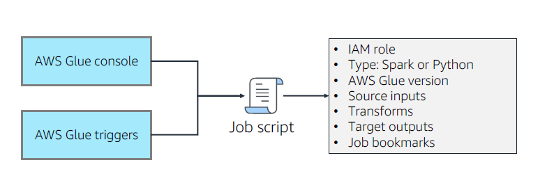
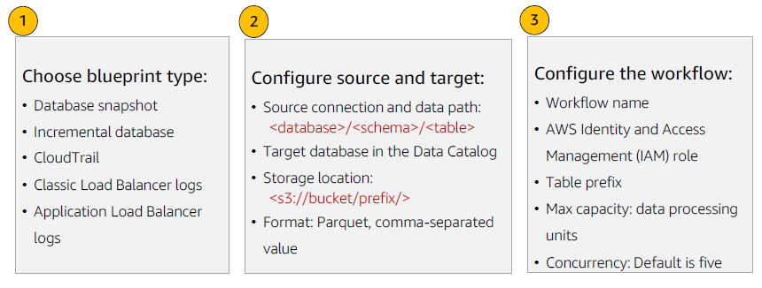
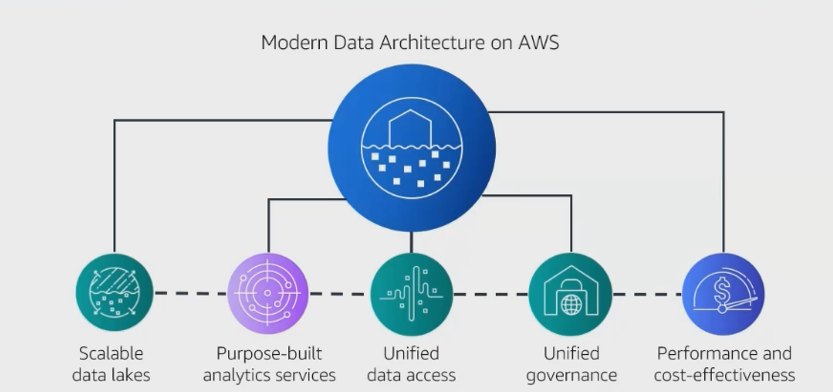
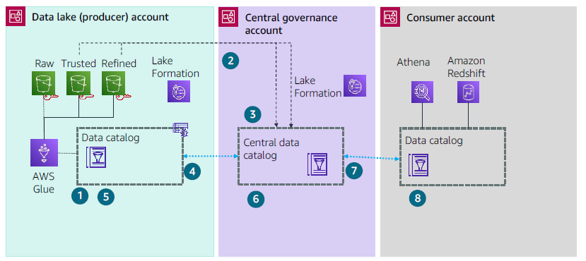

# A- Building Data Lakes on AWS

- [A- Building Data Lakes on AWS](#a--building-data-lakes-on-aws)
  - [A.1 Module 1 Introduction to Data Lakes](#a1-module-1-introduction-to-data-lakes)
  - [A.2 Module 2 Data Ingestion, cataloging, and preparation](#a2-module-2-data-ingestion-cataloging-and-preparation)
    - [A.2.1 Data Lake storage](#a21-data-lake-storage)
    - [A.2.2 Data Injection](#a22-data-injection)
      - [A.2.2.1 Transactional Data Ingestion](#a221-transactional-data-ingestion)
      - [A.2.2.2 Files and object ingestion](#a222-files-and-object-ingestion)
      - [A.2.2.3 Streaming data ingestion](#a223-streaming-data-ingestion)
    - [A.2.3 Crawl and catalog data](#a23-crawl-and-catalog-data)
    - [A.2.4 Data formatting, partitioning, and compression](#a24-data-formatting-partitioning-and-compression)
    - [A.2.5 Securing data lake storage](#a25-securing-data-lake-storage)
    - [A.2.6 Query data with Amazon Athena](#a26-query-data-with-amazon-athena)
    - [A.2.6 Athena Federated Query](#a26-athena-federated-query)
  - [A.3 Module 3: Building a data lake with AWS Lake Formation](#a3-module-3-building-a-data-lake-with-aws-lake-formation)
    - [A.3.1 Topic A AWS Lake Formation overview](#a31-topic-a-aws-lake-formation-overview)
    - [A.3.2 Topic B AWS Lake Formation basic permission model](#a32-topic-b-aws-lake-formation-basic-permission-model)
      - [A.3.2.1 Data lake access control](#a321-data-lake-access-control)
  - [A.5 Module 4: Data processing and analytics](#a5-module-4-data-processing-and-analytics)
    - [A.5.1 Topic A Data transformation](#a51-topic-a-data-transformation)
    - [A.5.2 Topic B Data processing with AWS Glue](#a52-topic-b-data-processing-with-aws-glue)
    - [A.5.3 Topic C AWS Glue jobs and workflows](#a53-topic-c-aws-glue-jobs-and-workflows)
  - [A.6 Module 5: AWS Lake Formation Additional Configurations](#a6-module-5-aws-lake-formation-additional-configurations)
    - [A.6.1 Topîc A Using blueprints and workflows](#a61-topîc-a-using-blueprints-and-workflows)
    - [A.6.2 Topic B Fine grained access control](#a62-topic-b-fine-grained-access-control)
    - [A.6.3 Topic C Lake Formation Governed Tables](#a63-topic-c-lake-formation-governed-tables)
    - [A.6.4 Topic D Visualizing data with QuickSight](#a64-topic-d-visualizing-data-with-quicksight)
  - [A.7 Module 6: Modern data architecture](#a7-module-6-modern-data-architecture)
    - [A.7.1 Topic A Modern data architecture](#a71-topic-a-modern-data-architecture)
      - [A.7.1.1 Scalable data lakes](#a711-scalable-data-lakes)
      - [A.7.1.2 Purpose built analytics services](#a712-purpose-built-analytics-services)
      - [A.7.1.3 Unified data access](#a713-unified-data-access)
      - [A.7.1.4 Unified governance](#a714-unified-governance)
      - [A.7.1.5 Performant and cost effective](#a715-performant-and-cost-effective)
    - [A.8 Topic B Data movement scenarios](#a8-topic-b-data-movement-scenarios)
      - [A.8.1 Support for advanced data architectures](#a81-support-for-advanced-data-architectures)
## A.1 Module 1 Introduction to Data Lakes
## A.2 Module 2 Data Ingestion, cataloging, and preparation

### A.2.1 Data Lake storage
``Data lakes`` uses ``Amazon S3`` as it **primary storage location** and this allows a decoupling storage from compute.

To optimize the **storage costs**:
* You can use the multiple **tiers that are currently available in S3**, **S3 intelligent tiering service** for example.
* You can also use **lifecycle management** or integrated **storage class analysis**.
* Transform data into **columnar, compressed and files formats**
  
<figure>
  
  
</figure>

### A.2.2 Data Injection
Data Ingestion services are multiples and include:
* **DMS** with ``AWS DMS``
* **Batch ou Bulkloading** of files
* **Streaming Data** with ``AWS Kinesis`` family and so on
* ...


<figure>
  
</figure>

If data are coming from **transactional source** like a database, **the most likely response** in term of ingestion, would be ``AWS DMS``.

With ``AWS DMS``,
* No downtime, **database still accessible during the time of migration**( one of multiple raison that we need to separate storage to compute)
  
#### A.2.2.1 Transactional Data Ingestion
<figure>
  
</figure>

#### A.2.2.2 Files and object ingestion
<figure>
  
</figure>

* ``Storage Gateway``
* ``Direct Connect``
* ``Data Sync``: **Online** data transfer service that actually automate, simplify and therefore accelerate  and moving data across storage systems.
* * ``Amazon AppFlow : Fully manged integration service that allows you to exchange data between ``SaaS`application and  ``AWS services``

#### A.2.2.3 Streaming data ingestion
<figure>
  
</figure>

### A.2.3 Crawl and catalog data
<figure>
  
</figure>

Once we get our data into a ``Data Lake``, the question is **what do we have to do with then**? The next step would be the creation and maintenance of the ``Glue data catalog``starting by configuring the ``Glue data crawler``.

The ``Glue data crawler`` identify certain characteristics of data itself and uses those characteristics to **build a metadata structure** which is the ``Glue data catalog`` and that data can be sooner or later being ETL into some format for analytic purpose.

> **Note**: The majority of data with is going to be in ``S3`` is **unstructured or semi-structure data**, because if it was **structure data**, we will probably not store it in ``S3``, **we will rather place it in one of the structure repository**  like an ``RDS, Redshift,...`` something like that.

``AWS Glue`` is a **serverless data preparation service –discover, prepare, and combine data for analytics, machine learning, and application development**
It has a number of components,:
* ``AWS Glue data catalog``: Build on and contains metadata  that describe and create reference for data that is going to be use as a source of ETL's jobs. Catalog's provides the index to the location of actual data, the schema and tables,  partitions, etc... . **It a collection of tables range in a database.**
> ``AWS Glue data catalog`` represents the persistent metadata store in your cloud base data lake and every ``AWS account`` have **one and only one** data catalog per region.

> **The crawler started by looking if some existing customs classifiers are aligned with the structure of the data in place and if not he will start by looking to builds-in classifiers.**
> 
* ``AWS Glue crawler``
* ``AWS Glue ETL``
* ``AWS Glue Studio``


### A.2.4 Data formatting, partitioning, and compression
Best practice is to optimize for:
* **Formatting**: optimal file storage format
  * **Row format compared to column format**
    *  At its most basic, **row stores** are great for **transaction processing and are built to ingest data at very high speeds**. Most relational databases are optimized for row stores.
    *  **Columnar stores** are built **for highly analytic query models**. They were born out of the need to provide data to queries in seconds. The unique way data is stored within a columnar store provides rapid aggregation of the values and extremely high compression rates. Storing database table information in a columnar fashion reduces the number of disk I/O requests and reduces the amount of data you need to load from disk for typical analytical workloads. 
       *  >  **Apache Parquet and ORC Columnar** storage formats optimized for fast retrieval of data.
* **Partitioning**: dividing large datasets into manageable file sizes
* **Compression**: optimizing file storage size vs. performance
  * **Benefits**
    * Reduced storage requirements 
    * Reduced I/O reading data from storage
    * Faster query processing
  * **Compression codecs for AWS Glue output**
    * SNAPPY (default)
    * LZO
    * GZIP
    * UNCOMPRESSED
* **Compaction**: Merging content from multiples smaller files into a larger files.

<figure>
  
</figure>

### A.2.5 Securing data lake storage
<figure>
  
</figure>

### A.2.6 Query data with Amazon Athena
<figure>
  
</figure>


``Amazon Athena`` is an interactive query service **that makes it easy to analyze data in Amazon S3 using standard SQL**. Athena is serverless, so there is no infrastructure to set up or manage.

### A.2.6 Athena Federated Query
<figure>
  
</figure>

``Athena Federated Query`` has a connector to:
* ``Amazon S3``
* ``Amazon ElastiCache for Redis``
* ``Amazon DocumentDB``
* ``Amazon Redshift``
* ``Amazon DynamoDB``
* ``HBase in Amazon EMR``
* ``On Premises`` data stores.

## A.3 Module 3: Building a data lake with AWS Lake Formation
### A.3.1 Topic A AWS Lake Formation overview
Lake Formation is a completely managed service.
* ``AWS Lake Formation`` is an automated build environment based on AWS Glue.
* ``Lake Formation`` coordinates AWS Glue crawlers to identify raw and processed datasets. It persistently stores metadata for each dataset in the AWS Glue Data Catalog within the data lake.
* ``AWS Glue jobs`` use Extract, Transform, and Load, or ETL, scripts that connect to source data, process it, and write it out to a target. AWS Glue triggers can start jobs based on a schedule or event, or on demand
* ``AWS Glue workflows`` orchestrates ETL jobs, crawlers, and triggers. You can define a workflow manually or use a Lake Formation blueprint to simplify ingestion and processing of commonly ingested data source types.
* ``Lake Formation`` provides centralized access controls for your data lake, including security policy-based rules for users and applications by role. Lake Formation uses a combination of AWS Identity and Access Management (IAM) and Lake Formation access controls to enforce table-, column-, and row-level granularity.
* ``Lake Formation`` uses the encryption capabilities of Amazon Simple Storage Service (Amazon S3) for data in the data lake, including automatic server-side encryption with keys managed by the AWS Key Management Service (AWS KMS).
  
Three stages of Lake Formation:
* **Register data lake storage locations**
* **Create a database in the data lake’s Data Catalog**
* **Grant permissions to data lake resources**

### A.3.2 Topic B AWS Lake Formation basic permission model
A data lake solution needs to address the following:
* Unifying permissions across the data lake stack.
  * **Data access permissions** authorize principals to read and write data to underlying
Amazon S3 locations.
  * **Data location permissions** authorize principals to create metadata databases and
tables that point to specific Amazon S3 locations.
* Enforcing fine grained permissions to restrict access
* Ensuring data access complies with regulations

<figure>
  
</figure>

#### A.3.2.1 Data lake access control

<figure>
  
</figure>

## A.5 Module 4: Data processing and analytics
### A.5.1 Topic A Data transformation

<figure>
  
</figure>

The key takeaway from this architecture diagram is that a **data lake will have a set of extract, transform, and load (ETL) jobs that transform data from one or more dataset sources and update other dataset targets**. In addition, crawlers work to keep the data catalog synchronized with the underlying datasets. This module will look at the various use cases and data

### A.5.2 Topic B Data processing with AWS Glue
``AWS Glue`` is a serverless data integration service – Discover, prepare, and combine data for analytics, machine learning, and application development.

You have two options for developing AWS Glue scripts:
• Use a ``Python shell`` script that ``AWS Glue`` runs in a non distributed environment.
• Use a ``PySpark`` or ``Scala`` script that ``AWS Glue`` runs using ``Apache Spark`` in a distributed environment.

1. ``AWS Glue Studio`` is designed for both **tabular data and for semi structured data**, which is difficult to render in spreadsheet like data preparation interfaces. Examples of semi structured data.
2. You can **quickly prepare the data for analysis in data warehouses and
data lakes**. 
3. ``AWS Glue Studio`` also **provides tools to monitor ETL workflows and validate that they
are operating as intended**.

``AWS Glue Studio`` provides a visual interface for the following tasks:
1. Pulling data from an ``Amazon S3, Kinesis, or Java Database Connectivity (JDBC)`` source
2. Configuring a transformation that joins, samples, or transforms the data 
3. Specifying a target location for the transformed data
4. Running, monitoring, and managing the jobs created in ``AWS Glue Studio``.
5. **You can also build out your job script interactively within a Jupyter notebook running
on a Spark (PySpark) runtime**.

### A.5.3 Topic C AWS Glue jobs and workflows
<figure>
  
</figure>

Job triggers:

1. **Schedule** – based on time of the day
2. **Job event** – based on **succeeded, failed, stopped, and other statuses**
3. **On-demand** – use ``AWS Lambda`` to start jobs on events such as ``Amazon S3`` notifications
4. **Control conditions** –all or any
5. **Retries or Timeout**

>> ``Auto Scaling`` **is available for AWS Spark and PySpark jobs (both AWS Glue ETL and Streaming) with AWS Glue version 3.0 or later**.

## A.6 Module 5: AWS Lake Formation Additional Configurations
### A.6.1 Topîc A Using blueprints and workflows 
<figure>
  
</figure>

A **blueprint** is a data management template **where you can ingest data into a data**. ``Lake Formation`` provides several blueprints, each for a predefined source type, such as a relational database or AWS CloudTrail logs. 

From a blueprint, you can create a **workflow** . **Workflows** consist of ``AWS Glue`` crawlers, jobs, and triggers that are generated to orchestrate the loading and updating of data. **Blueprints** take the data source, data target, and schedule as input to configure the workflow.

A **workflow** is a **container for a set of related** ``AWS Glue`` jobs, crawlers, and triggers. You create the workflow in ``Lake Formation`` by selecting a blueprint. ``Lake Formation`` can track the status of a workflow as a single entity.**

**Creating a workflow**
  1. Choose **blueprint type**:
  2. **Configure source and target**:
  3. **Configure the workflow**:

### A.6.2 Topic B Fine grained access control
* ``Lake Formation permissions`` **control access to Data Catalog resources, Amazon Simple Storage Service (Amazon S3) locations, and the underlying data at those locations**.
* ``IAM permissions`` **control access to the Lake Formation and AWS Glue APIs and resources**.

> For **read/write access to underlying data (in Amazon S3)**, in addition to ``Lake Formation`` permissions, **principals also need the IAM permission** ``lakeformation:GetDataAccess``.

> With this permission, ``Lake Formation`` **grants the request for temporary credentials to access the data**.

There are two distinct methods for granting Lake Formation permissions on Data Catalog resources:
* **Named resource access control (NRAC)**. With this method, **you grant permissions on specific databases or tables by specifying database or table names**. The grants have this form: 
>>> **Grant permissions to principals on resource**s (with grant option). 

```Lake Formation Tags`` are similar in structure to ``IAM tags`` that are part of the ``IAM`` attribute based access control. The **idea is to define a set of tags (attributes) and corresponding values and then assign specific sets of tag values to resources**. 

* ``LF Tags`` are ``Lake Formation Tags`` defined within a ``Lake Formation data lake``. Tags are <key, value> pairs.
* ``LF Tags`` **can be assigned to Data Catalog resources: database, tables, and column**.
  * **Catalog resources are hierarchical** (a database contains tables that contain columns). LF Tags assigned to a resource are also assigned (with inheritance) to contained resources. 
  * A different value for a particular ``LF Tag`` assigned to a lower level resource overrides the inherited value.
* You can create policies on ``LF Tags`` assigning them to principals.

With the grant option, **you can allow the grantee to grant the permissions to other principals**.
* **Tag based access control**, or (TBAC) With this method, **you assign one or more LF Tags to Data Catalog, databases, tables, and columns, and you grant permissions on one or more LF Tags to principals**. 
* >>> **Each LF Tag is a key value pair, such as department=sales**. 
  
A principal that has LF Tags that match the LF Tags on a Data Catalog resource can access that resource. This method is recommended for data lakes with a large number of databases and tables, and we cover that later in this topic.

> **For the new AWS creation Data lake, the recommended approach would be to use  both** ``Lake formation and IAM permissions``.
>
> **The first thing to do when logging to** ``AWS Lake Formation`` is to create an **Administrator**.  
> 
After creating **Administrators**, you can then:
* Managed **Administrators**
* Managed **LF-Tags**
* Managed **LF-Tag permissions**
  

With ``Blueprint``, **you can instantiate a lake formation workflow that then perform jobs and task for typical proposes  as pre-defined**. ``Lake formation workflows`` generate ``AWS Glue crawlers, Glue jobs, Glue triggers`` in order to **orchestrate, loading and updating data**.
****
  > **Workflows create on ``Lake Formation`` are visible on ``AWS Glue`` console and the node of that workflows is either a job, a crawler or a trigge**r.

> **Creating workflow in ``Lake Formation`` is much more user friendly  than creating a workflow on** ``AWS Glue`` as **DAG**.
>
### A.6.3 Topic C Lake Formation Governed Tables
When creating tables in ``Lake Formation`` filling in the Create table form, **turn on Enable governed data access and management under the data management and security section**.
These are notable restrictions:
* Currently, **only Athena, Amazon Redshift Spectrum, and AWS Glue ETL scripts* support querying Governed Tables. Athena queries are limited to read only.
* To create a governed table with the AWS Management Console, **you must use the Lake Formation console* . You can't use the AWS Glue console.
* **Only partitioned tables with Parquet formatted files are supported for data compaction**.
* ``AWS Glue crawlers`` don't support Governed Tables.
* You can't use ``Apache Spark DataFrames`` to read from and write to Governed Tables.
* Push down predicates aren't supported in ``AWS Glue ETL`` 

### A.6.4 Topic D Visualizing data with QuickSight
* Scalable, serverless, business intelligence (BI) service
* Embeddable into your existing applications
* Dynamic, machine learning powered insights

When you import data into a dataset, instead of using a direct structured query language query, it becomes SPICE data because of how it's stored. In Enterprise edition, data stored in SPICE is encrypted at rest. When you create or edit a dataset, you choose to use either SPICE or a direct query, unless the dataset contains uploaded files. Importing (also called ingesting ) your data into SPICE can save time and money:
* **Your analytical queries process quickly**.
* **You don't need to wait for a direct query to process**.
* Your data stored in ``SPICE`` **can be reused multiple times without incurring additional costs**. If you use a data source that charges per query, you're charged for querying the data when you first create the dataset and later when you refresh the dataset.

``Embedded QuickSight dashboards`` **provide a serverless architecture to scale insights from your growing user base**. You only pay for usage with the unique pay per session pricing model. Applications can authenticate the dashboard users with the identity provider you choose (for example, AWS Managed Microsoft AD, Amazon Cognito, or any SAML based federated single sign on provider your organization uses).

## A.7 Module 6: Modern data architecture
### A.7.1 Topic A Modern data architecture
<figure>
  
</figure>

#### A.7.1.1 Scalable data lakes 
This course has focused on the business value of data lakes and how to build data lakes with ``AWS Lake Formation``. Business insight is driven by data of all types: structured, semi structured, and unstructured. Organizations have large volumes of data generated continuously. To be able to extract value, data must be trusted and convenient to find by those roles that need access.

Key AWS services include the following:
* ``Amazon Simple Storage Service`` (Amazon S3) Highly durable, scalable, secure, fast, and inexpensive storage service.
* ``Lake Formation`` Integrated data lake service that makes it convenient to ingest, clean, catalog, transform, and secure data and make it available for analysis and machine learning
* ``Amazon Athena`` Interactive analytics service that makes it convenient to analyze data in Amazon S3 using Python or standard SQL.

#### A.7.1.2 Purpose built analytics services 
Although a data lake supports queries and exploratory analytics, there are use cases that require high volume and highly performant analytics. Also, purpose built data stores are integral to the Modern data architecture.

Key AWS services include the following:
* ``Amazon Aurora`` Fully managed relational database engine compatible with MySQL and PostgreSQL.
* ``Amazon DynamoDB`` Fully managed, serverless, NoSQL database that is designed to support key value and document data models.
* ``Amazon OpenSearch Service`` Fully managed service to deploy, operate, and scale OpenSeach Service (now supporting Apache Lucene 9) clusters. For more

* ``Amazon EMR`` Big data solution for petabyte scale data processing, interactive analytics, and ML using open source frameworks such as Apache Spark, Apache Hive, and Presto. For more information, see:
* ``Amazon Redshift / Amazon Redshift Spectrum`` Cloud data warehouse that uses SQL to analyze structured and semi structured data across data warehouses, operational databases, and data lakes.
* ``Amazon SageMaker`` Fully managed service to prepare data and build, train, and deploy ML models for any use case with fully managed infrastructure, tools, and
workflows.
* ``Amazon Managed Streaming for Apache Kafka`` (Amazon MSK) Streaming data service that manages Apache Kafka infrastructure and operations.
* ``Amazon Kinesis Data Analytics`` A convenient way to transform and analyze streaming data in real time with Apache Flink.

#### A.7.1.3 Unified data access
As the data in your data lakes and purpose built data stores continues to grow, you might need to be able to move a portion of that data from one data store to another.
Key AWS services include the following:
* ``AWS Glue`` Serverless data integration service that makes it easier to discover, prepare, move, and integrate data from multiple sources for analytics, ML, and application development.
* ``Amazon Kinesis Data Firehose`` Streaming ETL solution to load streaming data into data stores and analytics tools. It can capture, transform, and load streaming data into Amazon S3, Amazon Redshift, OpenSearch Service, and Splunk.
* ``AWS Database Migration Service`` (AWS DMS) Managed migration and replication service that helps move your database and analytics workloads to AWS quickly, securely, and with minimal downtime and zero data loss.
* ``AWS Transfer`` Family Offers fully managed support for the transfer of files ov  Secure File Transfer Protocol, Applicability Statement 2, FTP Secure, and FTP directly into and out of Amazon S3 or Amazon EFS.
* ``Amazon MSK`` Streaming data service that manages Apache Kafka infrastructure and operations.
* ``Amazon AppFlow`` Fully managed integration service where you can securely transfer data between software as a service applications like Salesforce, Marketo, Slack, and ServiceNow, and AWS services like Amazon S3 and Amazon Redshift.

#### A.7.1.4 Unified governance
One critical piece of a modern analytics architecture is the ability for customers to authorize, manage, and audit access to data.

Key AWS Service
* ``Lake Formation``

#### A.7.1.5 Performant and cost effective 
AWS is committed to providing great performance at a low cost across all analytics services.

A ``data mesh`` is **an architectural framework that solves advanced data security challenges through distributed, decentralized ownership**. Organizations have multiple data sources from different lines of business that must be integrated for analytics. 
> A ``data mesh`` **architecture effectively unites the disparate data sources and links them together through centrally managed data sharing and governance guidelines**. 

Business functions can maintain control over how shared data is accessed, who accesses it, and in what formats it’s accessed. A ``data mesh`` adds complexities to architecture but also brings efficiency by improving data access, security, and scalability.

### A.8 Topic B Data movement scenarios
Customers store data in a data lake. As needed, customers then move portions of that data to a purpose built analytics service to do additional ML or analytics.
<figure>
  
</figure>

The high-level architecture pattern has data domains managing their data architecture. Within a data domain, access for local consumers is managed through the local Lake Formation and data catalog. In addition to the data domain accounts and data lakes, there is a central account that provides the enterprise-wide catalog for data discovery, reporting, and auditing. It’s important that sharing is done through metadata linking alone. Data isn’t copied to the central account, and ownership remains with the producer. The central catalog makes it convenient for any user to find data and to request access. A consumer can then use their tool of choice inside of their own environment to perform analytics and ML on the data.
The workflow from producer to consumer includes the following steps:
1. Data lake (producer) account – Data source locations hosted by the producer are created within the producer’s AWS Glue Data Catalog and registered with Lake Formation.
2. Publishing a data product results in entry in Lake Formation Data Catalog entities (database, table, columns, attributes) within the central governance account. This makes it convenient to find and discover data products across the enterprise.
3. The central Lake Formation Data Catalog shares the data catalog resources back to the producer account with required permissions through Lake Formation resource links to metadata databases and tables.
4. Lake Formation permissions are granted in the central account to producer role personas (such as the data engineer role) to manage schema changes and perform data transformations (alter, delete, update) on the central data catalog.
5. Producers accept the resource share from the central governance account so that they can make changes to the schema at a later time.
6. Data changes made within the producer account are automatically propagated into the central governance catalog.
7. Based on a consumer access request and the need to make data visible in the consumer’s AWS Glue Data Catalog, the central account owner grants Lak  Formation permissions to a consumer account. This is based on direct entity sharing or tag based access controls, which can be used to administer access through controls like data classification, cost center, or environment.
8. Lake Formation in the consumer account can define access permissions on these datasets for local users to consume. Users in the consumer account, like data analysts and data scientists, can query data using their chosen tool, such as Athena or Amazon Redshift.

``AWS Analytic Reference`` Architecture provides a set of assets (Cloud Development Kit, or CDK, constructs) that can help jumpstart building a data mesh on AWS. For more

Note:

* [Use an event-driven architecture to build a data mesh on AWS](https://aws.amazon.com/blogs/big-data/use-an-event-driven-architecture-to-build-a-data-mesh-on-aws/)

#### A.8.1 Support for advanced data architectures
* ``AWS database and analytics services``
* ``AWS data`` movement and transformation services
* ``Lake Formation`` fine grained access control, tags, and TBAC
* ``Cross account links``
* ``Lake Formation governed tables``


