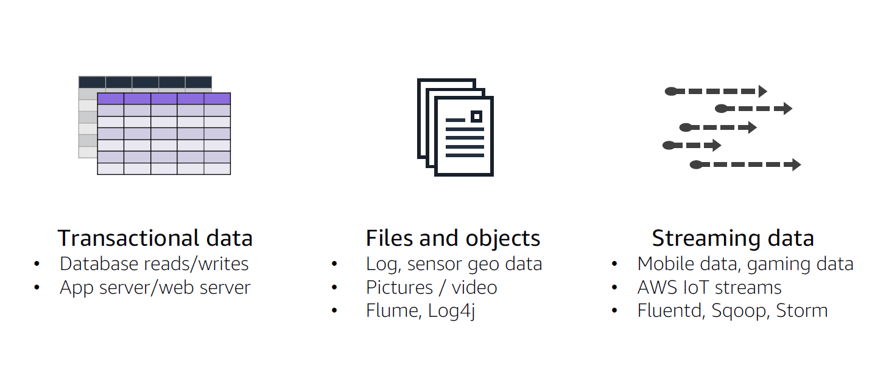

# A- Building Data Lakes on AWS

- [A- Building Data Lakes on AWS](#a--building-data-lakes-on-aws)
  - [A.1 Module 1 Introduction to Data Lakes](#a1-module-1-introduction-to-data-lakes)
  - [A.2 Module 2 Data Ingestion, cataloging, and preparation](#a2-module-2-data-ingestion-cataloging-and-preparation)
    - [A.2.1 Data Lake storage](#a21-data-lake-storage)
    - [A.2.2 Data Injection](#a22-data-injection)
      - [A.2.2.1 Transactional Data Ingestion](#a221-transactional-data-ingestion)
      - [A.2.2.2 Files and object ingestion](#a222-files-and-object-ingestion)
      - [A.2.2.3 Streaming data ingestion](#a223-streaming-data-ingestion)
    - [A.2.3 Crawl and catalog data](#a23-crawl-and-catalog-data)
    - [A.2.3 Data formatting, partitioning, and compression](#a23-data-formatting-partitioning-and-compression)
## A.1 Module 1 Introduction to Data Lakes
## A.2 Module 2 Data Ingestion, cataloging, and preparation

### A.2.1 Data Lake storage
``Data lakes`` uses ``Amazon S3`` as it **primary storage location** and this allows a decoupling storage from compute.

To optimize the **storage costs**:
* You can use the multiple **tiers that are currently available in S3**, **S3 intelligent tiering service** for example.
* You can also use **lifecycle management** or integrated **storage class analysis**.
* Transform data into **columnar, compressed and files formats**
  

### A.2.2 Data Injection
Data Ingestion services are multiples and include:
* **DMS** with ``AWS DMS``
* **Batch ou Bulkloading** of files
* **Streaming Data** with ``AWS Kinesis`` family and so on
* ...

If data are coming from **transactional source** like a database, **the most likely response** in term of ingestion, would be ``AWS DMS``.

With ``AWS DMS``,
* No downtime, **database still accessible during the time of migration**( one of multiple raison that we need to separate storage to compute)
  
#### A.2.2.1 Transactional Data Ingestion

#### A.2.2.2 Files and object ingestion

* ``Storage Gateway``
* ``Direct Connect``
* ``Data Sync``: **Online** data transfer service that actually automate, simplify and therefore accelerate  and moving data across storage systems.
* * ``Amazon AppFlow : Fully manged integration service that allows you to exchange data between ``SaaS`application and  ``AWS services``

#### A.2.2.3 Streaming data ingestion

### A.2.3 Crawl and catalog data

Once we get our data into a ``Data Lake``, the question is **what do we have to do with then**? The next step would be the creation and maintenance of the ``Glue data catalog``starting by configuring the ``Glue data crawler``.

The ``Glue data crawler`` identify certain characteristics of data itself and uses those characteristics to **build a metadata structure** which is the ``Glue data catalog`` and that data can be sooner or later being ETL into some format for analytic purpose.

> **Note**: The majority of data with is going to be in ``S3`` is **unstructured or semi-structure data**, because if it was **structure data**, we will probably not store it in ``S3``, **we will rather place it in one of the structure repository**  like an ``RDS, Redshift,...`` something like that.

``AWS Glue`` is a **serverless data preparation service –discover, prepare, and combine data for analytics, machine learning, and application development**
It has a number of components,:
* ``AWS Glue data catalog``: Build on and contains metadata  that describe and create reference for data that is going to be use as a source of ETL's jobs. Catalog's provides the index to the location of actual data, the schema and tables,  partitions, etc... . **It a collection of tables range in a database.**
> ``AWS Glue data catalog`` represents the persistent metadata store in your cloud base data lake and every ``AWS account`` have **one and only one** data catalog per region.

> **The crawler started by looking if some existing customs classifiers are aligned with the structure of the data in place and if not he will start by looking to builds-in classifiers.**
> 
* ``AWS Glue crawler``
* ``AWS Glue ETL``
* ``AWS Glue Studio``

### A.2.3 Data formatting, partitioning, and compression
Best practice is to optimize for:
* **Formatting**: optimal file storage format
  * **Row format compared to column format**
    *  At its most basic, **row stores** are great for **transaction processing and are built to ingest data at very high speeds**. Most relational databases are optimized for row stores.
    *  **Columnar stores** are built **for highly analytic query models**. They were born out of the need to provide data to queries in seconds. The unique way data is stored within a columnar store provides rapid aggregation of the values and extremely high compression rates. Storing database table information in a columnar fashion reduces the number of disk I/O requests and reduces the amount of data you need to load from disk for typical analytical workloads. 
* **Partitioning**: dividing large datasets into manageable file sizes
* **Compression**: optimizing file storage size vs. performance
* **Compaction**: Merging content from multiples smaller files into a larger files.

