# A- Building Data Lakes on AWS

- [A- Building Data Lakes on AWS](#a--building-data-lakes-on-aws)
  - [A.1 Module 1 Introduction to Data Lakes](#a1-module-1-introduction-to-data-lakes)
  - [A.2 Module 2 Data Ingestion, cataloging, and preparation](#a2-module-2-data-ingestion-cataloging-and-preparation)
    - [A.2.1 Data Lake storage](#a21-data-lake-storage)
    - [A.2.2 Data Injection](#a22-data-injection)
      - [A.2.2.1 Transactional Data Ingestion](#a221-transactional-data-ingestion)
      - [A.2.2.2 Files and object ingestion](#a222-files-and-object-ingestion)
      - [A.2.2.3 Streaming data ingestion](#a223-streaming-data-ingestion)
    - [A.2.3 Crawl and catalog data](#a23-crawl-and-catalog-data)
    - [A.2.4 Data formatting, partitioning, and compression](#a24-data-formatting-partitioning-and-compression)
    - [A.2.5 Securing data lake storage](#a25-securing-data-lake-storage)
    - [A.2.6 Query data with Amazon Athena](#a26-query-data-with-amazon-athena)
    - [A.2.6 Athena Federated Query](#a26-athena-federated-query)
  - [A.3 Module 3: Building a data lake with AWS Lake Formation](#a3-module-3-building-a-data-lake-with-aws-lake-formation)
    - [A.3.1 Topic A AWS Lake Formation overview](#a31-topic-a-aws-lake-formation-overview)
    - [A.3.2 Topic B AWS Lake Formation basic permission model](#a32-topic-b-aws-lake-formation-basic-permission-model)
      - [A.3.2.1 Data lake access control](#a321-data-lake-access-control)
  - [A.5 Module 4: Data processing and analytics](#a5-module-4-data-processing-and-analytics)
    - [A.5.1 Topic A Data transformation](#a51-topic-a-data-transformation)
    - [A.5.2 Topic B Data processing with AWS Glue](#a52-topic-b-data-processing-with-aws-glue)
    - [A.5.3 Topic C AWS Glue jobs and workflows](#a53-topic-c-aws-glue-jobs-and-workflows)
  - [A.6 Module 5 Module 5: AWS Lake Formation Additional Configurations](#a6-module-5-module-5-aws-lake-formation-additional-configurations)
    - [A.6.1 Topîc A Using blueprints and workflows](#a61-topîc-a-using-blueprints-and-workflows)
    - [A.6.2 Topic B Fine grained access control](#a62-topic-b-fine-grained-access-control)
## A.1 Module 1 Introduction to Data Lakes
## A.2 Module 2 Data Ingestion, cataloging, and preparation

### A.2.1 Data Lake storage
``Data lakes`` uses ``Amazon S3`` as it **primary storage location** and this allows a decoupling storage from compute.

To optimize the **storage costs**:
* You can use the multiple **tiers that are currently available in S3**, **S3 intelligent tiering service** for example.
* You can also use **lifecycle management** or integrated **storage class analysis**.
* Transform data into **columnar, compressed and files formats**
  

<figure>
  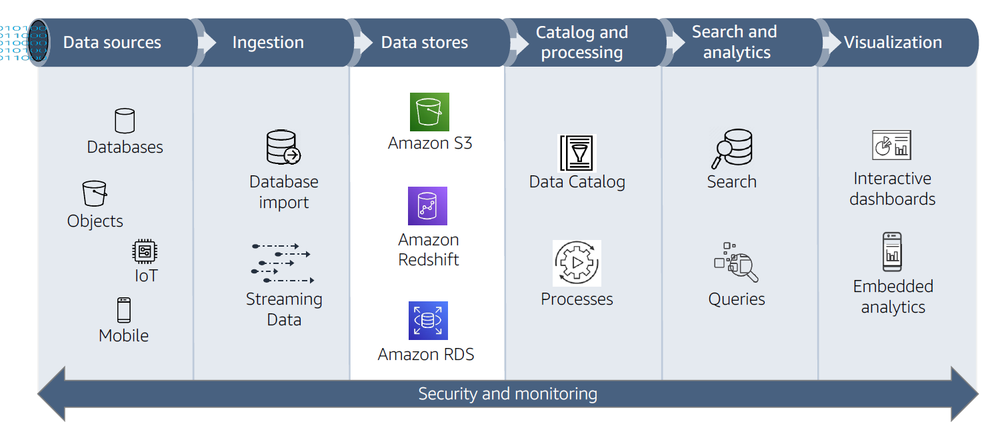
</figure>

<figure>
  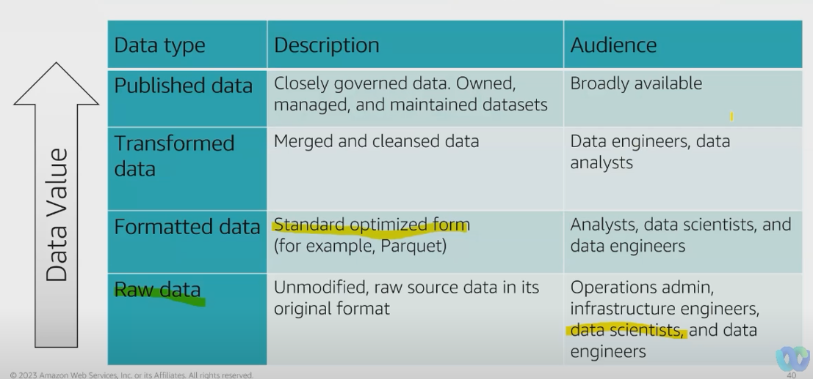
</figure>

### A.2.2 Data Injection
Data Ingestion services are multiples and include:
* **DMS** with ``AWS DMS``
* **Batch ou Bulkloading** of files
* **Streaming Data** with ``AWS Kinesis`` family and so on
* ...

<figure>
  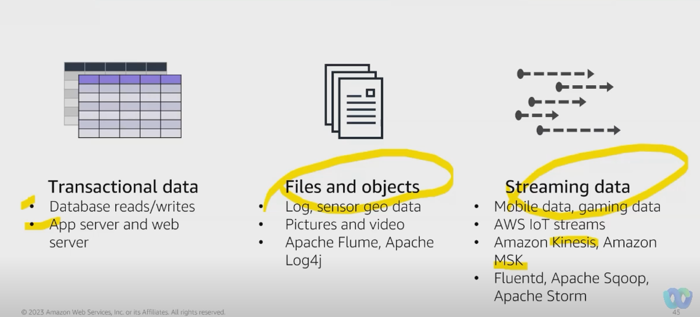
</figure>

If data are coming from **transactional source** like a database, **the most likely response** in term of ingestion, would be ``AWS DMS``.

With ``AWS DMS``,
* No downtime, **database still accessible during the time of migration**( one of multiple raison that we need to separate storage to compute)
  
#### A.2.2.1 Transactional Data Ingestion
<figure>
  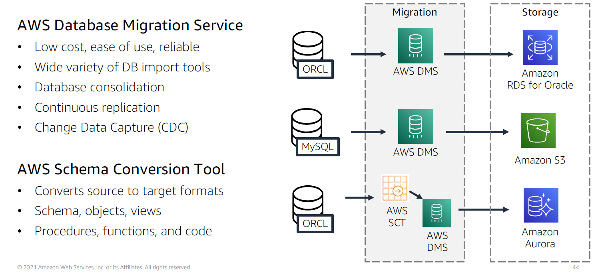
</figure>

#### A.2.2.2 Files and object ingestion
<figure>
  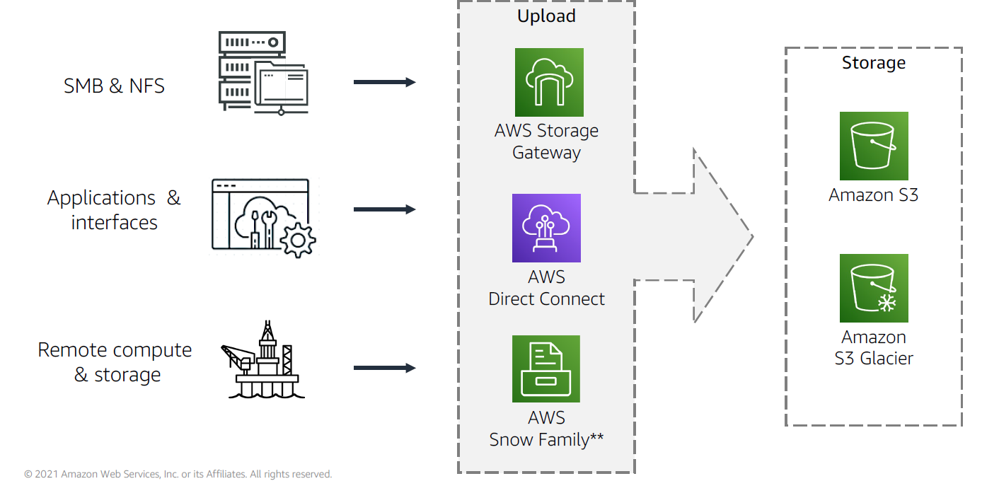
</figure>

* ``Storage Gateway``
* ``Direct Connect``
* ``Data Sync``: **Online** data transfer service that actually automate, simplify and therefore accelerate  and moving data across storage systems.
* * ``Amazon AppFlow : Fully manged integration service that allows you to exchange data between ``SaaS`application and  ``AWS services``

#### A.2.2.3 Streaming data ingestion
<figure>
  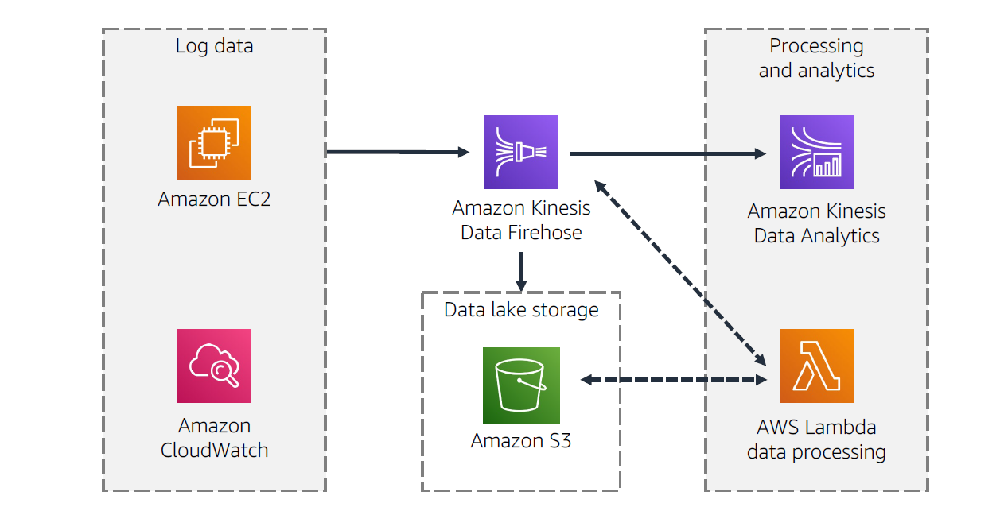
</figure>

### A.2.3 Crawl and catalog data
<figure>
  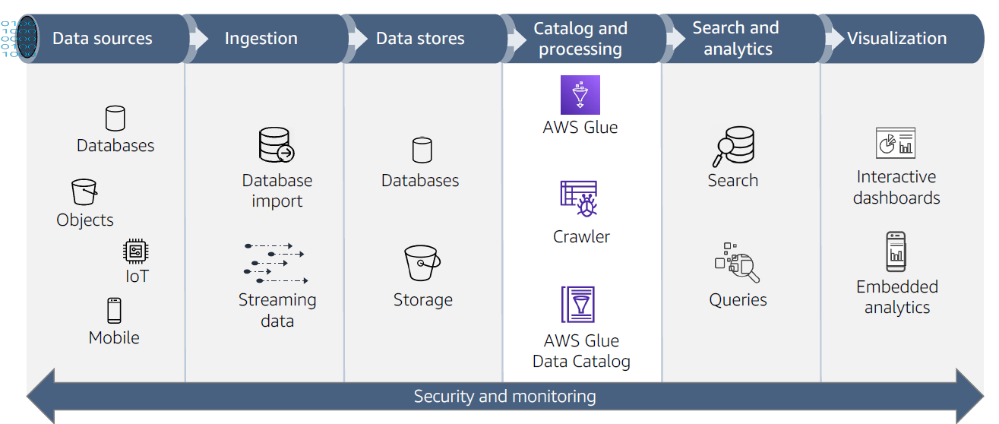
</figure>

Once we get our data into a ``Data Lake``, the question is **what do we have to do with then**? The next step would be the creation and maintenance of the ``Glue data catalog``starting by configuring the ``Glue data crawler``.

The ``Glue data crawler`` identify certain characteristics of data itself and uses those characteristics to **build a metadata structure** which is the ``Glue data catalog`` and that data can be sooner or later being ETL into some format for analytic purpose.

> **Note**: The majority of data with is going to be in ``S3`` is **unstructured or semi-structure data**, because if it was **structure data**, we will probably not store it in ``S3``, **we will rather place it in one of the structure repository**  like an ``RDS, Redshift,...`` something like that.

``AWS Glue`` is a **serverless data preparation service –discover, prepare, and combine data for analytics, machine learning, and application development**
It has a number of components,:
* ``AWS Glue data catalog``: Build on and contains metadata  that describe and create reference for data that is going to be use as a source of ETL's jobs. Catalog's provides the index to the location of actual data, the schema and tables,  partitions, etc... . **It a collection of tables range in a database.**
> ``AWS Glue data catalog`` represents the persistent metadata store in your cloud base data lake and every ``AWS account`` have **one and only one** data catalog per region.

> **The crawler started by looking if some existing customs classifiers are aligned with the structure of the data in place and if not he will start by looking to builds-in classifiers.**
> 
* ``AWS Glue crawler``
* ``AWS Glue ETL``
* ``AWS Glue Studio``

### A.2.4 Data formatting, partitioning, and compression
Best practice is to optimize for:
* **Formatting**: optimal file storage format
  * **Row format compared to column format**
    *  At its most basic, **row stores** are great for **transaction processing and are built to ingest data at very high speeds**. Most relational databases are optimized for row stores.
    *  **Columnar stores** are built **for highly analytic query models**. They were born out of the need to provide data to queries in seconds. The unique way data is stored within a columnar store provides rapid aggregation of the values and extremely high compression rates. Storing database table information in a columnar fashion reduces the number of disk I/O requests and reduces the amount of data you need to load from disk for typical analytical workloads. 
       *  >  **Apache Parquet and ORC Columnar** storage formats optimized for fast retrieval of data.
* **Partitioning**: dividing large datasets into manageable file sizes
* **Compression**: optimizing file storage size vs. performance
  * **Benefits**
    * Reduced storage requirements 
    * Reduced I/O reading data from storage
    * Faster query processing
  * **Compression codecs for AWS Glue output**
    * SNAPPY (default)
    * LZO
    * GZIP
    * UNCOMPRESSED
* **Compaction**: Merging content from multiples smaller files into a larger files.

<figure>
  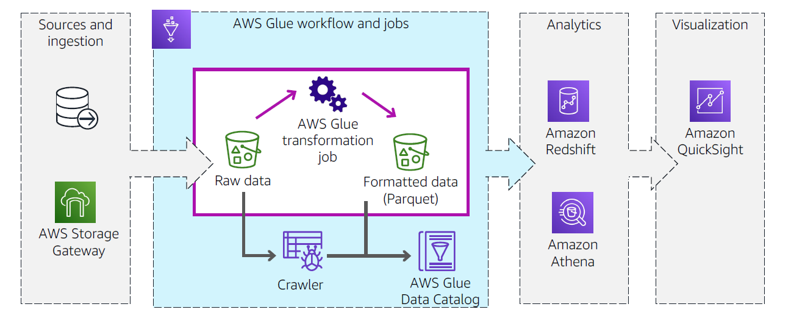
</figure>

### A.2.5 Securing data lake storage
<figure>
  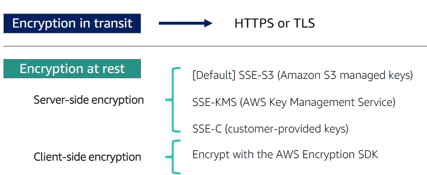
</figure>

### A.2.6 Query data with Amazon Athena
<figure>
  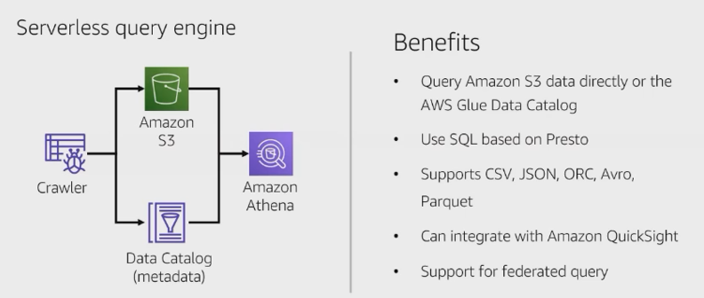
</figure>

``Amazon Athena`` is an interactive query service **that makes it easy to analyze data in Amazon S3 using standard SQL**. Athena is serverless, so there is no infrastructure to set up or manage.

### A.2.6 Athena Federated Query
<figure>
  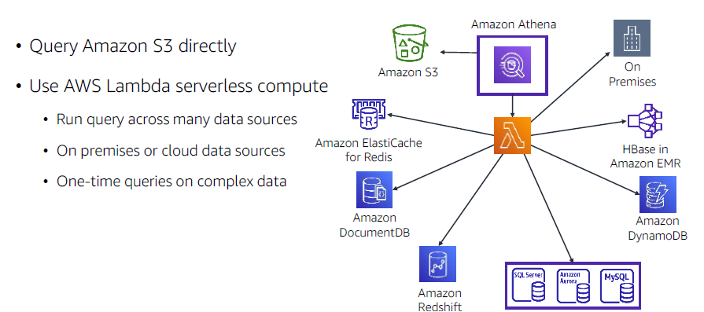
</figure>

``Athena Federated Query`` has a connector to:
* ``Amazon S3``
* ``Amazon ElastiCache for Redis``
* ``Amazon DocumentDB``
* ``Amazon Redshift``
* ``Amazon DynamoDB``
* ``HBase in Amazon EMR``
* ``On Premises`` data stores.

## A.3 Module 3: Building a data lake with AWS Lake Formation
### A.3.1 Topic A AWS Lake Formation overview
Lake Formation is a completely managed service.
* ``AWS Lake Formation`` is an automated build environment based on AWS Glue.
* ``Lake Formation`` coordinates AWS Glue crawlers to identify raw and processed datasets. It persistently stores metadata for each dataset in the AWS Glue Data Catalog within the data lake.
* ``AWS Glue jobs`` use Extract, Transform, and Load, or ETL, scripts that connect to source data, process it, and write it out to a target. AWS Glue triggers can start jobs based on a schedule or event, or on demand
* ``AWS Glue workflows`` orchestrates ETL jobs, crawlers, and triggers. You can define a workflow manually or use a Lake Formation blueprint to simplify ingestion and processing of commonly ingested data source types.
* ``Lake Formation`` provides centralized access controls for your data lake, including security policy-based rules for users and applications by role. Lake Formation uses a combination of AWS Identity and Access Management (IAM) and Lake Formation access controls to enforce table-, column-, and row-level granularity.
* ``Lake Formation`` uses the encryption capabilities of Amazon Simple Storage Service (Amazon S3) for data in the data lake, including automatic server-side encryption with keys managed by the AWS Key Management Service (AWS KMS).
  
Three stages of Lake Formation:
* **Register data lake storage locations**
* **Create a database in the data lake’s Data Catalog**
* **Grant permissions to data lake resources**

### A.3.2 Topic B AWS Lake Formation basic permission model
A data lake solution needs to address the following:
* Unifying permissions across the data lake stack.
  * **Data access permissions** authorize principals to read and write data to underlying
Amazon S3 locations.
  * **Data location permissions** authorize principals to create metadata databases and
tables that point to specific Amazon S3 locations.
* Enforcing fine grained permissions to restrict access
* Ensuring data access complies with regulations

<figure>
  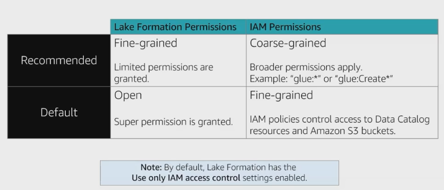
</figure>

#### A.3.2.1 Data lake access control

<figure>
  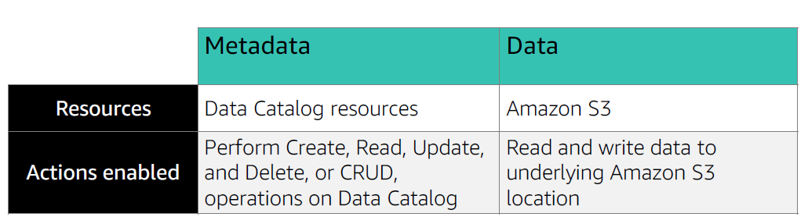
</figure>

## A.5 Module 4: Data processing and analytics
### A.5.1 Topic A Data transformation

<figure>
  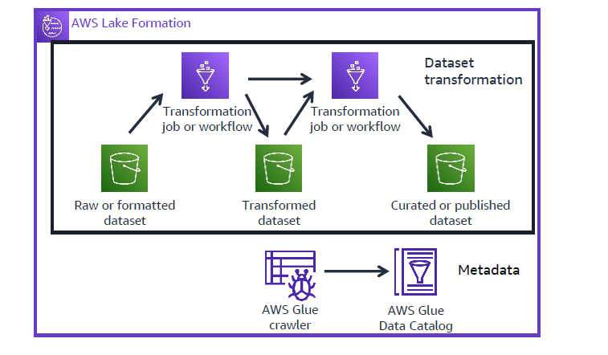
</figure>

The key takeaway from this architecture diagram is that a **data lake will have a set of extract, transform, and load (ETL) jobs that transform data from one or more dataset sources and update other dataset targets**. In addition, crawlers work to keep the data catalog synchronized with the underlying datasets. This module will look at the various use cases and data

### A.5.2 Topic B Data processing with AWS Glue
``AWS Glue`` is a serverless data integration service – Discover, prepare, and combine data for analytics, machine learning, and application development.

### A.5.3 Topic C AWS Glue jobs and workflows
## A.6 Module 5 Module 5: AWS Lake Formation Additional Configurations
### A.6.1 Topîc A Using blueprints and workflows 
A **blueprint** is a data management template **where you can ingest data into a data**. ``Lake Formation`` provides several blueprints, each for a predefined source type, such as a relational database or AWS CloudTrail logs. 

From a blueprint, you can create a **workflow** . **Workflows** consist of ``AWS Glue`` crawlers, jobs, and triggers that are generated to orchestrate the loading and updating of data. **Blueprints** take the data source, data target, and schedule as input to configure the workflow.

A **workflow** is a **container for a set of related** ``AWS Glue`` jobs, crawlers, and triggers. You create the workflow in ``Lake Formation`` by selecting a blueprint. ``Lake Formation`` can track the status of a workflow as a single entity.**

**Creating a workflow**
* Choose blueprint type:
* Configure source and target:
* Configure the workflow:

### A.6.2 Topic B Fine grained access control
There are two distinct methods for granting Lake Formation permissions on Data Catalog resources:
* **Named resource access control**. With this method, **you grant permissions on specific databases or tables by specifying database or table names**. The grants have this form: 
>>> **Grant permissions to principals on resource**s (with grant option). 

With the grant option, **you can allow the grantee to grant the permissions to other principals**.
* **Tag based access control**, or TBAC With this method, **you assign one or more LF Tags to Data Catalog, databases, tables, and columns, and you grant permissions on one or more LF Tags to principals**. 
* >>> **Each LF Tag is a key value pair, such as department=sales**. 
  
A principal that has LF Tags that match the LF Tags on a Data Catalog resource can access that resource. This method is recommended for data lakes with a large number of databases and tables, and we cover that later in this topic.

