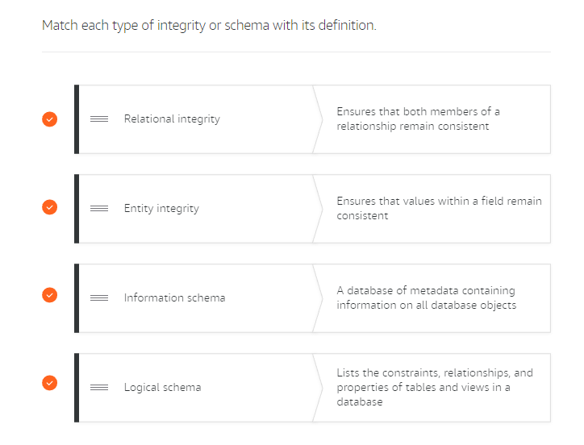

# Introduction to data analysis solutions
https://ecotrust-canada.github.io/markdown-toc/
- [Introduction to data analysis solutions](#introduction-to-data-analysis-solutions)
  - [A-Lesson 1: Introduction to data analysis solutions](#a-lesson-1-introduction-to-data-analysis-solutions)
    - [A.1-Benefits of data analytics on a big scale](#a1-benefits-of-data-analytics-on-a-big-scale)
    - [A.2 Characteristics of big data](#a2-characteristics-of-big-data)
    - [A.3 Components of a data analysis solution](#a3-components-of-a-data-analysis-solution)
  - [B Lesson 2: Volume - Data Storage](#b-lesson-2-volume---data-storage)
    - [B.1 Exponential growth of business data](#b1-exponential-growth-of-business-data)
    - [B.2 Introduction to Amazon S3](#b2-introduction-to-amazon-s3)
      - [B.2.1 Amazon S3 concepts](#b21-amazon-s3-concepts)
      - [B.2.2-Accessing your content](#b22-accessing-your-content)
    - [B.3 Introduction to data lakes](#b3-introduction-to-data-lakes)
      - [B.3.1 Benefits of a data lake on AWS](#b31-benefits-of-a-data-lake-on-aws)
      - [B.3.2 Amazon EMR and data lakes](#b32-amazon-emr-and-data-lakes)
      - [B.4 AWS Lake Formation](#b4-aws-lake-formation)
    - [B.4 Introduction to data storage methods](#b4-introduction-to-data-storage-methods)
      - [B.4.1 Data marts](#b41-data-marts)
      - [B.4.2 Amazon Redshift benefits](#b42-amazon-redshift-benefits)
      - [B.4.3 Comparing data warehouses and data lakes](#b43-comparing-data-warehouses-and-data-lakes)
    - [B.5 Amazon EMRFS](#b5-amazon-emrfs)
  - [C Lesson 3: Velocity – data processing](#c-lesson-3-velocity--data-processing)
    - [C.1 Introduction to data processing methods](#c1-introduction-to-data-processing-methods)
    - [C.2 Attributes of batch and stream processing](#c2-attributes-of-batch-and-stream-processing)
    - [C.3 Introduction to batch data processing](#c3-introduction-to-batch-data-processing)
      - [C.3.1 Batch processing architecture](#c31-batch-processing-architecture)
      - [C.3.2 Batch processing use cases](#c32-batch-processing-use-cases)
    - [C.4 Introduction to stream data processing](#c4-introduction-to-stream-data-processing)
      - [C.4.1 Processing big data streams](#c41-processing-big-data-streams)
      - [C.4.2 Benefits of stream processing](#c42-benefits-of-stream-processing)
      - [C.4.3 Stream processing architecture](#c43-stream-processing-architecture)
      - [C.4.4 Stream processing use cases](#c44-stream-processing-use-cases)
  - [D Lesson 3: Variety – data structure and types](#d-lesson-3-variety--data-structure-and-types)
    - [D.1 Introduction to source data storage](#d1-introduction-to-source-data-storage)
      - [D.1.1 Data source types](#d11-data-source-types)
    - [D.2 Introduction to structured data stores](#d2-introduction-to-structured-data-stores)
      - [D.2.1 Types of information systems](#d21-types-of-information-systems)
        - [D.2.1.1 OLTP databases(Operational databases)](#d211-oltp-databasesoperational-databases)
        - [D.2.1.2 OLAP databases(data Warehouses)](#d212-olap-databasesdata-warehouses)
    - [D.3 Row-based and columnar data indexing](#d3-row-based-and-columnar-data-indexing)
    - [D.3 Introduction to semi-structured and unstructured data stores](#d3-introduction-to-semi-structured-and-unstructured-data-stores)
      - [D.3.1 Non-relational databases](#d31-non-relational-databases)
        - [D.3.1.1 Documents stores](#d311-documents-stores)
        - [D.3.1.2 Key-values stores](#d312-key-values-stores)
      - [D.3.2 Schema changes in relational and non-relational databases](#d32-schema-changes-in-relational-and-non-relational-databases)
        - [D.3.2.1 Data Schemas](#d321-data-schemas)
        - [D.3.2.2 Schema change in a relational database](#d322-schema-change-in-a-relational-database)
        - [D.3.2.2 Schema change in a non-relational database](#d322-schema-change-in-a-non-relational-database)
      - [D.3.2 Graph databases](#d32-graph-databases)
    - [D.4 Comparing relational and non-relational databases](#d4-comparing-relational-and-non-relational-databases)
  - [E Lesson 4: Veracity – cleansing and transformation](#e-lesson-4-veracity--cleansing-and-transformation)
    - [E.1 Definitions](#e1-definitions)
    - [E.2 The problem of veracity](#e2-the-problem-of-veracity)
      - [E.2.1 Understanding data integrity](#e21-understanding-data-integrity)
      - [E.2.2 Definitions](#e22-definitions)
      - [E.2.3 Identifying data integrity issues](#e23-identifying-data-integrity-issues)
      - [E.2.4 Database schemas](#e24-database-schemas)
      - [E.2.5 Information schema](#e25-information-schema)
    - [E.3 Understanding database consistency](#e3-understanding-database-consistency)
      - [E.3.1 ACID](#e31-acid)
        - [E.3.1.1 ACID compliance](#e311-acid-compliance)
      - [E.3.2 BASE](#e32-base)
        - [E.3.2.1 BASE compliance](#e321-base-compliance)
    - [E.4 Introduction to the ETL process](#e4-introduction-to-the-etl-process)
      - [E.4.1 AWS services in the ETL process](#e41-aws-services-in-the-etl-process)
  - [F Lesson 5: Value – reporting and business intelligence](#f-lesson-5-value--reporting-and-business-intelligence)
    - [F.1 Introduction to analyzing data](#f1-introduction-to-analyzing-data)
      - [F.1.1 Operational analytics](#f11-operational-analytics)
      - [F.1.2 There are five types of analysis:](#f12-there-are-five-types-of-analysis)
    - [F.2 Predictive analytics](#f2-predictive-analytics)
    - [F.3 Cognitive analytics](#f3-cognitive-analytics)
    - [F.4 Analytic services and velocity](#f4-analytic-services-and-velocity)
      - [F.4.1 Batch Analytics](#f41-batch-analytics)
      - [F.4.2 Interactive analytics](#f42-interactive-analytics)
      - [F.4.3 Stream analytics](#f43-stream-analytics)
    - [F.5 Data analysis solutions and AWS services](#f5-data-analysis-solutions-and-aws-services)
      - [F.5.1 Ingest/Collect](#f51-ingestcollect)
      - [F.5.1 Store](#f51-store)
      - [F.5.1 Process/Analyze](#f51-processanalyze)
      - [F.5.1 Consume/Visualize](#f51-consumevisualize)
    - [F.5 Introduction to visualizing data](#f5-introduction-to-visualizing-data)
> Organizations spend **millions** of dollars on data storage. The problem isn’t **finding** the data—the problem is **failing** to do anything with it. 
## A-Lesson 1: Introduction to data analysis solutions
### A.1-Benefits of data analytics on a big scale

* Customer Personalization
* Fraud Detection
* Security Threat Detection
* User behavior
* Financial Modeling and Forecasting
* Real-Time Alerting

> **Effective** data analysis solutions require both storage and the ability to analyze data **in near real time**, with **low latency** while yielding **high-value returns.**

### A.2 Characteristics of big data

The **volume** and **velocity** of data are only two factors you should consider in  a data analytics solution
* Volume
* Velocity
* Variety
* Veracity
* Value

### A.3 Components of a data analysis solution

* **Ingest/Collect** : Assemble data from many sources
* **Store** : Hold data in repositories
* **Process Analyze** : Manipulate data into needed forms
* **Consume Visualize** : Extract key information from the data

## B Lesson 2: Volume - Data Storage
> When businesses have **more data** than they are able to **process and analyze**, they have a **volume problem**..
### B.1 Exponential growth of business data
There are three broad classifications of data source types:

* **Structured data** is organized and stored in the form of values that are grouped into rows and columns of a table.
* **Semi-structured data** is often stored in a series of key-value pairs that are grouped into elements within a file.
* **Unstructured data** is not structured in a consistent way. Some data may have structure similar to semi-structured data but others may only contain metadata.

### B.2 Introduction to Amazon S3
``Amazon S3`` is object storage built to store and retrieve any amount of data from anywhere.

#### B.2.1 Amazon S3 concepts

To get the most out of Amazon S3, you need to understand a few simple concepts. First, ``Amazon S3`` stores data as objects within buckets.

An **object** is composed of a file and any metadata that describes that file. To store an object in Amazon S3, you upload the file you want to store into a bucket. When you upload a file, you can set permissions on the object and add any metadata.

**Buckets** are logical containers for objects. You can have one or more buckets in your account and can control access for each bucket individually. You control who can create, delete, and list objects in the bucket. You can also view access logs for the bucket and its objects and choose the geographical region where Amazon S3 will store the bucket and its contents.

#### B.2.2-Accessing your content
Once objects have been stored in an ``Amazon S3`` bucket, they are given an **object key**. Use this, along with the bucket name, to access the object.

### B.3 Introduction to data lakes
> A data lake is a **centralized repository** that allows you to store **structured, semistructured, and unstructured** data at any scale.
``Data lakes`` promise the ability to store all data for a business in a single repository. You can leverage data lakes to store large volumes of data instead of persisting that data in data warehouses. ``Data lakes``, such as those built in ``Amazon S3``, are generally less expensive than specialized big data storage solutions.
* Single source of truth
* Store any type of data, regardless f structure
* Can be analyzed using artificial intelligence (AI) and machine learning.

#### B.3.1 Benefits of a data lake on AWS
* **Cost-effective data storage solution**
* Implement industry-leading **security and compliance**.
* Allow you to take advantage of **many different data collection and ingestion tools** to ingest data into your data lake.
* **Categorize and manage your data** simply and efficiently.
* Help you turn data into **meaningful insights**.

#### B.3.2 Amazon EMR and data lakes
``Apache Hadoop`` and ``Spark`` are both supported by ``Amazon EMR``, which has the ability to help businesses easily, quickly, and cost-effectively implement data processing solutions based on ``Amazon S3`` data lakes.

#### B.4 AWS Lake Formation 
``AWS Lake Formation`` makes it easy to **ingest, clean, catalog, transform, and secure** your data and make it available for analysis and machine learning. ``Lake Formation`` gives you a central console where you can discover data sources, set up transformation jobs to move data to an ``Amazon S3`` data lake, remove duplicates and match records, catalog data for access by analytic tools, configure data access and security policies, and audit and control access from AWS analytic and machine learning services.

``Lake Formation`` automatically configures underlying AWS services to ensure compliance with your defined policies. If you have set up transformation jobs spanning AWS services, ``Lake Formation`` **configures the flows, centralizes their orchestration, and lets you monitor the processing of your jobs**.

### B.4 Introduction to data storage methods
``Data Lakes`` and ``Data warehouses`` are two different storage systems. ``Data Lakes`` are not a replacement for ``data warehouses``.
> A ``data warehouse`` is a **central repository** of structured data from many data sources. This data is **transformed, aggregated, and prepared** for business reporting and analysis.
>
> 

A ``data warehouse`` is a **central repository of information coming from one or more data sources**. Data flows into a data warehouse from transactional systems, relational databases, and other sources. These data sources can **include structured, semi-structured, and unstructured data**. 
> **These data sources are transformed into structured data before they are stored in the data warehouse.**

**Data is stored within the data warehouse using a schema**. A schema defines how data is stored within tables, columns, and rows. The schema enforces constraints on the data to ensure integrity of the data. The transformation process often involves the steps required to make the source data conform to the schema. Following the first successful ingestion of data into the data warehouse, the process of ingesting and transforming the data can continue at a regular cadence.

Business analysts, data scientists, and decision makers access the data through business intelligence (BI) tools, SQL clients, and other analytics applications. Businesses use reports, dashboards, and analytics tools to extract insights from their data, monitor business performance, and support decision making. These reports, dashboards, and analytics tools are powered by data warehouses, which store data efficiently to minimize I/O and deliver query results at blazing speeds to hundreds and thousands of users concurrently.

#### B.4.1 Data marts
Data warehouses can be massive. Analyzing these huge stores of data can be confusing. Many organizations **need a way to limit the tables to those that are most relevant to the analytics users will be performing**.
> A subset of data from a data warehouse is called a **data mart**. Data marts only focus on one subject or functional area

#### B.4.2 Amazon Redshift benefits

This is where ``Amazon Redshift`` comes in. ``Amazon Redshift`` overcomes all of these negatives by providing a cloud-based, scalable, secure environment for your data warehouse. ``Amazon Redshift`` is easy to set up, deploy, and manage and provides up to 10 times faster performance than other data warehousing solutions.

#### B.4.3 Comparing data warehouses and data lakes

**Analyzing a Data Warehouse**:

For analysis to be most effective, it should be performed on data that has been processed and cleansed. This often means implementing an ETL operation to collect, cleanse, and transform the data. This data is then placed in a data warehouse. It is very common for data from many different parts of the organization to be combined into a single data warehouse.

Amazon Redshift is a data warehousing solution specially designed for workloads of all sizes. Amazon Redshift Spectrum even provides the ability to query data that is housed in an Amazon S3 data lake.

**Analyzing a Data Lakes**

Data lakes extend data warehouses

Data lakes provide customers a means for including unstructured and semi-structured data in their analytics. Analytic queries can be run over cataloged data within a data lake. This extends the reach of analytics beyond the confines of a single data warehouse.

Businesses can securely store data coming from applications and devices in its native format, with high availability, durability, at low cost, and at any scale. Businesses can easily access and analyze data in a variety of ways using the tools and frameworks of their choice in a
high-performance, cost-effective way without having to move large amounts of data between storage and analytics systems.

**AWS: Data Lakes and Analytics**

AWS provides a comprehensive portfolio of services that enable customers to build their data lakes in the cloud and analyze all their data with the broadest set of analytical approaches, including machine learning.

> So now what we’ve got is ``Amazon S3`` that can host a data lake and ``Amazon Redshift`` that can host a data warehouse, but what if I need to query across both spaces?
>
> ``Amazon Redshift Spectrum`` **allows you to combine your data lake and data warehouse as if it were a single source of data**. No data movement, no crazy query logic, just clean queries of all your data. 
>
### B.5 Amazon EMRFS

``Amazon EMR`` provides an alternative to ``HDFS``: the ``EMR File System (EMRFS)``. EMRFS can help ensure that there is a persistent "source of truth" for HDFS data stored in Amazon S3. When implementing EMRFS, there is no need to copy data into the cluster before transforming and analyzing the data as with HDFS. EMRFS can catalog data within a data lake on Amazon S3. The time that is saved by eliminating the copy step can dramatically improve performance of the cluster.

* ``Data warehouses`` provide storage for highly structured data sets that serve as the single source of truth for analytical queries.

* ``Data lakes`` allow content of any form to be stored. This content may not be curated and serves all forms of querying.

* ``OLTP databases`` serve as a structured store for new and frequently updated data. They may not perform well when analytical queries are run frequently.

* ``Hadoop clusters`` provide extremely fast and reliable ingestion and processing of data.

## C Lesson 3: Velocity – data processing

> When businesses **need rapid insights** from the data they are collecting, **but the systems in place simply cannot meet the need, there's a velocity problem.**

**Data processing** means the collection and manipulation of data to produce meaningful information. 

**Data collection** is divided into two parts:
* **Data collection**: Gathering data from multiple source for single source storage and analysis.
* **Data processing**: Formatting, organizing and controlling data. 

### C.1 Introduction to data processing methods
``Data processing`` may only need to **be performed once a day**, making results available the following morning, or it may need to be performed and made available immediately. This variance in the speed at which data processing must occur can be broken down into four categories.

Two types of data processing: 
* **Batch processing** (processing content in batches at certain intervals). Used to get deep insights from complex analytics.
* **Stream processing** (processing data in a stream—in other words, processing data that’s generated continuously, in small datasets). Used to get initial insights and real-time feedback.

* Rapid collection of data followed by the rapid processing of data is another common challenge ==> **Stream processing system.**

* Slower collection of data followed by a rapid processing requirement is a common challenge ==> **Batch processing system.**

### C.2 Attributes of batch and stream processing
The table below highlights the difference between batch and stream processing: 

### C.3 Introduction to batch data processing

``Batch processing`` is often thought of as a slow process. This is not the case. ``Batch processing`` must quickly and efficiently consume a huge amount of data all at once. This poses challenges that do not exist with ``stream processing``.

``Batch data processing`` provides companies with the ability to dive deep into the data they have collected to produce complex analytics that simply cannot be achieved using ``streaming analytics``.

> ``Batch processing`` is the processing of a series of programs, or jobs, on one or more computers without manual intervention.

Data is collected into batches asynchronously. Each batch is sent to a processing system when specific conditions are met, such as a specified time of day. The results of the processing job are then sent to a storage location to be queried later as needed.

You can run them **when less expensive capacity is available**. With modern architectures, you can optimize ``batch processing`` systems to the frequency and size of the batches you’re processing. This avoids the idling compute resources and under-used storage capacity often associated with traditional on-premises systems.

``Amazon EMR`` has mitigated the problem of **imbalanced processing jobs** by decoupling the collection system from the processing system. This is accomplished by implementing one of two common frameworks: ``Hadoop`` or ``Apache Spark``. Both frameworks process high-velocity data but they do it in different ways.

Both ``Hadoop`` and ``Spark support`` general **batch processing, streaming analytics, machine learning, graph databases, and ad hoc queries**.
#### C.3.1 Batch processing architecture
Batch processing can be performed in different ways using AWS services. In the following architecture,

The architecture diagram below depicts the same data flow as above but uses ``AWS Glue`` **for aggregated ETL (heavy lifting, consolidated transformation, and loading engine)**. 
> ``AWS Glue`` is a fully managed service, as opposed to ``Amazon EMR``, which requires management and configuration of all of the components within the service.

#### C.3.2 Batch processing use cases
* **Log analytics**: ``Amazon EMR`` can be used to process logs generated by web and mobile applications. 
* **Unified view of data across multiple data stores**: You can use the ``AWS Glue Data Catalog`` to quickly discover and search across multiple AWS data sets without moving the data. 
* **Predictive analytics**: ``Apache Spark`` on ``EMR`` includes MLlib for scalable machine learning algorithms, or you can use your own libraries.
* **Queries against an Amazon S3 data lake**: ``Data lakes`` are an increasingly popular way to store and analyze both structured and unstructured data.

> ``AWS Lambda`` is a serverless compute service that can **be used to initiate processing operations in a batch processing system.**

### C.4 Introduction to stream data processing

``Stream data processing`` is one of the fastest growing areas of processing. 
> With ``stream processing`` solutions, **the amount of data being transferred and the size of the data packets is not always consistent.**
#### C.4.1 Processing big data streams
* With streaming solutions, **the collection system (producer**) and **the processing system (consumer)** are always separate.
* Streaming data uses what are called **data producers**. Each of these producers can write their data to the same endpoint, **allowing multiple streams of data to be combined into a single stream for processing**. 
* Another huge advantage is **the ability to preserve client ordering of data and the ability to perform parallel consumption of data**. This allows multiple users to work simultaneously on the same data.

#### C.4.2 Benefits of stream processing

#### C.4.3 Stream processing architecture

**Combined processing architecture**

It is important to remember that **streaming analytics is very limited**. Due to the size of each data packet and the speed the data is moving, **you are limited to simple analytics such as aggregating and filtering the data**. Due to this limitation, **it is common for businesses to incorporate batch analytics to produce deeper insights into the data before producing dashboards and reports on the data.**

In this architecture, 
* Sensor data is being collected in the form of a stream. The streaming data is being collected from the sensor devices by ``Amazon Kinesis Data Firehose``. 
* This service is configured to send the data to be processed using ``Amazon Kinesis Data Analytics``. 
* This service **filters the data for relevant records** and send the data into another ``Kinesis Data Firehose`` process, which places the results into an ``Amazon S3 bucket`` at the serving layer.
* Using ``Amazon Athena``, the data in the ``Amazon S3`` bucket can now be queried. ``Amazon QuickSight`` can be used to produce dashboards that include content from both Amazon Athena and the first Amazon S3 bucket where the raw streaming data was loaded.

**Combined processing architecture**

#### C.4.4 Stream processing use cases
* **Build video analytics applications**
* **Evolve from batch to real-time analytics**
* **Analyze IoT device data**

## D Lesson 3: Variety – data structure and types
> When your business becomes **overwhelmed** by the **sheer number of data sources** to analyze and you **cannot find systems** to perform the analytics, you know you have a **variety** problem.
### D.1 Introduction to source data storage

**Transactional databases** experience heavy write and update operations, while **analytical databases** experience heavy read operations.

#### D.1.1 Data source types

**Structured data** is stored in a tabular format, often within a database management system (DBMS). This data is organized based on a relational data model, which defines and standardizes data elements and their relation to one another. Data is stored in rows, with each row representing a single instance of a thing (for example, a customer). These rows are well understood due to the table schema, which explains what each field in the table represents. This makes structured data easy to query.
> **The downside to structured data is its lack of flexibility.**
> 
**Examples of structured data applications** include Amazon RDS, Amazon Aurora, MySQL, MariaDB, PostgreSQL, Microsoft SQL Server, and Oracle.
>
**Semi-structured data** is stored in the form of elements within a file. This data is organized based on elements and the attributes that define them. It doesn't conform to data models or schemas. **Semi-structured** data is considered to have a self-describing structure. Each element is a single instance of a thing, such as a conversation. The attributes within an element define the characteristics of that conversation. Each conversation element can track different attributes. This makes semi-structured data quite flexible and able to scale to meet the changing demands of a business much more rapidly than structured data.

**Examples of semi-structured data** stores include CSV, XML, JSON, Amazon DynamoDB, Amazon Neptune, and Amazon ElastiCache.

**Unstructured data** is stored in the form of files. This data doesn't conform to a predefined data model and isn't organized in a predefined manner. Unstructured data can be text-heavy, photographs, audio recordings, or even videos. Unstructured data is full of irrelevant information, which means the files need to be preprocessed to perform meaningful analysis. This can be done in many ways. For example, services can add tags to the data based on rules defined for the types of files. The data can also be cataloged to make it available to query services.

**Examples of unstructured data** include emails, photos, videos, clickstream data, Amazon S3, and Amazon Redshift Spectrum.

> **Structured data** is hot, **immediately ready** to be analyzed. 

> **Semi structured data** is lukewarm, some data will be ready to go and other data **may need to be cleansed** or preprocessed. 

> **Unstructured data** is the **frozen** ocean—full of **exactly what you need** but separated by all kinds of **stuff you don’t need**.

### D.2 Introduction to structured data stores
> **Structured data** is stored in a tabular format, often within a database management system. 
* **Flat-file data** : There is no consistency from one file to the next. Joining data together is nearly impossible without pre-processing, and there is no way to gauge the integrity of the data.
* **Relational databases** : They allow you to rapidly collect, update, and query data. One of their greatest strengths is their ability to enforce ACID compliancy. (RDS Read-Replica and so on)

#### D.2.1 Types of information systems
There are two main ways—known as information systems—of organizing data within a relational database. The data can be organized to focus on the storage of transactions or the process of analyzing transactions.

##### D.2.1.1 OLTP databases(Operational databases)

**Transactional databases** are called online ``transaction processing (OLTP)`` databases. 
> The data gathered by ``OLTP databases`` **is often fed into another type of database that focuses on analyzing the transactional data**. 

``Online transaction processing (OLTP)`` databases, often called **operational databases**, logically organize data **into tables with the primary focus being on the speed of data entry**. 
> These databases are characterized by **a large number of insert, update, and delete operations**.

All decisions about the organization of data and storage of attributes is based on ensuring **rapid data entry and updates**.
> The effectiveness of an OLTP system is often measured by the number of transactions per second.

``Online analytical processing (OLAP)`` databases **gather data from OLTP systems for the purpose of organizing it for analytical operations.**

##### D.2.1.2 OLAP databases(data Warehouses)
``Online analytical processing (OLAP)`` databases, often called **data warehouses**, logically **organize data into tables with the primary focus being the speed of data retrieval through queries**. 
> These databases are characterized **by a relatively low number of write operations and the lack of update and delete operations**.

All decisions about the organization of data and storage of attributes are based on the types of queries and other analytics that will be performed using the data. 
The effectiveness of an ``OLAP`` system **is often measured by the response time of query results.**

### D.3 Row-based and columnar data indexing
Data within a database should be indexed to allow a query to quickly find the data it needs to produce a result. Indexes control the way data is physically stored on disk. They physically group records into a predictable order based on the key values within the table. This plays a huge part in the speed and efficiency of queries.

In an ``OLTP system``, the most common queries are called **lookup queries**. These queries need to return several columns of data for each matching record. The filters on this data are generally based on the key columns in that table. In this type of system, you might query to get details for a specific order.

In an ``OLAP system``, the most common queries are **aggregate queries**. These queries take large numbers of rows and reduce them to a single row by aggregating the values in one or more columns. In this type of system, you might query to find out the total number of items sold on a specific date.

> Running **a row-based index for an OLAP database can cause an excessive amount of unneeded data, called data waste**, to be read into memory for every query, because every column of every row must be loaded. **This is where columnar indexing comes in.**

Both ``OLTP`` and ``OLAP`` systems can use either indexing method. However, **there are advantages to choosing the method that is best suited to the types of queries that will be run the majority of the time**.

* For ``OLTP`` or ``OLAP`` databases **using row-based indexing**, Amazon have ``Amazon Relational Database Service``, also called ``Amazon RDS``. When you implement ``Amazon RDS``, you have the choice between many popular database management systems such as ``Amazon Aurora, PostgreSQL, MySQL, MariaDB, Oracle, and SQL Server``.

* For ``OLAP`` databases using **columnar indexing**, Amazon have ``Amazon Redshift``, which is a **fast, scalable data warehouse** that makes it simple and cost-effective to analyze all your data across your data warehouse and data lake. 

* **Flat-file data** is stored without strict structure.
* **OLTP data** is structured for data entry purposes.
* **OLAP data** is structured for data retrieval purposes.

### D.3 Introduction to semi-structured and unstructured data stores
Semi-structured and unstructured data are often stored in non-relational database systems, sometimes called NoSQL databases. This term can cause a bit of confusion. It is important to remember that SQL is a way of querying data. It implies precise structure. Non-relational or NoSQL does not mean the data stored cannot be queried using SQL. 
> **A better way to think of it is not only SQL.**

#### D.3.1 Non-relational databases
##### D.3.1.1 Documents stores
``Document stores`` **are a type of non-relational database** that store semi-structured and unstructured data in the form of files. These files range in form but include JSON, BSON, and XML. The files can be navigated using numerous languages including Python and Node.js.

**Strengths:**
* Flexibility
* No need to plan for a specific type of data when creating one
* Easy to scale

**Weaknesses:**
* Sacrifice ACID compliance for flexibility
* Cannot query across files
  
##### D.3.1.2 Key-values stores
``Key-value`` databases **are a type of non-relational database that store unstructured data** in the form of key-value pairs.

Logically, **data is stored in a single table**. Within the table, the values are associated with a specific key. The values are stored in the form of blob objects and do not require a predefined schema. The values can be of nearly any type.

**Strengths: 

* Very flexible
* Able to handle a wide variety of data types
* Keys are linked directly to their values with no need for indexing or complex join operations
* Content of a key can easily be copied to other systems without reprogramming the data

**Weaknesses**: 

* Impossible to query values because they are stored as a single blob
* Updating or editing the content of a value is quite difficult
* Not all objects are easily modeled as key-value pairs

#### D.3.2 Schema changes in relational and non-relational databases 

To understand the powerful flexibility in non-relational databases, **you need to understand what it takes to make changes to the organization of data between relational and non-relational database objects**.
##### D.3.2.1 Data Schemas
A **relational database stores data in the form of tables that contain rows**. Each row represents a single product that can be sold. Each column stores an attribute of that product

A **non-relational database stores data in the form of files that contain bracketed groups of information**. Each group of information represents a single product.

##### D.3.2.2 Schema change in a relational database
The needs of the business have changed. You need to add a new column to track each product's rating. Not all products have a rating yet, so **you need to allow the column to accept NULL values**.

To add a new column to the table, you must:

1. Execute a SQL command to add the column.
2. The table now contains an empty column. 
3. Populate the new column with a value for each existing record.

##### D.3.2.2 Schema change in a non-relational database
When the same requirement is placed on data in a non-relational database, the remedy is quite different. **You simply add the data for that record**.

With a **non-relational database, each record can have its own set of attributes**. 
> **This flexibility is one of the greatest benefits of non-relational databases.**
>
#### D.3.2 Graph databases
``Graph databases`` **are purpose-built to store any type of data: structured, semi-structured, or unstructured**. The purpose for organization in a graph database is to navigate relationships
Data within the database is queried using specific languages associated with the software tool you have implemented.

Logically, **data is stored as a node, and edges store information on the relationships between nodes**. An edge always has a start node, end node, type, and direction, and an edge can describe parent-child relationships, actions, ownership, and the like. There is no limit to the number and kind of relationships a node can have.

**Strengths:**

* Allow simple, fast retrieval of complex hierarchical structures
* Great for real-time big data mining
* Can rapidly identify common data points between nodes
* Great for making relevant recommendations and allowing for rapid querying of those relationships

**Weaknesses:**

* Cannot adequately store transactional data
* Analysts must learn new languages to query the data
* Performing analytics on the data may not be as efficient as with other database types

### D.4 Comparing relational and non-relational databases

* A **multi-demensional data warehouse** is best suited for a relational database.

* **Log files** are generally produced in the form of **XML or JSON files**, which are very well suited for storage in a **document database**.

* Data collected from **online gaming websites is often very rapid in generation and temporary in nature**. This data is well suited for a **key-value database**.

* **Transactional data** from a social subscription service could be stored in a **relational database, but due to the social component, it would be better suited to the advantages gained by using a graph database**.

* **Non-relational databases** are optimized for compute and are good at scaling horizontally. 
* **The data design for non-relational databases is denormalized document, wide column, or key-value based**. 
* Lastly, **non-relational databases are commonly used for OLTP web and mobile applications, but not for OLTP business systems**.

## E Lesson 4: Veracity – cleansing and transformation
> When you have data that is **ungoverned**, coming from numerous, **dissimilar systems** and **cannot curate the data** in meaningful ways, you know you have a **veracity** problem.
>
### E.1 Definitions

**Curation** is the action or process of selecting, organizing, and looking after the items in a collection.

**Data integrity** is the maintenance and assurance of the accuracy and consistency of data over its entire lifecycle.

**Data veracity** is the degree to which data is accurate, precise, and trusted.

### E.2 The problem of veracity
Data changes over time. As it is transferred from one process to another, and through one system and another, there are opportunities for the integrity of the data to be negatively impacted. You must ensure that you maintain a high level of certainty that the data you are analyzing is trustworthy.

#### E.2.1 Understanding data integrity
**Data integrity** is all about making sure your data is trustworthy. **Data integrity** is a broad term that is applied in different ways in each phase of the data lifecycle.
*  In the **creation phase, data integrity means ensuring data accuracy**. This involves a certain amount of trust in the systems that collect the data. Relational databases use ACID compliance to enforce data integrity. Making sure your data is accurate requires regular audits of your software systems to confirm two things: that they’re producing valid data or files and that changes won’t negatively impact the system’s integrity.

* In the **aggregation  phase, data integrity in this phase ensures that the user gets the value they expect from the aggregate provided to them**. The loss of integrity in this phase is often the result of poor naming of aggregate values and poor planning on the part of the developer in meeting the needs of the users.

* In the **storage phase, data integrity is about maintaining the data in a secure form and making sure all changes are accurate.** Securing data means ensuring that stable data is not changed and that volatile data can only be updated by authorized users and services. 

* In the **access phase, your data becomes visible to users**. At this stage, data is provided in a read-only format. This means that there are no changes allowed to the data, and the data’s integrity cannot be changed. Data integrity at this phase is a proof of the integrity of all the other phases. 

#### E.2.2 Definitions

* **Data cleansing** is the process of **detecting and correcting corruptions within data**.
* **Referential integrity** is the **process of ensuring that the constraints of table relationships are enforced**.
* **Domain integrity** is the **process of ensuring that the data being entered into a field matches the data type defined for that field**.
* **Entity integrity** is the **process of ensuring that the values stored within a field match the constraints defined for that field.**

#### E.2.3 Identifying data integrity issues

As a data analyst, you may be called upon to perform data integrity checks. During this process, you will be looking for potential sources of data integrity problems.

Data can come from both internal and external sources. **It is highly unlikely that you will be able to have influence on data generated outside of your business**. However, within your business, you may have the ability to make recommendations on improvements for the data sources you will be interacting with.

**Here are a few best practices to help you identify data integrity issues.**

* **Know what clean looks like**

* **knows where errors are coming from**

* **knows what acceptable changes look like**

* **know if the original data has value**

#### E.2.4 Database schemas
As we have discussed, **relational databases rely upon database schemas to organize the content within the database and to enforce both referential and domain integrity**.

A **data schema is the set of metadata used by the database to organize data objects and enforce integrity constraints**. The **schema defines the attributes of the database**, providing descriptions of each object and how it interacts with other objects within the database. One or more schemas can reside on the same database.

There are two types of schemas: 
* **logical**: Logical schemas **focus on the constraints to be applied to the data within the database**. This includes the organization of tables, views, and integrity checks. 
* **Physical**: Physical schemas **focus on the actual storage of data on disk or in a cloud repository**. These schemas include details on the files, indices, partitioned tables, clusters, and more.

#### E.2.5 Information schema
Have you ever wondered how a DBMS manages all of the databases, tables, and relationships? The answer is found in the **information schema**. 
> An **information schema is a database of metadata that houses information on the data objects within a database**.

When you prepare to begin evaluating the data integrity of a source system, you need to know the following:
* What does clean look like?
* Where are the errors most likely to come from?
* What do acceptable changes look like?
* Does the original data have value?

 

### E.3 Understanding database consistency
 To maintain **veracity in stored data, consistency is key**. When data is stored as files, consistency is controlled by the application that is developing the files. When data is stored in a database, consistency is the responsibility of the database that is housing the data. In this topic, we will discuss the two methods that databases implement: ``ACID`` and ``BASE``.

#### E.3.1 ACID

``ACID`` is an acronym for **Atomicity, Consistency, Isolation, and Durability**. It is a method for maintaining consistency and integrity in a structured database.
##### E.3.1.1 ACID compliance

``ACID`` is the long-standing bastion of relational data integrity. In a database such as ``Amazon RDS``, **a sequence of statements processed together is called a transaction**. Millions of transactions can be performed consecutively. The data and the constraints on that data are very active in relational databases.

> The goal of an **ACID-compliant** database is **to return the most recent version of all data and ensure that data entered into the system meets all rules and constraints that are assigned at all times.**

**Many NoSQL databases choose not to enforce ACID consistency**. Why? Well, it comes down to the fact that ACID consistency is most concerned about the absolute consistency of all data. Enforcing this consistency takes time. This is time that many NoSQL databases cannot afford if they are to meet the demands of the applications using them.

This is where ``BASE`` consistency comes in. ``BASE`` **consistency is most concerned about the rapid availability of data. BASE consistency is commonly implemented for NoSQL databases, in distributed systems and on unstructured data stores.**

#### E.3.2 BASE

``BASE`` is an acronym for **Basically Available Soft state Eventually consistent**. It is **a method for maintaining consistency and integrity in a structured or semi-structured database.**
##### E.3.2.1 BASE compliance

``BASE`` **supports data integrity in non-relational databases, which are sometimes called NoSQL databases**. Non-relational databases like ``Amazon DynamoDB`` still use transactions for processing requests. These databases are hyperactive, and **the primary concern is the availability of the data over the consistency of the data**. 
> **To ensure the data is highly available, changes to data are made available immediately on the instance where the change was made**. 
However, it may take time for that change to be replicated across the fleet of instances. The aim is that the change will eventually be fully consistent across the fleet. 

* **Basically Available**: ``BA`` **allows for one instance to receive a change request and make that change available immediately**. The system will always guarantee a response to each request. However, it is possible that the response may be a failure or stale data if the change has not been replicated to all nodes. In an ``ACID`` system, **the change would not become available until all instances were consistent**. 
> **Consistency in a ``BASE`` model is traded for availability**.
>
* **Soft State**
In a ``BASE`` system, there are allowances for partial consistency across distributed instances. For this reason, ``BASE`` **systems are considered to be in a soft state, also known as a changeable state**.

In an ``ACID`` system, **the database is considered to be in a hard state because users cannot access data that is not fully consistent**.

* **Eventual consistent**
This reinforces the other letters in the acronym. The data will be eventually consistent. In other words, a change will eventually be made to every copy. However, the data will be available in whatever state it is during the propagation of the change.

### E.4 Introduction to the ETL process
Your data analysis solution requires a process **to gather, transform, and move data into a new analytical data store**. This process is known as an ``ETL`` operation. 
> ``ETL`` operations **allow you to ensure that your data has the accuracy, precision, and depth you need to properly analyze the data and produce a complete data narrative through reports and dashboards.** 

#### E.4.1 AWS services in the ETL process

AWS provides services for every phase of the ETL process. From data source storage to reporting, AWS has you covered.

**Transforming your data – comparing Amazon EMR and AWS Glue**

When it comes to performing the data transformation component of ETL, **there are two options within AWS**: ``Amazon EMR`` and ``AWS Glue``. These two services provide similar results but require different amounts of knowledge and time investment.

* ``Amazon EMR`` is a **more hands-on approach to creating your data pipeline**. This service provides a **robust data collection and processing platform**. Using this service requires you to have strong technical knowledge and know-how on your team. The upside of this is that **you can create a more customized pipeline to fit your business needs**. Additionally, **your infrastructure costs may be lower than running the same workload** on ``AWS Glue``.

* ``AWS Glue`` **is a serverless, managed ETL tool that provides a much more streamlined experience** than ``Amazon EMR``. This **makes the service great for simple ETL tasks, but you will not have as much flexibility** as with ``Amazon EMR``. You can also use ``AWS Glue`` **as a metastore for your final transformed** data by using the ``AWS Glue Data Catalog``. This catalog is a drop-in replacement for a Hive metastore.

When making your decision about which of these tools to work with, decide with the end in mind. Are you going to want a continuous data pipeline that requires very little overhead? Do you need massive parallel data processing? How much customization will your data solution require?

* ``AWS ETL`` services allow you to transform one data source type into a different storage format, including  relational, non-relational, and file-based destination formats.

* ``AWS ETL`` services are easy to get started with, and you only pay for what you use.

* These services allow you to use ``Apache Hadoop``, if you are comfortable with it, or use a number of other frameworks and even ``AWS Glue``, which requires no programming knowledge to use.

## F Lesson 5: Value – reporting and business intelligence
> When you have **massive volumes** of **data** used to support a **few golden insights**, you may be missing the **value** of your data.

### F.1 Introduction to analyzing data
**Data analytics** comes in two classifications, **information analytics**, and **operational analytics**.
* **Information analytics** is the process of analyzing information to find the value contained within it. It is a broad classification of data analytics that can cover topics from the financial accounting for a business to analyzing the number of entries and exits in a secured building.
*  The second form of analytics is **operational analytics**. It is quite similar to information analytics; however, it focuses on the digital operations of an organization.

> **Information analytics** is the process of analyzing information to find the value contained within it. This term is often synonymous with data analytics.

#### F.1.1 Operational analytics
There is another form of analytics. It is really a sub-form of **information analytics**, known as **operational analytics**. This form of analytics is used specifically to retrieve, analyze, and report on data for IT operations. The data includes system and security logs, complex IT infrastructure events and processes.

Within AWS, the ``Amazon Elasticsearch Service`` is commonly used to implement operational analytics.

#### F.1.2 There are five types of analysis: 
* **Descriptive**: This form of analysis answers the questions **What happened ?**?
* **Diagnostic**: This form of analysis answers the questions **Why dis it happen ?**?
* **Predictive**: This form of analysis answers the questions **What will happen ?**?
* **Prescriptive**: This form of analysis answers the questions **What should I do ?**?
* **Cognitive**:This form of analysis answers the questions **What are recommended actions ?**?

### F.2 Predictive analytics
**Use case:** Need to create an application that can provide users predictions to minimize the stress of flights and delays due to weather.

AWS has ``Amazon ML`` and a set of services (including artificial intelligence [AI]) **that make it easy for developers to apply predictive analytics to their data and add new, smart data-processing features to their applications**. Amazon has a long and rich tradition around machine learning (ML), and much of this accumulated technology has been packaged up for customer use with this service.

The machine learning stack has three key layers:

1. **Application services** to enable developers to plug prebuilt AI functionality into their apps without having to worry about the ML models that power these services
2. **Platform services** to make it easy for any developer to get started and get deep with ML
3. **Frameworks and interfaces** for ML practitioners

* ``Amazon DynamoDB`` is the storage location for the application data. 
* ``AWS Data Pipeline`` orchestrates the flow of data and preparation for use in ``Amazon SageMaker``. 
*  You can then train an ML model to use the data within ``Amazon SageMaker`` to make real-time predictions based on user activity.

### F.3 Cognitive analytics
**Cognitive analytics** is the newest form of data analytics. It is providing an incredible opportunity to provide highly specialized recommendations to businesses without any human involvement, past the initial configuration and training of the ML models.

### F.4 Analytic services and velocity
The first time you push data through a data analytics system, 
* The data will **flow from ingestion into a staging storage location**. 
* Data will then **be processed from the staging location and may result in the data being placed in an analytical data store**. 
* Processing of the data from the staging location may be repeated many times to produce many different analytical results.

#### F.4.1 Batch Analytics
**Batch analytics** typically involves querying large amounts of **cold data**. Batch analytics are implemented on large data sets to produce a large number of analytical results on a regular schedule. MapReduce-based systems, such as ``Amazon EMR``, are examples of platforms that support batch analytics.

**Note**: Various systems and platforms can be stacked or combined with each other. 

#### F.4.2 Interactive analytics 
**Interactive analytics** typically involves **running complex queries across complex data sets at high speeds**. This type of analytics is interactive in that it allows a user to query and see results right away. **Batch analytics** are generally run in the background, providing analytics in the form of scheduled report deliveries.

 ``Amazon Athena`` makes it easy to analyze data directly in Amazon S3 and Amazon S3 Glacier using standard SQL queries.

 ``Amazon OpenSearch Service`` allows you to search, explore, filter, aggregate, and visualize your data in near-real time. The service has easy-to-use APIs and real-time analytics capabilities alongside the availability, scalability, and security that production workloads require.

 ``Amazon Redshift`` provides the ability to run complex, analytic queries against petabytes of structured data and includes ``Redshift Spectrum``, which runs SQL queries directly against exabytes of structured or unstructured data in Amazon S3 without the need for unnecessary data movement.

#### F.4.3 Stream analytics
 **Stream analytics** requires ingesting **a sequence of data and incrementally updating metrics, reports, and summary statistics in response to each arriving data record**. This method is best suited for real-time monitoring and response functions.

 ``Amazon Kinesis`` is a platform for streaming data on AWS, offering powerful services to make it easy to load and analyze streaming data and enables you to build custom streaming data applications for specialized needs. Kinesis offers two services: Amazon Kinesis Data Firehose and Amazon Kinesis Data Streams.

### F.5 Data analysis solutions and AWS services
 

#### F.5.1 Ingest/Collect

#### F.5.1 Store

#### F.5.1 Process/Analyze

#### F.5.1 Consume/Visualize

**What were total sales in April?** - Questions relating to past events are answered using **descriptive analytics**.

**What is the year-over-year total sales for the Asia Pacific region?** - Questions **comparing current data sets to past data sets** are answered using **diagnostic analytics.**

**What is the projected growth for smoking-related hospitalizations next year?** - Questions **looking for predictions of future events** are answered using **predictive analytics**.

**What products should I buy if I like the Seattle Seahawks?** - Questions **looking for recommendations based on preferences or prior purchase history** are answered using **prescriptive analytics.**

**What is the average number of vehicles spotted by my video doorbell?** - Questions that require **analysis of video, images, and voice** are answered using **cognitive analytics**.

### F.5 Introduction to visualizing data