# A. Module 1 Prepare for the Exam
- [A. Module 1 Prepare for the Exam](#a-module-1-prepare-for-the-exam)
  - [A.1 Domain 1: Data Ingestion and Transformation](#a1-domain-1-data-ingestion-and-transformation)
    - [A.1.1 Lesson 1: Perform data ingestion](#a11-lesson-1-perform-data-ingestion)
    - [A.1.3 Batch data ingestion](#a13-batch-data-ingestion)


## A.1 Domain 1: Data Ingestion and Transformation

### A.1.1 Lesson 1: Perform data ingestion
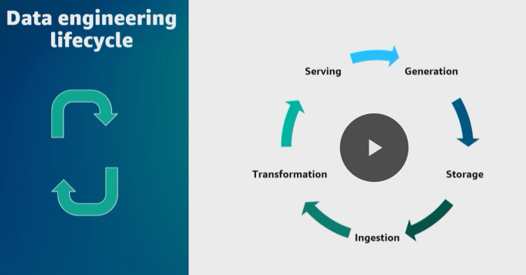
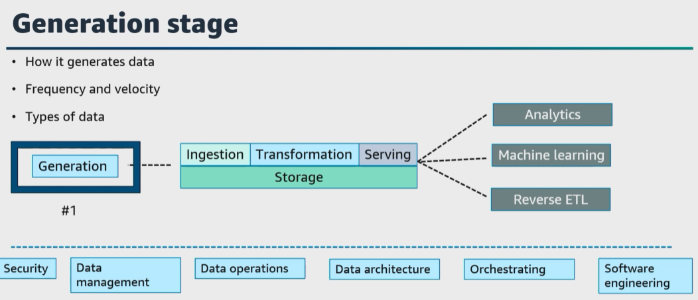


1. ``Generation`` **is where the data originates from, so it is your source system**. This could be an Internet of Things device, a transactional database, an application message queue, and so on. For the generation stage, the data engineer consumes the data from a source system, but does not control that source system. 

Here are just a few questions to consider at this stage. 
* What are the characteristics of the data? 
* How is that data persisted in the source system? 
* Will there be any duplicates, and what is the schema of that source data and does that schema change and more? 


2. The next stage of the data engineering lifecycle is ``storage``. Ensure you can choose an appropriate solution to store the source data, and we will cover this stage under domain 2, **data store management**, but I wanted to mention it here as the second stage and remind you to understand different use cases and different AWS storage services to ingest your data from the source system into AWS. 

3. Let's move on to the third stage of the data engineering lifecycle, which is ``ingestion`` and the focus of this task statement. So after **you understand your data source, the characteristics of the source system, how that data is stored in the source system, and have a plan and design to store the ingested data, you then need to gather and ingest that data**. Here are a few questions to ask yourself. 
* What are the use cases for the data being ingested? 
* Where will this data go after it's ingested? 
* What is the frequency and volume of data being ingested? What format is the data in and more? 

There are **two major data ingestion concepts to consider at this stage**. 
* ``Batch`` compared to ``streaming`` and 
* ``push`` compared to ``pull``. 

Ensure you understand each and the differences of batch, streaming, push, and pull for this exam. 

|   |   |   
|---|---|
| 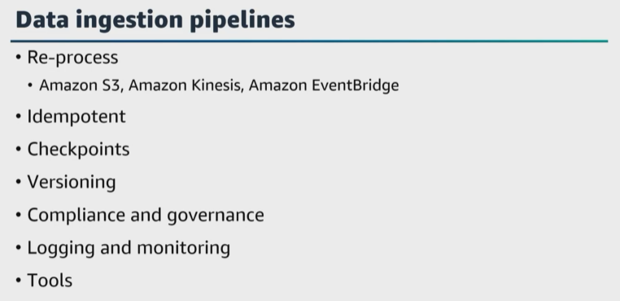  |  Consider **replayability of your data ingestion pipelines**. ``Replayability`` **helps to reprocess data in case of failures, updates, or changes in the pipeline logic**.  <br/> <br/> What are considerations to achieve **replayability** in your data ``ingestion`` pipelines? **I always recommend designing your data ingestion pipeline in an event-driven manner**.  |

What are ``AWS services`` you can use to collect and initiate events when new data arrives or if a change occurs?

A few services that can help here are ``Amazon S3, Amazon Kinesis, or Amazon EventBridge``. 
>> **It is best practice to test the replayability of your data ``ingestion`` pipelines using different simulation scenarios and reprocessing scenarios to validate idempotents and consistently reprocess data without data loss, duplication, or integrity issues**.

This helps the pipeline to process the same data multiple times without data duplication or inconsistencies. 

* Also **configure checkpoint mechanisms within the pipeline to track the progress and state of data processing to determine the last successfully processed data point**. Then the pipeline can resume processing from that point in case of failures or interruptions. 

* Also, 
  * Add data **versioning** within your data ``ingestion`` pipeline. **Store the raw or intermediate data in a durable and scalable ``storage`` service** such as ``Amazon S3``. This ensures you retain the data for a period of time for ``compliance requirements, data governance policies, and for replayability``, and then of course ```add logging and monitoring`` within the data ``ingestion`` pipeline **to capture relevant logs, errors, and metrics to track the progress, identify failures, and analyze the behavior of the pipeline**, and finally, 
  
  * Use infrastructure as code tools such as ``AWS CloudFormation or AWS Cloud Development Kit, or AWS CDK``, to automate the deployment and configuration of your data ingestion pipeline. 
  
|   |   |   
|---|---|
| 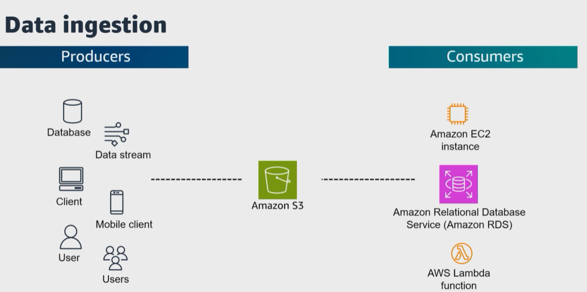  | The process of data collection begins with producers. **Producers can be anything** from ``databases`` to ``mobile devices`` or ``applications``. For example, the producer generates the data in the source system and the ingestion tool gathers or ingests it.  <br/> <br/> Once the data is ingested, it can move directly to a consumer. **Consumers can be anything** from applications hosted on ``Amazon Elastic Compute Cloud, or Amazon EC2``, to ``AWS database services`` to compute services such as ``AWS Lambda`` and more.  |


|   |   |   
|---|---|
| 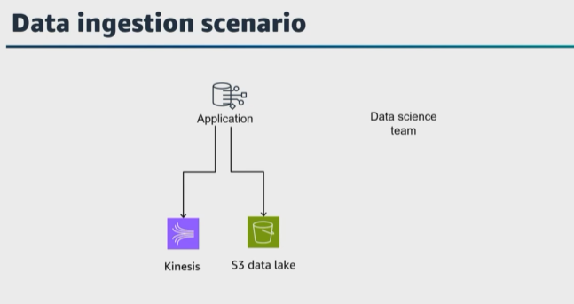  | For this example, our application writes files to an ``S3 data lake``. This ``data lake`` **needs to be accessed by the data science team and the business intelligence or data analyst team**. Your application is continually capturing data, which are customer interactions with the application and customer reviews, and then writes that data to an ``S3`` bucket in the tab separated values, or TSV, file format. <br/> <br/> How would you design the pipeline to transform the data after writing to ``Amazon S3``, so your data scientists or machine learning engineers can explore this raw data?   |


|   |   |   
|---|---|
| 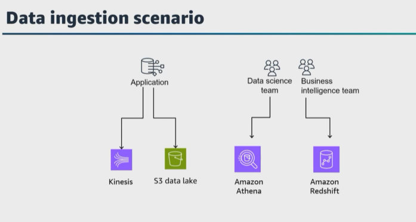   | Since the data is stored in an ``S3`` bucket, you can use ``Amazon Athena`` **to query and analyze the data using standard SQL**. How do you configure this? <br/> <br/> Well, first **I would register the TSV data in the ``S3`` bucket with ``Athena`` and then run some ad hoc queries** on the data set, but **you could also convert the TSV data into a more query optimized columnar file format** such as ``Apache Parquet``.  <br/> <br/> But what if your business intelligence team needs a subset of that data in a data warehouse? Well, **you can insert TSV data into ``Amazon Redshift`` and combine your data warehouse queries for the data** in the ``S3 lake`` using ``Amazon Redshift Spectrum``.|

 
What ``AWS service`` **can you use to update your ``Athena`` tables as new data** arrives in your ``S3 data lake?`` 
 * One option is to use ``AWS Glue`` and an ``AWS Glue crawler``. 
  
Let's ask one more question for this example. **Let's say you're receiving large amounts of files from multiple sources**. At the end of each day, all files are merged and compressed into a single gzip file. That file is uploaded to an ``S3`` bucket. Then the file is loaded into an ``Amazon Redshift cluster`.

**How can you update the configuration to run the ``copy`` process faster to the ``Amazon Redshift cluster``? Well, let's step back to fundamentals. 
* You have to know the ``copy`` command uses the ``Amazon Redshift massively parallel processing`` architecture **to read and load data in parallel** from files in an ``S3 bucket``, so **you can split the gzip file into smaller files so that the number of files is a multiple of the number of slices** in the ``Amazon Redshift cluster``, and then ``Amazon Redshift`` **can load the data in parallel to the slices, which can improve the overall load time**. 
  >> **You can use parallel processing by splitting your data into multiple files and setting the distribution keys on your table**. 

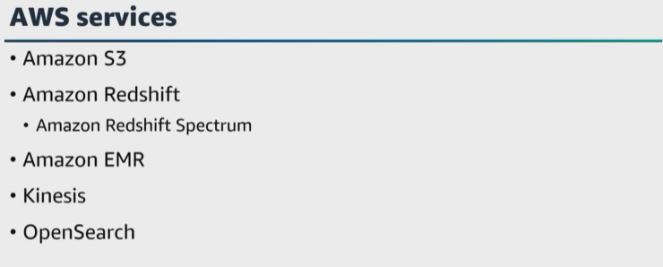

In order to do well, **you must be familiar with the common use cases for data analysis**. Be sure that you know the ``AWS services`` related to each use case and how the different ``AWS services`` are implemented and when to choose one over the other. 

* For example, ``Amazon S3`` **is great for ``data lakes``**. An advantage of a ``data lake`` is that **you do not need a predefined schema**. 

* If **you need a data warehouse or a lakehouse**, you can use ``Amazon Redshift`` and ``Amazon Redshift Spectrum``. An advantage is that **you can run ``SQL`` and complex analytic queries against structured and unstructured data without the need for unnecessary data movement**. 

* For big data processing, ``Amazon EMR`` **can quickly and easily process vast amounts of data for data engineering, data science development, and collaboration.** 

* For real-time analytics ``Amazon Kinesis`` **can collect, process and analyze streaming data as it arrives in your data lake and respond in real time and ``Amazon Managed Streaming for Apache Kafka``, or ``Amazon MSK``, to ingest and process streaming data in real time**. 

* For operational analytics, ``Amazon OpenSearch Service`` **can search, explore, filter, aggregate, and visualize your data in near real time for application monitoring, log analytics, and clickstream analytics**. 

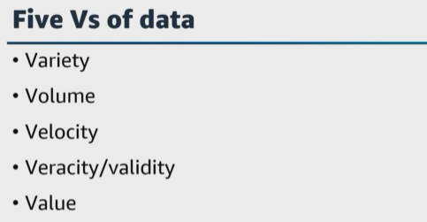

We keep mentioning that **the objective of ``ingestion`` is to ensure that you understand how the frequency, volume, generation, and source system of the data can determine the solution that you choose for your data store**. Back to fundamentals, what are the five v's of data? Variety, volume, velocity, veracity, or validity, and value. 

* **Variety** is the **type of data**. This could be web server, log files, videos, pictures, geolocation data, sensor or IoT data and more. AWS supports the processing of structured, unstructured and semi-structured data with AWS services such as ``Amazon RDS, Amazon S3, AWS Glue``, and ``Amazon Comprehend``. 

* **Volume is the amount of data to be transferred or total size**, but also the daily, monthly, and yearly growth of the data. This can be an indicator of the ``AWS services`` to use. Some services have limits on item or record sizes, so ensure that you are familiar with that information. Other services have limits on the total size and storage volume. Pay attention to throughput as well because it can also include networking services in addition to the traditional data analytics services. What are some ``AWS storage services`` **for large volumes of data**? ``Amazon S3, Amazon Elastic Block Store, or Amazon EBS, Amazon Redshift, and DynamoDB``. 

* **Velocity is the speed of ingestion and processing of the new data** from the source system into the target storage system. You need a solid understanding of how quickly the source data is generated and how quickly that incoming data must be processed. The frequency of the data is a property of the producer that sends data to your source system. Pay careful attention to **the difference in real time versus near real-time stream solutions**. Also, pay careful attention to any analysis requirements that may exist within questions you may see on the exam, because sometimes your data will be transformed during this ``ingestion`` stage. What are some ``AWS services`` **that can handle variable traffic and large amounts of data ingestion**? ``Amazon Kinesis, Amazon MSK, Amazon OpenSearch Service, and Lambda``. 

* **Veracity is the quality, completeness, and accuracy of the data being ingested**. Your data may come from different sources and depending on how the data is generated, that data may be incomplete or inconsistent. Let's say that your IoT sensor went offline and you might be missing a period of data. If you know the veracity of the data ingested, you can ensure that you include that when processing your data. 

* **Value is probably the most important V of data**. You must consider the data being ingested to ensure how that data is ingested correctly and how that ingested data will add value to the business currently and also in the future. **If you ingested terabytes of data, then you clean and process all of that data, but the end data product adds no value, then it is a waste of money and time**. Storage, which we again will cover under domain 2, depends on the types of data collected and stored. AWS has multiple storage services for different use cases and requirements. Know which services can work with and store structured, semi-structured and unstructured data. 

Okay, let's get back to ``ingestion``. You can use the type of data your environment collects and the temperature of that data to determine what kind of ingestion solution is ideal for your needs. What are AWS services that support the ingestion stage of the data engineer lifecycle? 

| 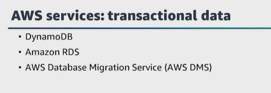   | ``Transactional data`` systems **need to quickly store and retrieve small amounts of data**. Also, end users need quick and straightforward access to the data. <br/> <br/> ``DynamoDB`` and ``Amazon RDS`` `**are AWS storage solutions for ``transactional`` data**. You could also use ``AWS Database Migration Service``, or ``AWS DMS``, **to ingest transactional data into AWS**. <br/> <br/> With a ``transactional`` database, **the rows in the table updated regularly**.  |   
|---|---|


For example, maybe a customer moves or gets a new phone number. ``AWS DMS`` can use the database transaction log files to capture and transfer updates. It can be used to migrate existing database systems to a new database engine, such as migrating an ``Oracle database`` to an ``Amazon Aurora database``, and from an analytic perspective, ``AWS DMS`` **can also be used to run continuous replication from common database engines** to an ``S3 data lake``. 


| 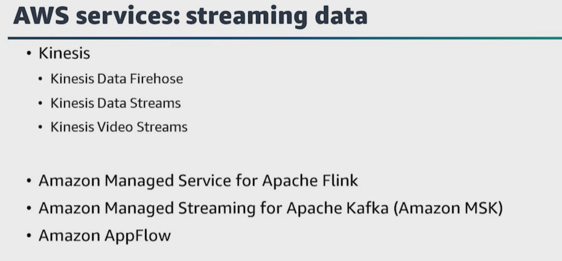  | ``Streaming data`` such as **Clickstream logs should be ingested continuously and in real or in near real time**. ``Streaming data`` **is categorized by reading in large amounts of smaller events**.  <br/> <br/> For example, 1 KB payload that you are continuously writing to a stream. With ``streaming data`` **you might need to bound processing by time, event amounts, or particular segments to limit how much data you are processing to produce results in real time**. If you have hot data coming in at a high frequency and you want to process that in real time, then streaming solution might be the best options.  |   
|---|---|


What ``AWS service`` can you use to ingest streaming data? We mentioned these already, ``Amazon MSK`` and ``Amazon Kinesis``. The ``Kinesis`` family has multiple services you can use depending on the specific use case and requirements. 

``Amazon Kinesis Data Firehose`` **ingests streaming data, buffers the data for a configurable period, and then writes that to a target storage service**. Do you know which storage services that you can stream data to with ``Kinesis Data Firehose``? They include ``Amazon S3, Amazon Redshift, Amazon OpenSearch Service``, and a few others. 

``Amazon Kinesis Data Streams`` **ingest data in real time**. It can process the incoming data with a custom application and has low latency. ``Amazon Managed Service for Apache Flink``, formerly known as ``Amazon Kinesis Data Analytics``, **reads data from a streaming source and uses ``SQL statements`` or ``Apache Flink`` code to perform analytics on the stream**. 

``Amazon Kinesis Video Streams`` **processes streaming videos, audio streams, and other time-serialized data such as thermal imagery and radar data**. There is also an ``Amazon Kinesis Agent`` **that helps to consume data from a file and write that data into a stream** with ``Kinesis Data Streams`` or ``Kinesis Data Firehose``. 

Another ``AWS streaming service`` is ``Amazon MSK``. You can use ``Amazon MSK`` **to replace an existing ``Apache Kafka`` cluster**. ``Kinesis`` **may be a better option for a new solution because ``Kinesis`` is serverless and you only pay for the data throughput**. With ``MSK``, **you pay for the cluster whether you're sending data through it or not**. 

Another AWS service for ingestion is ``Amazon AppFlow``. What is a use case for ``Amazon AppFlow``? **It can be used to ingest data from software as a service service (SaaS) and transform and write the data** to ``Amazon S3, Amazon Redshift``, or right to other ``SaaS services``. 


| 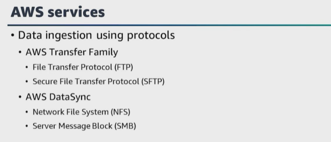  | What ``AWS service`` **would you choose if you had to ingest data using the file transfer protocol, ``FTP``, and secure file transfer protocol, ``SFTP``, protocols**? You can use the ``AWS Transfer Family`` **for file transfers directly into ``Amazon S3`` using common file transfer protocols**.  <br/> <br/> What **if you need to ingest data stored in an on-premises storage?** What ``AWS service`` would you use? ``AWS DataSync`` **can ingest data from an existing on-premises storage system**. ``DataSync`` **also uses common protocols such as** ``NFS`` and ``Server Message Block``, or ``SMB``. |   
|---|---|


| 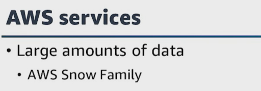  | What **if you need to ingest large amounts of data**? <br/> <br/> Ensure that you understand the ``AWS Snow Family`` and **know which Snow service works best for different use cases and requirements**.  |   
|---|---|

### A.1.3 Batch data ingestion

| 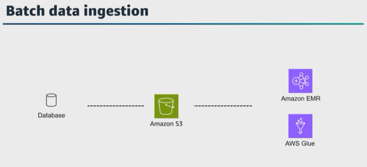  |  With ``batch data``, **you are typically dealing with a larger event payloads and ingesting those on an hourly, daily, or weekly basis using a scheduled job such as a CronJob**.<br/> <br/>  You are bounding data by the data source, for example, if you have ingested data stored in an S3 bucket. <br/> <br/> ``Batch data`` **ingestion works for colder data that doesn't need to be processed right away**.   |   
|---|---|


What are some ``AWS services`` **for ``batch data`` ingestion**? ``Amazon EMR`` **provides ways to deploy common Hadoop frameworks and some of the tools can be used for ingesting data from a database**. For example, **you can run Spark on ``Amazon EMR`` and use a ``Java Database Connectivity, or JDBC``, driver to connect to a relational database to load data in a data lake**. 

``AWS Glue`` is a **fully managed ETL service that can make connections to ``JDBC`` sources**. ``AWS Glue`` `**can connect to many different database engines and through those connections transfer data for further processing**. ``AWS Glue`` is a service to help process, improve, and migrate data between different data stores and data streams. Data engineers might analyze and process the data using ``AWS Glue`` **interactive sessions and can visually develop, run, and monitor ``ETL workflows`` in ``AWS Glue Studio``. 

``AWS`` has different services to help support the requirements of your system. Let's wrap up this lesson and talk about **how to manage stateful and stateless data transactions** in ``AWS``. 


| 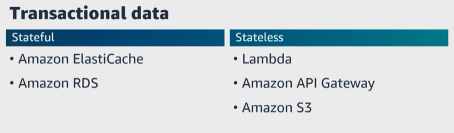  |    |   
|---|---|

``Stateful data transactions`` `**store information about the current state**. We just talked about transactional databases. **What are ``AWS services`` that support ``stateful data transactions``? ``Amazon ElastiCash for Redis and Amazon RDS``. 

``Stateless data transactions`` **do not store data or sessions and do not rely on the past state**. **What are ``AWS services`` that support stateless data transactions? ``Lambda, Amazon API Gateway, and Amazon S3``. 
