# A. Transform and process data
- [A. Transform and process data](#a-transform-and-process-data)

| 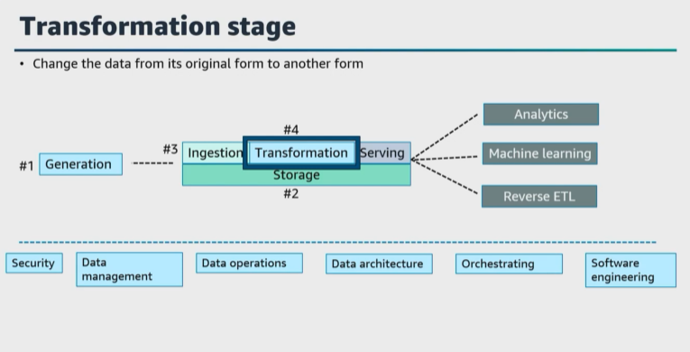  |  ``Transformation`` **means to change the data from its original form into some other form that can be useful for downstream use cases**. If your data does not have the proper transformation, then it will sit inert and not be in a useful form for reports, analysis, machine learning, and more.    What are tools available to turn raw data into something consumable for downstream stakeholders?   |   
|---|---|

| 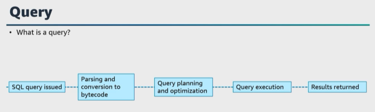   | ``Queries`` **are a fundamental part of data engineering, data science, and analysis**. ``Queries`` **allow us to retrieve and act on data**. For the exam, ensure that you know how queries work.   |   
|---|---|

| 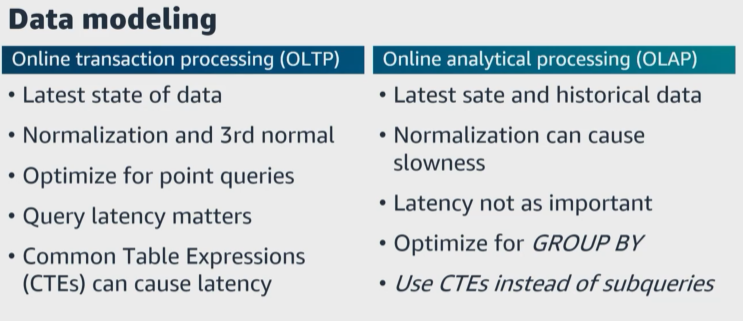   | ``Data modeling`` is another fundamental, and I've seen a lot of people skip this step. You **cannot jump into building data systems without a design and plan to organize your data in a useful way**. Your **data model should represent the way your data relates to the real world and reflect how your data should be structured and standardized**.     Ensure you understand different data models such as **conceptual, logical, physical, and normalization**. And I also recommend understanding different techniques to modeling **batch analytical data and data vaults too**. |   
|---|---|

``Online transaction processing, or OLTP``, and ``online analytic processing, or OLAP``, data modeling and querying are fundamentally different. 

* ``OLTP`` is **optimized for transactional processing and real-time updates and is focused on the latest state of data**. ``OLTP`` **uses normalized or de-normalized models**. ``OLTP`` **has the smaller storage requirements** than ``OLAP`` and **has shorter response times**. ``OLTP`` **is good for order processing, processing payments, and customer data management**. 

* ``OLAP`` **is optimized for complex data analysis and reporting and is focused on the latest state and historical data**. ``OLAP`` **uses the star schema, snowflake schema, or other analytic models**. The **storage requirements are large terabytes to petabytes**. ``OLAP`` **is good for predicting customer behavior and analyzing trends**. 
  

|    | There are later stages of transformation that can change the data schema and apply normalization or even apply large-scale aggregation to report or featurize data for machine learning processes.     ``Transforming`` your data **adds the ability to unify and integrate the data**. It manipulates, enhances, and saves the data to be used downstream, which increases the value, adds scalability and reliability, and is usually more cost effective.   |   
|---|---|

> **Does transformation only occur at this transformation stage?** No, because **sometimes data is transformed in the source or generation stage as the data is being ingested**. 

| 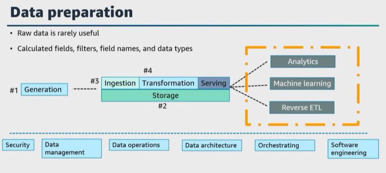  | **Raw data is rarely useful in final data analytics**, and this is why **we have to ensure that we design and build the data pipelines to help data analysts create the business insights** that they require. This is called **data preparation or data wrangling**.     You can prepare data in multiple ways and use it in multiple analysis. A ``data preparation`` **can add calculated fields, apply filters and change field names or data types**. If the data source is on a ``SQL database``, you can also use ``data preparation`` to join tables. Alternatively, **you can enter a ``SQL query`` if you want to work with data from more than one single table**.   |   
|---|---|

| 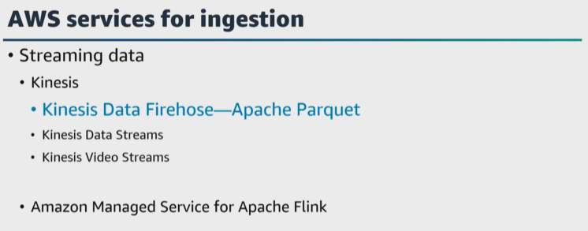  | Some of the ``AWS services`` and tools for ingestion **can also perform light transformations as part of that ingestion process**. For example, ``Kinesis Data Firehose`` **can write data out** in a ``Parquet format``, but **heavier transformations might require you to fully optimize your data for a set of analytic tasks and different data consumers**. <br/<   In ``AWS``, **you can transform and process your data using cloud computing and distributed computing**. What are a few cloud computing ``AWS services`` for data transformation and processing? Well there is ``Lambda, Amazon EMR, AWS Glue, and Amazon Redshift``.  |   
|---|---|

| 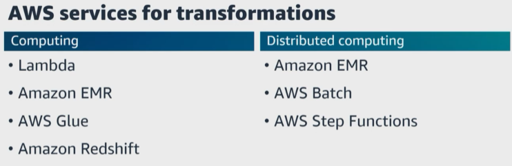  | What ``AWS services`` and frameworks **are available for distributed computing involving a computational task across multiple nodes to process that data in parallel**? ``Amazon EMR, AWS Batch, and AWS Step Functions``.     ``Lambda`` `**can be used to perform validations and light transformations of your data**. For example, you can initiate a ``Lambda function`` to run each time an incoming CSV file is received. You could have your code validate that it is a CSV file, perform some computation, maybe update the database with that result, and move the file to a different ``S3 bucket`` to be batch processed later.  |   
|---|---|

| 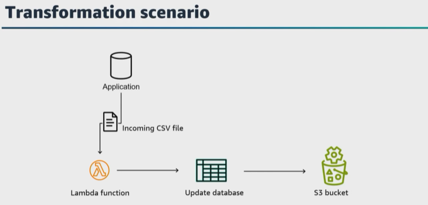  | ``Lambda`` `**can be used to perform validations and light transformations of your data**. For example, you can initiate a ``Lambda function`` to run each time an incoming CSV file is received. You could have your code validate that it is a CSV file, perform some computation, maybe update the database with that result, and move the file to a different ``S3 bucket`` to be batch processed later.  |   
|---|---|

| 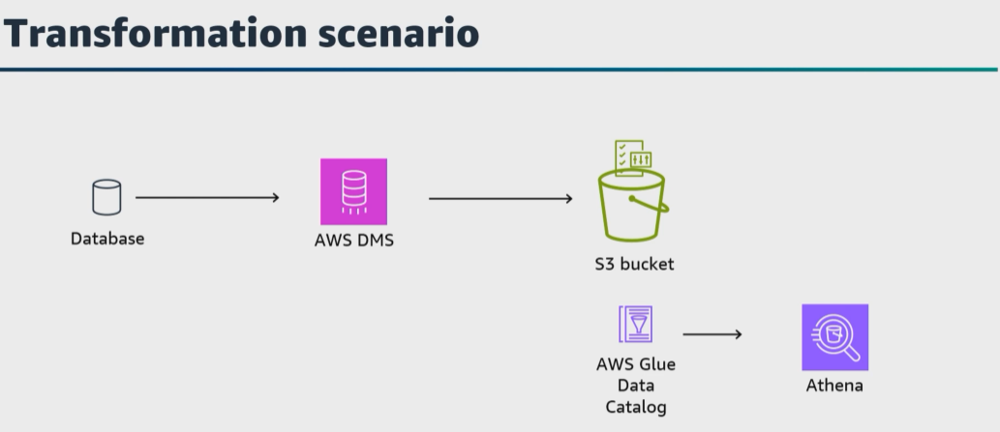  | What **if you need serverless processing**? Which ``AWS service`` could help here? As we mentioned in the last lesson, ``AWS Glue`` **has multiple components that can be split into multiple separate services**. ``AWS Glue`` **is a serverless environment that uses a Python engine or a Spark engine for performing data transformations and processing**. Both engines work with data in ``Amazon S3``. ``AWS Glue`` also **includes** the ``AWS Glue Data Catalog``.  |   
|---|---|

Let's say that you're using ``AWS DMS`` **to replicate a database to an ``S3 bucket``**. In your ``S3 bucket``, **there will be multiple files containing the data from the source database**. You'll end up with a prefixed directory in ``Amazon S3`` from each table from the source database. 

The ``AWS Glue Data Catalog`` **can provide a logical view of this dataset and capture additional metadata**. You can then use ``Athena`` and you can use ``Data Catalog`` to run ``SQL queries`` or use ``Amazon EMR`` and the ``AWS Glue ETL`` **engine to help users reference catalog objects directly in their ETL code**. 

``AWS Glue crawlers`` **can examine a data source and automatically infer the schema and other information too and automatically populate that information**. 

| 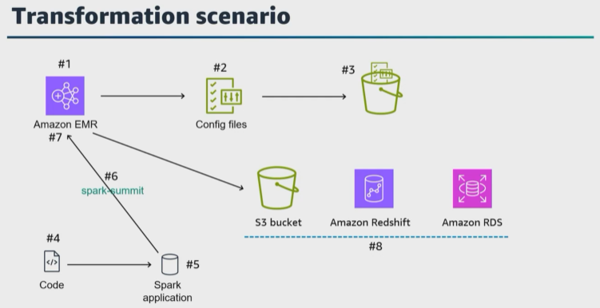  | What if you need to use ``Spark Hive, Apache Hoodie, Apache HBase, Presto Pig, and other big data processing tools``? What ``AWS service`` can help here? ``Amazon EMR`` **is a managed big data processing service for running these open-source big data processing tools**.  |   
|---|---|

Let's walk through an example of how to use ``Spark`` for data processing in ``AWS``. When you launch an ``Amazon EMR`` cluster, 
* ``Amazon EMR`` **provides a managed service** for running big data frameworks such as ``Spark``. You can launch an ``Amazon EMR`` cluster through the ``AWS Management Console`` or use the ``AWS Command Line Interface`` **to create a cluster with the desired specifications, such as instance types, number of instances, and Spark versions**. 

* Once the ``Amazon EMR`` cluster's running, **you can connect into the primary node of the cluster to access the command line interface**. Then you can configure ``Spark`` by modifying the ``Spark configuration files`` **to set properties such as memory allocations, number of executor cores, and parallelism settings based on your workload requirements**. 

* Then **you can prepare your data for processing in ``AWS`` and store the data in ``Amazon S3`` and configure appropriate permissions and access control to the data sources**. 

* Then **you can develop your ``Spark`` applications using ``Scala, Python, or Java``. You can write your code to perform the desired data processing operations, using the ``Spark APIs`` and functionality. ``Spark`` provides a set of transformations, actions, and libraries for data processing, including data cleaning, aggregation, filtering, joins, and machine learning. 

* Then submit your ``Spark`` application to the ``Amazon EMR`` cluster for execution, using the ``Spark`` submit command **and remember to specify the main class or script file and any necessary command line arguments**. 

* ``Amazon EMR`` **handles the launching and managing of the ``Spark`` application across the cluster**. As always, **monitor the progress and performance of your Spark application**. ``Amazon EMR`` **provides logs, metrics, and monitoring capabilities to track the application's execution, resource utilization, and diagnose any issues**. 

A question to ask when monitoring the performance of your Spark application is, 
> *What optimization techniques such as data partitioning, caching, and tuning ``Spark`` configurations could you use for better performance**. 

Depending on the size of your dataset and processing requirements, **you can scale your ``Amazon EMR`` cluster up or down to allocate more resources or reduce costs**. You can save the processed data to ``Amazon S3, Amazon Redshift, Amazon RDS``, or any other compatible data store based on your requirements. 

These **steps help to use the distributed computing capabilities of ``Spark`` and the scalability of ``AWS`` for large-scale data processing workloads**. 

Earlier we mentioned that for serverless, ``AWS`` offers ``AWS Glue`` **for running ``Spark`` but for ``Amazon EMR``, you need specific configurations of the cluster that you want to run ``Spark``**. 
> So **if you need more control over the environment, ``Amazon EMR`` is a better choice if you're using a ``Hadoop`` ecosystem for processing your data**. 

``Data preparation`` is a core component of the data processing phase. `**Services that can perform data preparation include**, ``Amazon Kinesis, Amazon EMR, and AWS Glue``. ``Amazon Managed Service for Apache Flink`` **is a great tool for basic data transformations using SQL commands**. However, you may need more complex transformations. In these situations, you may need services such as ``Amazon EMR`` or ``AWS Glue``. These services provide robust support for more complex transformation. 

| 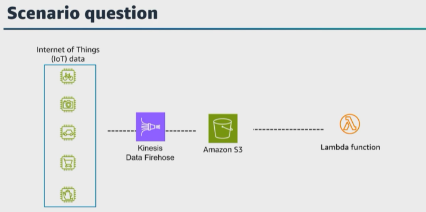  | Here's a question. **If you are building a pipeline to ``ingest IoT`` data securely and in near real time**, what ``AWS services`` could you use? Well this is vague, but I mentioned securely and near real-time ingestion. I would love to hear your designs, but my first thoughts are ``Kinesis Data Firehose`` to ingest ``streaming IoT data`` to ``Amazon S3``, also creating a ``Lambda function`` **to remove any sensitive data and to transform this data before storing** it in the ``S3 bucket``.   |   
|---|---|

| 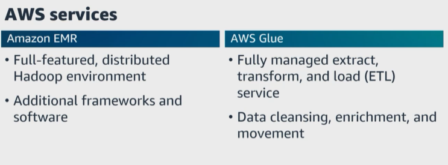  | For the exam, **be sure that you understand the difference in these services**. ``Amazon EMR`` **is a full-feature distributed Hadoop environment**. Its ability to perform transformation goes beyond what ``AWS Glue`` can accomplish. ``AWS Glue`` **is a fully managed ETL service, whereas ``Amazon EMR`` is not**.    ``Amazon EMR`` **requires the installation of additional frameworks and software, such as Spark, Hive, Pig, HBase, and Presto**. ``AWS Glue`` **is a great solution when all you need is data cleansing, enrichment, and data movement**.   |   
|---|---|

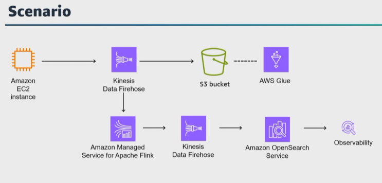

Let's walk through an example. In this architecture, an ``Amazon EC2`` instance is running an ``Apache web server``. The goal of the solution is to have the data visualized using ``Cabana`` dashboards and presented to the users. The ``Kinesis agent`` is installed on the ``Amazon EC2`` instance and is configured to continuously send data to ``Kinesis Data Firehose``. ``Kinesis Data Firehose`` is configured to send data on the stream to an ``S3 bucket`` for storage. 

This data can be cataloged with ``AWS Glue`` and used as part of a ``data lake`` solution. ``Kinesis Data Firehose`` is also configured to send data on the ``stream`` to ``Amazon Managed Service for Apache Flink`` for processing. ``Amazon Managed Service for Apache Flink`` can use SQL commands or built in machine learning capabilities to aggregate the data in the stream. ``Amazon Managed Service for Apache Flink`` then sends the transform data to another ``Kinesis Data Firehose``. ``Kinesis Data Firehose`` sends the data to ``Amazon OpenSearch Service`` to be indexed for use in user reports, and ``Cabana`` can connect to ``Amazon OpenSearch Service`` to build visualizations of the log records for the users. 

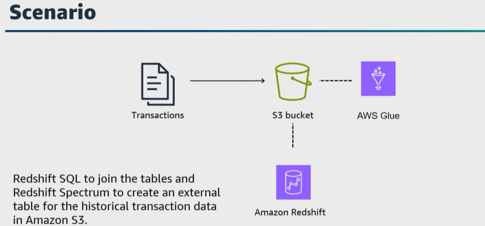   

Let's say you work for a clothing company that stores all historical transactions in an ``S3 bucket`` that is integrated with ``Data Catalog`` to join the historical transactions with the sales report data. The processing of the data is completed in an ``Amazon Redshift cluster``. The data analyst has asked you to provide a solution to reduce the workload of the ``Amazon Redshift cluster``. What is your solution? 

* My first thought is to use ``Amazon Redshift SQL`` to join the tables and ``Redshift Spectrum`` to create an external table for the historical transaction data in ``Amazon S3``. 

When I'm asked for transformation failures and performance issue solutions, I follow the same troubleshooting approach. 
* First, I check the **logs generated** by the ``AWS services``, involved in the data transformation. 
  
* Second, I verify the **data quality and integrity** at different stages. Another step is to validate the source data against the transformation logic to ensure that the mapping filters, aggregations, and calculations are all correct. 

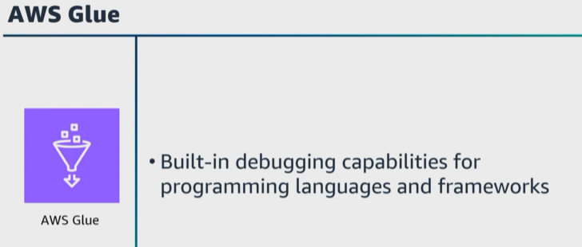 

Let's say that you're using ``AWS Glue`` as part of your transformation. You can run the transformations in development mode or run in debugging mode to collect detailed logs and investigate intermediate results. ``AWS Glue`` **has built-in debugging capabilities for different programming languages or frameworks to help inspect your data, intermediate results, and execution plans**. Sometimes I find it helpful to use smaller datasets during this debugging phase to better isolate and identify issues. 

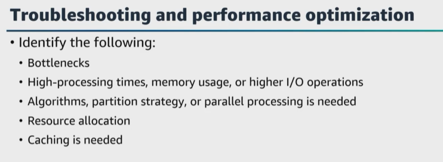 
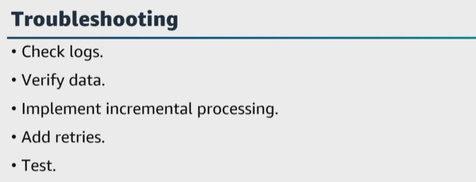 

Let's pause here and ask, what are examples of how this troubleshooting process, can ensure performance optimization? Well by profiling and analyzing the execution of the data transformation code and queries, you can identify bottlenecks and areas that have higher processing times, memory usage, or higher input/output operations. You may also identify a more efficient algorithm, partitioning strategy, or that you should add in parallel processing to optimize your data transformation operations, or you identify resource allocation settings to update, such as memory allocation, number of executor cores or parallel configurations to optimize performance. And also you can identify ways to incorporate caching to reduce data access and processing times. 

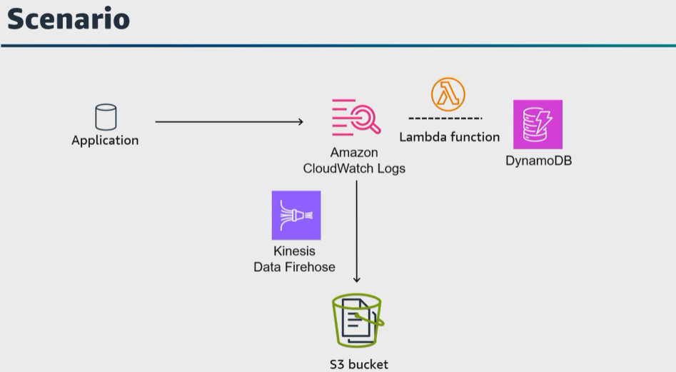 

Let's say that your application logs are sent to ``Amazon CloudWatch`` Logs and you need to enrich your logs with data from ``DynamoDB`` in near real time and then use the output for further study. How do you collect and enrich the logs? 

One solution is to create a ``Lambda function`` that will enrich the logs with the ``DynamoDB`` data, create a ``Kinesis Data Firehose stream`` and configure it to subscribe to ``CloudWatch Logs`` with an ``S3 bucket`` as the destination for the logs.

Then create a ``CloudWatch Log`` subscription that will send log events to your ``delivery stream``. ``Kinesis Data Firehose`` collects, transforms, and loads streaming data from sources such as ``Kinesis Data Streams`` or ``CloudWatch Logs`` to downstream services such as ``Amazon Managed Service for Apache Flink`` and ``Amazon S3``. 

We just mentioned incorporating security. For the exam, ensure that you know how to connect to different data sources using JDBC and open database connectivity, or ODBC. 

| 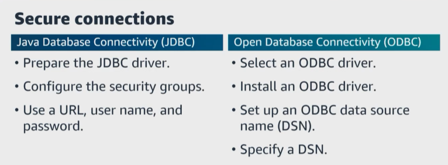   | ``JDBC`` **is a Java API for connecting and interacting with the relational databases**. In ``AWS`` to connect to a data source using ``JDBC``, first prepare the ``JDBC`` driver for the specific database you want to connect to. Next, configure the needed security groups with inbound rules to access the necessary ports for the database. Then in your Java application, use the ``JDBC`` driver to establish a connection to the database by providing the appropriate connection URL, username, and password. The connection URL typically includes the database host name or IP address, port number, and database name. After the connection is established, you can use ``JDBC's APIs`` to execute ``SQL`` statements, perform queries, updates, and other database operations.   |   
|---|---|

ODBC is a standardized API for connecting to various data sources including relational databases. First, select an ODBC driver that corresponds to the data source you're connecting to. Then install the ODBC driver on the system you'll be connecting to the data source, which might be an Amazon EC2 instance or an on-premises server. Then set up an ODBC data source name that contains the necessary configuration information for connecting to the data source. This includes the driver connection details such as host name, port, and authentication, and other settings. Then in your application or tool that supports ODBC connectivity, specify the DSN to establish a connection to the data source. You can then execute queries and interact with the data. 

``Amazon RDS`, Aurora, and Amazon Redshift`` **help to simplify the process of connecting to databases** within AWS and to the ``AWS services`` and provide direct connectivity options and automated management, reducing the need for manual ``JDBC`` or ``ODBC`` configurations.

Understand how to choose appropriate connectivity method, based on the data source you're working with and the specific requirements of your ``AWS environment``. 

Let's wrap up this lesson and talk about creating ``data APIs`` to make data available to other systems by using ``AWS services``. For the exam, ensure that you understand how to use a combination of AWS services and techniques. We've covered a bit of this already. 

| 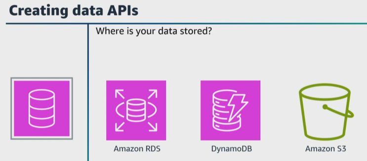   |   |   
|---|---|

| 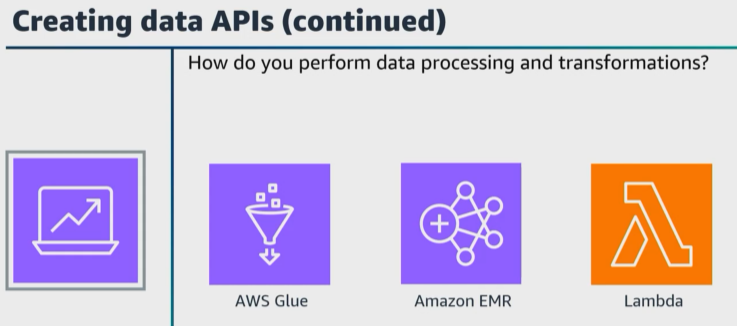   |   |   
|---|---|

* First, **know where your data is stored**. If you need to perform ``data processing`` or ``transformation``, ``AWS`` provides ``AWS Glue`` or ``Amazon EMR`` to help you cleanse, normalize, and transform the data into a usable format. You can use ``API Gateway`` **to create and manage APIs for your data**. ``API Gateway`` accesses a frontend service and enables clients to access your data securely and with controlled access. **It provides authentication, authorization, rate limiting, caching, and request and response transformation**. 
  
* ``Lambda`` **can be used to process and serve the data for your API. You can write code** in ``Lambda`` to fetch data from the data source, apply any additional transformations, and respond to API requests with the formatted data. Also, ``Lambda`` **can be triggered by ``API Gateway`` or other ``AWS`` services based on your requirements**. 

| 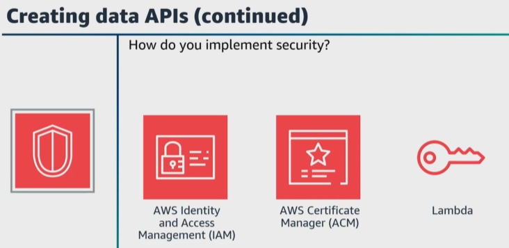   |   |   
|---|---|

What about ``security and authentication``? Well you can implement ``security measures`` **to protect your data API**, using ``AWS Identity and Access Management, or IAM``, to control access and permissions for ``API Gateway`` and your ``Lambda functions``. You could also use ``AWS Certificate Manager, API keys, OAuth``, or other authentication mechanisms to secure your ``API endpoints``. 

| 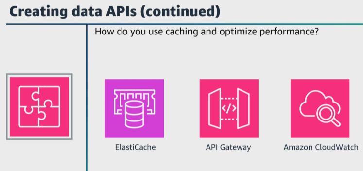   |   |   
|---|---|

What ``AWS services` could you use **for caching and performance optimization**? To improve the performance of your `data API`, **you can use the built-in caching features of `ElastiCache` or `API Gateway` to cache responses and reduce latency**. You can also use `Amazon CloudWatch` **to monitor and track the performance, latency, and usage of your data `API` and you can configure logging to capture `API` requests, logs, and errors for troubleshooting and analysis**. 

`API Gateway` **could also be used to version your `APIs` and to manage changes and maintain backward compatibility**. 

| 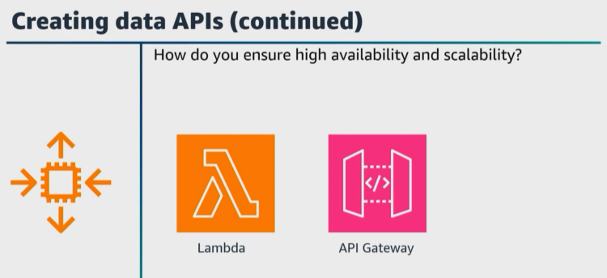   |   |   
|---|---|

For **scaling and availability**, you can use ``auto scaling`` for your ``Lambda functions`` and configure ``API Gateway`` `**to handle high concurrency and availability requirements**. 

| 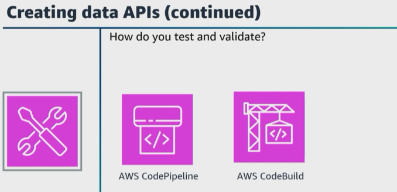   |   |   
|---|---|

For **testing and validation**, you can use ``AWS CodePipeline`` and ``AWS CodeBuild`` **for continuous integration and deployment to automate the testing and deployment process**. 

For the exam, ensure that you know the different ``AWS services`` to use to create secure and scalable ``data APIs`` and make your data available to other systems. 

Let's get started with the third task statement for domain 1, orchestrate data pipelines.