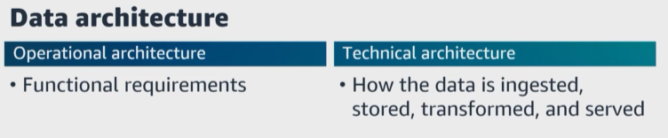
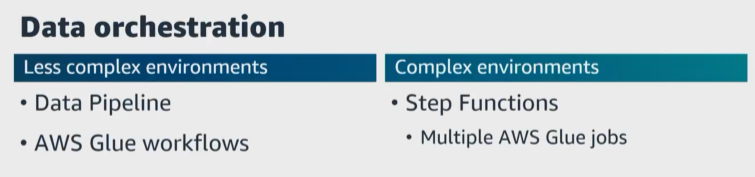

# A. Orchestrate data pipelines
- [A. Orchestrate data pipelines](#a-orchestrate-data-pipelines)

|   | ``Data architecture`` **is basically the design of your systems to support the evolving data needs for your organization**. There are **operational and technical** aspects that need to be considered.     ``Operational architecture`` is the functional requirements. The ``technical architecture`` `**is how the data is ingested, stored, transformed, and served.**    |   
|---|---|

> For the exam, **ensure that you know examples and types of data architectures** such as ``data warehouse, data lake, data lakehouse, data stacks, Lambda, Kappa, data mesh``, and more. 

|   | From these different ``data architectures``, a ``data pipeline`` **can be built to bring data in from the source systems and then transform that data, which often includes multiple stages, further transforming or enriching the data as it flows through each stage of your data pipeline**.    |   
|---|---|

|   | You may have tens or hundreds of pipelines working independently or in conjunction with each other on different datasets and also perform different types of transformations.     **Each pipeline may use multiple services to meet the requirements and goals** and orchestrating all of these services and pipelines can be complex, but ``AWS provides`` **services to help with orchestrating your data pipeline.**    |   
|---|---|

|   | ``Data orchestration`` **is the process of ensuring that data flows properly from the ingestion service into the processing services, and then out to the storage location**.    For this exam, **ensure that you understand the core concepts for pipeline orchestration**. Can you define a data pipeline? **It is a collection of data processing tasks that need to be run in a specific order**.    |
|---|---|

**Some of the tasks need to be run sequentially, but others may need to run in parallel, and the sequencing of the task is the workflow**. 

|   | ``Data orchestration`` **is the process of ensuring that data flows properly from the ingestion service into the processing services, and then out to the storage location**.    For this exam, **ensure that you understand the core concepts for pipeline orchestration**. Can you define a data pipeline? **It is a collection of data processing tasks that need to be run in a specific order**.    |
|---|---|

What is a ``serverless AWS service for orchestration``? ``Step Functions`` and ``Lambda``. For ``Step Functions``, **you use the state machine language to design states, transitions, error handling, retries, input, output, event source, the triggers, monitoring, logging, testing, and deployments**. 

``Data pipeline`` `**orchestration also involves automating the execution of tasks for the data pipeline workflow**, which includes managing dependencies between different tasks and ensuring that the pipeline runs as expected. 

What are some examples of a ``data pipeline``? Well, I'm currently working on a pipeline that receives feedback from one of my exam prep courses regularly, and then this data pipeline validates that the data being received is valid. Then it converts that data file into the format Parquet. 

I'm hoping to have a **second pipeline** that **runs each day at a specific time that validates that I have received all of the feedback and then runs a ``Spark`` job to join the datasets and enrich that data with additional data**. 

Then a **third pipeline** that **loads to newly enriched data into a data warehouse**. Then **I can run queries on positive feedback, negative feedback, neutral feedback, ratings, and more**. For ``cost optimization``, I **could switch ``Amazon Redshift`` to a ``data lake on Amazon S3`` and use ``Athena`` instead `**to run my queries**. 

> Here's a **question to test your depth**. Do **data pipelines have to be defined as directed acrylic graphs**? 

No, but **certain orchestration tools do require this**. For example, ``Apache Airflow`` requires pipelines to be defined as a DAG. ``Step Functions`` do not enforce that the pipeline should be a ``DAG``. 

Here's another question. **How do you trigger a data pipeline to run schedule-based pipelines and event-based pipelines**? 

|   | Let's go back to the pipeline I'm building that I just mentioned.     The **first pipeline** would be an ``event-driven`` pipeline **that runs in response to a new feedback file being uploaded.**   |
|---|---|

Since we are talking about my ``data pipeline``, let's ask another question. What **if I decided instead to process all the small files as a batch and convert them into a single Parquet file**? What would I need? 

I **would need a ``manifest file`` at the end of the batch of files that contains the information about the other files that form part of a batch of files``. 

Diving deeper, **how would I configure this**? I could use an ``S3 event notification`` **to only initiate when a file that begins with the name manifest is written to my ``S3 bucket``. When this happens, ``my pipeline would be triggered and the first step would be to read the manifest file and then for each file listed in the manifest file, validate that the file exists. 

And **this would be an ``event-driven`` pipeline too, even though we are not responding to every upload event**. 

One **really important part of the build and configuration of your pipeline is how you handle the failure of a step in your pipeline**. What are a few common reasons for failures in your data pipeline? Well, 

* There are ``data quality`` issues such as if your pipeline is expecting to receive CSV files to process, but instead, your pipeline receives a file in JSON format. Your pipeline does not know how to process JSON-formatted files so this would cause a failure, probably a hard failure since your job cannot recover until the data quality issue is resolved. 

* There could also be ``code errors`` and `**we'll dive deeper into applying programming concepts in the next lesson**. But **let's say that you update a job and accidentally introduce a logic or syntax error into your code**. Sometimes even if you test your code before deployments, it may not catch a specific error, but testing your code is always best practice before deploying. This would also cause a hard failure because you would need to fix your code and then redeploy. 

* There could also be **endpoint errors**. What is an example of a soft failure with **endpoint errors**? Well, if the endpoint error is due to a temporary network error, this would be a soft failure because by retrying the connection could fix the error, but maybe your job is not configured with the correct and needed permissions, then this would be a hard failure. 

* And there are also **dependency errors** because the ``data pipeline`` consists of multiple steps and complex dependencies. **This could be a dependency within your pipeline or between your pipelines**. 

|   | So how do you orchestrate your pipeline with failure retry strategies?     Many orchestration tools such as ``Apache Airflow`` and ``Step Functions`` **give you the ability to specify the number of retries, the interval between retry attempts and backoff rate too**. How does this work?    |   
|---|---|

|   | With ``Step Functions``, **you can specify a backoff rate value that will multiply the delay between retries by that value**.     Let's say that I **specify a retry interval of 10 seconds and a backoff rate of 1.5**.    ``Step Functions`` **will wait 10 seconds. Then for the second retry, Step Functions will wait 15 seconds**. For the third retry, **Step Functions will wait 22.5 seconds and so on**.    |   
|---|---|

|   | You can use the ``Amazon Simple Notification Service, or Amazon SNS``,**to send an email**. Ensure you know how to create an ``Amazon SNS topic`` and subscribe one or more email addresses to that topic. We will cover alerting and monitoring in more detail as we continue on through this course, but especially under domain 3, ``data operations and support``.    |   
|---|---|

Let's dive into the ``AWS services`` **for orchestrating** ``data pipelines``. There are ``serverless orchestration`` engines with ``AWS Data Pipeline`` and ``Step Functions``. There is a managed open-source project with ``Amazon Managed Workflows for Apache Airflow, Amazon MWAA``, and service-specific orchestration with ``AWS Glue workflows``. 

|   | ``AWS Data Pipeline`` **gives you the ability to extract, transform, and load data between ``AWS data sources`` and on-premises data sources at specified intervals**. With ``Data Pipeline``, **you can regularly access your data where it is stored, transform and process it at scale, and transfer the results to ``AWS services`` such as ``Amazon S3, Amazon RDS, Amazon Redshift, DynamoDB, and Amazon EMR``.    |   
|---|---|

Here's a question. **Can you use ``AWS Data Pipeline`` to read and write to other ``JDBC`` data stores such as an on-premises database**? Yes, you can use ``Amazon EC2, Amazon ECR, and on-premises compute resources`` to run jobs to transfer your data. 

|   | ``Step Functions`` is **a serverless orchestration service that provides a visual design tool that I love because it is like a design document**. It uses a **low code approach to help you develop your ``data pipelines`` and ``serverless applications``. With the visual design tool, you can drag and drop using built-in integrations, or you can define your pipeline using ``Amazon state languages directly with JSON``. |  
|---|---|

What **if you have a simple use case in which you want to run a few ``Spark`` jobs in a specific order, but you don't want to spend time orchestrating those jobs or maintaining a separate application? You can do that using ``Step Functions`` **and create the entire workflow in ``Step Functions`` and interact with ``Spark`` on ``Amazon EMR``**. 

|   |  |  
|---|---|

Let's walk through the steps. 

* **First**, initiate the ``Step Function`` state machine **by passing the input file path**. 

* **Second**, the first stage in the state machine initiates a ``Lambda function``. 

`* **Third**, the ``Lambda function`` **interacts with ``Spark`` running on ``Amazon EMR`` and submits a ``Spark`` job**. 

* **Fourth**, the **state machine waits a few seconds before checking the ``Spark`` job status**. 

* **Fifth**, based on the job status, **the state machine moves to the success or failure state**. 

* **Sixth**, the state machine waits a few seconds for the job to finish and then the job finishes and the state machine updates with its final status. 

|   |  |  
|---|---|

> For **less complex environments**, would you choose ``AWS Data Pipeline`` or ``Step Functions``? 

I would choose ``AWS Data Pipeline``, and `**for more complex environments**, I would choose ``Step Functions``. 

|   |  |  
|---|---|

Let's look at more ``AWS services`` **for less complex and more complex environments**. Let's continue on and start with ``AWS Glue workflows``. 

``AWS Glue workflows`` **is a great choice** if your ``data pipeline`` only uses ``AWS Glue components``. ``AWS Glue workflows`` is part of the ``AWS Glue`` service to build ``data pipelines``. **It gives you the ability to create, visualize, and run workflows**. 

With ``AWS Glue workflows``, **you build out the workflow by adding triggers to the workflow graph and defining the watch events and actions for each trigger**. 

Let's talk about a few examples. What type of pipeline could you create using ``AWS Glue workflows``? 
* One pipeline I think of is running an ``AWS Glue crawler`` **to add ingested CSV files into a new partition** of the ``Data Catalog``. 
  
* Then run an ``AWS Glue Spark`` job to read new data using the catalog, 
  
* then transform that data that is in the CSV files into Parquet files. 

* Then run a new ``AWS Glue crawler`` **to add** the ``transform Parquet files`` to the ``Data Catalog``. 

|   | Let's dive deeper here and run two jobs in parallel.    One, ``AWS Glue`` job could **aggregate the data and write the results** to an ``Amazon DynamoDB`` table.    The other ``AWS Glue`` job could **create a new and rich dataset that joins the new data into an existing reference set of that data**.    And finally, run an ``AWS Glue Python shell`` job **to send a notification about the success or failure of the job**.  |  
|---|---|

|   | What if you had a use case that required ``Amazon EMR`` to run ``Hive`` jobs for your ``AWS Glue workflow``?    **How do you integrate non ``AWS Glue`` services**?    You can run an ``AWS Glue Python shell`` job **that uses the ``Boto3`` library to interact with other ``AWS services``, such as ``Amazon EMR`` or ``Amazon Simple Queue Service, or Amazon SQS``, to write files** to an ``Amazon SQS`` queue. |  
|---|---|

|   | Let's dive a bit deeper into the integration of more complex data pipelines. You can use ``Step Functions`` to **orchestrate multiple ETL jobs involving complex ETL workflows**.    For example, you may want to explore the correlations between online user engagement and forecasted sales revenue and opportunities. You can use ``Step Functions`` **to coordinate the multiple ``AWS Glue`` jobs to blend and prepare the data for analysis**.  |  
|---|---|

|   |  |  
|---|---|

Let's look at an example of a whole data pipeline. You build your ``serverless data lake`` with ``Amazon S3`` **as the primary data store**. You can use various techniques to ingest and store data in ``Amazon S3``. 

For example, 
* You can use ``Amazon Kinesis Data Firehose`` to **ingest streaming data**. 
* You can use ``AWS DMS`` **to ingest relational data from existing databases**, and 
* You can use ``DataSync`` **to ingest files from an on-premises** ``NFS``. 

Your data is ingested into an ``S3 bucket`` called the **raw zone**. To **make that data available, you catalog its schema** in the ``Data Catalog``. You can do this using a ``Lambda function`` **invoked by ``Amazon S3`` to start an ``AWS Glue crawler`` that catalogs the data**. When the crawler is finished creating the table definition, you invoke a second ``Lambda function`` using ``Amazon CloudWatch events rule``. 

This step starts an ``AWS Glue ETL`` job **to process and output the data** into another ``S3 bucket`` called the **process zone**. The ``AWS Glue ETL`` job `**converts the data to ``Parquet`` format and stores it in the processed ``S3`` bucket. You can modify the ETL job to achieve other objectives such as more granular partitioning, compression, or enriching of the data. 

Monitoring and notification is an integral part of the automation process. As soon as the ``ETL`` job finishes, another ``CloudWatch rule`` sends an email notification using an ``Amazon SNS`` topic. This notification indicates that your data was successfully processed, and this ties in our earlier section of this lesson when we talked about using ``AWS notification services``. The pipeline classifies and transforms your data and then sends you an email notification upon completion.

Okay, we've covered more complex data pipelines. Let's also talk about AWS services for less complex environments.``Apache Airflow`` **is an open-source orchestration software that helps to author, monitor, and schedule workflows**. In ``AWS``, we have a managed version of ``Apache Airflow``, ``Amazon MWAA``. 

Let's jump back to our fundamentals of core concepts that we talked about at the beginning of this lesson. For ``Apache Airflow``, is the data pipeline created as a DAG? Yes, **you use Python to define the ``DAG`` and the ``DAG`` provides the task in the pipeline and the dependencies between the task. With ``Amazon MWAA``,**you can define and schedule DAGs to run tasks such as ``AWS Glue jobs, Lambda functions``, or other custom tasks within your data ``ETL pipeline``. ``AWS`` provides ``AWS Glue workflows`` for orchestrating ``AWS Glue`` components. This consists of an ordered sequence of steps that can run ``AWS Glue`` crawlers and ``AWS ETL`` jobs. 

|   |  |  
|---|---|

So what may this type of workflow look like? It can get very complex, but let's look at it as simple flow. 

* The ``AWS Glue crawler`` **would run daily to add new ingested data from the raw zone of the ``data lake`` into the ``Data Catalog``. 
  
* After the crawler completes, it initiates an ``AWS Glue`` ETL job **to convert the raw CSV data into Parquet format** and then writes it to the curated zone of the ``data lake``. 

* When the ``AWS Glue`` job completes, it initiates an ``AWS Glue`` crawler to add the newly transformed data into the curated zone into the ``Data Catalog``. So let's say that you are orchestrating a pipeline for data scientists to run ad hoc queries against the data stored in two ``S3 buckets`` in two separate ``AWS Regions``. 

|   |  |  
|---|---|

How do you orchestrate your pipeline so that the data scientists can use ``Athena`` to query the data from both Regions to process queries? Well, you can run the ``AWS Glue`` crawler **in one Region to catalog the datasets in all Regions**, and once that data has been crawled, the data scientists can run the ``Athena`` queries. 

|   |  |  
|---|---|

Let's walk through another option for orchestrating your data transformation pipeline for a more complex workflow with Step Functions. So let's first talk about a high-level overview. You start a state machine by including JSON data as the input text that is passed to the first state in the workflow. 

The first state in the workflow uses the input data, performs the function it is configured to do. An example could be running a ``Lambda function`` using the input passed into the state machine. It modifies the JSON data and then passes the modified JSON data to the next state in the workflow. You can initiate a ``Step Function`` using ``EventBridge`` on a scheduled or ``event-based`` or ``initiate the Step Function`` on demand by calling the ``Step Functions API``. 

Now let's walk through the steps. 

* **First**, a ``CloudWatch event`` is triggered when a file is uploaded to an ``S3 bucket`` and this ``CloudWatch event`` starts the state machine passing in a ``JSON`` object that includes the location of the newly uploaded file in the bucket. 

* The **next step** is did jobs succeed? This step is a type of choice. It examines the ``JSON`` data passed from the last step, and if the job status field is set to succeeded, it branches to the run ``AWS Glue`` crawler step. If the job status field is set to failed, it branches to the job failed. 

In the ``run AWS Glue crawler step``, a ``Lambda function`` is initiated, which in turn initiates an ``AWS Glue crawler`` to run against a location where the previous ``Lambda function`` had written the ``Parquet file``. The job failed step will stop the execution of the state machine and marks the execution as a failure. If the state machine detects with the catch statement that the state machine execution is in an error state, it will run the error step. 

In the error step, another Lambda function is triggered that sends out a notification to the data engineering team to indicate that the file processing failed. Data pipelines and workflows involve many complex multidisciplinary and iterative steps. 

|   |  |  
|---|---|

Another example for a typical machine learning model development workflow starts with the ``data preparation``, then ``model training`` and ``tuning``, and then ``deployment`` to production. But each of these steps have several sub-tasks. 

* ``Data pipelines`` begin with our source system, so the generation step, but ingestion is a step or stage where data engineers begin to design the data pipeline activities and orchestration can help manage complex pipelines and to span out across multiple systems. Generally, the steps of the data analysis pipeline follow this order. 

* **First**, an appropriate tool collects and adjusts the data. 

* **Second**, the data is stored in a persistent way. 

* **Third**, the data is transformed, processed, or analyzed. This data processing and analysis solution takes the data from storage, performs operation, and then stores the data again, often in a new location. 

And then optionally the data might be processed and analyzed with another tool, or the same tool uses the data again to get additional answers from the data. 

* **Fourth**, to make the data useful to business users, the data is visualized. At this point, the data has been presented to the user. The user has insight into the data that they can then take and use to make further business decisions. **It is important to use the correct ingestion solution for the type of data that you want to consume**. 

|   |  |  
|---|---|

For the exam, ensure you know how to build a data pipeline for performance, availability, scalability, resilience, and fault tolerance. We've mentioned this a few times already, but let's quickly cover a few best practices. 

* Use **distributed processing** frameworks such as ``Spark, Amazon EMR, or AWS Glue`` to handle large volumes of data and parallel processing across a cluster of resources. 

* **Configure auto scaling** in your data pipeline to ensure that optimal performance and cost efficiency. 
  
* **Implement proper data partitioning** techniques to distribute data across multiple processing resources. 

* Use **fault-tolerant storage services** such as ``Amazon S3`` or ``Amazon Elastic File System``, or ``Amazon EFS``, for storing your data. Implement backups, strategies, and plans to protect your data with ``Amazon S3`` or ``AWS Backup`` **to ensure that data availability and help with disaster recovery**. 

* Use ``CloudWatch`` **to monitor the health and performance of your data pipeline**. Set up alarms and notifications to actively detect and respond to issues or performance issues. 

* Implement ``error handling`` and ``retry mechanisms`` within your ``data pipeline`` with ``Step Functions`` or ``AWS Glue workflows``. 
  
* Implement ``data validation`` and ``quality checks`` and include ``automated testing, version control, and deployment processes``. 

* ``Isolate different stages or components`` of your ``data pipeline`` into units for troubleshooting, maintenance, and scalability. You can use ``Lambda, AWS Glue, or containerization technologies`` to encapsulate and isolate individual data processing components. 

* And implement ``CI/CD`` practices for your ``data pipeline`` to ensure efficient deployment of changes. 

Let's get started with the fourth task statement, which is to apply programming concepts.

