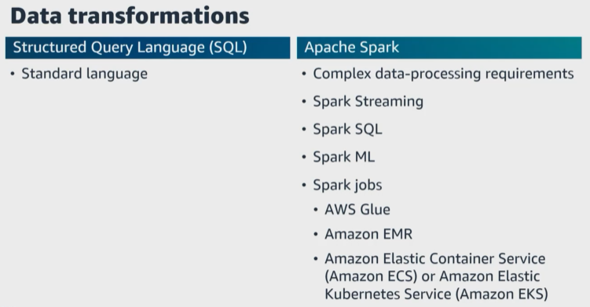
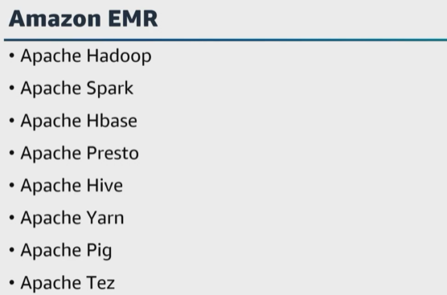
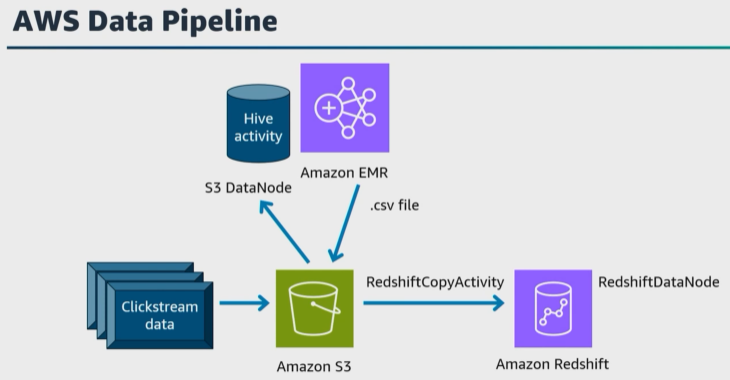
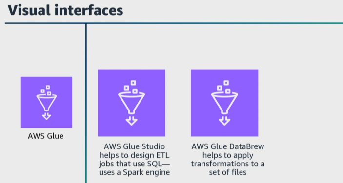
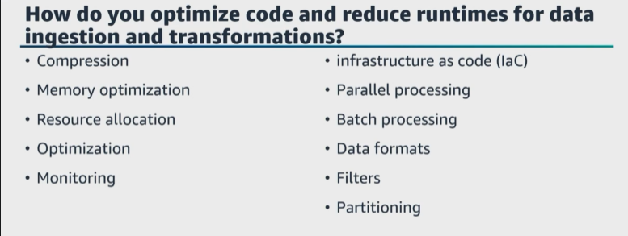
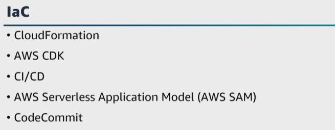
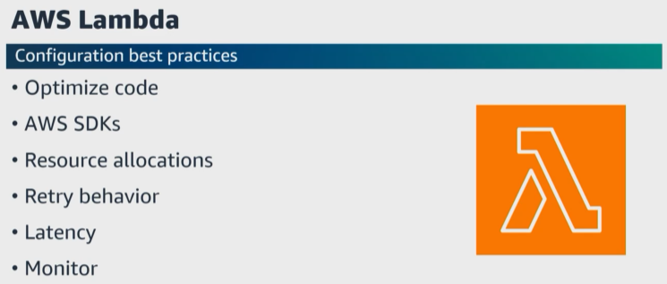
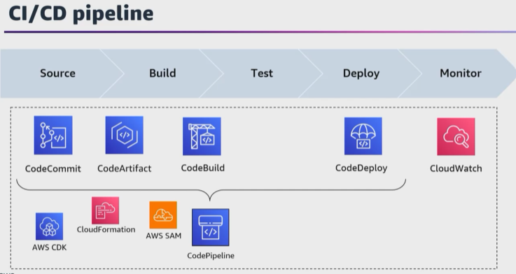
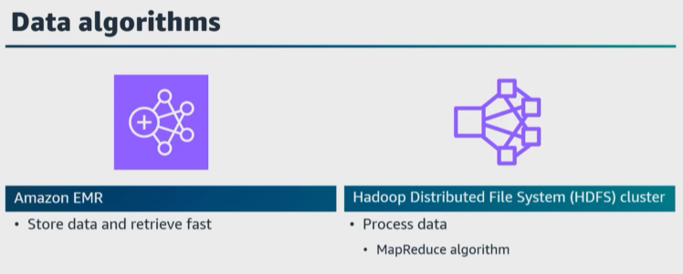
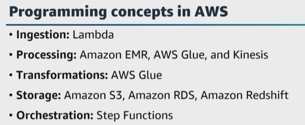

# A. Apply programming concepts
- [A. Apply programming concepts](#a-apply-programming-concepts)
- [B. Additional resources](#b-additional-resources)

``AWS`` offers engines for data transformations, and there are many different ways to transform your data. Data engineers use raw datasets, combine the raw datasets with other datasets, process the data with different analytic engines, and create new or different datasets, but all of this depends on the business purpose, requirements, what you're trying to create, and more. 

|   |    |   
|---|---| 

Let's start with the ``structured query language, SQL``, and talk about the advantages of ``SQL``. The big advantage to using ``SQL`` is that it is a standard language and it has been used for years and is widely known. But code-based approaches to data transformation, such as ``Spark``, can be more powerful and versatile to perform data transformations. 

And as a data engineer, **you need to understand the tools and target for your data**. If you are using an environment that is heavily focused on ``SQL``, then using ``SQL`` for your transformations is probably the better choice. But if your environment **has complex data-processing requirements with latency and throughput requirements, then ``Spark`` might be the better choice**. 

There are multiple ways to run ``Spark`` jobs in ``AWS``. 
* You **can process data in batches or in near real time** using ``Spark Streaming``. 
* You can use ``Spark SQL`` to process data using standard ``SQL`` and ``Spark ML`` for applying machine learning techniques to your data. 
* You can also run ``Spark`` jobs with ``AWS Glue``, **which adds a serverless way** to run ``Spark``, and with ``Amazon EMR`` **to have a managed service for deploying a cluster** for running ``Spark``. 
* You can also use ``Amazon Elastic Container Service, or Amazon ECS, and Amazon Elastic Kubernetes Service, or Amazon EKS``, to run a ``Spark`` engine in a containerized environment or use a **managed service** from an ``AWS partner`` such as ``Databricks``. 

Here's a question. If you have a target for your data transformations in ``Amazon Redshift``, what do you use to process your data, ``SQL`` or ``Spark``? Well, if your target data transformation is in ``Amazon Redshift``, **then you are using an ``ELT`` approach** and the data transformation is being performed inside the data warehouse, which is ``Amazon Redshift``, and ``Amazon Redshift`` **uses queries based on ``SQL`` to interact with data and objects in the system**, so ``SQL`` **would be the better choice**. 

You could use ``Spark SQL`` to use ``SQL`` for transformation while using the data-processing engine to perform transformations, rather than the data warehouse. In this case, this configuration would allow the data warehouse to focus on the end user queries while data transformation is offloaded to a ``Spark`` cluster, so it would flow as an ``ETL`` approach where the data is extracted to intermediary storage. 

``Spark`` is used to transform the data, then the data is loaded into the data warehouse. 

Here's a question. Why do you need to ensure that your queries are optimized and processed as quickly as possible? Well, when you run complex queries on large amounts of data, it can take time to process. For example, let's walk through how ``Amazon Redshift`` optimizes queries. 

* ``Amazon Redshift`` **routes a submitted SQL query through the parser and optimizer to develop a query plan**. 
  
* The execution engine then translates the query plan into code and sends that code to the compute nodes for execution. 

|   |    |   
|---|---|

Let's move on and talk about more engines. What engine is available in ``AWS`` if you have a framework that consists of multiple open-source software packages for working with large datasets and you need to be able to scale from running on a single server to running on thousands of nodes? You can use ``Amazon EMR`` to process and analyze large datasets using frameworks, such as ``Hadoop, Spark, Hbase, and Presto``, on fully customized clusters, and you can also run a number of Hadoop tools such as ``Yarn, Tez, Pig``, and more. 

|   |    |   
|---|---|

Let's jump back to the beginning of this lesson where we were talking about the ``ETL`` process. ``AWS Data Pipeline`` **is a managed ETL service to define data movement and transformation across various** ``AWS services`` and ``for on-premises resources too``. 

Using ``Data Pipeline``, **you define the dependent processes to create your pipeline consisting of the data nodes that contain your data**. This includes activities or business logic, such as ``Amazon EMR`` jobs or ``SQL queries``, that will run sequentially. 

For example, if you want to move **clickstream data** stored in ``Amazon S3`` to ``Amazon Redshift``, you would define 
* A pipeline with an ``S3`` data node that stores your log files, 
* A ``Hive activity`` that **will convert your log files to a .CSV file using an ``Amazon EMR`` cluster, and store it back to ``Amazon S3``. 
* A ``RedshiftCopyActivity`` that will copy your data from ``Amazon S3`` to ``Amazon Redshift``, and 
* A ``RedshiftDataNode`` that **will connect** to your ``Amazon Redshift`` cluster. 
* You might then pick a schedule to run at the end of the day. 

|   |    |   
|---|---|

There are also ``AWS services`` that provide a visual interface, such as ``AWS Glue Studio``, that can help design ``ETL`` jobs that use ``SQL`` statements to perform complex transformations for users who do not have ``Spark`` coding skills to run SQL-based transformations using the ``Spark`` engine. 

There's also ``AWS Glue DataBrew`` that helps you to apply transformations to a set of files. 

Let's move on and talk about how to apply programming concepts to the transformation and processing of your data. ``Athena`` helps you query structured and semi-structured data that is stored in ``Amazon S3``. 

Let's say that you're using Athena to query tables in the Data Catalog. Do you know the column names that Athena supports? For example, does ``Athena`` support special characters, such as forward slashes, spaces, or periods? No, ``Athena`` **supports column names that contain alphanumeric characters and underscores**. For example, **the column name /var/log could be rename to var_log or varlog**. 

|   |    |   
|---|---|

For pipelines, infrastructure as code is a core concept of orchestration systems and touch every stage of the data engineering lifecycle. Let's start at the beginning and jump back to our first lesson and talk about optimizing code to reduce runtime for data ingestion and transformation. 

**What are strategies you can use in AWS to optimize code and reduce runtime for data ingestion and transformation?** 

* You can use **parallel processing to distribute the workload across multiple compute resources**. For example, ``AWS Glue`` **supports parallel execution of data transformation jobs using Spark**. By partitioning and processing data in parallel, you can significantly reduce the overall runtime. 

* You can use **batch processing to reduce overhead and improve efficiency**. ``AWS Glue`` and ``Amazon EMR`` `**provide capabilities for batch processing to process large volumes of data efficiently**. 

* You choose **data formats** that are optimized for storage and processing. **Columnar formats**, such as ``Parquet or ORC``, **provide better compression**. > **Column-wise data access can help with faster data ingestion and transformation.** 

* Also, you can **convert data to optimize formats before processing, especially for large datasets**. 
  
* Ensure **you load and process only the necessary data instead of the entire dataset**, and use filtering techniques to remove unneeded data early in the process. **This reduces the amount of data being processed and improves overall runtime**. 

* You can reduce the amount of data scanned by **partitioning your data based on specific criteria, such as date, Region, or another attribute**. Partitioning can help to reduce the amount of data scanned during ingestion and transformation. 

* You can compress your data to reduce storage requirements and improve data transfer speeds. ``AWS Glue`` **provides built-in compression options for transforming and writing data in compressed formats**, and you can choose the appropriate compression algorithm based on the data characteristics and the processing tools that you are using. 

* You can **optimize memory and resource allocation for data processing tasks**. Ensure you know how to tune the memory configuration and parallelism settings to match the requirements. This helps to have sufficient resources with optimized usage, which can help to prevent performance bottlenecks and improve overall runtime. 

We already covered query optimization, **such as indexing, query rewriting, and proper SQL query design**, and we covered using incremental processing to process only the changes or delta data since the last processing run. 

And to continuously monitor and analyze the performance of your data ingestion and transformation processes, use ``CloudWatch`` **to identify bottlenecks, optimize resource allocation, and improve your code for improved performance**. 

|   |    |   
|---|---|

Let's jump back to optimizing your code by using automation for all aspects of your infrastructure deployment. For ``IaC``, you can use ``CloudFormation`` templates **to specify the definitions and configurations of your infrastructure that you are going to deploy**. You could also use the ``AWS CDK`` for repeatable deployments too. Then for your data pipelines, you can use ``CI/CD`` to implement, test, and deploy your data pipelines. There is also the ``AWS Serverless Application Model, or AWS SAM``, **to package and deploy serverless data pipelines**, such as ``Lambda functions, Step Functions, and DynamoDB tables``. 

For version control, once you have your template definition file, you can commit that file to a source code repository such as ``AWS CodeCommit`` or ``GitHub``. Then your ``CI/CD`` **pipeline can be automated to run when a new version of a file is committed to the source control repository**. 

|   |    |   
|---|---|

**The goal is to optimize your code to reduce runtime for data ingestion and transformation**. ``Serverless applications`` **can improve the performance with parallelization and concurrency**. 

For example, ``Lambda`` manages scaling automatically, **but you can optimize the individual ``Lambda`` functions used in your application to reduce latency and increase your throughput**. 

How do you configure your ``Lambda`` functions to meet your concurrency and performance requirements? 
* **First**, ensure that **your code is optimized**. Are you using best practices and the ``AWS SDKs`` and libraries? 
  
* **Next**, ensure that **you have an appropriate amount of memory and CPU for your function**. Also, configure the **concurrency limit** based on your expected workload and performance requirements. 
  * **You can use asynchronous invocation** that does not need an immediate response. 
  * You can choose to **use provision concurrency to prewarm your function** and set appropriate timeout values for your function **to avoid waiting and premature terminations**. 
  * You can **adjust the timeout based on the expected execution time** and **configure your retry behavior to handle transient errors**. 
  * Another option is **to use provisioned IOPS for your ``Amazon EBS`` volumes **for higher input/output performance**. 

If your ``Lambda function`` needs access to your resources inside an ``Amazon VPC``, **consider the additional latency that this might add**. 
> To **minimize latency, you could place your function inside the same ``Amazon VPC`` and use databases and caches and monitor the performance of your function to optimize your configurations and code`**. 

Here's a question on optimizing your code. Let's say that your pipeline is designed to monitor and collect user activity in near real time using ``Kinesis Data Streams``. Another application on an ``Amazon EC2`` instance uses the ``Kinesis Data Streams API`` with the AWS SDK for Java to consume and process that data before it is sent to an Amazon OpenSearch cluster for analysis. Your data analysts noticed errors which are causing loss of the ``Amazon OpenSearch cluster``. Can you recover the missing data by modifying the Java code? 

Yes, you can modify the Java application code to use idempotent processing and pointing the shard iterator to the shard position before the application error occurred. I will add a link for this if you wanna take a deeper dive. 

|   |    |   
|---|---|

For the exam, **ensure that you can understand how applying programming concepts and using ``AWS services`` and tools for ``CI/CD`` can automate the deployment, testing, and monitoring of your data pipelines for faster iterations, higher quality, and increased efficiency in your workflows**. We've mentioned using ``CloudFormation`` and the ``AWS SAM`` to automate the creation of ``Lambda`` applications and mount storage volumes within your ``Lambda`` functions. **Automated tests to help to ensure correctness and integrity of your data transformations**. 

What are other tests you can think of to automate? 

Well, **data quality** checks and also ***schema validation**. Let's pause and go back to the fundamentals needed for this exam. 

Data engineers need to have a solid understanding of different data structures and algorithms to design and implement efficient and scalable data processing systems. By using the right data structures and algorithms, **data engineers can optimize performance, improve scalability, and reduce processing time**. 

``Data structures`` **represent data relationships and refer to the way data is organized and stored in a computer's memory**. They provide methods of sorting and accessing data effectively. Some data structures are **relational databases, NoSQL databases, data warehouses, distributed file systems, message queues, tree data, and hash tables**. 

Ensure you understand different data structures and can choose the appropriate ones for a particular use case. Algorithms are a set of instructions or rules that computer software, webpages programs, and hardware use to complete a task. Some examples of algorithms include sorting, searching, shortest path, hashing graph, and more. Each provides a way to access data, but also to respond to a command in order to complete a task. However, if an algorithm is designed for a specific data structure, using it with a different data structure will lead to inefficiencies in the results. 

|   |    |   
|---|---|

For example, a data engineer may need to implement a sorting algorithm to sort a large dataset. They may choose to use an algorithm like ``Quicksort`` or ``Merge Sort`` depending on the data size and type. 

Let's say that you need to process a large amount of customer data, analyze the data, and get insights so that analysts can make further decisions. To accomplish this task, you need to store the data in a data structure that can handle large volumes of data and efficiently retrieve it as fast as possible. You decide to use ``Amazon EMR`` with the distributed file system, ``Hadoop Distributed File System``, to store the data. Then you need to process the data to extract insights. To do this, you need to choose the appropriate algorithm to process the data efficiently. You decide to use ``MapReduce algorithm``, **which is a programming model for processing large datasets with a parallel distributed algorithm on a cluster**. You implement the ``MapReduce algorithm`` in your data-processing pipeline, which involves breaking down the data into smaller chunks, mapping each chunk to a set of key-value pairs, and reducing the results to get the final results. Finally, you optimize the performance of your data-processing pipeline by using techniques like data partitioning, caching, and parallel processing. 

By **understanding data structures and algorithms, you were able to design and implement an efficient and scalable data-processing system that allowed you to extract valuable insights from the customer data**. 
> **Data structures and algorithms help to efficiently process data and optimize data-processing pipelines, which improves the performance and reduces the processing time. The faster the data can be processed, the more value your data brings**. 

By choosing the correct data structures and algorithms, you can design your pipelines and systems to scale as needed. And by understanding data structures and algorithms, you can identify and fix performance issues and optimize your code for efficiency. 

Let's wrap this up and talk about examples of how a data engineer might apply programming concepts in AWS. For data ingestion, a data engineer might use Lambda to write code that handles data ingestion tasks. For instance, you could create a Lambda function that listens to an event source such as an S3 bucket. The function is initiated when the new data is uploaded to the bucket and performs actions like parsing, transforming, and loading the data into a data warehouse or database. 

|   |    |   
|---|---|

* For ``data processing``, you might use ``Amazon EMR`` and ``AWS Glue`` to write code using programming languages like ``Python or Scala`` to define data-processing jobs. You can use frameworks, such as ``Spark``, **to distribute and parallelize data-processing tasks across a cluster** of ``EC2 instances``. 

* For ``real-time data processing``, you can use ``Kinesis`` and write code to consume and process streaming data. And you can use the ``AWS SDKs`` and ``Amazon Kinesis client`` libraries to interact with the data streams. 

* For ``data transformation`` and to perform complex transformations, you can use ``AWS Glue`` and write code using the ``AWS Glue Python-based ETL`` framework to define transformation logic, such as **data cleansing, aggregation, normalization, and schema evolution**. 

* For ``data storage``, you can use ``Amazon RDS`` or ``Amazon Redshift`` for structured data and write SQL queries to interact with the data. 

* For ``semi-structured`` or ``unstructured data``, you can use ``Amazon S3`` and the ``AWS SDKs`` **to read, write, and manipulate data** stored in ``Amazon S3``. For ``workflow orchestration``, you can use ``Step Functions`` **to build serverless workflows by defining state machines, then use programming concepts to define the workflow structure, conditions, and actions**. 

``Materialized views`` **are a powerful tool to improve query performance** in ``Amazon Redshift``. ``Materialized views`` **store a pre-computed result set to improve query performance**. Similar queries do not have to re-run the same logic each time. Instead, the queries can retrieve records from the existing result set. This solution would be the most cost-effective way to improve query performance.

# B. Additional resources

 

* [Code Example: Data Preparation Using ResolveChoice, Lambda, and ApplyMapping](https://docs.aws.amazon.com/glue/latest/dg/aws-glue-programming-python-samples-medicaid.html)

* [AWS Glue PySpark Transforms Reference](https://docs.aws.amazon.com/glue/latest/dg/built-in-transforms.html)

* [How to Extract, Transform, and Load Data for Analytic Processing Using AWS Glue (Part 2)](https://aws.amazon.com/blogs/database/how-to-extract-transform-and-load-data-for-analytic-processing-using-aws-glue-part-2/)

* [ETL Processing Using AWS Data Pipeline and Amazon Elastic MapReduce](https://aws.amazon.com/blogs/big-data/etl-processing-using-aws-data-pipeline-and-amazon-elastic-mapreduce/)

* [AWS Data Pipeline Concepts](https://docs.aws.amazon.com/datapipeline/latest/DeveloperGuide/dp-concepts.html)

* [Working with Pipelines](https://docs.aws.amazon.com/datapipeline/latest/DeveloperGuide/dp-managing-pipeline.html)

* [Build a Concurrent Data Orchestration Pipeline Using Amazon EMR and Apache Livy](https://aws.amazon.com/blogs/big-data/build-a-concurrent-data-orchestration-pipeline-using-amazon-emr-and-apache-livy/)

* [Overview of Workflows in AWS Glue](https://docs.aws.amazon.com/glue/latest/dg/workflows_overview.html)

* [Amazon Managed Streaming for Apache Kafka (MSK)](https://aws.amazon.com/blogs/aws/amazon-managed-streaming-for-apache-kafka-msk-now-generally-available/)

* [Amazon Kinesis Data Streams Quotas and Limits](https://docs.amazonaws.cn/en_us/streams/latest/dev/service-sizes-and-limits.html)

* [AWS Glue Components](https://docs.amazonaws.cn/en_us/streams/latest/dev/service-sizes-and-limits.html)

* [Overview of Amazon EMR](https://docs.aws.amazon.com/emr/latest/ManagementGuide/emr-overview.html)

* [Device Communication Protocols for AWS IoT](https://docs.aws.amazon.com/iot/latest/developerguide/iot-message-broker.html)

* [Orchestrate an ETL Pipeline with Validation, Transformation, and Partitioning Using AWS Step Functions](https://docs.aws.amazon.com/prescriptive-guidance/latest/patterns/orchestrate-an-etl-pipeline-with-validation-transformation-and-partitioning-using-aws-step-functions.html)

* [Tuning Query Performance](https://docs.aws.amazon.com/redshift/latest/dg/c-optimizing-query-performance.html)

* [Basic Git Commands](https://docs.aws.amazon.com/codecommit/latest/userguide/how-to-basic-git.html)

* [GetShardIterator](https://docs.aws.amazon.com/kinesis/latest/APIReference/API_GetShardIterator.html)