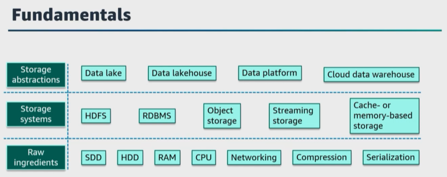
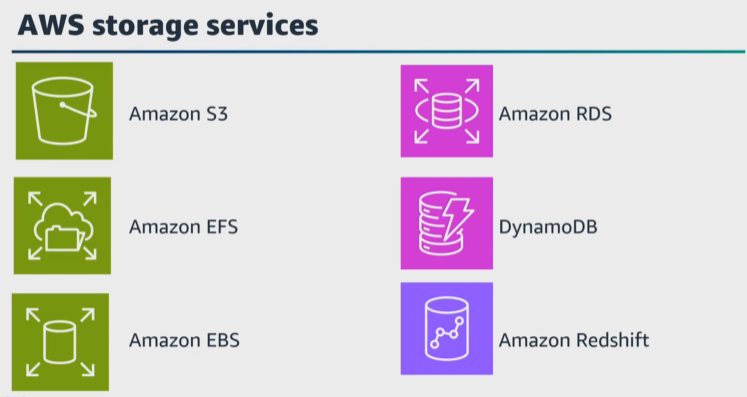
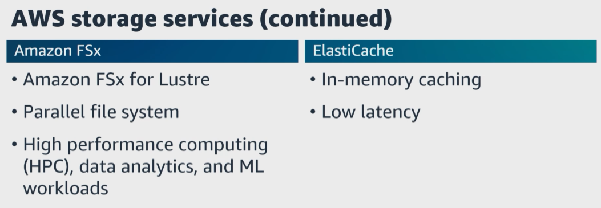
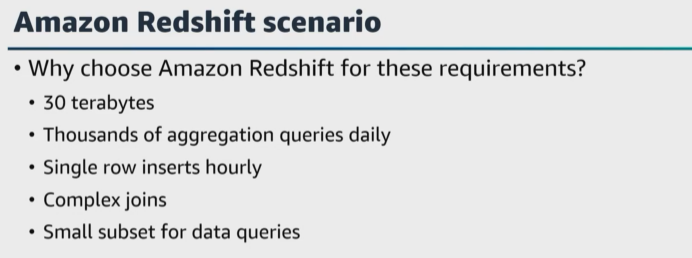
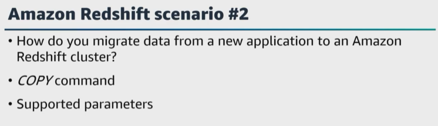
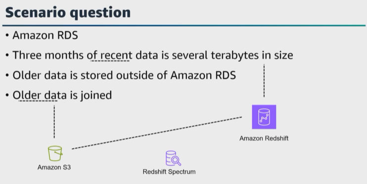
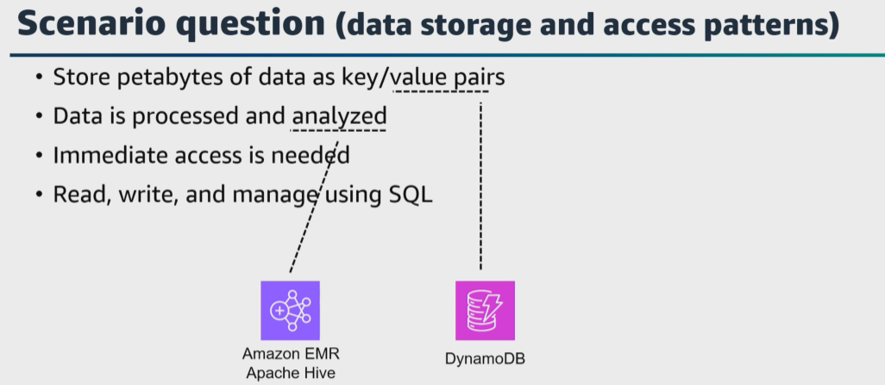
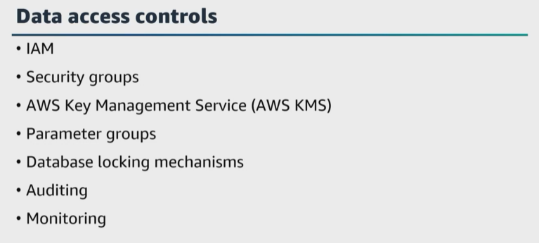

# A. Choose a data store

- [A. Choose a data store](#a-choose-a-data-store)

Let's get started with the first task statement from domain 2, which is to choose a data store. For this task statement, **you'll need to understand the different storage platforms and options in AWS**. 

|   |    |   
|---|---|

As a data engineer who uses storage daily, it is important to understand the underlying components, characteristics, performance considerations, durability, and cost of different storage systems. Knowing the use cases of your data, the way that data is stored, and the way that data is retrieved, is the first step to choosing the proper storage solution for your data architecture. 

Storage systems sit at a level of abstraction above the raw infrastructure. In most data architectures, your data storage and query systems involve distributed systems services and hardware storage layers, and these systems need the raw infrastructure to function correctly. 

|   |    |   
|---|---|

We've already talked about the different AWS storage services. ``Amazon S3`` **is object storage**, ``Amazon EFS`` **is file storage**, and ``Amazon EBS`` **is block storage**. Each of these storage platforms have its own characteristics to meet requirements of different use cases. 

Let's quickly cover their key characteristics. 

* ``Amazon S3`` is a highly available, scalable, and durable object storage service designed to store and retrieve any amount of data. A few use cases for ``Amazon S3`` **are storing static content, backups, media files, data lakes, and more**. ``Amazon S3`` is also the underlying storage used for a data lake. 

* ``Amazon EFS`` **provides a fully managed, scalable file storage service that can be shared across multiple** ``EC2 instances``. A few use cases for ``Amazon EFS`` **are shared file storage across multiple instances, web hosting, content management systems, big data processing, and more**. Another file storage is ``Amazon FSx for Windows File Server, Amazon FSx for Lustre, Amazon FSx for NetApp ONTAP``, and more. 

* ``Amazon EBS`` **provides persistent block-level storage volumes that are attached to** ``EC2 instances``. A few use cases for ``Amazon EBS`` are **running databases, transactional applications, and other applications that require low-latency, high-performance storage**, and more. 

* ``Amazon RDS`` **is a managed database service** for ``MySQL, PostgreSQL, Oracle, SQL Server``, and others. Use cases for ``Amazon RDS`` are hosting and managing relational databases. 

* ``DynamoDB`` **is a managed NoSQL database service that offers single-digit millisecond latency at any scale**. A few use cases for ``DynamoDB`` are applications requiring low latency read and write operations, real-time data, gaming, IoT, and dynamic scaling. ``DynamoDB`` can also use several data types, such as document, graph, key value, memory, and search. 

* ``Amazon Redshift`` **is a managed petabyte-scale data warehouse service for analytics and business intelligent workloads**. ``Amazon Redshift`` `**is great to store and manage structured data,** but would also be a great solution for handling **large volumes of high-velocity semi-structured and unstructured data**. 

Also, there's ``AWS Lake Formation``, **which is a managed service to build, secure, and manage data lakes**. ``Lake Formation`` **combines structured and unstructured data into a central repository, and you can crawl, catalog, and prepare your data for analytics**. 

Selecting the right AWS storage service and configuration depends on the requirements, types of data, and performance demands of your applications and workloads. What are factors you need to consider when choosing a data store based on performance requirements? Input/output operations per second requirements, scalability, durability, and also data access patterns when choosing the appropriate storage solution. 

|   |    |   
|---|---|

Here are two questions. What ``AWS service`` **would you choose for a highly parallel file system?** ``Amazon FSx for Lustre``. What are use cases for a parallel file system? **High-performance computing, data analytics, and machine learning workloads with large-scale parallel data processing requirements.** 

What ``AWS service`` **would you choose for an in-memory caching and low latency access**? ``ElastiCache``. Use cases for ``ElastiCache`` **are caching frequently accessed data, session storage, and real-time analytics.** 

|   |    |   
|---|---|

Here's another question. Can you explain to me why you would choose ``Amazon Redshift`` with the following requirements? For your new application, you need to store 30 terabytes of uncompressed data. There will be hundreds to thousands of aggregated queries each day. There will also be multiple complex joins, but only a small subset of the columns in a table will be involved for the data queries. 

``Amazon Redshift`` **can store your data with optimal query performance using parallel processing and columnar data storage with targeted data compression and coding schemes**. I would choose ``Amazon Redshift`` **because columnar architectures have an advantage when querying a subset of the columns in a table by reducing the input and output**. And because the data is stored by column, it can be highly compressed, which further reduces the input and output, and provides more data to be stored and to be quickly queried. Also, ``Amazon Redshift`` `**supports SQL Join**. 

|   |    |   
|---|---|

Here's a question about how to implement data migration or remote access methods. You have an ``Amazon Redshift cluster`` and you are planning to migrate data from a new application into a cluster table. How do you migrate this new data? 
* Well, in ``Amazon Redshift``, the ``Copy`` command **loads data into a table from data files**. 
* The files can be located in an ``S3`` bucket, or an ``Amazon EMR`` cluster, and more. 
* As it loads the table, **copy attempts to convert the strings in the source data to the target column's data type**. 

What if you need to specify a conversion that is different from the default behavior, or if the default conversion results in errors? You can manage data conversions by setting supported parameters. 

|   |    |   
|---|---|

Here's a question for storage services and configurations for specific performance demands. You have an application hosted in ``Amazon RDS``. Analytical workloads and queries are run against **the most recent 3 months of data**, which is several terabytes in size. **The older data must be stored outside the database, but this older data will occasionally be joined with the recent data for reports**. What is your solution to optimize the performance? 

* I would **export the older data** to ``Amazon S3``, then 
* Create a **daily job that exports the current data from ``Amazon RDS`` to ``Amazon Redshift``. 
* Then you can use ``Amazon Redshift`` **for regular queries** and ``Redshift Spectrum`` **for joining the older data and the current data for the reports**. 
* Also **ensure that you understand your data storage and access patterns**. 

|   |    |   
|---|---|

Let's say that you need to **store petabytes of data as key-value pairs**. The data collected will be processed and analyzed, and will require immediate access to that data. You'll also need to have the ability to read, write, and manage the data using a **SQL or SQLite interface**. What is your solution? 

* My solution would be **to analyze the data with ``Hive`` on ``Amazon EMR`` and save the data to a ``DynamoDB table``. 
* With ``Hive``, **you can read, write, and manage petabytes of data** using a ``SQL-like interface``. 
* We mentioned in an earlier lesson that ``Amazon EMR`` **can process large amounts of data using open-source tools, such as ``Spark, Hive, Apache HBase, Apache Flink, Apache Hudi, and Presto``. 

For **short-running jobs**, you can spin up and spin down clusters and pay per second for the instances used. For **long-running workloads**, you can create highly available clusters that automatically scale to meet demand. 

|   |    |   
|---|---|

Here's another question. **How do you manage permissions to prevent access to data**? Well, managing permissions to prevent unauthorized access to data is critical to ensure data security, integrity, and compliance. Both ``Amazon Redshift`` and ``Amazon RDS`` **provide mechanisms to control access through user permissions and security groups**. 

Let's walk through some options we can use to prevent access to data in both of these services. Both Amazon Redshift and Amazon RDS gives you the ability to manage your data security and control access with IAM, security groups, and AWS Key Management Service, or AWS KMS. 

For Amazon Redshift and Amazon RDS, IAM helps to control access to clusters and resources. You can create IAM users with specific permissions and roles and assign appropriate IAM policies based on roles and responsibilities. 

You can also use security groups, add encryption, and manage encryption keys using AWS KMS for an added layer of data protection. Also, you can use parameter groups to configure database parameters, including locking mechanisms to control concurrency and prevent potential data conflicts, and finally, use database auditing to track and log access and changes to the database and monitor any unauthorized access attempts. 

Also, remember to configure recurring monitoring schedules to check your access logs and audit trails to detect and address any suspicious or unauthorized access attempts. 
