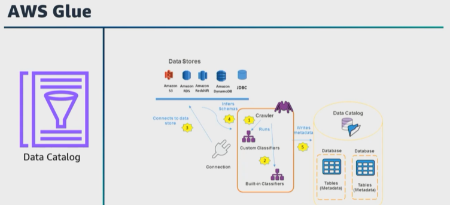

# A. Understand data cataloging systems

- [A. Understand data cataloging systems](#a-understand-data-cataloging-systems)

Let's get started with the second task statement from domain 2, which is to understand data cataloging systems. For the exam and this task statement covering data catalogs, ensure that you understand how to plan, design, structure, and organize your data. For many organizations, data is physically stored in many separate locations. This isolation can make it challenging for users to combine data from various sources in order to provide the most meaningful information. 

A ``data catalog`` `**is a metadata repository that stores information about the location, description, or schema and runtime metrics of the data**. Users can use this central information to facilitate writing federated queries, performing ETL actions, and more. 

As a data engineer, **you will need to understand how to set up a data catalog and maintain various data integrations of data pipelines and storage systems that integrate with your data catalog**. 

We will talk about data security and governance under domain 4, but I wanted to mention it here with **data catalogs**. If your pipeline is efficient with fast **data transformations** and you use the best data consumption tools, that data is not valuable if it is not secured, and even if you secure your data and follow the governance regulations, you still need to ensure that your analytic datasets can be easily found and used. 

To ensure that you capture the needed details about each dataset, you can enforce your organization's policies to classify the data based on the requirements. To create your ``data warehouse`` or ``data lake``, **you must catalog this data**. The **data catalog** contains references to data that is used as sources and targets of your ``ETL`` jobs in ``AWS Glue``. 

> **It is an index to the location, schema, and runtime metrics of your data.** 

You can use the information in the ``Data Catalog`` to create and monitor your ``ETL`` jobs. Information in the data catalog is stored as metadata tables where each table specifies a single data store. Typically, you run a crawler to take inventory of the data in your data stores, but there are other ways to add metadata tables into your ``data catalog``. 

|   |    |   
|---|---|

Let's say that you want to use ``Athena`` to query your data in your ``data lake``. How does this work? ``Athena`` can run queries using the databases and table definitions in the catalog. To query the data, ``Athena`` **will use the catalog** to get the ``S3 location`` of the data files, metadata that will give you the file format type, such as Parquet or CSV, information about any partitions that are used, and more. 

``Lake Formation`` **also provides an interface** for the ``Data Catalog``, too, and for the ``Data Catalog``, ``Lake Formation`` `**has the ability to add key-value properties at the column level**. Remember that we just said that with ``AWS Glue``, **you can capture some business attributes using key-value tags at the table level**. ``Lake Formation`` **provides additional functionalities to configure access permissions at the database, table, and column level, and we'll talk about permissions more in just a few minutes**. 

Here's a question. 

|   |    |   
|---|---|

You have a central **data lake** in ``Amazon S3`` that holds the data for **four AWS accounts**. You need to ensure **role-based access controls** for your **data lake** so each business unit can continue to access only their data. What is your solution? 

* I **would build a data lake storage in each of the four AWS accounts**, 
* ``Catalog`` that data across the multiple accounts to the ``central data lake account`` using ``Lake Formation``, then 
* I would **update the ``S3`` bucket policies in each account with the Lake Formation service-linked role**, and 
* Use the ``Lake Formation permissions`` **to further grant more specific access**. 
  
> **In ``Lake Formation``, **you can configure cross-account access to ``Data Catalog metadata`` and the underlying data**. 

**For example**, in large enterprises that have **multiple AWS accounts**, many of those accounts need access to a **data lake** managed by a **single AWS account**. Sharing the ``Data Catalog`` and underlying data with other AWS accounts **gives users the ability to run queries and jobs that can join and query tables across multiple accounts**. ``Users`` and ``AWS Glue ETL`` jobs **can query and join tables across multiple accounts while using ``Lake Formation`` ``table-level`` and ``column-level`` data protections**. 

Let's talk more about ``Data Catalog`` and talk about how to ensure that you are building workflows to ingest all of your data, that your data is cataloged, and that the appropriate metadata is added. What would you use? 

* My **first thought** is to use an ``AWS Glue crawler`` **to run after new data is ingested and to have that new data automatically added** to the ``Data Catalog``. 

Here's a question. 

|   |    |   
|---|---|

What do you add to ensure that the ``Data Catalog`` is being updated with all of the needed details of the new data when a new data engineering job is being deployed into production? 

* You can add **a check** to ensure that the ``AWS Glue API`` is being used to update the ``data catalog``. 


|   |    |   
|---|---|

For the exam, also **ensure that you understand how synchronizing partitions with the ``Data Catalog`` is important to manage and organize data stored in partitioned data sources**, such as ``Amazon S3``. With large datasets that are divided into partitions based on specific criteria, such as date, Region, or category, **updating the ``Data Catalog`` to reflect these partitions accurately ensures efficient querying and analysis of the data**. ``AWS Glue`` **also offers functionality to automate the process of synchronizing partitions** with a ``Data Catalog``. 

Let's walk through an example with ``Amazon S3``. 

* **First,** create a database in ``AWS Glue`` to serve as your ``data catalog``. You can do this through the ``AWS Glue console`` or by using ``AWS Glue APIs`` and ``SDKs``. 

* **Second,** create a crawler for the data source. In the ``AWS Glue console``, create a crawler for the ``data source``, and for our example, it is an ``S3`` bucket that contains the partition data. The **crawler will automatically discover the data in its partitions, collecting metadata and schema information**. 

* **Third**, to define the partitioning schema, specify the partitioning schema when configuring the crawler. For example, if your data is partitioned by date, provide the partitioning columns and their data types. If the partitions are not automatically detected, you can use the ``AWS Glue API`` **to manually add or modify partitions in the data catalog**. 

* **Fourth**, run the crawler to scan the data source and collect metadata about the partitions. The crawler will update the data catalog with the information it discovers. 

* **Fifth**, schedule the crawler. Depending on your data ingestion frequency, you can schedule the crawler to run periodically to keep the ``data catalog`` up to date as new partitions are added or existing ones have changed. 

* **Sixth**, query the data using ``Athena``. After the data catalog is updated to reflect the partitions accurately, you can use ``Athena`` or other query engines to efficiently query the data based on specific partition criteria. By synchronizing partitions with a ``data catalog`` in ``AWS Glue``, **you ensure that your data is organized, discoverable, and accessible for analysis and data processing tasks**. 


|   |    |   
|---|---|

Let's also talk about how to create new source or target connections for cataloging in ``AWS Glue``. Why would you create a new source or target connections in ``AWS Glue``? Well, it will help you to manage your data assets to access catalog and process data from various sources and targets within your ``AWS environment``. You can create a connection for the ``data source`` or ``data target``. The connection type you choose depends on whether you're connecting to a source to ingest data or a target to store or write data. 

For example, if you're connecting to an ``S3 bucket`` as a data source, **you will need to provide the ``S3 bucket`` path and optional inclusion/exclusion patterns**. Or if you're connecting to ``Amazon RDS``, **you'll need to provide the database endpoint, port, credentials, and other relevant information`**. You can choose to test the connection to verify that ``AWS Glue`` can successfully access the data source or target using the provided configuration. Once the connection is saved, it will appear in the list of connections on the connections page in the ``AWS Glue`` console. You can now use this connection in ````AWS Glue crawlers`` or other ``ETL`` jobs to access and catalog data. If the new connection is for a ``data source``, you can create a crawler to automatically discover and catalog the data. 

``Crawlers`` **will use the connection you created to access the data and populate the ``data catalog`` with metadata**. 
> In ``AWS``, metadata and data catalogs help to organize, describe, and manage data assets and help users and applications understand the data's characteristics, structure, schema, and usage. 


|   |    |   
|---|---|

For the exam, ensure you know the components of metadata and components of a data catalog. 

* ``Metadata components`` include the following, 
    * **schema information**, which describes the structure of the data, including data types, field names, and relationships between fields, 
    * **data type information**, which specifies the data types of various attributes in the dataset, 
    * **data source information**, which indicates the origin of the data, such as the database, data lake, or data warehouse, 
    * **timestamps**, which record creation time, modification time, and other relevant time-related information. 

    * **Data quality** metrics, which provide details on data accuracy, completeness, and consistency, 

    * **data ownership== which define who owns the data

    * **access controls**,  who has access to it. 

* ``Data catalog components`` include the following, 
    * **table and databases**, 
    * **table schemas**, which define the structure of the data, including column names, data types, and other properties. 
    * **Partitioning information** that is stored by the ``data catalog`` to help queries be more efficient. In ``AWS Glue``, **data can be partitioned based on specific criteria**, such as data Region. 
    * **Location and storage information** is also recorded by the ``data catalog``, for example, an ``S3`` **bucket path** or **database endpoints**. 
    * **Statistics and metadata** crawling populate the ``data catalog`` with valuable information. ``AWS Glue`` crawlers automatically discover data and collect metadata from various sources. 
    * **Data lineage** and dependency information that can be tracked to show how the data flows between different datasets and processing steps. 
    * **Tagging and labels** to provide the ability to categorize and search for data based on specific criteria. 
    * **Access control policies** help to ensure that only authorized users and applications can view or interact with specific datasets. 
    * **Integration** with data analytics and business tools for users to work with that data. 

|   |    |   
|---|---|

We will cover security again under domain 4, but since we just mentioned access control policies, let's also talk about how to classify data based on requirements by implementing various security and compliance measures. Data classification involves categorizing data into different levels of sensitivity or importance to ensure that you are applying appropriate security controls and access policies to protect the data accordingly. 

``AWS provides`` several tools and services to help you classify and manage data based on your requirements. 
* With ``IAM``, you have the ability to control access to ``AWS services``, resources, and data by defining ``IAM`` roles, groups, and policies. 
* ``AWS`` all also provides various encryption options to protect data at rest and in transit. 

    **For example**, ``AWS KMS`` helps to manage encryption keys for your data stored in ``AWS services. 
    **For example**, ``AWS KMS`` helps to manage encryption keys for your data stored in ``AWS services. Amazon Virtual Private Cloud, or Amazon VPC, and security groups help to isolate and control access to resources. AWS service control policies, or SCPs, are used to manage permissions in AWS Organizations. They give you the ability to set controls to prevent member accounts from performing specific actions or accessing specific services, which can help ensure data security and compliance. 
* ``Amazon Virtual Private Cloud``, or ``Amazon VPC``, and security groups help to isolate and control access to resources. ``AWS service control policies``, or ``SCPs``, are used to manage permissions in ``AWS Organizations``. They give you **the ability to set controls to prevent member accounts from performing specific actions or accessing specific services**, which can help ensure data security and compliance. 
* ``Amazon Macie`` **is a security service that uses machine learning to automatically discover, classify, and protect sensitive data in AWS``. Based on your specific needs, you can implement a combination of these ``AWS`` services and best practices to classify, protect, and manage your data securely in AWS. 
