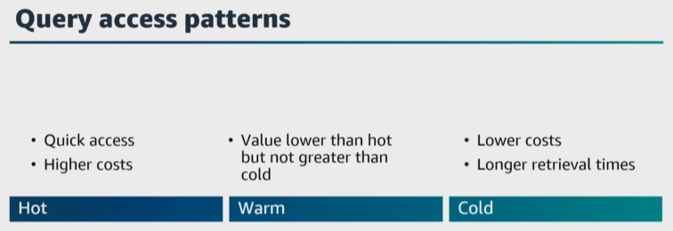
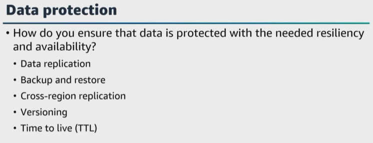
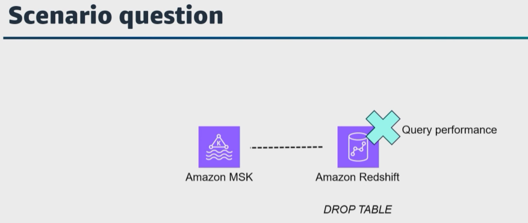
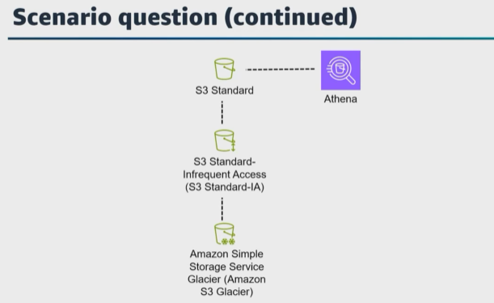

# A. Manage the lifecycle of data

- [A. Manage the lifecycle of data](#a-manage-the-lifecycle-of-data)

Let's get started with the third task statement for domain 2, which is **to manage the lifecycle of data**. In the introduction lesson for this domain, I mentioned that we have been talking about data management and its importance from the source system through the data lifecycle. 

Data management is important during the transformation stage because transformation creates new datasets that will need to be managed. As a data engineer, you need to think about the data you are storing, the data storage lifecycle, and data retention. 

Here are a few questions. How important is this data? How long should I keep this data, and how often will the data be accessed? 

|   |    |   
|---|---|

Query access patterns will differ for datasets depending on how often the data is accessed. So your storage can be broken down into three categories of needed persistence, which are hot, warm, and cold. Usually newer data is accessed more than older data. 

When you're choosing the storage and storage tier for your data, you must also include the cost of each tier storage. If all of your data is stored as hot data to ensure quick access, then this will be a higher storage cost. But if you store all of your data in cold storage, then there will be longer retrieval times, and there might be a higher retrieval cost to access that data. 

So another question to ask is, **how can you optimize your cost of storage based on the data lifecycle**? If your dataset is stored in ``Amazon S3``, you can use ``S3 lifecycle policies`` **to change the storage tier of your data stored** in ``Amazon S3``. You can also use ``S3 lifecycle policies`` **to delete data to meet business and legal requirements**. 

You can also optimize the cost of your storage based on the data lifecycle in ``Amazon Redshift``. As your data warehousing capacity and performance needs change or grow, **you can resize your cluster to use the different computing and storage options** of ``Amazon Redshift``. 

For example, you can use ``elastic resize`` **to add or remove nodes and to also change node types for your cluster**. 

And this leads us back to the data retention question we asked earlier. **What data do you need to keep and how long should you store this data**? Let's pause quickly for fundamentals because this is a great example of why you need to correctly classify your data. Data is valuable and you must know the value of the data that you are storing. Think about the data you are protecting. How is it stored, and who has access to it? Not all data is created equal, which means classifying data properly is crucial to its security. 

Another classification to consider is, **can your data be recreated**? Some regulations and compliance requirements might require you to store your data for a specified period of time, and you'll need data retention policies and archiving strategies to be able to store and search your data to meet the retention requirements. 

And this leads us to another question. How do you ensure your data is protected and has appropriate resiliency and availability? To protect your data with appropriate resiliency and availability, you can implement a combination of best practices and ``AWS services`` **designed to ensure durability, availability, and recovery in case of failures**. 

We just mentioned data replication. Ensure you know different ``AWS services`` that you can use to replicate your data across multiple Availability Zones or Regions. For example, ``Amazon S3`` **automatically replicates data across multiple Availability Zones, which ensures high availability and durability**. Also, ``Amazon RDS`` **has a multi-AZ configuration to ensure automatic failover in case of an Availability Zone failure**. 

|   |    |   
|---|---|

Protecting your data also includes backup and restores. For example, using ``AWS Backup`` or configuring automatic snapshots for your databases. Another backup and restore option is to replicate your data across Regions. ``Data protection`` can also include versioning to protect your data from accidental deletions or overrides. ``Amazon S3`` has versioning to store multiple versions of your objects. 

Here's a question. What ``AWS service`` feature **can you use to automatically delete items from a table after a specific timestamp**? ``DynamoDB`` **has a time-to-live feature to manage data with expiration dates or to help clean up old data**. 

|   |    |   
|---|---|

Here's another question. You have data that is sent to an ``Amazon Managed Streaming for Apache Kafka`` cluster to be processed and then stored in ``Amazon Redshift``. As your data is stored over time, **you start to notice issues with the query performance of the ``Amazon Redshift`` cluster**. Also, some of the maintenance tasks are taking longer to complete. Well, if your data has a fixed retention period, you can organize that data as a sequence of time series tables so that each table is identical, but contains data for different time ranges. Then, by running a drop table command on the older tables, you can remove old data. 

But you may be asking, Julie, why would I run a drop table command instead of running a large-scale delete process? 

Well, **using drop table saves you from running a subsequent vacuum process to reclaim that space**. 
> **Having smaller sets of time series table results in data being indexed and optimized for specific queries, which can help improve query times and improve the performance.** 

> Also, **creating new tables for each dataset and deleting old tables can eliminate vacuum needs and save cost and time if the tables are sorted by timestamp**. 

Here's another question. 

|   |    |   
|---|---|

Currently, you store a **large amount of CSV-formatted data from multiple different sources** and data stores in an ``Amazon S3`` bucket using the ``S3 Standard storage class``. You use ``Athena aggregate`` functions to gain insights, and a summarized view of this data. **After 6 months, the data becomes infrequently accessed**, but there is a regulatory requirement to archive and store the raw data after 2 years. How would you optimize the storage costs for this design, and which ``S3 storage class`` would you choose? 

To query this data, 
* **you could compress, partition, and transform the raw data into a columnar format using an ``AWS Glue ETL`` job**, 
* Then **query this process data using ``Athena``**. 
* I would create an ``S3 lifecycle policy`` to transfer the process data from ``S3 Standard`` storage class into ``S3 Standard-Infrequent`` Access storage class after 6 months, 
* * Then create another ``S3 lifecycle policy`` to transfer the data into ``Amazon Simple Storage Service Glacier`` or ``Amazon S3 Glacier`` after 2 years. 
