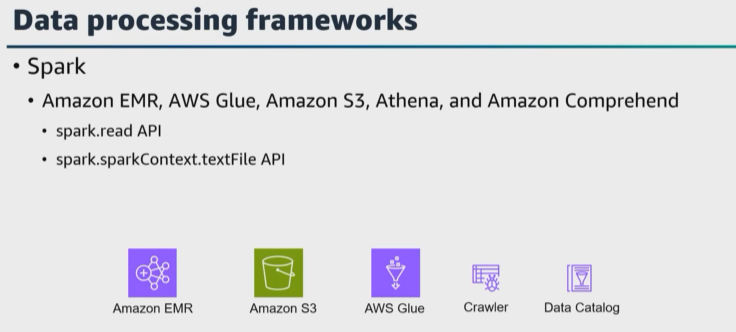
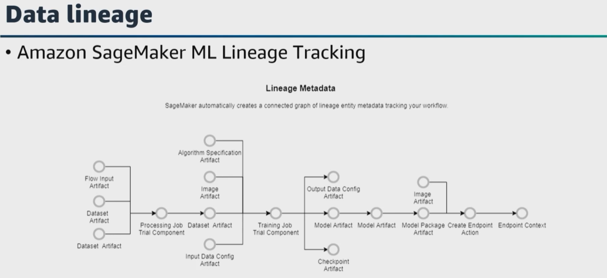
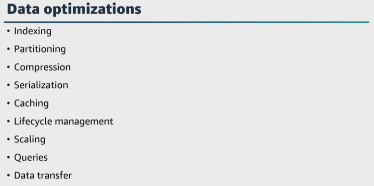
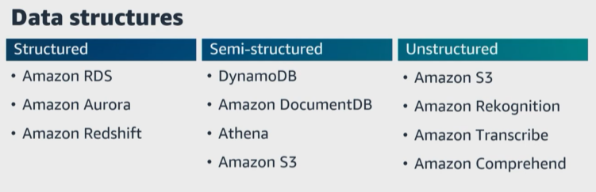
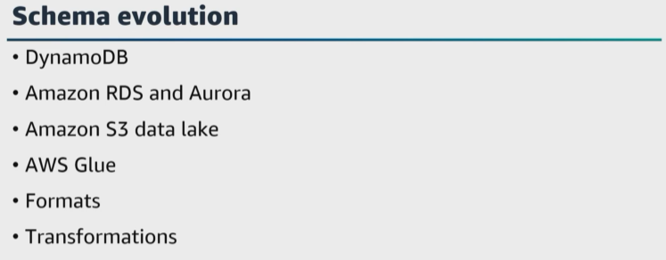
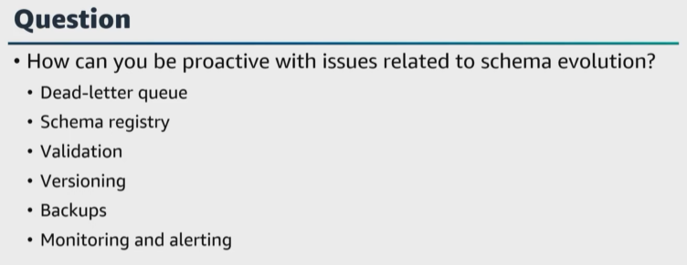
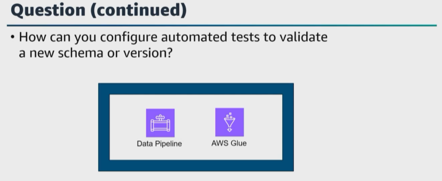

# A. Design data models and schema evolution

- [A. Design data models and schema evolution](#a-design-data-models-and-schema-evolution)
- [B. Walkthrough question 3](#b-walkthrough-question-3)
- [C. Walkthrough question 4](#c-walkthrough-question-4)
- [D. Additional resources](#d-additional-resources)

Let's get started with the fourth task statement from domain 2, which is to design data models and schema evolution. As we have said a few times already, to ensure that you can get business insights from your data, the data must be in a usable form, and the process to convert your data into a useful form is data modeling and design. 

Data engineers must understand modeling and best practices, along with the flexibility to apply the appropriate level and type of modeling to the data source for the different use cases. Here's a question. Does strict normalization work well with event data? Well, not really because these days, our data varies with different data sources and use cases. 

AWS provides services and tools to increase the flexibility of your data models while retaining logical separation, dimensions, attributes, and more. For example, ``Amazon Redshift`` supports a star schema or snowflake schema data modeling and also supports data modeling patterns, such as the ``Kimball method``. You could use and implement Inmon and data vault data modeling patterns, but it may require additional data transformation and custom solutions. 

Data engineers can gain insights from data with ``Amazon Redshift serverless`` **by importing and querying data in the data warehouse, and engineers can build schemas and tables, import data visually, and explore database objects using Query Editor version two**. 

Also, ensure that you understand ``data processing`` frameworks, such as ``Spark``. You can combine Spark with AWS services such as ``Amazon EMR, Amazon S3, and AWS Glue`` **to build data processing pipelines to handle structured and unstructured data at scale**. How does this work? 

|   |    |   
|---|---|

Well, with ``Amazon EMR``, you can launch ``Spark`` clusters on demand, process your data in parallel and scale your cluster as needed. Then with ``Amazon S3``, you can read data directly from ``Amazon S3`` into ``Spark DataFrames`` or resilient distributed datasets. 

For example, you can use ``Spark's spark.read API`` **to read structured data** or ``spark.sparkContext.textFile`` API **to read raw text data** directly from ``Amazon S3``. and then for ``AWS Glue``, you can use ``AWS Glue data crawlers`` **to automatically infer the schema of structured data** in ``Amazon S3`` and create the corresponding tables in the Data Catalog. This metadata can then be used by Spark to process the structured data. 

AWS offers other data processing and analytics service that can complement Spark and handle various data types. For example, ``Athena`` **can be used for interactive SQL queries on structured data stored in ``Amazon S3`` and ``Amazon Comprehend`` can be used for natural language processing tasks on unstructured text data**. 

Another key fundamental for data engineers is **to ensure accuracy and trustworthiness of your data** by using ``data lineage``. ``Data lineage`` **helps with error tracking, accountability, and debugging your data in the systems or pipeline that processes your data**. As data moves through the ``data lifecycle``, **you must understand what systems affect your data and what the data is composed of or transformed to as it gets passed along the pipeline**. 

For the exam, ensure that you understand how to establish ``data lineage`` for tracking the origin, transformation, and flow of data throughout its lifecycle. AWS provides tools and services to help you establish ``data lineage``, ensuring better data governance, compliance, and understanding of data flows. For example, ``Amazon SageMaker ML Lineage Tracking`` **tracks the machine learning-related ``data lineage``**. 

|   |    |   
|---|---|

Let's walk through how to use ``SageMaker ML Lineage Tracking`` to establish ``data lineage``. ``SageMaker`` **is a fully managed service that gives you the ability to build, train, and deploy machine learning models at scale**. In ``SageMaker``, you can choose **ML Lineage Tracking** by setting the appropriate configurations for your training jobs and model deployments. After **ML Lineage Tracking** is active, ``SageMaker`` **automatically tracks and captures metadata about your training data and model artifacts**. 
> **This metadata includes information about the input data, output models, hyper parameters, and other details related to your ML workflow.** 

``SageMaker ML Lineage Tracking`` also records the data processing steps and transformations applied to the training data. All of this information helps establish the lineage of the training data and ensures reproducibility. ``SageMaker ML Lineage Tracking`` **can also track model artifacts and the inference data used during prediction**. This feature helps establish lineage throughout the entire ML lifecycle. ``Amazon SageMaker ML Lineage Tracking`` **can be integrated with ``AWS Glue`` and ``Amazon S3`` to further enrich the data lineage information and capture data flows across different data sources and processes**. 

|   |    |   
|---|---|

Let's also talk about best practices for indexing, partitioning strategies, compression, and other data optimization techniques in AWS. What are indexing techniques for ``Amazon RDS``? 

> Well, **you can identify columns used frequently in WHERE clauses or join operations and create indexes on those columns to speed up data retrieval**. 

* For ``DynamoDB``, **choose the right primary key and secondary indexes to support efficient querying patterns**. For partitioning, you can use ``Amazon S3`` to store large datasets. You might partition your data into logical folders based on attributes or categories to manage and query subsets of data using ``Athena`` or ``AWS Glue``. 

* For ``Amazon Redshift``, **you can use distribution keys and sort keys to create tables to distribute data evenly across nodes** and minimize data movement during queries. 

* For your ``S3 objects``, you can use **supported compression formats***, such as **gzip or bzip2**. In ``Amazon Redshift``, **you can apply compression encoding to columns that contain repetitive or highly compressible data to optimize storage and query performance**. You can use ``data serialization`` formats, like ``Parquet`` or ``ORC`` format for data stored in ``Amazon S3``. 

* For **cached and frequently accessed data**, you can use ``ElastiCache`` or ``Amazon CloudFront`` **to reduce the load on your backend databases and speed up data access for read-intensive workloads**. 

* You can define ``data archiving`` and ``retention policies`` **to store historical or infrequently accessed data** in cost-effective storage tiers, such as ``Amazon S3 Glacier`` or ``Amazon S3 Glacier Deep Archive``. 

* For **provisioned throughput** and **auto scaling**, you can use ``DynamoDB`` **to provision read and write throughput based on your application's requirement**.  You can also use **auto scaling** to automatically adjust your capacity. 

* To optimize query performance, you can tune your queries and optimize your SQL statements with ``Amazon RDS Performance Insights`` or ``Amazon Redshift query monitoring`` to help identify and address performance bottlenecks. 

* To optimize data transfer, you can use ``DataSync or Transfer Family``, and of course, use managed services, such as ``Aurora``, ``DynamoDB`` or ``OpenSearch Service``. 

* And ensure that you are **continuously monitoring** your data storage and access patterns to identify areas for improvement and implement optimizations. 

|   |    |   
|---|---|

For the exam, ensure you know how to model structured, semi-structured and unstructured data in AWS to choose the appropriate storage and processing options to get valuable insights from different types of data. 

* For structured data, you can use `Amazon RDS`, `Aurora`, and `Amazon Redshift`. 

* For semi-structured data, you can use `DynamoDB`, `Amazon DocumentDB` with `MongoDB` compatibility, `Athena`, and `S3`. 

* For unstructured data, you can use `Amazon S3`, `Amazon Rekognition`, `Amazon Transcribe`, and `Amazon Comprehend`. 

Let's move on and talk about schema evolution techniques in AWS. Schema evolution is common with event data because fields may be added or removed. Also, value types might change, for example, a string to an integer, and these changes have impacts on your data pipeline. 

|   |    |   
|---|---|

`Schema evolution` is the process of making changes to the schema or structure of the data stored in databases or data stores while preserving existing data and ensuring backward compatibility. In `AWS`, **there are several techniques and services that support `schema evolution` to manage changes to your data schema effectively. 

* For `DynamoDB schema evolution`, **you can update your application to accommodate the new attributes or changes in the data**. `DynamoDB` will **automatically handle the new schema and the data that doesn't have the new attributes will continue to be accessible and usable**. 

* For `Amazon RDS` and `Aurora schema evolution`, the **schema evolution can be more complex compared to NoSQL databases**. A technique for `schema evolution` in `Amazon RDS` or `Aurora` **might include using the `AWS DMS` to perform schema changes with minimal downtime or using stored procedures to update data schema in a controlled manner**. 

* `Data lakes`, especially when implemented using `Amazon S3`, **often follow a schema on read approach**. This means that **data is stored in its raw untransformed form and the schema or structure is applied at the time of reading or querying the data**. 

* With `Athena` or `AWS Glue` for data processing and querying, **you can evolve the schema by adjusting the way data is interpreted during the analysis process**. You can implement `schema versioning` techniques to track and manage changes to your data schema. You **can add versioning information to your data records or metadata to understand which version of the schema each data record adheres to**. `AWS Glue` **supports schema versioning, which gives you the ability to define different versions of data structures and track changes over time**. 

* When working with **semi-structured or unstructured data**, using `columnar data formats like Avro, Parquet or ORC` can help `schema evolution`. These formats support `schema evolution` by design and **give you the ability to add, remove, or modify fields without breaking existing data**. Also, you can use `AWS Glue` for automated ETL jobs to transform data from one schema to another, and `AWS Glue` **can help manage schema changes during data movement and transformation processes**. 

Here's a question. 

|   |    |   
|---|---|

What are techniques you can use to be proactive with possible issues related to schema evolution? 

A `dead letter queue` is my first thought, but you could also use a `schema registry, validate your schema, implement schema versioning, perform backups before applying schema changes, and set up monitoring and alerting`. 

|   |    |   
|---|---|

How can you **configure automated tests to validate a new schema or version**? You can use `AWS Glue` and `AWS Data Pipeline` or `custom scripts`. `AWS Glue DataBrew` **helps you to profile and visualize your data for potential issues**. 

Performing `schema conversion` is **important also when migrating databases from one database engine to another or migrating** to `AWS`. 

The `AWS Schema Conversion Tool` **helps to convert database schemas from one database engine to another**. It is used to convert the schema and code to be compatible with the target database engine for migrations to `Amazon RDS` or `Aurora`. `AWS SCT` **performs an assessment to identify any issues in the schema and code, and then provides guidance on how to address these issues during the conversion process**. And `AWS SCT` **automates many aspects of the schema conversion, such as data type mapping, stored procedure conversions, and index conversions to streamline the migration process.** 

`AWS DMS` works **with `AWS SCT` to convert the source database schema to be compatible with the target database engine during the migration process**. `AWS DMS` **supports schema conversion for various target database engines such as `Amazon RDS, Aurora, Amazon Redshift`, and others. 

# B. Walkthrough question 3

A data engineer is working for a multinational e-commerce company. The company's online platform allows customers around the world to upload and download private data stored in Amazon S3 bucket. The bucket is in the sa-east-1 Region. The company wants to ensure latency performance around the world, particularly for users located far from the data origin location. Because of the high remote collaboration from customers, the data is modified on an hourly basis. The data engineer must optimize the application performance. The data engineer wants to reduce latency and ensure fast, secure, and private file transfers across long geographic distances. 

Which solution will meet these requirements?

Option A, use a public Amazon CloudFront distribution. Set the TTL value for 86,400 seconds, or for one day, to maximize cache hits. 
Option B, use Amazon S3 transfer acceleration and pre-signed URLs. 
Option C, use byte-range fetches on Amazon S3 
Option D, use the latest version of the AWS SDKs in the platform source code. 

Reading this question, can you identify any keywords or phrases and exactly what the question is asking? 

A few keywords I see are that customers around the world upload and download private data stored in an S3 bucket in the sa-east-1 Region, and you need to ensure latency performance around the world. The data is modified on an hourly basis and you need to optimize the application performance and choose the solution that will also reduce latency and ensure fast, secure, and private file transfers across long geographic distances. 

Now that we've examined the question, identified keywords and reviewed the requirements, let's explore the responses. 

**Option A is incorrect**. The scenario states that the **data consistently changes**, a **solution that sets a one day TTL could potentially cause data from the cache to serve outdated data from the edge locations**. Data is updated hourly, therefore, because TTL is set at one day, old data could be transferred. 

**Option B is a possible correct answer** because a solution that configures ``S3 Transfer Acceleration`` is the **most suitable for the scenario**. ``S3 Transfer Acceleration`` **can ensure fast, secure, and private file transfers across long geographic distances**. ``S3 Transfer Acceleration`` **uses the globally distributed edge locations of CloudFront**. Additionally, ``S3 Transfer Acceleration`` uses ``AWS backbone networks``. You can configure ``S3 Transfer Acceleration`` in ``Amazon S3``. Therefore, this solution is **private and is suitable to use with data that constantly changes**. This solution **effectively minimizes latency calls by distance**. Therefore, customers from various locations can experience improved upload and download speeds. A solution that uses ``S3 presigned URLs`` **would give customers the ability to interact with ``Amazon S3`` in a private way. Even though this is a possible correct answer, it is best practice to review all the answers to ensure you choose the best choice answer. 

**Option C is incorrect**. You can use **byte-range fetches** to **fetch specific portions of an object by using the range HTTP header**. This solution can improve performance by transferring only the required data. However, **this solution does not directly minimize latency caused by distance**. Additionally, **this solution does not ensure fast, secure file transfers across long geographic distances**. 

**Option D is incorrect**. A **solution that uses the latest SDKs versions is important for performance enhancements. However, this solution does not specifically address the requirement to minimize latency caused by distance**. Additionally, **this solution does not ensure fast, secure file transfers across long geographic distances, so that makes option B the correct answer**. 

# C. Walkthrough question 4

A company has an Amazon Redshift data warehouse with many large tables. The company loads new data daily. The company runs complex queries based on only the last 2 weeks of data. The company runs two complex queries quarterly that must access data for the past 6 months. The company does not need data that is over 6 months old. The company wants to optimize data storage costs. 

Which solution will meet these requirements in the most cost-effective manner?"

Option A, unload data that is older than 2 weeks daily to an Amazon S3 bucket. Delete the data from the Redshift tables. Use Amazon Redshift Spectrum for the quarterly queries. Create a lifecycle management policy to delete data from the S3 bucket after 6 months. 

Option B, unload data that is older than 2 weeks daily to an Amazon S3 bucket. Delete the data from the Redshift tables. Use Amazon Redshift Spectrum for the quarterly queries. Create a lifecycle management configuration to move the data to Amazon S3 Glacier Deep Archive after 6 months. 

Option C, transfer all the data to an Amazon S3 bucket that replaces Amazon Redshift. Use AWS Glue to catalog the data. Use Amazon Athena to query the data directly from the S3 bucket. Create a lifecycle management configuration to delete data from the S3 bucket after 6 months. 

Option D, transfer all the data to an Amazon S3 bucket that replaces Amazon Redshift. Use AWS Glue to catalog the data. Use Amazon Athena to query the data directly from the S3 bucket. Create a lifecycle management configuration to move the data to Amazon S3 Glacier Deep Archive after 6 months. 

Reading this question, can you identify any keywords and phrases, and also exactly what the question is asking? 

A few keywords I see are Redshift data warehouse with many large tables, new data is loaded daily, runs complex queries based on only the last 2 weeks of data, but the company runs two complex queries quarterly that must access data for the past 6 months, then data that is over 6 months old is no longer needed. You need to choose the answer that will optimize data storage cost and is the most cost effective. 

**Option A is a possible correct answer** because **you can unload older, infrequently queried data** from ``Amazon Redshift`` to ``Amazon S3`` **to reduce data storage costs**. You can use ``Redshift Spectrum`` **to run complex queries directly on the data** in the ``S3 bucket``. You can use **a lifecycle management configuration to delete data that is no longer needed**. Even though this is a possible correct answer, it is best practice to review all the answers to ensure you choose your best choice answer. 

**Option B is incorrect**. You can unload older infrequently queried data from ``Amazon Redshift`` to ``Amazon S3`` to reduce data storage costs. You can use ``Redshift Spectrum`` **to run complex queries directly on the data** in the ``S3 bucket``. However, in this scenario, the company does not need the data after 6 months. Therefore, you can delete the data. **You do not need to transfer the data to S3 Glacier Deep Archive and incur storage costs.** 

**Option C is incorrect**. You can store the data in ``Amazon S3`` instead of ``Amazon Redshift``. A solution that catalogs the data with AWS Glue can reduce storage costs. A solution that uses lifecycle management configuration to delete unneeded data can reduce additional storage costs. However, Athena runs simple interactive queries. ``Amazon Redshift`` **would be a more effective solution to run complex queries**. 

**Option D is incorrect**. You can store the data in ``Amazon S3`` instead of ``Amazon` Redshift``. A **solution that catalogs the data with ``AWS Glue`` can reduce storage costs**. However, ``Athena`` runs **simple interactive queries**. ``Amazon Redshift`` **would be a more effective solution to run complex queries**. Additionally, in this scenario, the company does not need the data after 6 months. Therefore, you can delete the data. You do not need to transfer the data to S3 Glacier Deep Archive and incur storage costs. 

Now that we've examined the question, identified keywords, and reviewed the requirements, let's explore the responses. 

# D. Additional resources

* [What Is Cloud Storage?](https://aws.amazon.com/what-is/cloud-storage/#:~:text=a%20massive%20scale.-,What%20are%20the%20types%20of%20cloud%20storage%3F,has%20its%20own%20use%20cases.)

* [Storage Best Practices for Data and Analytics Applications](https://docs.aws.amazon.com/whitepapers/latest/building-data-lakes/building-data-lake-aws.html)

* [Amazon S3 Tutorials](https://docs.aws.amazon.com/AmazonS3/latest/userguide/tutorials.html)

* [Storage Options for Your Amazon EC2 Instances](https://docs.aws.amazon.com/AWSEC2/latest/UserGuide/Storage.html)

* [Implementing Microservices on AWS](https://docs.aws.amazon.com/AWSEC2/latest/UserGuide/Storage.html)

* [Data Store](https://docs.aws.amazon.com/whitepapers/latest/microservices-on-aws/data-store.html)

* [What Is Amazon Redshift?](https://docs.aws.amazon.com/redshift/latest/mgmt/welcome.html)

* [Working with Query Editor v2](https://docs.aws.amazon.com/redshift/latest/mgmt/query-editor-v2-using.html)

* [S3DistCp (s3-dist-cp)](https://docs.aws.amazon.com/emr/latest/ReleaseGuide/UsingEMR_s3distcp.html)

* [AWS Glue Data Catalog](https://docs.aws.amazon.com/prescriptive-guidance/latest/serverless-etl-aws-glue/aws-glue-data-catalog.html)

* [Catalog and Search](https://docs.aws.amazon.com/whitepapers/latest/building-data-lakes/data-cataloging.html)