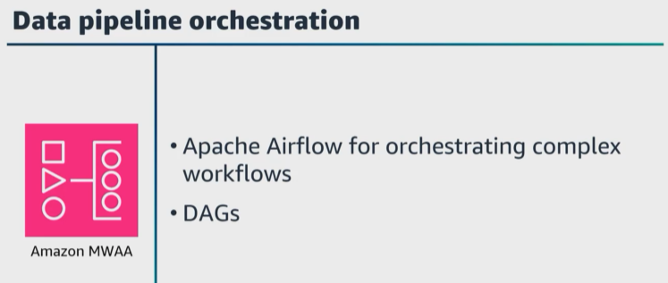
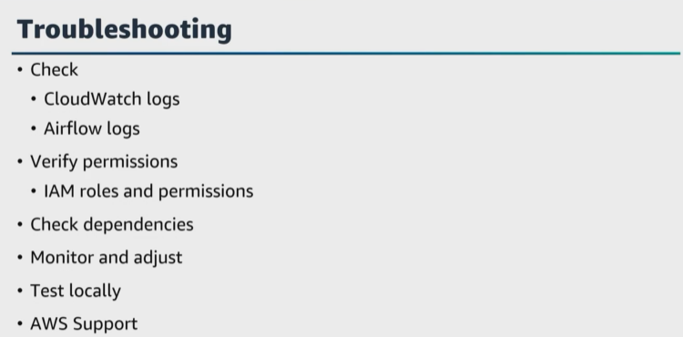
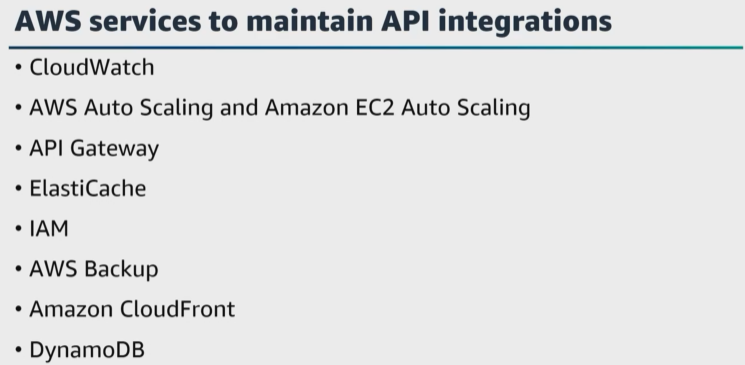

# A. Automate data processing by using AWS services

- [A. Automate data processing by using AWS services](#a-automate-data-processing-by-using-aws-services)

Let's get started with the first task statement from domain 3, which is to automate data processing by using AWS services. Data operations include your data and your systems and monitoring and automated alerts for changes and anomalies. 

|   |    |   
|---|---|

One of the benefits of running workloads in AWS is the ability to automate all aspects of the infrastructure deployment. With ``CloudFormation``, you can create a template file for building the infrastructure to support your data pipeline. For example, your ``CloudFormation`` template could create an ``S3`` bucket. You can add an ``EventBridge`` rule to the template to monitor the files being written to your ``S3`` bucket that runs a ``Lambda function`` when a new file is written to your bucket and you can add an ``Amazon SNS`` topic to the template to send notifications. 

Also, you can add another ``Lambda function`` to the template to validate the new files are received, and then that launches a Step Function state machine. And then the state machine launches an ``AWS Glue`` job to process the file, which then runs an ``AWS Glue`` crawler to update the data catalog. And again, you can use ``Amazon SNS`` to send notifications of any failures, and then this template can be stored in ``Amazon S3`` or ``CodeCommit`` to manage access changes, versions and more. 

|   |    |   
|---|---|

For **continuous integration** and to automate the whole pipeline, you can use ``CodePipeline``. For example, when a new Python file is committed to the source repository, which is ``CodeCommit``, you can use ``CodeBuild`` to automatically build and integrate the newly committed code into the existing code. Also, at this stage, unit tests can be run to test your code quality and ensure that the specific function returns the expected output. This gives you continuous delivery to automatically deploy code changes with additional automated end-to-end testing, such as ingesting files, running transformation pipelines, and validating the output files. 

|   |    |   
|---|---|

Let's talk about orchestrating data pipelines with ``Amazon MWAA`` and ``Step Functions``. ``Amazon MWAA`` **is a managed service that provides ``Apache Airflow``, which is an open-source platform for orchestrating complex workflows**. With ``Amazon MWAA``, **you can create, schedule, and monitor ``data pipelines`` using the ``Apache Airflow workflow`` management capabilities**. 

We mentioned this in an earlier lesson, but ``Apache Airflow`` gives you the ability to define ``DAGs`` to represent your data workflows. Each ``DAG`` represents a series of tasks with dependencies, and these tasks can be ``Spark`` jobs, ``AWS Glue`` jobs, ``AWS Batch`` jobs, or any other tasks that needs to be executed as part of the pipeline. By using ``MWAA``, you can deploy and scale ``Apache Airflow clusters`` and simplify the process of setting up and maintaining ``Apache Airflow``. 

|   |    |   
|---|---|

``Step Functions`` is a fully managed service that helps you coordinate and visualize distributed applications and microservices as workflows. It gives you the ability to build serverless workflows that integrate various ``AWS services`` and custom application logic. We've already talked about this several times, but with ``Step Functions``, you can define state machines to represent your data pipelines. A ``state machine`` **consists of a series of states where each state can execute a task, make decisions, or wait for events**. These states can be initiated by ``Lambda functions``, ``AWS Glue`` jobs, ``Amazon EMR`` clusters, or other ``AWS services`` as part of the pipeline. ``Step Functions`` **also has built-in error handling, retry mechanisms and the ability to visualize the workflow to monitor and debug your pipelines**. 

|   |    |   
|---|---|

``Amazon MWAA`` is useful when **you need a more flexible and code-based approach to define complex data workflows**. ``Step Functions`` **is useful in creating serverless event-driven workflows that integrate with other ``AWS services``**. 

|   |    |   
|---|---|

Before we move on, let's pause here and talk about troubleshooting ``Amazon Managed Workflows``. And step back to the example we were just talking about, ``Amazon MWAA``. 
* **Troubleshooting** involved **identifying and resolving issues that might or do arise during the setup, deployment, and execution of your data workflows**. And back to fundamentals, there are always recommended troubleshooting steps to use. 
  * I would check ``CloudWatch Logs`` to identify any error messages or exceptions generated during the execution of your ``Apache Airflow DAGs``. 
  * Also, I would review the ``Apache Airflow logs`` because ``Apache Airflow`` generates its own logs for task execution and other internal processes. 
  
* Next, I would verify ``IAM roles and permissions`` to ensure that the ``IAM`` roles and permissions associated with ``MWAA``, your ``DAGs`` in any related ``AWS services`` such as ``AWS Glue``, ``Amazon S3``, ``Amazon EMR`` and more are correctly configured. 

* Next, I would check ``dependencies and file references`` to verify your ``DAGs`` and ``Python scripts`` have the needed dependencies installed and that the file references within your ``DAGs`` are accurate. If your ``DAGs`` rely on external services, ``APIs``, or ``databases``, verify that those dependencies are functioning correctly and are accessible from your ``MWAA`` environment. 

It is also important to monitor and adjust **resources allocated** to your ``MWAA`` environment, such as the number and size of worker nodes. If your workflows are resource-intensive, you might need to adjust the resources to prevent out-of-memory issues or other resource-related errors. 

I would also test ``DAGs`` locally on my development machine or in a test environment before deploying a ``DAG`` to ``MWAA`` and ensure that you are using the latest version of ``Apache Airflow`` and any relevant plugins. And of course, use AWS Support to help you troubleshoot and diagnose more challenging problems. 

|   |    |   
|---|---|

We just mentioned external dependencies and for the exam, ensure that you understand how to consume and manage data APIs. What are A``WS services`` you can use to consume and manage data APIs? 

* You can use ``Lambda`` **to create serverless functions that make ``API`` requests and process the responses**. These functions can be initiated by events or by ``API Gateway``. 

* ``API Gateway`` provides a secure, scalable, and managed API endpoint that you can expose to external clients. You can also configure ``API Gateway`` to act as your frontend to your ``Lambda function``s or other backend services. 

* The ``AWS SDKs`` can be used with multiple programming languages to interact with external APIs from within your ``AWS application`` code. The ``AWS SDK`` handles the details of authentication, signing requests, and parsing responses. Maintaining data API integrations ensures reliability, performance, and security of your applications over time. 

|   |    |   
|---|---|

Let's cover a few best practices in ``AWS services`` that can help. 

* Set up monitoring and logging for your ``API requests`` and ``Lambda functions`` using ``CloudWatch``. Monitor error rates, latency and other performance metrics to detect issues and bottlenecks. 

* Configure **Auto Scaling** for your ``Lambda function``s or backend resources to handle varying API request loads automatically. 

* Implement **caching strategies** using ``API Gateway`` caching, or ``ElastiCache`` to reduce the load on your backend systems and improve response times. 

* Use **throttling** and **rate-limiting** features in ``API Gateway`` to prevent abuse and ensure fair usage of your API resources. 

* Implement **error-handling** in your ``Lambda functions`` to handle API failures and provide meaningful error messages to clients. 

* Secure your ``API integrations`` using **authentication** and **authorization** mechanisms such as ``IAM`` and ``OAuth``. 

* Implement **data backup** and **disaster recover strategies** for the backend systems that integrate with your ``API`` and backup your ``Lambda function`` code and configurations too. 

* API versioning can help to manage changes to your API over time while maintaining backward compatibility. 

* And continuously **monitor and optimize the performance of your API** integrations with ``CloudFront`` for content delivery, ``DynamoDB`` for NoSQL data storage and ``Lambda layers`` to manage dependencies and reduce function package sizes. 

|   |    |   
|---|---|

Let's move on and talk about using the features of AWS services to process data. What are a few AWS services that can help? Well, we've mentioned these several times already, but they are ``Amazon EMR``, ``Amazon Redshift``, and ``AWS Glue``. 

We also just talked about using ``Lambda`` to automate data processing, and we also mentioned in an earlier lesson that you can use ``AWS Glue`` to help prepare data transformation. We also covered querying data using ``Athena``. 

What is a use case for using Athena to query your data? A scenario might be where you want to perform quick ``data exploration`` and ``analysis`` without the need for infrastructure set up, or you want to pay only for the queries you run. When you run SQL queries, using the Query Editor in the ``Athena`` console, **you can write standard SQL statements to filter, aggregate, join, and analyze your data**. Then after running a query, ``Athena`` will display the query results in the console. You can download the results or save them to ``Amazon S3`` for further analysis or visualization. 

|   |    |   
|---|---|

Another part of this task statement is managing events and schedulers. At the beginning of this lesson, we mentioned ``EventBridge``. Using ``EventBridge``, you can implement event-driven architectures and automate processes in your AWS environment. Managing events and schedules is important for automating tasks, workflows, and processes in AWS. You can create event rules that match incoming events based on a predefined patterns. These patterns can be based on event attributes, custom event buses, or other conditions. When an event matches a rule, ``EventBridge`` routes the event to one or more targets for further processing. ``EventBridge`` integrates with ``CloudWatch`` **to monitor rule and target activity through ``CloudWatch`` metrics and set up alarms based on event patterns**. 

You can also use ``pop`` to log API calls for ``EventBridge``. Also, the ``EventBridge`` schema registry is an optional feature that helps you to define and manage event schemas. So long story short
>>  ``EventBridge`` **can help you to monitor events, alert, remediate, and respond**. 

|   |    |   
|---|---|

Let's walk through an example of orchestrating a ``data pipeline`` to demonstrate everything that we've learned so far in this course. 

Let's say that your orchestrating a data pipeline using a ``Step Function``. For the state machine, we are going to start with the ``Lambda function``. This ``Lambda function`` will check the extension of an incoming file to determine the type of file. After the type of file is determined, we will pass that information to the next step, which is a **choice state**. If the file is a type that is supported, then we will call another ``Lambda function`` to process that file and end the **state machine** with the success status. If the file type is not supported, then we will send out a notification to report on that failure to process the file. 

If you try this in your own ``AWS account``, please let me know and share your success. If you struggle with this, please reach out. I have a step-by-step guide that can help. 

|   |    |   
|---|---|

But before you create your ``Step Function``, first you need to create the ``Lambda function`` to check the file extension. Second, you create a second ``Lambda function`` that will process the file with the identified file type. Third, create an ``Amazon SNS`` topic and subscribe your email to that topic. Fourth, create a new ``Step Function`` state machine with the components you created so far. So that would be the two ``Lambda functions`` and the ``Amazon SNS`` topic. 

The fifth step is a great check on your depth and understanding of AWS services. ``CloudTrail logs`` activities performed in your AWS account in near real time. But ``object-level data events are not logged by CloudTrail by default``. So the fifth step is to configure your ``S3`` bucket **to generate ``CloudTrail`` data events**. You'll have to create a ``CloudTrail trail`` to log both management and data events. 

The sixth step is what I wanna focus on, and that is the management of events in Scheduler. So this sixth step is to create an ``EventBridge`` rule to initiate your ``Step Function state machine``. With ``EventBridge``, you can create a rule, define a pattern, select a service, which for our example is ``Amazon S3``. Select specific operations. Add your specific bucket and select the target, which for our example would be the ``Step Function`` state machine. 
