# A. Analyze data by using AWS services

- [A. Analyze data by using AWS services](#a-analyze-data-by-using-aws-services)
Let's get started with the second task statement from domain 3, which is to analyze data by using AWS services. 

So far in this course, we have focused on building the data lifecycle, and AWS services to ingest, store, and transform the data. In this lesson, we will talk about AWS services to help data consumers analyze and view the data. 

For the exam, ensure that you understand data manipulation operations that are used in data analysis and reporting such as data aggregation, rolling average, grouping, and pivoting. 

| 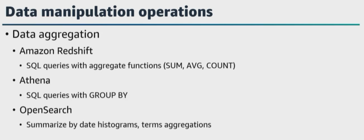  |    |   
|---|---|

Let's start with data aggregation, which involves summarizing or combining data from multiple records into a single value. You can use ``Amazon Redshift``, ``Athena``, and ``Amazon OpenSearch`` Service **for data aggregation**. 

* Using ``Amazon Redshift`` you can use SQL queries with aggregated functions, such as **sum, average, count**, to perform data aggregation on large datasets stored in an ``Amazon Redshift`` data warehouse. 

* With ``Athena``, you can run SQL queries on data stored in ``Amazon S3`` and use GROUP BY and aggregate functions to perform data aggregation, and ``Amazon OpenSearch`` Service **provides powerful aggregation capabilities to summarize data based on different criteria such as date histograms, term aggregations, and more**. 

| 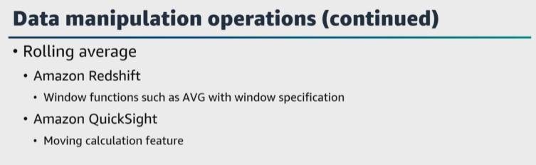  |    |   
|---|---|

* A ``rolling average`` **calculates the average set of a values within a specified window or period**. It is useful for smoothing out fluctuations in data. You can use ``Amazon Redshift`` and ``Amazon QuickSight`` to support rolling averages. Using ``Amazon Redshift``, **you can use window functions like average with an appropriate window specification to calculate rolling averages** in ``Amazon Redshift``, and with ``QuickSight``, **it provides built-in support for calculating rolling averages in visualizations through the moving calculation features**. 

| 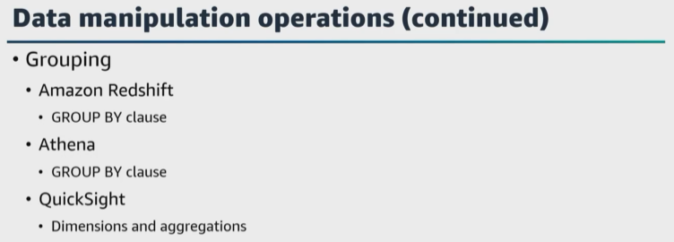  |    |   
|---|---|

**Grouping involves** grouping data based on specific attributes or fields. This operation is commonly used in combination with data aggregation, ``Amazon Redshift``, ``Athena``, and ``QuickSight`` support grouping. Using ``Amazon Redshift``, you can use GROUP BY clause in your SQL queries to group data. ``Athena`` supports GROUP BY clause for data grouping and in ``QuickSight`` you can group data in visualizations using dimensions and aggregations. 

| 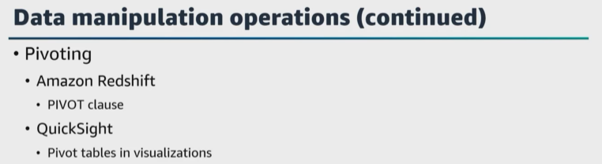  |    |   
|---|---|

**Pivoting** involves **transforming data from rows into columns**. This **operation can be useful for reshaping data for reporting purposes**. ``Amazon Redshift`` and ``QuickSight`` support pivoting, in ``Amazon Redshift`` you can use the PIVOT clause along with aggregate functions in SQL queries to pivot data, and ``QuickSight`` gives you the ability to create pivot tables and visualizations to present data in a pivoted format. 

These are just a few examples of data manipulation operations that can be performed in AWS for data analysis and reporting. What are some AWS services to help data consumers analyze and view data? 

We just mentioned a few and have mentioned some of these already, but I do wanna mention them again for this task statement. 

* ``QuickSight`` gives you the ability to create interactive dashboards and perform ad hoc data analysis, and 
  
* ``AWS Glue DataBrew`` is a visual data preparation tool that helps clean and normalize data for analysis without writing code. 

* ``Athena`` gives you the ability to run interactive SQL queries directly on data that's stored in ``Amazon S3``. 

* ``Amazon Redshift`` gives you the ability to analyze large datasets using standard SQL queries. 
  
* ``Amazon EMR`` gives you the ability to process large amounts of data using popular frameworks such as ``Spark`` and ``Hadoop``. 

* ``AWS Glue`` gives you the ability to discover, catalog, and transform data for analysis. It can automatically generate ETL code to move and transform data between different data stores. 

* ``AWS Data Pipeline`` is a service for orchestrating and automating the movement and transformation of data between different AWS services and on-premises data sources. 

* ``Lake Formation`` gives data consumers the ability to access and analyze data from multiple sources stored in a data lake securely. 

Here is a question, 

| 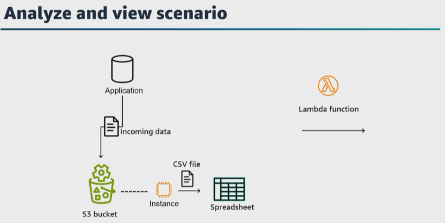  |    |   
|---|---|

let's say that you have data that is sent to an S3 bucket. Currently, you run a script on an ``EC2 instance`` every 8 hours to extract the data from ``Amazon S3``, **clean it, and convert it into CSV files**. Then the data is analyzed in a spreadsheet form. How can you update this design **to visualize the data on a dashboard and add a search feature**? 

| 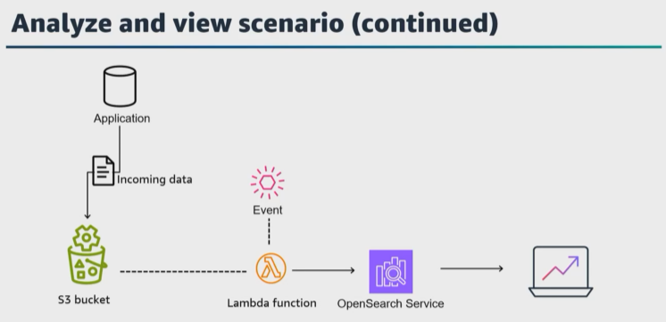  |    |   
|---|---|

Well, one solution would be to move your script to a ``Lambda function`` and configure the results to be sent to an ``Amazon OpenSearch`` cluster. You can use ``EventBridge`` to initiate the function to run every 8 hours. ``Amazon OpenSearch`` provides a dashboard and gives you the ability to perform log analytics, real-time monitoring search and more. 

| 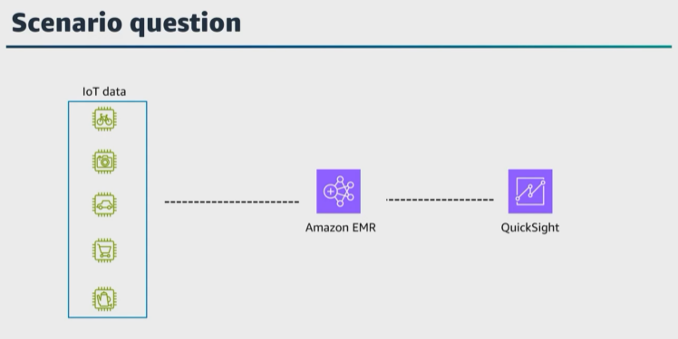  |    |   
|---|---|

Here's another question. 

You need to create **a cost-effective solution** to ingest sensor data from IoT sensors and provide a visual report every day. I added cost-effective to this question because ``Amazon EMR`` has two types of clusters, **transient** and **persistent**. You could create a **transient cluster** to quickly and cost effectively perform data transformation workloads to sort, aggregate and join on large datasets. The **transient cluster** could aggregate the data each night, and then after completion, the **transient cluster** can be automatically terminated. Then you could use ``QuickSight`` to provide the visual report. 

| 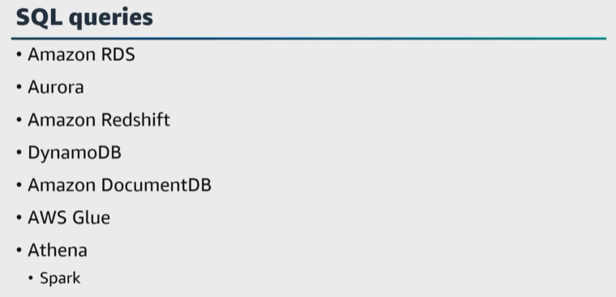  |    |   
|---|---|

Let's also talk about how to run SQL queries on ``AWS database services`` such as ``Amazon RDS``, ``Amazon Redshift``, ``Athena``, and more. 

> **Each of these services run SQL queries differently, but the SQL syntax remains consistent across the services.** 

Let's start with ``Amazon RDS`` and ``Aurora``. You can use SQL to manage the structure and data in your relational databases. For example, you can use SQL queries to create, read, update, and delete data. 

``DynamoDB`` supports ``PartiQL``, which is an open-source, SQL-compatible query language to query data, regardless of where or in what format it is stored. ``PartiQL`` helps to process structured data from relational databases, semi-structured and nested data in open data formats, and even schemaless data in NoSQL or document databases that allow different attributes for different rows.

``Amazon DocumentDB`` is a fully managed NoSQL database service that is compatible with MongoDB. 

You can use SQL-like queries in ``Amazon DocumentDB`` to interact with your data. 

With ``AWS Glue``, you have the ability to use SQL-like transformations to prepare and clean your data before loading it into target databases. 

``Athena`` gives you the ability to use SQL to query your data stored in ``Amazon S3`` an S3 data lake, and other databases too in formats such as CSV, Parquet, or JSON. 

| 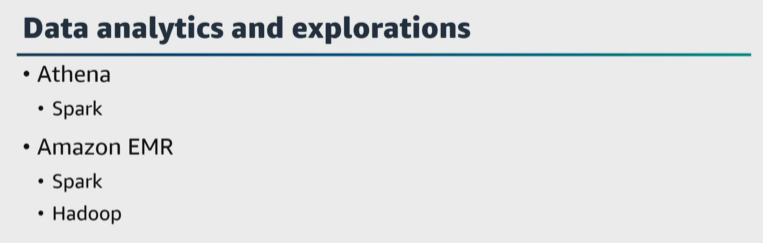  |    |   
|---|---|

Before we move on, let's dive deeper into data analytics and exploration in ``Athena`` using ``Spark``. 

To run ``Spark`` applications on ``Athena``, 
    * you can add ``Spark`` code to process and receive the results. 
    * You can also develop ``Spark`` applications using ``Python`` or ``Athena`` notebook APIs. You can set up an ``Amazon EMR`` cluster with ``Spark``, load your data from ``Amazon S3`` or other sources, and use the ``Spark`` capabilities to explore and analyze the data interactively. 

``Amazon EMR`` provides a Jupyter Notebook interface to write and execute ``Spark`` code to help perform data exploration task. 

| 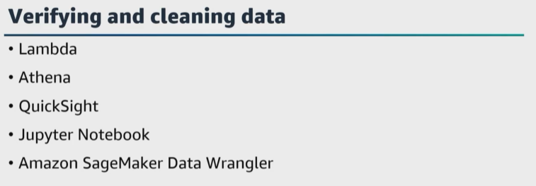  |    |   
|---|---|

Since we just mentioned ``Jupyter Notebooks``, let's also talk about verify and cleaning data in AWS. What AWS services are available? A few are Lambda, ``Athena``, ``QuickSight``, ``Jupyter Notebooks``, and Amazon ``SageMaker Data Wrangler``. 

To ensure accuracy and reliability of the insights from your data, ensure that you know how to verify and clean your data in the data analysis process. AWS provides services that can be used for data verification and cleaning, each serving different purposes. 

| 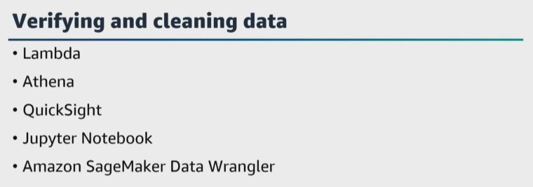  |    |   
|---|---|

For data verification and cleaning tasks, you might use multiple different services to meet requirements in your data analysis workflow. 

For example, you might use 
* ``Lambda`` for custom data validation and enrichment, 
* ``Athena`` for SQL-based data verification, 
* ``QuickSight`` for data visualization and exploration, 
* ``Jupyter Notebooks`` for more complex data cleaning task and 
* ``SageMaker Data Wrangler`` for data preparation for machine learning models. 
