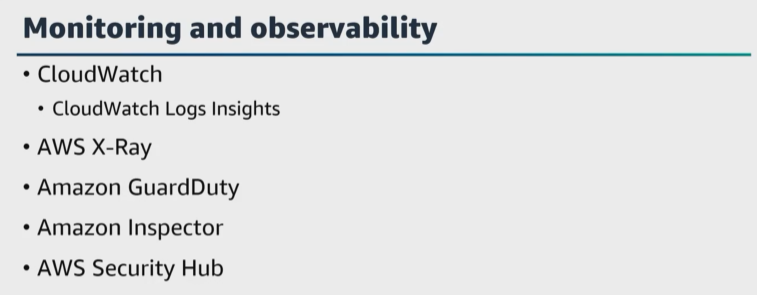
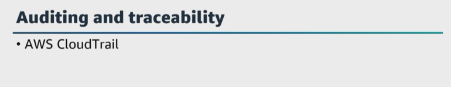
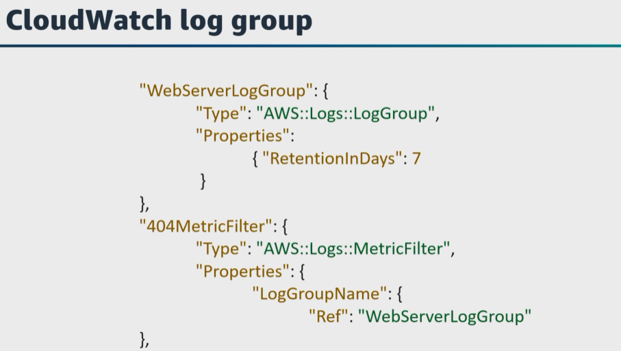
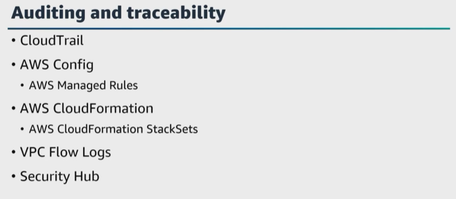
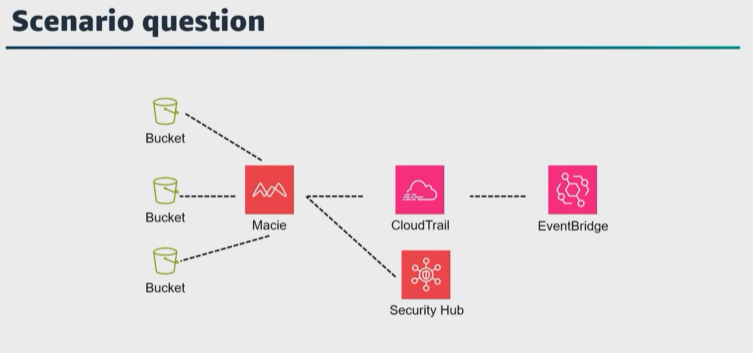
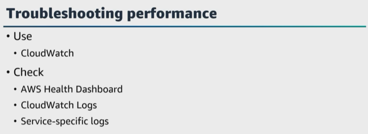
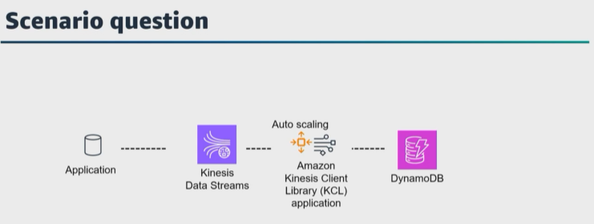
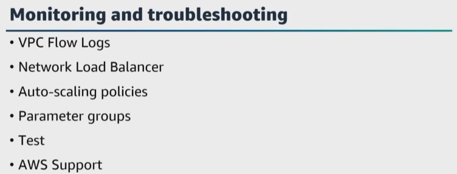
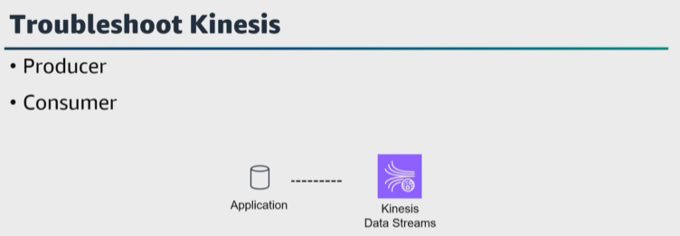

# A. Maintain and monitor data pipelines
-[A. Maintain and monitor data pipelines](#a-maintain-and-monitor-data-pipelines)

Let's get started with a third task statement from domain 3, maintain and monitor data pipelines. **Monitoring is an important part of maintaining the reliability, availability, and performance of the data pipeline lifecycle, but you also have to ensure observability**. 

Here are a few questions to consider for the data side of your pipeline. When you query your data, how do you ensure that the inputs and outputs are correct? If your query is safe to a table, how do you know the schema is correct? Why should you run data quality tests on the input datasets and the transformation dataset? Well, if there is a data quality issue in the transformation stage, you need to have the ability to flag any issues, roll back changes, and investigate root causes. 

What is a question for the operations part of your data pipeline? Well, my first thought is how do you ensure that your systems are performing? What metrics should you be monitoring? A few metrics are query queue length, query concurrency, memory usage, storage utilization, network latency, and disk input outputs. If you have poor performing queries, then those can be refactored or tuned. If your queries are performing well, then you might need to tune the database. 

|   |    |   
|---|---|

For example, you could cluster or cache a table for faster lookup performance, or maybe you need to scale up your compute resources. **AWS provides monitoring and observability services and tools that you can use to monitor, report, and take action automatically when appropriate to remediate**. 

For example, ``CloudWatch, AWS X-Ray, CloudWatch Logs Insights, Amazon GuardDuty, Amazon Inspector, AWS Security Hub``, and more. 

To make your application observable, it must be instrumented to share traces, metrics, and logs to understand the raw data collected, gain insights from it, and add more visibility. 

Let's start off and talk about how to log data to ensure that we have the needed data to monitor and take actions. What AWS services are available to log application data to monitor and troubleshoot your applications in AWS? We've already talked about how CloudWatch can help to monitor your resources and the applications you run on AWS. You can use CloudWatch to collect and track metrics. 

* ``CloudWatch Logs`` **gives you the ability to monitor, store, and access your log files and notify you when certain thresholds are met**. 

* ``CloudWatch Events`` delivers a **near real-time stream** of system events and gives you the ability to write rules that watch for certain events and initiate automated actions in other ``AWS services`` when these events occur. 

* ``EventBridge`` **helps connect applications together using data from your own applications, integrated software as a service, or SaaS, applications, and AWS services**. ``EventBridge`` `**delivers a stream of real-time data from event sources and routes that data to targets** such as ``Lambda``. You can set up routing rules to determine where to send your data to build application architectures that react in real time to all of your data sources. 

* ``X-Ray`` **can provide end-to-end tracing and analysis if you have large-scale applications with distributed architecture and microservices**. ``X-Ray`` **can help to visualize and understand the interactions between components of your application and can be valuable for performance optimization and issue resolution**. 
  
* ``Lambda`` **automatically logs each invocation of your Lambda functions**. You can also add custom log statements to your Lambda functions using programming languages. 

* If your application is behind an application ``load balancer``, ***you can use access logs to capture detailed information about each request, such as the request time, client IP, user agent, and more**. 

* For ``Amazon RDS`` databases, you can use different log types such as error logs, slow query logs, and general logs to capture and monitor database-related activities and errors. And to ensure auditing and traceability in AWS, you can deploy logging and monitoring solutions that capture and analyze activities and events across your infrastructure and services. 

|   |    |   
|---|---|

What AWS services are available to ensure traceability? ``CloudTrail`` **records all API calls made in your AWS account**. It provides an **audit trail of events such as creating or modifying resources to help you understand who did what and when**. ``CloudTrail`` logs can be sent to ``Amazon S3`` or ``CloudWatch Logs`` where you can set up alerts, analyze and retain them for compliance and auditing purposes. And to ensure the accuracy and reliability of the data for traceability and audits, it is important to verify and clean your data. 

We mentioned this in our last lesson. AWS provides services for data verification and cleaning, such as ``Lambda, Athena, QuickSight, Jupyter Notebooks, and SageMaker Data Wrangler``. Let's pause here and talk about how to configure CloudWatch Logs to log application data and how to add automation. 

|   |    |   
|---|---|

When you create a **log group, it is a container for log streams and it helps you organize and control access to your logs**. You can also automate the configurations of ``CloudWatch Logs`` using ``CloudFormation``. 

* ``CloudFormation`` helps you define your infrastructure as code, including log groups, log streams, and log configurations to manage and reproduce your logging setup or using ``EventBridge`` like we just mentioned. **By default, log data in CloudWatch Logs is retained indefinitely**. You can configure log retention policies to specify how long you wanna retain that data. This helps you to manage costs and comply with data retention requirements. 

|   |    |   
|---|---|

Let's jump back to our AWS services for traceability. 

* ``AWS Config`` is **a service that records the configuration changes made to your AWS resources**. It provides a detailed view of the historical configuration for resources and can be used for compliance, auditing, and change management. 
  
* ``AWS Managed Rules`` **are predefined rules** for ``AWS Config`` **that help you evaluate whether your AWS resources comply with best practices and help to ensure security and compliance**. 

* ``AWS CloudFormation`` stack sets can be used **to deploy and manage ``CloudTrail, CloudWatch, and AWS Config`` configurations consistently across multiple AWS accounts and Regions. 

* ``VPC Flow Logs`` **capture information about the IP traffic going to and from network interfaces in your Amazon VPC**. This helps monitor and troubleshoot network traffic for security and compliance audits. 

* ``Security Hub`` **provides a view of security alerts and compliance status across your AWS environment**. It consolidates findings from multiple AWS services, such as ``GuardDuty, Amazon Inspector, and AWS Config`` into a single dashboard for added visibility. 

And for **automation**, you **can set up ``Lambda`` functions initiated by an event to perform custom actions when specific events occur`**. This can help automate responses to certain events and improve traceability because you can perform custom log analysis and take automated actions based on log patterns. 

Let's pause here because analyzing logs is essential for gaining insights into application behavior, identifying issues, and improving system performance, and we have mentioned a lot of these services already, especially in the last lesson. I will not repeat myself, but you can go back to the last lesson if needed. 

|   |    |   
|---|---|

Here is a question. 

You are using ``Macie`` **to help manage the security of your S3 data**. Currently, ``Macie`` **provides you with an inventory of your S3 buckets and automatically evaluates and monitors the buckets** for security and access control. If ``Macie`` **detects a potential issue with the security or privacy of your data, such as a bucket that becomes publicly accessible, ``Macie`` generates a finding for you to review and remediate as necessary. How would you design an automatic remediation of any public S3 buckets that ``Macie`` finds? 

Would you create an action from the logs sent to ``CloudWatch Logs, EventBridge or use CloudTrail``? 

Well, 
* ``Macie integrates with CloudTrail`` and automatically pushes policy and sensitive data findings to ``EventBridge`` as events. 
* And if you can configure the publication settings, ``Macie can also push findings to Security Hub``. 
* It **currently does not send logs to CloudWatch Logs**. 
* If you integrate ``AWS user notifications`` with ``Macie``, **you can also use ``EventBridge events`` to automatically generate notifications too**. 

> **All of these services help to detect security incidents, track changes, maintain compliance, and troubleshoot issues quickly.**

|   |    |   
|---|---|

Let's walk through a best practice approach to ensure that you can troubleshoot performance issues. 

* Use ``CloudWatch`` **or other monitoring tools to track key performance metrics** such as CPU utilization, memory usage, network traffic, disk input outputs, and database performance. Establish baseline metrics and compare them to the current performance to identify anomalies. Before diving into troubleshooting your application, ensure that AWS services your application relies on are not experiencing any service disruptions or performance degradation by checking the ``AWS Health dashboard``. 

* Analyze your **application logs** to identify any error messages, exceptions, or warnings. 
  
* Use ``CloudWatch Logs`` **to collect, store, and analyze your application logs``. 
  
* Look for **any patterns that might indicate performance bottlenecks**. 
  
* If your application uses ``AWS services`` such as ``Lambda, Amazon RDS, or Amazon EC2``, **check the service-specific logs to find any potential issues related to resource usage, errors, or timeouts.** 

Here's a question. 

|   |    |   
|---|---|

You are asked to troubleshoot an application **that has increased latency during peak hours**. The application is using ``Kinesis Data Streams`` to log data. To handle any increases in the traffic, you provision the ``data stream with 40 shards`` to ensure high data throughput. You have also configured a ``KCL`` application hosted in an auto scaling group to consume the stream, analyze the data, and store the results in an ``Amazon DynamoDB`` table. What is your approach to troubleshoot and resolve the high latency? 

Your 

* **First** step is to check ``CloudWatch`` to see what is the **average CPU utilization** of the instances during peak hours. You verified that **the average CPU utilization for the instances in your auto scaling group is less than 35 percent**. 
* Also, there are no logs for provision throughput exceeded exception errors for the ``Kinesis Data Stream``. 
* So **the logs or lack of logs verify that the data stream and the instances are able to handle the load during peak hours**. 
* So the other component of the application is the ``DynamoDB`` table. I would check **the provisioned write capacity and increase that write throughput capacity**. 

|   |    |   
|---|---|

It is **also important to monitor and visualize the network traffic patterns between different components of your application**. High network latency or packet loss can cause performance issues. 

* ``VPC Flow Logs`` and ``Network Load Balancer`` **access logs can help provide insights into network performance**. 

* If you are using ``auto scaling``, **ensure that the scaling policies are correctly configured based on the demand patterns of your application**, and then adjust auto scaling parameters as needed. 

Here's a question. 

You need to optimize your queries and avoid latency in your ``Amazon Redshift cluster`` that has a long running query. **How can you ensure that your short running queries are not impacted**? 

Well, 
* We've talked about ``parameter groups`` in a previous lesson. In ``Amazon Redshift``, **you can create a parameter group associated with your cluster and configure scaling** for the ``workload management queue``. **This ensures your faster running queries will not get stuck in queues behind long running queries**. 
  
* Also, **you can conduct load testing and stress testing to simulate heavy traffic and high loads on your application to identify performance limitations and potential areas of improvement**. If you are unable to identify or resolve the performance issue, consider using ``AWS Support`` for assistance and guidance. 

And remember that **managed AWS services will handle many error conditions differently than services such as ``Amazon EMR`` and ``Kinesis Data Streams`` where you are responsible for programming this behavior**. 

For example, if you have an issue with your cluster hosted in ``Amazon EMR``, **that issue can cause the cluster to fail or take longer than expected to complete**.

Why? 

Well, your clustered ``Amazon EMR`` **runs in a complex ecosystem made up of several types of open-source software, custom application code, and AWS services**. An issue in any of these parts can cause to cluster to fail or take longer than expected to complete. 
> ** It is best practice for example, when you're developing a new Hadoop application, add debugging and process a small but representative subset of your data to test the application**. You may also want to run the application step by step to test each step separately. 

|   |    |   
|---|---|

For **Kinesis Data Streams**, there are **two components that you might need to troubleshoot, the producer and the consumer**. 
* Issues with **the producer** involve the inability to connect or a slow response when writing to the stream. 
* Issues with **the consumer** might involve issues with records received or the consumer is receiving information slowly. 

For ``Amazon Managed Service for Apache Flink``, there are many common issues that may be encountered, **including the inability to access the stream, lost data, inability to process data and application errors**, investigate issues with your application by querying your ``CloudWatch Logs``. 

Let's pause here and step back to monitor and check the depth of your knowledge. 

Can you also use ``Amazon Managed Service for Apache Flink`` to detect anomalies in your **data stream** and send an alert? Let's say that your data pipeline is orchestrated to collect sensor data in real time to monitor the temperature levels in your data center. What can you use to receive alerts if an anomaly high temperature reading is detected? 

You can use the ``random cut forest function`` **to detect the anomaly** and send alerts, and **then you could also configure a ``Lambda function`` to turn on the air conditioning to lower the temperature in the data center**. 

For ``Kinesis Data Firehose``, 
* If ``Kinesis Data Firehose`` **encounters errors while delivering or processing data, it retries until the configured retry duration expires**. 
* If the retry duration ends before the data is delivered successfully, ``Kinesis Data Firehose`` **backs up the data to the configured ``S3`` backup bucket**. 
* If the destination is ``Amazon S3`` and delivery fails, or if delivery to the backup ``S3`` bucket fails, ``Kinesis Data Firehose`` **retries until the retention period ends**. 
* Common errors include the inability to deliver data to a specific service and other stream errors. 
