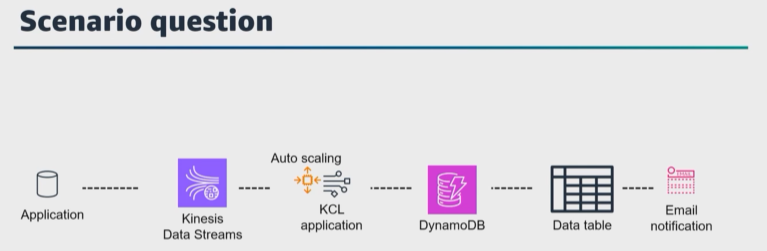
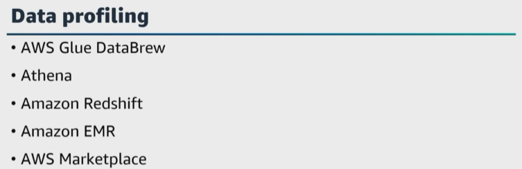
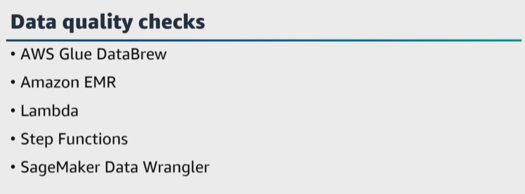
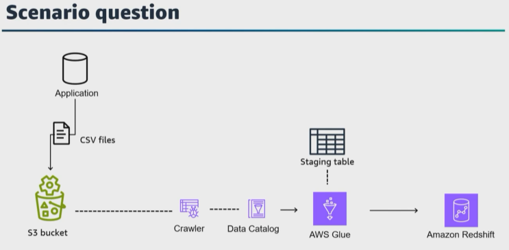
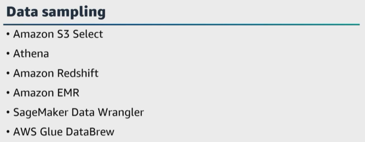
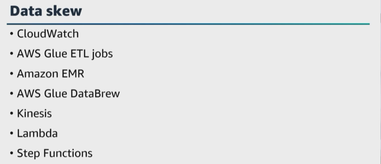
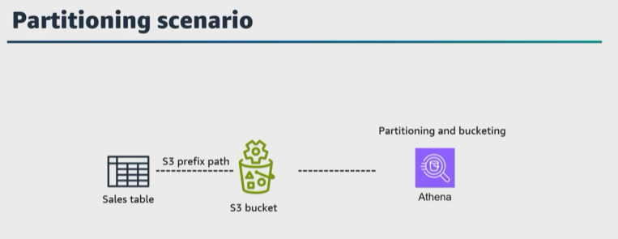
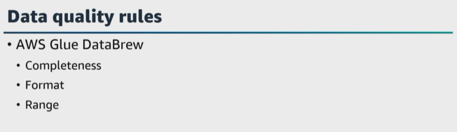

# A. Ensure data quality
- [A. Ensure data quality](#a-ensure-data-quality)
- [B. Walkthrough question](#b-walkthrough-question)
- [C. Walkthrough question](#c-walkthrough-question)
- [D. Additional resources](#d-additional-resources)

Let's get started with the fourth task statement and talk about ensuring data quality. And for this task statement, I want to mention trust. The people who use your data need to trust the data that you are serving. And this leads us back to the fundamentals of understanding the use cases and users, understanding the data that will be produced, and understanding how you will serve that data and more. 

If your stakeholders and end users lose trust in your data, the end goals are probably not being met. And this leads us back to why ``data quality`` **and ensuring observability processes throughout the data lifecycle are so important**. 

At AWS, we work backwards from the customer and as a data engineer, you should too. 

Here are a few questions to ask as you are starting a new data lifecycle. 
* Who will use this data? 
* How will they use this data? 
* And how do you collaborate to ensure that you serve the data that is needed? 

I have heard data engineers say publishing no data is better than publishing bad data. And we have already mentioned having automated checks throughout your pipelines to ensure that if there is an anomaly or error, then the pipeline is stopped and remediated. 

|   |    |   
|---|---|

Let's say that you're performing a ``data quality`` check in your pipeline and you notice there is a duplicate value in a column that should be your primary key. What do you do? You can ensure that a notification is sent and depending on the issues, you might not need to stop the entire process. 

``Data quality`` checks are important for your pipelines. Where do you add checks? 

> **It is best practice to add ``data quality`` checks before transformation, during transformation, and post transformation, but this takes design and implementation in your data lifecycle and pipeline.**

More checks aren't always better though. Too many checks and you might drown in false positive nightmares. Too few checks and you will drown in data quality nightmares. So how do we fix this? 

Well, ``data profiling`` **is part of data management, operations, and preparation, and is the process of analyzing and examining data to gain insights into its structure, content, and quality**. 
> **It involves a systematic examination of data to understand its characteristics, structure, patterns, and statistics**. 

For example, ``data profiling`` 
* **identifies the presence of missing or null values as well as the distribution of data across various fields**. 
* It also **assesses the quality of data by identifying data anomalies, inconsistencies, and potential data quality issues and assesses the cardinality of the data**. 
* It **examines data patterns and identifies relationships between fields or entities**. It can reveal common values, frequency, distributions, and correlations between data elements, and it summarizes data such as minimum, maximum, mean, median, and standard deviation. 

``Data profiling`` **helps to improve data quality, understand your data and supports governance and compliance**. Understanding data distributions and patterns can improve query performance and optimize your ``data storage``. 

So what AWS services and tools are available to perform data profiling in AWS? 

Again, we have mentioned these already, but let's mention them again for this task statement. 

|   |    |   
|---|---|

* ``AWS Glue DataBrew`` can be used for ``data profiling`` **tasks to explore and profile data without writing complex code data**. ``DataBrew`` **automatically generates data, statistics, frequency distributions, and data quality insights to help your users understand their data better**. 

* ``Athena`` **can also be used to perform basic ``data profiling`` by running SQL queries that generate statistical summaries and analyze data patterns**. 

* You can use the ``Amazon Redshift`` SQL capabilities to perform ``data profiling`` tasks such as calculating data distributions, identifying data anomalies, and generating data quality metrics. 

* With ``Amazon EMR`` with ``Spark``, you can develop custom ``data profiling`` scripts to analyze data, calculate statistics, and create data summaries. 

* There are also third-party data profiling and data quality tools available on the AWS Marketplace that can be integrated with your AWS environment to perform comprehensive data profiling. 

Okay, so you have profiled your data, but now how do you also perform data validation in the data management process to ensure the quality and reliability of data? Because you must check and verify data for completeness, consistency, accuracy, and integrity. 

Well 
* **First** check **to ensure your data is complete**. For example, are there any missing values, nulls, or empty fields in the dataset? 
*  **Second**, check **to ensure that your data is consistent**. For example, validate data against predefined rules or constraints to identify any inconsistencies or discrepancies. 
*  **Third**, check **the accuracy of your data**. 
*  **Fourth**, check **your data integrity to ensure that data remains unchanged and consistent** throughout its lifecycle from creation to deletion, and as a data engineer, there are ways to perform data validation and multiple techniques and tools that you can use. 

|   |    |   
|---|---|

What if you need to run ``data quality`` checks while processing the data? An example is checking for empty fields and verifying that all required fields have non-null values. 

* You can use ``AWS Glue DataBrew`` **recipes to define rules and validation checks for empty fields, data formats, uniqueness and more**. 

* We just mentioned that with ``Amazon EMR``, you can use ``Spark`` to build custom data quality checks as part of your data processing workflow. 

* For more complex **data quality checks**, you can use a ``Lambda function`` to run quality checks and initiate remediation, and 
  
* ``Step Functions`` **to orchestrate the processing tasks based on the validation results**.
  
* ``SageMaker Data Wrangler`` **gives you the ability to apply data quality checks using filters and transformations to identify and remediate missing values, duplicates and more**. 

Here's a question. 

|   |    |   
|---|---|

You are using ``Amazon S3`` to store your data in CSV format. 
* An ``AWS Glue Crawler`` is used to populate the ``Data Catalog`` and create tables in the schema. 
* You launch an ``AWS Glue`` job to process the data from the tables and write that data to an ``Amazon Redshift`` table. 
* After running the jobs a few times, **you notice there are duplicate records** in the ``Amazon Redshift`` table. 

How do you ensure that there are no more duplicates when you rerun the jobs? 

Under task statement 1.2, we talked about creating a test or staging environment. 

* You can set up a **staging table** in the ``AWS Glue`` job **to replace the existing rows in the ``Amazon Redshift`` table before persisting new data**. 

Let's dive deeper and test your depth of knowledge. 

Can you perform **a merge operation**? Yes, 
* **you would load your data into a staging table and then join the staging table with your target table for an update statement and an insert statement**. 
* Or you **can implement an upsert or merge** in ``Amazon Redshift`` using an ``AWS Glue`` Job. 
* You can **load your data into a staging table first, and then join the staging table with your target table using an ``upsert`` operation**. 
    > The ``upsert`` **feature inserts or updates data**, if the row that is being inserted already exists in the table. By using this operation, the ``Amazon Redshift`` **tables will no longer have duplicate records**. 

|   |    |   
|---|---|

This task statement also covers ``data sampling``, **which is a technique used to select a subset or sample of data from a larger dataset for analysis to provide insights while reducing the computational resources and time required for processing**. There are various ``data sampling`` techniques each with its advantage and use cases. 

And again, I will add flashcards for these, but what are AWS services that you can use to help with data sampling? 
* ``Amazon S3 Select`` **gives you the ability to retrieve a specific subset of data directly from objects stored in ``Amazon S3``, `**using SQL-like queries**. 

* You can use ``Athena`` and ``Amazon Redshift`` **to sample data by specifying a limit clause in your SQL queries to retrieve a limited number of rows**. 

* With ``Amazon EMR`` and ``Spark``, **you can write custom Spark scripts to perform systematic sampling, random sampling, or stratified sampling on your data**. 

* ``SageMaker Data Wrangler`` **supports data sampling to create balanced datasets for model training and testing**. 

* For ``AWS Glue DataBrew``, `**you can filter and select a subset of data using DataBrew transformations**.

For this task statement, you also need to **know how to implement data skew mechanisms when partitions or keys have more data than others**. ``Data skew`` is an imbalance in the distribution of data across partitions or nodes, leading to performance bottlenecks and longer processing time for tasks. You can use ``dynamic load balancing, data replication, or other strategies`` `**to address skew and redistribute the workload**. 

|   |    |   
|---|---|

How do you implement mechanisms to detect data skew in real time or during data processing in AWS? Well, **detecting data skew in real time or during data processing involves implementing monitoring, alerting, and profiling mechanisms to identify and address data distribution imbalances**. We've already talked about monitoring and observability in the last lesson. 
* In ``CloudWatch``, **you can create custom metrics to monitor data processing jobs** or applications and collect and **track metrics such as ``record counts per partition or key, data distribution, and processing times``**.  And then **configure alarms, based on the metrics defined, you can receive real-time alerts when data skew occurs beyond your predefined thresholds**. 

* For ``AWS Glue ETL`` jobs **use ``CloudWatch metrics`` and ``AWS Glue`` job bookmarks to monitor job progress and data processing status**. With the ``AWS Glue`` **job bookmarks glue can resume from the last process record to better track data skew issues in subsequent runs.** 

* When you're using ``Amazon EMR`` with Spark, **you can choose detailed Spark application logging and monitoring**. Then **use ``CloudWatch Logs`` to capture ``Spark application logs`` and review the logs for signs of data skew, such as long-running tasks, uneven task distribution, or skew data partitions**. 

* And jumping back to data profiling and quality checks in ``AWS Glue DataBrew``, or with custom ``Spark scripts``, you can include logic to analyze data distributions, check for imbalanced partitions, and identify skewed keys or attributes. 

* For **real-time data processing**, consider using ``Spark streaming with Kinesis or Apache Kafka`` as the data source. Implementing ``Spark streaming`` **jobs gives you the ability to continuously process incoming data and monitor data skew as it occurs in real time**. 

* For more complex data processing workflows, you can use ``Lambda functions`` and ``Step Functions`` **to orchestrate data processing tasks and perform real-time skew detection**. ``Lambda functions`` can analyze data streams or datasets for skewness and ``Step Functions`` can coordinate these tasks and initiate remediation actions. In data processing jobs with ``Spark`` or ``Amazon EMR``, **you can implement dynamic data repartitioning techniques based on observed data skew**. 

* And for advanced use cases, **you can develop custom monitoring and alerting solutions using AWS services like ``Lambda, EventBridge, and Amazon SNS``. Detecting skew in real time or during data processing helps ensure data accuracy, optimized performance, and maintain reliable data processing in AWS environments. 

|   |    |   
|---|---|

Let's also talk about how to ensure that data is evenly partitioned across nodes or tasks in your distributed processing system. You can use a ``partitioning key`` and ``hash function`` **to evenly distribute the data and implement load balancing mechanisms to monitor the workload on different nodes and redistribute tasks accordingly**. 

For **frequently accessed data or hotspots**, consider **replicating the data across multiple nodes to reduce the impact of data skew with multiple nodes** to process the same data simultaneously. Additionally, **use shuffling techniques to redistribute data when required, such as during ``MapReduce operations``**. What is a common data partitioning strategy? 

* My first thought is **to partition files by columns related to a date**. For example, if I have a sales table, I could have a year column, a month column, and a day column to reflect the year, month, and day of a sales transaction. If I'm using an S3 bucket, then all the dates data related to each specific day will be written out in the same S3 prefix path. 

``Partitioning`` **provides a performance benefit when you filter the results of your query based on one or more partition columns**. For example, if you use the ``where`` clause for a specific date, then the query would only need to read the file or files in the single S3 prefix. And if you query the data for a full month or even a full year, the number of files that need to be scanned is reduced. 

``Data bucketing`` **is a concept related to **partitioning**, and **partitioning and bucketing** are two ways to reduce the amount of data ``Athena`` must scan when you run a query**. 
    * ``Bucketing`` **is a way to organize the records of a dataset into categories called buckets**. This meaning a bucket and bucketing is different from S3 buckets. In ``data bucketing``, **records that have the same value for property go in the same bucket**. Records are distributed as **evenly** as possible among buckets **so that each bucket has roughly the same amount of data**. The buckets are files, and **a hash function determines the bucket that a record goes into**. 
    > **A bucketed dataset will have one or more files per bucket per partition. The bucket that a file belongs to is encoded in the file name**. 

* ``Athena`` engine version 2 **supports dataset bucketed using the ``hive bucket algorithm`` and ``Athena`` engine version 3 also supports the ``Spark bucketing algorithm``. Hive bucketing is the default. 

    > **If your dataset is bucketed using the ``Spark algorithm``, use the ``TBL properties clause`` **to set the bucketing format property value to ``Spark``**. 

We just talked about sequential sampling. In some cases, you can use sampling or approximation techniques to estimate results without processing the entire dataset. Sampling can reduce the impact of data skew and improve the efficiency of data processing. 

For join operations consider using skew join optimization techniques to handle data skew in the join keys such as bloom filters, skew join algorithms, or other methods to optimize join operations with skewed data. AWS provides built-in algorithms and optimizations for handling skewed data and join operations. 

For example, the skew join optimization feature in ``Amazon EMR``, **that automatically detects and handles data skew in the join keys. It identifies skewed keys and redistributes the data to balance a load during the join, improving the performance of the operation**. 

Some AWS services such as ``Amazon Redshift`` `**offer adaptive join algorithms that can adjust their behavior based on the data distribution**. These algorithms can dynamically switch between different join strategies, such as hash joins and sort merge joins based on the data skew and other factors. 

|   |    |   
|---|---|

Here's a question, you currently store your historical transaction records in an ``S3 bucket`` that is integrated with ``Data Catalog``. Each night your sales report is sent and stored to an Amazon Redshift cluster. To process a sales report, **you must join the historical data in ``Amazon S3`` and the sales report in the ``Amazon Redshift cluster``. What is your solution? 

* You can use ``Redshift Spectrum`` and **create an external table for historical transaction data in ``Amazon S3`` and join the tables using ``Amazon Redshift SQL``**. 
* Before processing data, ***perform pre-processing and data transformation to normalize data distributions with techniques such as ``data bending, feature scaling, or log transformations`` **to handle data skew**. 
* Also, you might consider **adjusting the granularity of tasks in your distributed processing system**. ``Finer grain`` tasks **can help distribute the workload more evenly, reducing the impact of data skew**. 

> **Regular monitoring and profiling of your data processing system can help identify data skew issues and guide the implementation of appropriate mechanisms to handle them.** 

|   |    |   
|---|---|

Let's wrap up this lesson and talk about how to define data quality rules in AWS. 

``Data quality`` **rules are predefined criteria or conditions you use to assess and enforce the quality of data in your data sets to help identify and flag data that does not meet specific quality standards**. This gives data analysts and data engineers the ability to take appropriate actions for ``data cleansing, correction, or validation``. 

When you create a DataBrew project in the AWS Glue DataBrew console, what are examples of data quality rules that you might include? Well, there are completeness rules to flag records with missing or null values in specific columns. 

* A **format rule that checks** it values in a column match a specific format or pattern. For example, email address format or phone number format. A range rule validates that numeric values fall within a specified range, and there's also a uniqueness rule to identify duplicate records or values in a column. 

When your data quality rules are applied to your defined dataset, ``DataBrew`` will analyze the data according to the defined rules, and generate quality statistics and flags for non-compliant records. Then you can review the results of the data quality analysis to identify records that do not meet the predefined quality rules. 

``DataBrew`` **provides visualizations and summaries to help you understand data quality issues**, and then take actions based on the identified data quality issues and perform ``data cleansing, transformation, or validation`` to fix data quality problems. You can automate the process and ensure continuous data quality monitoring. 

# B. Walkthrough question 

An online travel agency company uses AWS to analyze customer trends and create personalized marketing campaigns. For compliance and security reasons, the company uses AWS CloudTrail to capture API activity that analytics services create in the company's platform. The company wants to develop a solution to analyze the logged events that CloudTrail captures. 

Which solution will meet these requirements with the least operational overhead?" 

Now that we've examined the question, identified keywords, and reviewed the requirements, let's explore the options. 

**Option A:** Configure the trail to send the logged events to AWS CloudTrail Lake in an event data store. Query the log data in the data store by using SQL. 
**Option B:** Configure the trail to send the logged events to Amazon S3 in JSON format. Create a new Amazon EMR cluster that runs Trino. Query the log data with Trino by using JSON functions with SQL. 
**Option C:** Configure the trail to send the logged events to Amazon S3 in JSON format. Ingest the log data in Amazon Redshift by using the SUPER data type. Query the log data with Amazon Redshift by using PartiQL. 
**Option D:** Configure the trail to send the logged events to Amazon S3. Create external tables from the log data. Include the data in the tables by using Amazon Redshift. Query the log data by using Amazon Redshift Spectrum. 
Pause the video if you need more time. Okay, let's evaluate the options. 

**Option A** is a possible correct answer. ``CloudTrail`` **can send logs to ``CloudTrail Lake`` without the need to develop a custom solution**. ``CloudTrail Lake`` **automatically converts the JSON event type to Apache ORC format, and stores the data in an event data store**. ``CloudTrail Lake`` **gives you the ability to run SQL queries across multiple event data stores automatically**. You can use this solution to analyze the event data automatically. Even though this is the possible correct answer, it is best practice to review all the answers to ensure you choose your best choice answer. 

**Option B** is incorrect. CloudTrail can export the JSON log data to Amazon S3. You can use Amazon EMR with Trino to run interactive queries on the JSON log data. However, **this solution requires more operational overhead than a solution that uses CloudTrail Lake**. **This solution requires you to configure and maintain a new ``EMR cluster``**. 
> ``CloudTrail Lake`` **provides automatic event data integration from CloudTrail**. Additionally, ``CloudTrail Lake`` **provides SQL supportive capabilities to analyze the data without the need for further customization**. 

**Option C** is incorrect. CloudTrail can export the JSON log data to Amazon S3. Amazon Redshift can ingest the data by using the SUPER data type. Amazon Redshift can run interactive queries on the data by using PartiQL. However, **this solution requires more operational overhead than a solution that uses CloudTrail Lake**. CloudTrail Lake provides automatic event data integration from CloudTrail. Additionally, CloudTrail Lake provides SQL supported capabilities to analyze the data without the need for further customization. 

**Option D** is incorrect. CloudTrail can export the log data to Amazon S3. Amazon Redshift can create external tables from the S3 files and query the data by using Redshift Spectrum. However, **this solution requires more operational overhead than a solution that uses CloudTrail Lake**. CloudTrail Lake provides automatic event data integration from CloudTrail. Additionally, CloudTrail Lake provides SQL-supported capabilities to analyze the data without the need for further customization. 

# C. Walkthrough question

A logistics company runs its data platform on AWS. The company uses Amazon S3 data lake to ingest data from different operational sources that correspond to different fulfillment centers. The company analyzes the data to better predict inventory that is needed for each fulfillment center. Recently, the company discovers data quality issues. A data engineer must develop a solution to identify the issues. To automate the solution, the data engineer creates an Amazon EventBridge rule that starts an AWS Step Functions state machine when the data is ingested into Amazon S3. 

How can the data engineer configure the solution to ensure data quality with the least operational overhead?"

A few keywords I see are a company uses Amazon S3 data lake to ingest data from different operational sources that correspond to different fulfillment centers, and the company analyzes the data to better predict inventory, but data quality issues have been discovered. To automate the solution, the data engineer creates an Amazon EventBridge rule that starts an AWS Step Functions state machine when the data is ingested into Amazon S3. And now you need to choose how to configure this solution to ensure data quality with the least operational overhead. 

Now that we've examined the question, identified keywords and phrases and review the requirements, let's explore the responses. 

**Option A**: Configure the state machine to start a transient Amazon EMR cluster that is configured with Apache Spark that runs a data validation job that uses PyDeequ to identify data quality issues. 
**Option B**: Configure the state machine to start an AWS Glue custom job that uses Apache Spark to run a data validation job that uses PyDeequ to identify data quality issues. 
**Option C**: Configure the state machine to start an AWS Glue DataBrew profile job configured with a data quality ruleset and rules. 
**Option D**: Configure the state machine to start a custom AWS Lambda data validation job that is configured to check and apply data quality rules. 
Pause the video if you need more time. Okay, let's evaluate the options. 

**Option A** is incorrect. You can use a transient ``EMR cluster`` configured with Apache Spark to customize a data validation job that uses the ``PyDeequ library``. However, **this solution does not provide the least operational overhead**. ``DataBrew`` **can implement data quality rules as part of a ruleset without the need to configure the transient ``EMR cluster`` with Apache Spark**. Additionally, with ``DataBrew``, **you do not need to create a custom job with PyDeequ to perform data quality validations.`` 

**Option B** is incorrect. You can use an ``AWS Glue`` **custom job that uses ``Apache Spark`` to create a data validation job that uses the PyDeequ library**. However, **this solution does not provide the least operational overhead**. DataBrew can implement data quality rules as part of a ruleset. You do not need to customize the creation of the data quality rules with PyDeequ to perform the validations. 

**Option C** is a possible correct answer because ``DataBrew`` **gives you the ability to create a data quality ruleset that automatically performs data quality validations as part of a profiling job``. You can use ``DataBrew`` in combination with a ``Step Functions`` `**state machine to automate ``data validation`` in an ingestion pipeline**. Even though this is the possible correct answer, it is best practice to review all the answers to ensure that you choose your best choice answer. 

**Option D** is incorrect. You can use a custom ``Lambda function`` **to perform data validation**. However, **this solution does not provide the least operational overhead**. The custom function would need to be developed to apply the custom data quality rules. ``DataBrew`` **can implement data quality rules as part of a ruleset without the need to create a custom`** ``Lambda function``.

# D. Additional resources

Review these materials to learn more about the topics covered in this exam domain: 

* [Workflow Orchestration](https://docs.aws.amazon.com/whitepapers/latest/best-practices-building-data-lake-for-games/workflow-orchestration.html)

* [AWS Step Functions](http://aws.amazon.com/step-functions/)

* [Amazon Managed Workflows for Apache Airflow](http://aws.amazon.com/managed-workflows-for-apache-airflow/)

* [Using Apache Spark in Amazon Athena](https://docs.aws.amazon.com/athena/latest/ug/notebooks-spark.html)

* [Data Warehousing on AWS](https://docs.aws.amazon.com/whitepapers/latest/data-warehousing-on-aws/data-warehousing-on-aws.html)

* [Data Processing](https://docs.aws.amazon.com/step-functions/latest/dg/use-cases-data-processing.html)

* [PartiQL: A SQL-Compatible Query Language for Amazon DynamoDB](https://docs.aws.amazon.com/amazondynamodb/latest/developerguide/ql-reference.html)

* [Amazon SageMaker Notebook Instances](https://docs.aws.amazon.com/sagemaker/latest/dg/nbi.html)

* [DevOps Guidance](https://docs.aws.amazon.com/wellarchitected/latest/devops-guidance/devops-guidance.html)

* [What Is AWS Glue DataBrew?](https://docs.aws.amazon.com/databrew/latest/dg/what-is.html)