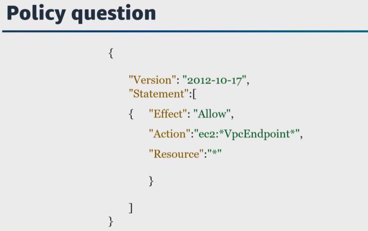
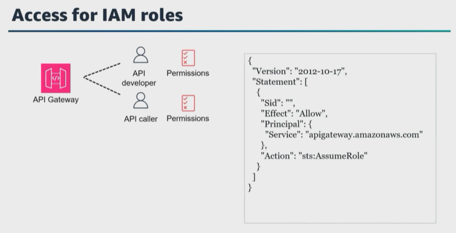
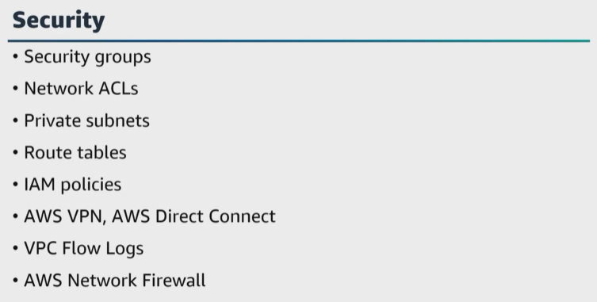

# A. Apply authentication mechanisms
- [A. Apply authentication mechanisms](#a-apply-authentication-mechanisms)

Let's get started with the first task statement from domain 4, which is to apply authentication mechanisms. Every data engineer is responsible for the security of the systems they build and maintain. 

|   |    |   
|---|---|

Before we jump into this task statement, I wanna pause for fundamentals and define authentication and authorization. This task statement covers authentication and the next task statement covers authorization. 
* ``Authentication`` **identifies and verifies who you are**. 

* ``Authorization`` **determines what you as an identity can access within a system once you've been authenticated**. 

In AWS, authentication methods verify the identity of users or resources before granting access to AWS services and resources. ``AWS`` **supports various authentication methods including password-based, certificate-based, and role-based authentication**. 

For the exam, ensure that you know the different use cases and the different levels of security that each provides. 

So how do you authenticate in AWS? 

|   |    |   
|---|---|

``IAM`` **is a service that helps you securely control access to your AWS resources**. You use ``IAM`` **to control who is authenticated and authorized to use resources**. This includes support for identity federation. Using ``IAM``, **data engineers can design roles that follow the principle of least privilege for each user and AWS service that is used**. 

There are a few different ways to authenticate in AWS. 
* **First**, **you can be authenticated or signed in to AWS as the AWS account root user, as an IAM user, or by assuming an IAM role**. 
* You can also **sign in as a federated identity by using credentials provided through an identity source**. 

With ``AWS IAM Identity Center``, **you can manage sign in security for your workforce identities with multi-account permissions to assign your workforce users access to ``AWS accounts`` or as an application assignments to assign your users single sign-on access to Security Assertion Markup Language, or SAML 2.0, applications or as an identity center to connect automatically**. 

What are different identities in AWS? 
* An ``IAM user`` is an identity within your AWS account that has specific permissions for a single person or application. 
* ``IAM groups`` are groups of users who need the same permissions. You can't sign in as a group, but you can use groups to specify permissions for multiple users at a time. 
* Users are different from roles. **A user is uniquely associated with one person or application**, but a ``role`` **is intended to be assumable by anyone who needs it**. Users have permanent long-term credentials, but roles provide temporary credentials. You can also use an ``IAM role`` **to grant cross-account access for a trusted principal in a different account to access resources in your account**. 

Some AWS services use features in other AWS services. For example, when you make a call in a service, it is common for that service to run applications in Amazon EC2 or store objects in Amazon S3. A service might do this using the calling principal's permissions, using a service role, or using a service-linked role. 

For the exam, ensure that you understand use cases and scenarios for using IAM roles with temporary credentials such as federated user access, cross-service access and more, and know the differences between principal permissions, service roles, and service-linked roles. 

In AWS, you can also use ``certificate-based authentication``. ``AWS Certificate Manager``, or ACM, **handles creating, storing, and renewing public and private SSL/TLS X.509 certificates and keys. and private SSL/TLS X.509 certificates and keys**. You can provide certificates for your integrated AWS services, either by issuing them directly with ACM or by importing third-party certificates into the ACM management system. You can also export ACM certificates signed by AWS private CA for use anywhere in your internal public key infrastructure. 

|   |    |   
|---|---|

To manage access to our resources, we can use ``IAM policies``. 
* ``Policies`` **are documents that define the actions that can be performed against resources in AWS**. There are several types of policies that can be used. These include 
    * ``IAM identity-based policies``, 
    * ``trust policies``, and 
    * ``resource-based policies``. 

``IAM identity-based policies`` `**can be attached to an IAM user, an IAM group, or an IAM role**. 

A ``resource-based policy`` **is associated directly with an** ``AWS resource`` such as an ``S3 bucket`` or ``AWS KMS key``. 

> **It is important to understand that IAM roles actually require two policies**. The first is a ``trust policy``, **which defines who or what is able to assume the role**. The second is the ``identity-based`` policy, **which defines what the user or service assuming the role is able to do**. 

> **You should also understand that if an action on a resource is not specifically allowed by a policy, the default behavior of AWS is to deny the action**. 

For example, IAM identity-based policies to help you find permissions for your IAM identities. When you set the permissions for an identity in IAM, you must decide whether to use an AWS managed policy, a customer managed policy, or an inline policy. 

|   |    |   
|---|---|

An ``AWS managed policy`` **is a policy that is created and managed by AWS** to help assign appropriate permissions to users, groups, and roles. **You cannot change the permissions defined** in ``AWS managed policies``. 

``Customer managed policies`` **are identity-based policies** that you create and you can attach to multiple users, groups, or roles in your AWS account. 

An ``inline policy`` **is a policy created for a single IAM identity**, which is a user, group, or role. ``Inline policies`` `**maintain a strict one-to-one relationship between a policy and an identity**. They are deleted when you delete the identity. 

|   |    |   
|---|---|

Let's also talk about how to apply ``IAM policies`` to roles, endpoints, and services. 

For example, ``S3`` access points support ``IAM resource-based policies`` **that give you the ability to control the use of access points by resource user or other conditions**. For an application or user to be able to access objects through an access point, both the access point and the underlying bucket must grant the request so the permissions granted in an access point policy are effective only if the underlying bucket also allows the same access, and there is an upcoming example for this. 

Let's look at how to create IAM policies to control requests made through an access point. AWS recommends two ways to accomplish this task. 

* **First**, you can assign access control from the bucket to the access point. 
* And **second**, you can add the same permissions contained in the access point policy to the underlying bucket's resource-based policy. 

This example bucket policy **allows full access to all access points that are owned by the bucket's owner account**. All access to this bucket is controlled by the policies attached to its access points. 

|   |    |   
|---|---|

In the second example, the access policy grants the IAM user, Julie, in account 123456789012 in account 123456789012 permissions to get and put objects with the prefix, Julie, through the access point, my access point in account 123456789012. my access point in account 123456789012. 

Notice that for the access point policy to effectively grant access to Julie, the underlying bucket must also grant the same access to Julie. You can delegate access control from the bucket to the access point as described in the first example, or you can add the following policy to the underlying bucket to grant the necessary permissions to Julie. 

Let's also talk about how to apply IAM policies for AWS PrivateLink. Here's a question. 

|   |    |   
|---|---|

What permission does this policy grant? By default, users do not have permissions to work with endpoints. You can create an **identity-based policy** such as this example **that grants users permissions to create, modify, describe, and delete endpoints**. 

Here's another question. 

|   |    |   
|---|---|

How do you grant permissions to create a VPC endpoint with the specified private DNS name? You can use the ``ec2:VpceServicePrivateDnsName`` You can use the ``ec2:VpceServicePrivateDnsName`` condition key to control what VPC endpoint service can be modified or created based on the private DNS name associated with the VPC endpoint service. 

So at a high-level overview, IAM acts as an Identity Provider, or IDP, and it manages identities inside your AWS account. It authenticates these identities to log in to your AWS account, and then authorizes those identities to access resources or deny access to resources based on the policies attached. 

Let's talk about setting up IAM roles for access. Here's a question. 

You control access to your API Gateway with IAM permissions. To create, deploy, and manage an API in API Gateway, you grant the API developer permissions to perform the required actions supported by the API management component of API Gateway. And to call a deployed API or to refresh the API caching, you grant the API caller permissions to perform required IAM actions supported by the API execution component of API Gateway. The access control for these two processes involves different permission models. Do you understand how this works? 

To allow an API developer to create and manage an API in API Gateway, you must create IAM permission policies that allow a specified API developer to create, update, deploy, view, or delete required API entities. You attach the permissions policy to a user, role, or group. To allow an API caller to invoke the API or refresh its caching, you must create IAM policies to permit a specified API caller to invoke the API method for which the user authentication is enabled. The API developer sets a methods authorization type property to AWS_IAM authorization type property to AWS_IAM to require that the caller submit the user's credentials to be authenticated. Then you attach the policy to a user, group, or role. 

|   |    |   
|---|---|

Let's say that your API is integrated with Lambda in the backend. Well, API Gateway must also have permissions to access integrated AWS resources. And for our example, that permission gives it the ability to initiate a Lambda function on behalf of the API caller. To grant these permissions, create an IAM role for API Gateway type. When you create this role in IAM, the resulting role contains the following IAM trust policy that declares API Gateway as a trusted entity permitted to assume the role. 

|   |    |   
|---|---|

For API Gateway to call the integrated AWS service, you must also attach to this role appropriate IAM permission policies for calling integrated AWS services. For example, to call Lambda function, you must include the following IAM permissions policy in the IAM role ``lambda:InvokeFunction``. You can use IAM with CloudFormation to control what users can do with CloudFormation. In addition, you can manage what AWS services and resources are available to each user. 

|   |    |   
|---|---|

And to wrap this all together, you can establish a private connection between your VPC and CloudFormation by creating an interface VPC endpoint. You can attach an endpoint policy to your VPC endpoint that controls access to CloudFormation. **The policy can specify the principal that can perform actions, that actions that can be performed, and the resources on which actions can be performed**. 

|   |    |   
|---|---|

The following is an example of an endpoint policy for CloudFormation. When attached to an endpoint, this policy 
* **grants access to the listed CloudFormation actions for all the principals on all resources.** 
* The example also **denies all users the permissions to create stacks through the VPC endpoint** and **allows full access to all other actions on the CloudFormation service**. 

|   |    |   
|---|---|
For the exam, also ensure that you understand how to secure infrastructure and control network traffic to the resources in your ``Amazon VPC`` that support your data pipeline. You can use security groups and network access control lists. You can also use private subnets, a bastion host or NAT gateway, route tables, AWS Virtual Private Networks, or AWS VPN, AWS Direct Connect, VPC Flow Logs, Security Hub, and AWS Network Firewall. 

Let's wrap up this lesson and talk about creating and rotating credentials for password management. A secrets lifecycle has four phases, create, store, use, and destroy. And a secrets management solution protects the secrets in each of these phases from unauthorized access. 

``AWS Secrets Manager`` **is a secrets management service to help you protect access to your application services and resources**. 

``Secrets Manager`` **offers built-in integration with IAM** and you can attach access control policies to IAM principals or to secrets themselves by using resource-based policies. 
* ``Secrets Manager`` **also integrates with ``AWS Key Management`` Service, or AWS KMS. 
* ``Secrets`` **are encrypted at rest by using an ``AWS managed key`` or ``customer managed key``. 
* And ``Secrets Manager`` **supports a rotation of secrets securely**, and you can schedule automatic database credential rotation for ``Amazon RDS, Amazon Redshift, and Amazon DocumentDB``. 
* You can also use **customized ``Lambda functions`` to extend the ``Secrets Manager`` rotation feature to other secrets types such as API keys and OAuth tokens**. 

Here's a question. 

|   |    |   
|---|---|

You are storing your results in Data Catalog in Amazon S3. You are using Athena and QuickSight for analysis and data visualization. The Data Catalog is updated to include a new data profiler that stores metrics in a new S3 bucket and a new Athena table is created to query and reference the new S3 bucket. When you try to visualize the new data in QuickSight, the import fails. First, what is the issue? What is the error message? Let's say that you receive an error message that says you have insufficient permissions. 

Well, let's pause and remember that before the data profiler was added to the Data Catalog and before a new table was created in Athena, it all worked. But now, you have insufficient permissions when using Athena with QuickSight. **To successfully connect ``QuickSight to the S3 buckets`` used by ``Athena``, make sure that you have authorized ``QuickSight to access the S3 account``**. It's not enough that you, the user, are authorized. **What is needed here is ``cross-service`` access** that we talked about earlier in this lesson. ``QuickSight`` **must be authorized separately**. To resolve this issue, you need to configure the permissions for the new S3 bucket from the QuickSight console. 