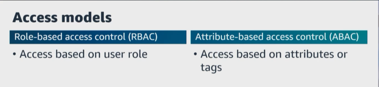
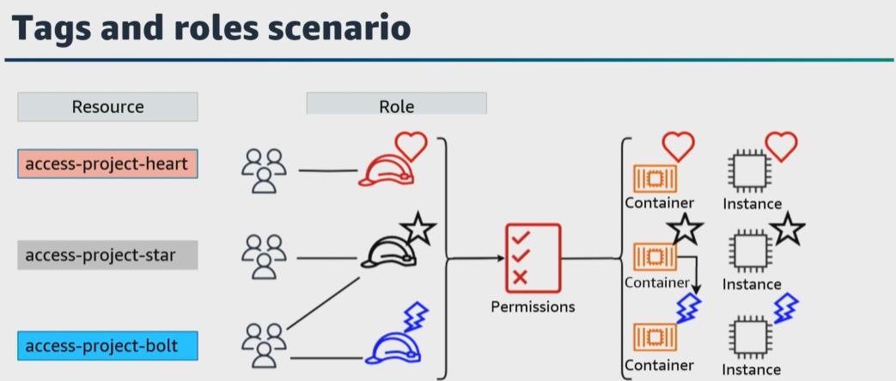
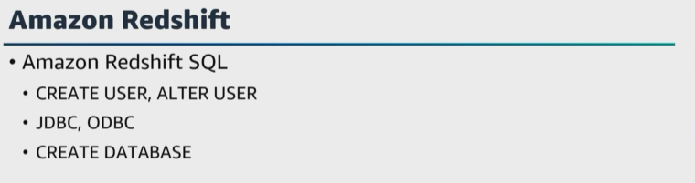

# A. Lesson 2: Apply authorization mechanisms
- [A. Lesson 2: Apply authorization mechanisms](#a-lesson-2-apply-authorization-mechanisms)
  
Let's get started with the second task statement from domain 4, which is to apply authorization mechanisms. We started off the last lesson talking about how every data engineer is responsible for the security of the systems they build and maintain. And we said that authentication identifies and verifies who you are. Authorization determines what you as an identity can access within a system once you have been authenticated. 

The goal is for authenticated principlals who are authorized to access the targeted resource with the least privilege. In AWS, security policies can be programmatically built and managed in a pipeline as code. And then along with your application code, you can also test the automation of your policies in a pipeline just like you would with software development to verify and validate that policies function as expected. 

For example, ``IAM Access Analyzer`` **can be used to continuously evaluate permissions granted in policies to identify resources that can be accessed from outside a customer's AWS account, and policies can be enforced across multiple accounts using AWS Organizations**. 

|   |    |   
|---|---|

This task statement focuses on authorization, and how to control access to resources in AWS services using policy-based authentication mechanisms. Each policy is created and managed by AWS or by you. You can share or reuse policies across identities, both within and between accounts, regardless of how those identities are authenticated using role-based access control, or ``RBAC``, methods or attribute-based access control, or ``ABAC``, methods or both. Each model has advantages and disadvantages, and the model you use depends on your specific use case. 

``RBAC`` **determines access to resources based on a role**. For example, a developer role would authorize a user to perform development within a data pipeline or application. This access control model can be easier to manage since permissions align to the role. But what if you have users who need permissions across several roles, or you have complex business logic that makes roles difficult to define, or your authorizations are based on dynamic parameters. 

You can use ````ABAC````, **which is an authorization strategy that defines permissions based on attributes and attach tags to IAM resources, including IAM users or roles and to AWS resources, environment, or even application state**. You can create an ``ABAC`` policy or multiple policies for your IAM principals. 

|   |    |   
|---|---|

Let's look at a basic example. You can create three roles with the access-project tag key. You set the tag value of the first role to heart, the second to star, and the third to bolt. You can then use a single policy that grants access when the role and the resource are tagged with the same value for access project. The ``ABAC`` model adds dynamic, contextual, and granular authorization decisions, but it can be difficult to implement initially. Defining rules and policies as well as attributes for all relevant access requires work. To provide an additional layer of granularity when making authorization decisions, you can combine ``ABAC`` with ``RBAC``. This hybrid approach determines access by combining a user's role and its assigned permissions with additional attributes to make access decisions.

|   |    |   
|---|---|

Let's move on and talk about how to provide database users, groups, and role access and authority in a database. For example, with ``Amazon Redshift``, how do you create and manage your users? 
* **You can create and manage database users using the ``Amazon Redshift`` SQL commands create user or alter user**. 
  
* You can also create and manage database users by configuring your SQL client with custom ``Amazon Redshift``, ``JDBC or ODBC`` drivers to manage the process of creating database users temporary passwords. ``Amazon Redshift`` users can only be created and dropped by a database super user. 

Users authenticate when they log on to ``Amazon Redshift``. They can own databases and database objects such as tables. They can also grant permissions on those objects to users, groups, and schemas to control who has access to which object. Users with create database rights can create databases and grant permissions to those databases.

Super users have database ownership permissions for all databases. Also, when you use ``role-based access control``, or ``RBAC``, to manage database permissions in ``Amazon Redshift``, you can secure the access to sensitive data by controlling what users can do, both at a broad or fine level. Users with an assigned role can perform only the tasks that are specified by the assigned role that they are authorized with. 

For example, a user with assigned role that has the create table or drop table permissions is only authorized to perform those tasks. You can control user access by granting different levels of security permissions to different users to access the data that they require for their work. And this leads us back to the principle of least privilege or permissions that is best practice for all users based on their role requirements. Regardless of the types of objects that are involved. Granting and revoking of permissions is performed at the role level without the need to update permissions on individual database objects. 

Let's change direction and talk about managing permissions through ``Lake Formation``. ``Lake Formation`` provides a single place to manage access control for data in your data lake. You can define security policies that restrict access to data at the database table, column, row, and cell levels. These policies apply to IAM users and roles and to users and groups when federating through an external identity provider. You can use fine-grain controls to access data secured by ``Lake Formation`` with Redshift Spectrum, Athena, AWS Glue ETL, and ``Amazon EMR`` for Spark. 

You can use ``Lake Formation`` **tag-based access control to manage hundreds or even thousands of database permissions by creating custom labels called ``LF tags``**. You can define LF tags and attach them to databases, tables, or columns. Then share control access across analytic, machine learning, and ETL services for consumption. LF tags ensure that data governance can be scaled by replacing the policy definitions of thousands of resources with a few logical tags. For example, you can set up permissions on datasets stored in different data sources like ``Amazon Redshift`` without migrating data or metadata in to Amazon S3 or Data Catalog. 

If you integrate ``Lake Formation`` with ``Amazon Redshift`` data sharing to centrally manage database, table, column, and row level access permissions of ``Amazon Redshift`` data shares, and restrict user access to objects within a data share. In our last lesson, we talked about using Secrets Manager. But you can also use Parameter Store, which is a capability of AWS Systems Manager to store configuration, data management and secrets management. You can store data such as passwords, database strings, and license codes as parameter values. However, Parameter Store doesn't provide automatic rotation services for stored secrets. Instead, Parameter Store enables you to store your secrets in Secrets Manager and then reference the Secret as a Parameter Store parameter. 


When you configure Parameter Store with Secrets Manager, the secret ID parameter store requires a forward slash before the name string. For the exam, ensure you understand how to prevent unauthorized access and how to limit the blast radius. In the next lesson, we'll talk about various techniques such as encryption, tokenization, data decomposition, and cyber deception to render content unintelligible to AWS or others. 