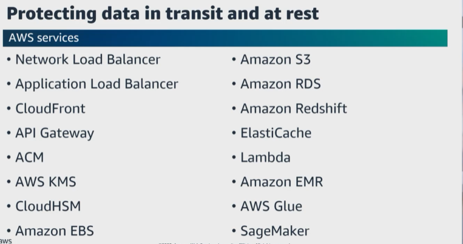
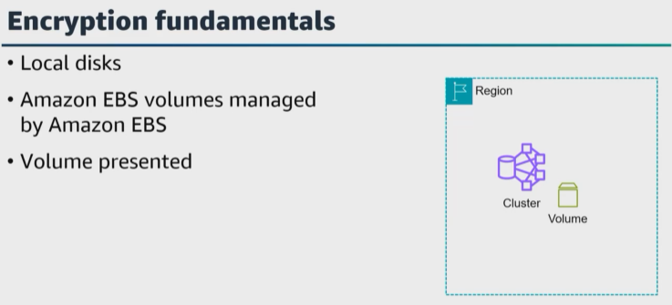
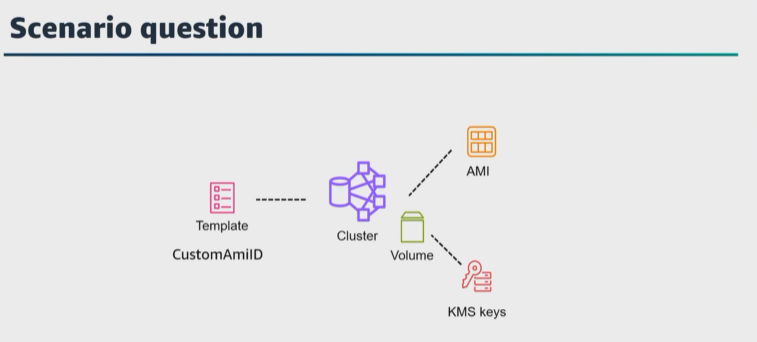
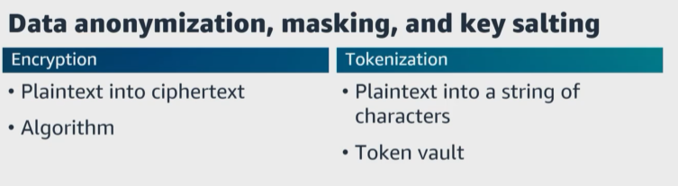
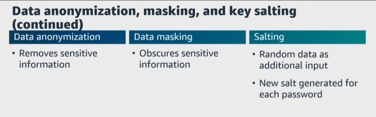
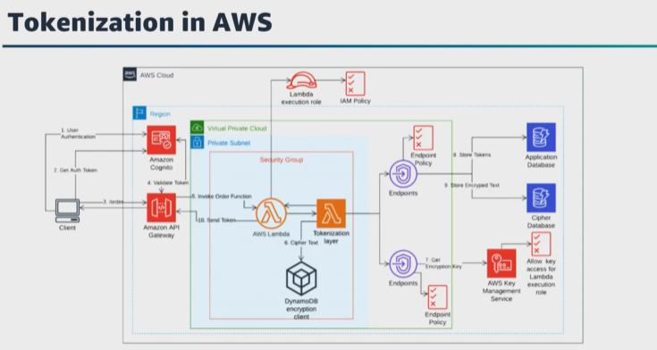

# A. Lesson 3: Ensure data encryption and masking
- [A. Lesson 3: Ensure data encryption and masking](#a-lesson-3-ensure-data-encryption-and-masking)
Let's get started with the third task statement from domain 4. This task statement focuses on data encryption and masking. AWS gives you the ability to add a layer of security to your data at rest and in transit while providing scalable and efficient encryption features. 

``Data protection`` **by design and by default is important to ensure that all data is processed lawfully, fairly and in a transparent manner**. All AWS services offer the ability to encrypt data at rest and in transit. ``AWS KMS`` is a managed service to create and control the cryptographic keys that are used to protect your data. 

``AWS KMS``** integrates with most other AWS services that encrypt your data**. For example, ``AWS KMS`` integrates with ``CloudTrail`` to log use of your ``AWS KMS`` keys for auditing, regulatory, and compliance, and you can use the ``AWS KMS API`` to create and manage ``AWS KMS`` keys and features such as custom key stores and use ``AWS KMS`` keys in cryptographic operations. Here's a question. What AWS service can you use if you have a requirement to directly manage the ``AWS CloudHSM`` device that generates, stores, and uses encryption keys? 

``CloudHSM`` **provides hardware security models in AWS**. AWS automates the hardware provisioning, software patching, network routing, and creating encrypted backups of key stores. **You are responsible for scaling your CloudHSM environment and managing the crypto accounts and credentials within the HSM**. Like ``AWS KMS``, ``CloudHSM`` **is designed so that plain text keys cannot be used outside the HSM by anyone**. 

In ``AWS`` **all network traffic between AWS data centers is transparently encrypted at the physical layer**. 

All **traffic within an ``Amazon VPC`` and between ``peered Amazon VPCs`` across Regions is transparently encrypted at the network layer**. 

At the ``application layer``, **you can use a protocol like Transport Layer Security, or TLS**, and all AWS service endpoints support TLS to create a secure HTTPS connection to make API requests. 

Here's a question. For customer managed infrastructure within AWS that needs to terminate TLS, what options are available? 

|   |    |   
|---|---|

``AWS offers`` services such as the network ``load balancer, application load balancer, CloudFront, and API Gateway**. 
> **To implement a TLS connection each of these endpoint services give you the ability to upload your own digital certificates to bind a cryptographic identity to the endpoint**. 

And we talked about this in a previous lesson, the process of generating, distributing, and rotating digital certificates with ACM. 

Using services like ``AWS KMS``, ``CloudHSM and ACM``, **customers can implement a data at rest and data in transit encryption strategy to ensure that all data of a given classification shares the same security posture**. 

For the exam ensure that you understand **data at rest encryption with AWS services** such as ``Amazon EBS, Amazon S3, Amazon RDS, Amazon Redshift, ElastiCache, Lambda, Amazon EMR, AWS Glue, and SageMaker``. One thing I did not mention is that you also have encrypted message queues for the transmission of sensitive data using server-side encryption, or SSE, for Amazon SQS. 

Here's another question to test your understanding of encryption fundamentals that are needed for this exam. 

|   |    |   
|---|---|

If you create an ``Amazon EMR cluster`` in a Region and your ``Amazon EBS`` volumes are encrypted, then is the local disk also encrypted? 

**No, it's not**, but you can choose to add local disk encryption in the security configuration. Between the operating system and the ``Amazon EBS`` volumes **there are three levels**. 
* There are the **local disk**, 
* the ``Amazon EBS`` volumes **managed by Amazon EBS**, and then 
* there is the **volume that the virtual machine is presented with**. 

> **The data itself is encrypted by the ``EC2 hypervisor`` before sending it across the network to the underlying ``Amazon EBS`` volume**. So the ``Amazon EBS`` volumes are encrypted. The volume that the virtual machine is presented with is encrypted, but what the operating system sees is not encrypted. 
>
It is important to understand that **the EC2 host is not presenting an encrypted volume to the operating system unless you add end-to-end encryption**. Encryption and decryption are happening on the EC2 host. I would love to hear your thoughts on this question. Do you agree? Do you disagree? This topic was debated heavily in the AWS community a few months ago. 

|   |    |   
|---|---|

For the exam, **ensure that you understand how and when to use encryption methods, storage of cryptographic keys, and management of cryptographic keys used with their data for use cases and requirements**. Also ensure that **you know the differences between ``client-side encryption`` and ``server-side encryption``**. 

Here's a question. 

You received a new requirement to ensure that all nodes in your ``Amazon EMR cluster`` **have root device volume encryption**. What is your solution? 
* You can create ``Amazon EMR clusters`` with **custom Amazon machine images, or AMIs**. 
* You can also **encrypt the ``Amazon EBS`` root volume of your AMIs with ``AWS KMS`` keys. Additionally, you can adjust the ``Amazon EBS`` root volume size for instances in your ``Amazon EMR cluster``. 
* Then to encrypt the ``Amazon EBS`` root device of an ``Amazon Linux AMI for Amazon EMR``, 
* copy a snapshot image from an unencrypted AMI to an encrypted target. **The source AMI for the snapshot can be the base Amazon Linux AMI, or you can copy a snapshot from an AMI derived from the base Amazon Linux AMI that you customized, and then in your cloud formation template, define an Amazon EMR cluster that uses a custom AMI with encrypted root device volume under the custom AMI ID property.** 

|   |    |   
|---|---|

Let's move on and talk about ``data anonymization``, masking, and key salting. There is a difference between **encryption** and **tokenization**. 

``Encryption`` **is the process of using an algorithm to transform plaintext into ciphertext**. An algorithm and an encryption key are required to decrypt the original plaintext. 

``Tokenization`` **is the process of transforming a piece of data into a random string of characters called a token**. It does not have direct meaningful value in relation to the original data. Tokens serve as a reference to the original data, but cannot be used to derive that data. Unlike encryption, tokenization does not use a mathematical process to transform the sensitive information into the token. Instead, tokenization uses a database often called a token vault, which stores a relationship between the sensitive value and the token. The real data in the vault is then secured often with encryption. The token value can be used in various applications as a substitute for the original data. A token is meaningless on its own and cannot be mapped back to the data it represents without use of a tokenization system. 

For example, a processing of recurring credit card payment, the token is submitted to the vault. The index is used to retrieve the original data for use in the authorization process. Tokens can also be used to secure other types of sensitive or personally identifiable information. 

Back to fundamentals.**You need to understand the difference between data anonymization, key salting, and data masking**. 

|   |    |   
|---|---|

``Data anonymization`` **removes classified, personal, or sensitive information from datasets**. While ``data masking`` **obscures confidential data with altered values**. 

Also ensure you know what a salt is. A salt is random data fed as additional input to a one-way function that hashes data, a password, or passphrase. The way salting works is that a new salt is randomly generated for each password. The salt and the password are concatenated and fed to a cryptographic hash function, and the output hash value is then stored with the salt in a database. The salt does not need to be encrypted because knowing the salt would not help the attacker. 

|   |    |   
|---|---|

Let's talk about tokenization in AWS. Token vaults can be constructed in Amazon VPCs to store sensitive information in an encrypted form while sharing tokens out to approved services for transmitting obfuscated data. In addition, AWS has a number of partners that specialize in providing tokenization services that integrate with databases and storage services. 

Here's a question. How can you design a secure, reliable, scalable, and cost-optimized tokenization solution in AWS? Let's say that you need to access a customer database. The database stores the customer's name, social security numbers, credit cards, order history, and preferences. Since this information contains sensitive data and PII, you need to enforce methods such as column-level access, role-based control, column-level encryption, and protection from unauthorized access. By using tokenization, you can replace the sensitive data with random, unique tokens, which are stored in an application database. This lowers the complexity and the cost of managing access while helping with data protection. 

One design would be a serverless application that uses API Gateway, Lambda, Amazon Cognito, DynamoDB, and ``AWS KMS``. For this design, the client authenticates with Amazon Cognito and receives an authorization token. The token is used to validate calls to the customer order Lambda function. The function calls the tokenization layer providing sensitive information in the request. This layer includes the logic to generate unique random tokens and store encrypted text in a cipher database. Lambda calls ``AWS KMS`` to obtain an encryption key. It then uses the DynamoDB client-side encryption library to encrypt the original text and store the ciphertext in the cipher database. The Lambda function retrieves the generated token in the response from the tokenization layer. This token is then stored in the application database for future reference. ``AWS KMS`` manages the creation and management of cryptographic keys. It provides logs of all key usage to help you meet regulatory and compliance needs. 

For enhanced security you can configure a second Lambda function to ensure that the security group attached allows only incoming HTTPS traffic from private IPs. The Lambda function connects to DynamoDB using a gateway endpoint and ``AWS KMS`` uses an interface endpoint instead of going through the public internet. 

VPC endpoints can use endpoint policies to enforce only permitted operations for ``AWS KMS`` and DynamoDB over this connection. To further control the management of encryption keys, the ``AWS KMS`` main key has a resource-based policy. It grants the Lambda layer to generate data keys for encryption and decryption and restrict any administrative activity on the main key. 

Here's another question. How do you protect sensitive data in your data warehouse? You can use Dynamic Data Masking, or DDM, in Amazon Redshift and manipulate how Amazon Redshift shows sensitive data to the user at query time without transforming it in the database. When attached to a table, the masking expression is applied to one or more of its columns. You can further modify masking policies to only apply them to certain users or users defined roles that you create with RBAC. You can also apply DDM on the cell level by using conditional columns when creating your masking policy, and you can apply multiple masking policies with varying levels of obfuscation to the same column in a table and assign them to different roles. 

Let's get started with the four task statement from domain 4.
