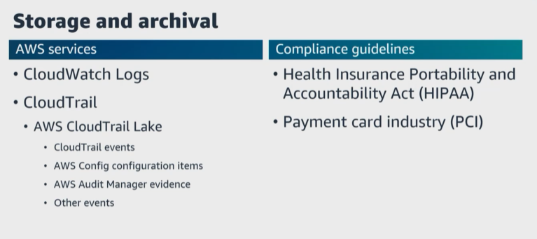
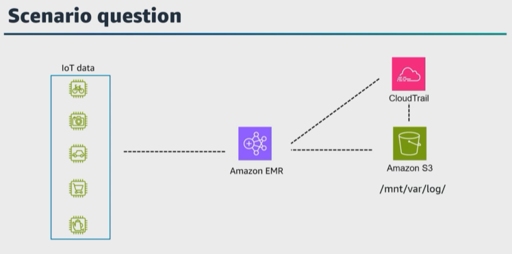
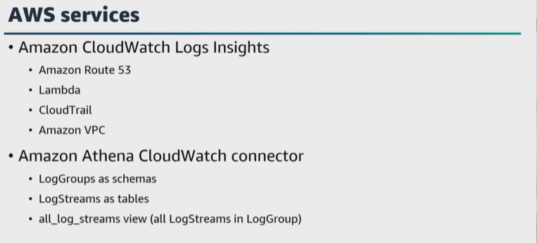

# A. Prepare logs for audit

- [A. Prepare logs for audit](#a-prepare-logs-for-audit)
Let's get started with the fourth task statement from domain 4, prepare logs for audit. Under task statement 2.1 we talked about data storage, the data storage lifecycle, and data retention. 

In previous lessons, we talked about how to log data to ensure that we have the data needed to monitor and to take actions. We also talked about AWS services that are available to log application data to monitor and troubleshoot your applications in AWS. 

|   |    |   
|---|---|

**There are certain regulations such as the ``Health Insurance Portability`` and ``Accountability Act``, or ``HIPAA``, payment card industry, or PCI, and more that require you to keep data for a certain period of time**. And the data needs to be available upon request so you will need a storage and archival data process with the ability to search the data, but you might only need to hold that data for a specific amount of time, so you need the ability to delete that data within the compliance guidelines. 

We've already talked about configuring CloudWatch Logs to log application data and adding automation under task statement 3.3. I do not wanna repeat that content so go back to that lesson if you need a refresher. 

**When you create a log group it is a container for log streams and it helps you organize and control access to your logs**. By default, **log data in CloudWatch Logs is retained indefinitely, and you can configure log retention policies to specify how long you want to retain your log data.** 

We also talked about using ``CloudTrail to track API calls.`` ``CloudTrail Logs`` **are sent to ``Amazon S3`` or ``CloudWatch Logs`` where you can set up alerts, analyze and retain them for compliance and auditing purposes**. For this task statement, let's talk about how to use ``CloudTrail Lake`` for centralized logging queries, for ``CloudTrail`` events across AWS accounts and Regions. 

You can also use ``CloudTrail Lake`` integrations **to log and store user activity data from outside of AWS**. 

When **you create an event data store**, **you choose the type of events to include in your event data store**. You can create an event data store to include ``CloudTrail events, AWS Config configuration items, AWS Audit Manager evidence``, or **events from outside of AWS**. 

Because the event schema is unique to the event category, **each event data store can only contain a specific event category**, such as an AWS Config configuration items or ``CloudTrail`` events. 

Then **you can run SQL queries across multiple event data stores using the supported SQL JOIN keywords**. 
> **CloudTrail doesn't support authorization based on tags for trails, however, you can control access to actions on event data stores by using authorization based on tags**. 

``AWS CloudTrail Lake`` **supports ``CloudWatch metrics``, which you can use to view information about the amount of data ingested into your event data store during the last hour or over the course of its retention period**. 

Here is a question. 

|   |    |   
|---|---|

When you are designing your cluster in ``Amazon EMR``, what considerations do you need to consider regarding logging logs and audits? 

One thing I think of is how much debugging support do I need or want? 

``Amazon EMR`` `**can archive log files** to ``Amazon S3``. By default, **each cluster writes log files on the primary node**. These are written to the ``/mnt/var/log/`` directory. 

``Amazon EMR`` **also integrates with ``CloudTrail``. ``CloudTrail`` captures all API calls for ``Amazon EMR`` as events**. The calls captured include **calls from the ``Amazon EMR`` console and code calls to the ``Amazon EMR API`` operations**. 

If **you create a trail, you can start a continuous delivery of CloudTrail events to an S3 bucket, including events for Amazon EMR``**. 

If **you don't configure a trail, you can still view the most recent events in the CloudTrail console in event history**. 

|   |    |   
|---|---|

To analyze logs, ensure you know which AWS services to use for your specific design and requirements. 

You can use ``CloudWatch Logs Insights`` **to search and analyze your log data** in ``CloudWatch Logs``. You can perform queries to help you respond to operational issues. **If an issue occurs you can use ``CloudWatch Log Insights`` to identify potential causes and validate deployed fixes**. ``CloudWatch Log Insights`` **automatically discovers fields in logs from AWS services, such as ``Amazon Route 53, Lambda, CloudTrail, and Amazon VPC``, and any application or custom log that emits log events as JSON. 

Also, the ``Amazon Athena CloudWatch connector`` `**gives ``Athena`` the ability to communicate with ``CloudWatch`` so that you can query your log data with SQL**. The **connector maps your log groups as schemas and each log stream as a table**. The **connector also maps a special all_log_streams view that contains all log streams in the log group**. This view helps to query all the logs in a log group at once instead of searching through the log streams individually. 

And you can configure a ``CloudWatch Logs log group`` **to stream data received in your OpenSearch Service cluster in near real time through a CloudWatch Log subscription**. With the help of ``CloudWatch``, **you can consolidate all of your system, application, and AWS service logs into a single highly scalable service**. 

Data engineers can discover the logs for the services they run in CloudWatch and keep a debug log while developing. You can also schedule the services you want to launch during a specific timeframe using ``CloudWatch Events``. 

Let's get started with the last task statement from domain 4.