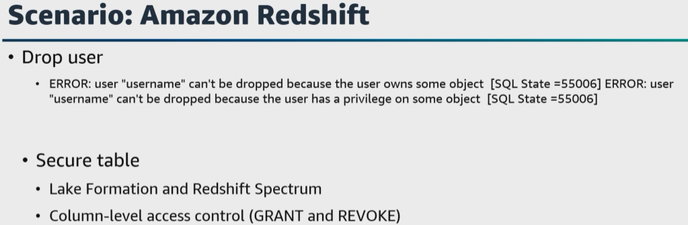

# A. Lesson 5: Understand data privacy and governance

- [A. Lesson 5: Understand data privacy and governance](#a-lesson-5-understand-data-privacy-and-governance)
- [B. Walkthrough question 7](#b-walkthrough-question-7)
- [C. Walkthrough question 8](#c-walkthrough-question-8)
- [D. Additional resources](#d-additional-resources)


Let's get started with the last task statement from domain 4, which is to understand data privacy and governance. Throughout this course, we have mentioned the importance of protecting data. 


For this task statement, we will dive deeper into personally identifiable information or PII data and data sovereignty. Under the fundamentals lessons for this course, we talked about how the entire data lifecycle must include security. 

|   |    |   
|---|---|

Let's start with solutions designed to protect sensitive data for its entire lifecycle in AWS. **You can protect data in transit over individual communication channels using transport layer security, or TLS, and at rest in individual storage solutions using volume encryption, optic encryption, or database table encryption.** 

However, if you have sensitive workloads, you might need additional protection that can follow the data as it moves through the entire data lifecycle. **Fine-grain data protection techniques such as ``field-level encryption`` give you the ability to protect sensitive data fields in larger application payloads while leaving nonsensitive fields in plaintext**. 

* ``Field-level encryption`` **is used to protect sensitive data fields individually while retaining the structure of the application payload**. 
* The alternative is ``full payload encryption``, **where the entire application payload is encrypted as a binary blob**, which makes it unusable until the entirety of it is decrypted. 
  
It is best practice to protect sensitive data to reduce its exposure throughout its lifecycle. **This means protecting data as early as possible on ingestion and ensuring that only authorized users and applications can access the data only when and as needed**. 

Here is an example, 

|   |    |   
|---|---|

``CloudFront``, when combined with ``Lambda@Edge``, **provides an environment at the edge of the AWS network to protect sensitive data upon ingestion in AWS**. Since the downstream systems don't have access to sensitive data, data exposure is reduced, which helps to minimize your compliance footprint for auditing purposes. 

|   |    |   
|---|---|

The following figure shows how ``PII`` data fields in a ``JSON`` construction that are deemed sensitive by an application can be transformed from plaintext to ciphertext with a ``field-level encryption`` mechanism. Here is a question, how can you create a secure data lake by masking, encrypting data, and enabling fine-grain access with Lake Formation to process your data? 


|   |    |   
|---|---|

Let's say that you have data that is ingested through a serverless pipeline to identify, mask, and encrypt sensitive data before storing it securely in Amazon S3. After the data has been processed and stored, you use Lake Formation to define and enforce fine-grain access permissions to provide secure access for data analysts and data scientists. What is a use case?

Well, **your solution might be designed for diagnostic devices that are sending message queuing telemetry transport, or MQTT messages, onto an AWS IoT Core topic**. 
* You could use ``Kinesis Data Firehose`` to pre-process and stage the raw data in Amazon S3. 
* Then use ``AWS Glue`` for ETL to further process the data by calling ``Amazon Comprehend`` to identify any sensitive information. 
* Then use ``Lake Formation`` **to define fine-grained permissions that restrict access to business analysts and data scientists who use ``Athena`` to query the data**. 

Here is another example.

|   |    |   
|---|---|

Let's say that you have an application that runs on a scheduled basis, such as four times a day every 6 hours by default. To process data that is added to the raw data S3 bucket, you can customize the application to perform a sensitive data discovery scan during any stage of this pipeline. Because most customers do their ETL daily, the application scans for sensitive data on a scheduled basis before any crawler jobs run to catalog the data and after typical validation and data redaction or tokenization process is complete. 

But, remember, this can add time to your pipeline. You can expect that this additional validation will add 5 to 10 minutes to your pipeline execution at a minimum. The validation processing time will scale linearly based on object size, but there is a startup time per job that is constant. If sensitive data is found in the objects, an email is sent to the administrator requesting an approval decision, which they can approve or deny the next steps of the pipeline. In most cases, the reviewer will choose to adjust the sensitive data cleanup processes to remove the sensitive data, deny the progression of the files and reingest the files in the pipeline. 

So **the application could be designed to use IAM managed policies to grant permissions for the ``Lambda functions`` to access AWS resources that are part of the application**. 

* ``S3 buckets`` **can store data in various stages of processing**. You might have a raw data bucket for uploading objects for the data pipeline, a scanning bucket where objects are scanned for sensitive data, a manual review bucket holding objects where sensitive data was discovered, and a scan data bucket for starting the next ingestion step of the pipeline. 
  
* ``Lambda functions`` **initiate the logic to run the sensitive data scans and workflow**. 

* ``Step Functions`` **orchestrate the ``Lambda functions`` for the business logic. 

* A ``Macie`` **sensitive data discovery job** can scan the scanning stage S3 bucket for sensitive data. 

* An ``EventBridge rules`` **starts a ``Step Functions`` workflow execution on a recurring schedule, and 
  
* ``Amazon SNS`` **sends notification to review sensitive data discovered in the pipeline and an 
  
* ``Amazon API Gateway REST API`` **with two resources receives the decisions of the sensitive data reviewer as part of the manual workflow**. 


|   |    |   
|---|---|

For this plan, what are some things that are missing? 

My first thought is **a backup plan, disaster recovery plan, and a data privacy strategy plan**. Why do you need a data privacy strategy plan? 

Well, **it is important to prevent backups or replications of data to disallowed AWS Regions**, which ties back to data sovereignty, which we mentioned earlier. Here is a scenario that covers adding a backup strategy that could also be used for disaster recovery. 

Let's say that you have a typical data lake environment that has multiple users, such as data lake administrators, data engineers, storage administrators, and backup administrators. 
> **Configuration and management of the S3 resources required by the data lake is a responsibility of the storage administrator role**. 

* The ``storage administrators`` **can configure S3 features to help protect data residing in buckets** such as S3 versioning, same Region replication, cross-Region replication, and S3 Object Lock. 

* The ``backup administrator`` role **is responsible for backups, restores and the related compliance of your applications across multiple AWS services**. Using AWS Backup, ``backup administrators`` `**can create backup plans that define the frequency and retention of backups for AWS resources in a single AWS account or across multiple accounts using AWS Organizations**. 
* > The data **is stored in organized and backup vaults that have their own access policies, encryption keys, and locking policies separate from what was defined at the object or bucket level in Amazon S3.** 

Using ``IAM Identity Center``, **you can map your identities to user permissions for the different data lake users**. 

What about data lakes containing data from multiple sources and across various stages of development? For example, raw data from a source system is ingested into one bucket, undergoes transformation that lands it in a curated bucket and becomes part of aggregated data resulting from analytics processing in a different bucket. Transformed and aggregated data can be reproduced from the raw data, so backing up the buckets containing raw data can be the best option for backup. 

However, **for data such as raw data containing ``PII information``, the preference may be to back up the de-identified data instead**. The **S3 buckets housing the critical data can be tagged with a key-value pair schema that indicates the data protection level required**. For example, a tag key of "data protection level" and value of "critical" would be applied to only the S3 buckets requiring backup. Then you can select only the required S3 buckets by using these tag values. he **backup frequency and retention specified determines when the jobs run and for how long the data is stored**.

When using ``AWS Backups for Amazon S3``, **backup administrators can define backup plans that create continuous, periodic, or both types of backups**. 
* ``Continuous backups`` **are useful for point-in-time restores, or PITR**. 
* The ``periodic backup`` rule **defines the frequency and retention required for your compliance requirements** using the same destination vault as your PITR rule. 

> **To further isolate and protect your data, you can use the copy to destination capabilities to copy snapshots to a destination vault that can reside in a different AWS account or Region.** 

**Backups are encrypted using the AWS KMS key associated with the backup vault**. ``AWS Backup Audit Manager`` **lets you audit and report on the compliance of your data protection policies to help meet business and regulatory compliance requirements**. 

To monitor the backup activity of the S3 resources you identified earlier, you can create a custom framework in ``AWS Backup Audit Manager`` with a targeted set of controls configured. Let's walk through another scenario and talk about granting permissions for data sharing in AWS services, for example, data sharing for Amazon Redshift. 

|   |    |   
|---|---|

Let's say that you've attempted to drop a user and receive the following error. 
````sh
ERROR: user "username" can't be dropped because the user owns some object. 
ERROR: user "username" can't be dropped because the user has a privilege on some object. Why? 
````
The **lifecycle of a data share object follows the same pattern as any ``Amazon Redshift object`` from creation to deletion`**. As part of this ``lifecycle, Amazon Redshift`` **applies drop user checks for data share objects**. 
> **You can't drop a user if the user owns any data share objects or if the user has any permissions on data share objects**. 

Here's another question. What if you have a new table in ``Amazon Redshift`` that contains confidential data? This table will be queried by multiple different teams. How can you secure the table to ensure that only users with the permissions can read the columns with the confidential data? 

We mentioned earlier that ``Lake Formation`` and ``Amazon Redshift Spectrum`` could be one solution, but ``Amazon Redshift`` **also has column-level access control and you can use column-level grant and revoke statements to meet security and compliance requirements**. Let's wrap up this lesson and cover one final scenario. 


|   |    |   
|---|---|

We've just talked about managing permissions, but how do you manage configuration changes that have occurred in your account? When you turn on ``AWS Config``, 
* Tt first **discovers the supported AWS resources that exist in your account and generates a configuration item for each resource**. 
* ``AWS Config`` **keeps track of all changes to your resources by invoking the describe or the list API call for each resource in your account**. The service uses those same API calls to capture configuration details for all related resources. 

For example, 
* Removing **an egress rule from a VPC security group** causes ``AWS Config`` **to invoke a describe API call on the security group**. 
* ``AWS Config`` **then invokes a describe API call on all of the instances associated with the security group**. 
* The updated configurations of the security group, which is the resource, and each of the instances, which is the related resources, are recorded as configuration items and delivered in a configuration stream to an S3 bucket. 

If you are using ``AWS Config rules``, **each rule is associated with a ``Lambda function`` which contains the evaluation logic for the rule**. 

> **You can configure ``AWS Config`` to stream configuration changes and notifications to an ``Amazon SNS`` topic.** 

# B. Walkthrough question 7

A company ingests data from its business into Amazon S3 data lake. The company uses analytics services to analyze the data and to create new products based on insights that are collected from the data. Recently, the company established a new data source ingestion from its customer relationship platform to the data lake. A data engineer needs to ensure that any personal identifiable information collected from the new data source is masked before analytics services access the data. The data engineer is using AWS Step Functions to build the solution. 

Which solution will meet these requirements with the least operational overhead?"

Now that we've examined the question, identified keywords and phrases and reviewed the requirements, let's explore the responses. 

**Option A:** Run a profile job by using a custom AWS Lambda function. Create a second Lambda function that reads the profiling job results. If PII is detected, configure the function to run a new custom Lambda function that hashes any columns that contain PII and sends the data to a results bucket in Amazon S3. 

**Option B:** run a profile job by using AWS Glue DataBrew. Create an AWS Lambda function that reads the profiling job results. If PII is detected, configure the function to run a second DataBrew job that mask any columns that contain PII and sends the data to a results bucket in Amazon S3. 

**Option C:** run a profile job by using AWS Glue DataBrew. Create an AWS Lambda function that reads the profiling job results. If PII is detected, configure the function to hash any columns that contain PII and send the data to a results bucket in Amazon S3. 

**Option D:** run a profile job by using AWS Glue DataBrew. Create a second DataBrew job that reads the profiling result. If PII is detected, configure the DataBrew job to hash any columns that contain PII and send the data to the results bucket in Amazon S3. 

Pause the video if you need more time. Okay, let's evaluate the options. 


**Option A** is incorrect. You can develop custom ``Lambda functions`` to perform the data profiling and data hashing. However, **this solution requires more operational overhead for the data engineer**. ``DataBrew`` **already provides this capability by default.** 

**Option B** is a possible correct answer because DataBrew provides data profiling and data masking capabilities that give you the ability to create an automated process to identify and mask PII by using a Step Functions state machine. Even though this is a possible correct answer, it is best practice to review all the answers to ensure that you choose your best choice answer. 

**Option C** is incorrect. You can develop a custom ``Lambda function`` to perform the data hashing and to mask the data. However, this solution requires more operational overhead for the data engineer. DataBrew already provides this capability by default. 

And **option D** is incorrect. This solution would not work because the ``Step Functions`` **state machine would need a ``Lambda function`` to read the results of the first DataBrew profiling job**. Then the ``Lambda function`` would need to run the second DataBrew job if PII is detected. 

So that makes option B the correct answer. 


# C. Walkthrough question 8

A company wants to improve its data lake and allow a broader range of access to the data. Because of this work, the company identifies an increased risk of data leakage. A data engineer must implement a solution that reduces these risks. The solution must ensure the privacy of customer data and must comply with data protection laws. 

Which solution will meet these requirements?" 


Now, that we've examined the question identified keywords and phrases and reviewed the requirements, let's explore the responses. 

**Option A** use Amazon Macie to identify sensitive data. Use AWS Glue Studio to transform and mask the findings. 
**Option B** use AWS CloudTrail to monitor and log all API activity. Set up alerts for any suspicious access patterns. 
**Option C** use AWS Config to enforce security best practices and compliance rules for the data lake. 
**Option D** use Amazon Athena to perform real-time monitoring and anomaly detection on the data access patterns. 
Pause the video if you need more time. Okay, let's evaluate the options. 

**Option A** is a possible correct answer, because ``Macie`` **is a fully-managed data security and data privacy service**. ``Macie`` **uses machine learning and pattern matching to help you discover, monitor, and protect sensitive data**. ``AWS Glue Studio`` **can compose data transformations that perform complex tasks including to detect and mass sensitive data**. Even though this is a possible correct answer, it is best practice to review all the answers to ensure that you are choosing your best choice answer. 

**Option B** is incorrect. ``CloudTrail`` **gives you the ability to audit and track changes on AWS**. ``CloudTrail`` **does not directly address the requirements to reduce the risk of data leakage or to protect the privacy of customer data**. 

**Option C** is incorrect. ``AWS Config`` **assesses and enforces compliance rules for resource configurations**. ``AWS Config`` **does not address the privacy of customer data or data leakage**. 

**Option D** is incorrect. ``Athena`` is an interactive query service. **It gives you the ability to analyze data**. ``Athena`` **is not designed for real-time monitoring or anomaly detection on data access patterns**. This solution does not address the privacy of customer data or data leakage. 

So, that makes option A the correct answer. 

# D. Additional resources

Review these materials to learn more about the topics covered in this exam domain: 


* [What Is IAM?](https://docs.aws.amazon.com/IAM/latest/UserGuide/introduction.html)

* [What Is AWS Certificate Manager?](https://docs.aws.amazon.com/acm/latest/userguide/acm-overview.html)

* [Example IAM Identity-Based Policies](https://docs.aws.amazon.com/IAM/latest/UserGuide/access_policies_examples.html)

* [AmazonDynamoDBFullAccess](https://docs.aws.amazon.com/aws-managed-policy/latest/reference/AmazonDynamoDBFullAccess.html)

* [IAMFullAccess](https://docs.aws.amazon.com/aws-managed-policy/latest/reference/IAMFullAccess.html)

* [AWSCodeCommitPowerUser][(](https://docs.aws.amazon.com/aws-managed-policy/latest/reference/AWSCodeCommitPowerUser.html))

* [AWSKeyManagementServicePowerUser](https://docs.aws.amazon.com/aws-managed-policy/latest/reference/AWSKeyManagementServicePowerUser.html)

* [AWS Access Levels](https://docs.aws.amazon.com/IAM/latest/UserGuide/access_policies_understand-policy-summary-access-level-summaries.html#access_policies_access-level)

* [AmazonMobileAnalyticsWriteOnlyAccess](https://docs.aws.amazon.com/aws-managed-policy/latest/reference/AmazonMobileAnalyticsWriteOnlyAccess.html)

* [AmazonEC2ReadOnlyAccess](https://docs.aws.amazon.com/aws-managed-policy/latest/reference/AmazonEC2ReadOnlyAccess.html)

* [Delegating Access Control to Access Points](https://docs.aws.amazon.com/AmazonS3/latest/userguide/access-points-policies.html#access-points-delegating-control)

* [What Is Amazon API Gateway?](https://docs.aws.amazon.com/apigateway/latest/developerguide/welcome.html)

* [How Amazon API Gateway Works with IAM](https://docs.aws.amazon.com/apigateway/latest/developerguide/security_iam_service-with-iam.html)

* [Insufficient Permissions When Using Athena with Amazon QuickSight](https://docs.aws.amazon.com/quicksight/latest/user/troubleshoot-athena-insufficient-permissions.html)

* [Consolidate and Query AWS CloudTrail Data across Accounts and Regions Using AWS CloudTrail Lake](https://aws.amazon.com/blogs/mt/consolidate-and-query-aws-cloudtrail-data-across-accounts-and-regions-using-aws-cloudtrail-lake/)

* [Tutorial: Detecting and Redacting PII Data with S3 Object Lambda and Amazon Comprehend](https://docs.aws.amazon.com/AmazonS3/latest/userguide/tutorial-s3-object-lambda-redact-pii.html)