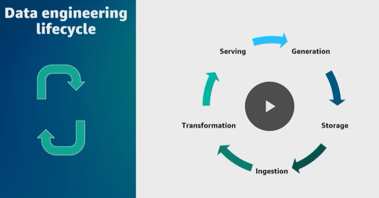
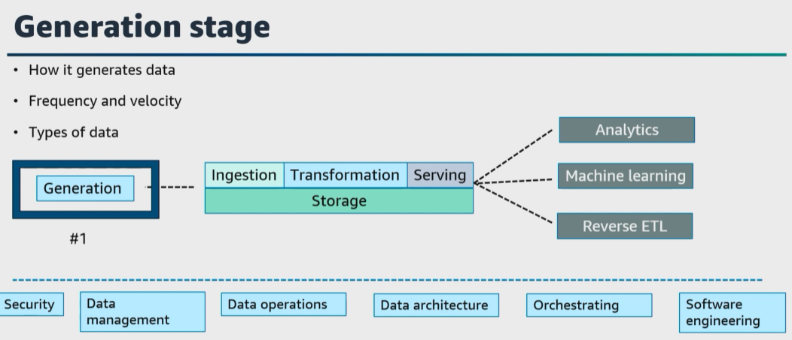
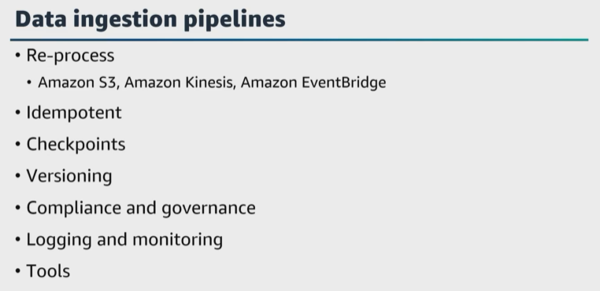
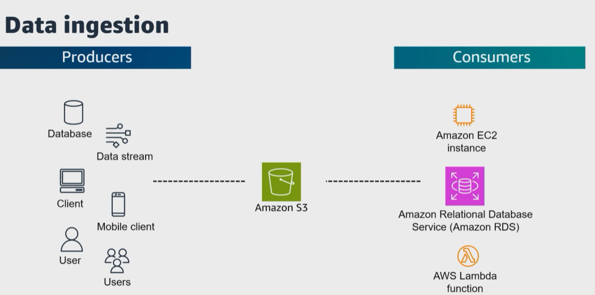
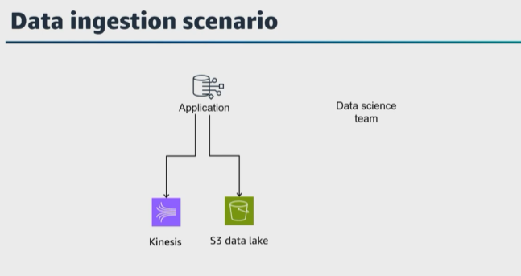

# A. Module 1 Prepare for the Exam
- [A. Module 1 Prepare for the Exam](#a-module-1-prepare-for-the-exam)
  - [A.1 Domain 1: Data Ingestion and Transformation](#a1-domain-1-data-ingestion-and-transformation)
    - [A.1.1 Lesson 1: Perform data ingestion](#a11-lesson-1-perform-data-ingestion)


## A.1 Domain 1: Data Ingestion and Transformation

### A.1.1 Lesson 1: Perform data ingestion




1. ``Generation`` **is where the data originates from, so it is your source system**. This could be an Internet of Things device, a transactional database, an application message queue, and so on. For the generation stage, the data engineer consumes the data from a source system, but does not control that source system. 

Here are just a few questions to consider at this stage. 
* What are the characteristics of the data? 
* How is that data persisted in the source system? 
* Will there be any duplicates, and what is the schema of that source data and does that schema change and more? 


2. The next stage of the data engineering lifecycle is ``storage``. Ensure you can choose an appropriate solution to store the source data, and we will cover this stage under domain 2, **data store management**, but I wanted to mention it here as the second stage and remind you to understand different use cases and different AWS storage services to ingest your data from the source system into AWS. 

3. Let's move on to the third stage of the data engineering lifecycle, which is ``ingestion`` and the focus of this task statement. So after **you understand your data source, the characteristics of the source system, how that data is stored in the source system, and have a plan and design to store the ingested data, you then need to gather and ingest that data**. Here are a few questions to ask yourself. 
* What are the use cases for the data being ingested? 
* Where will this data go after it's ingested? 
* What is the frequency and volume of data being ingested? What format is the data in and more? 

There are **two major data ingestion concepts to consider at this stage**. 
* ``Batch`` compared to ``streaming`` and 
* ``push`` compared to ``pull``. 

Ensure you understand each and the differences of batch, streaming, push, and pull for this exam. 




* Consider **replayability of your data ingestion pipelines**. ``Replayability`` **helps to reprocess data in case of failures, updates, or changes in the pipeline logic**. What are considerations to achieve **replayability** in your data ``ingestion`` pipelines? **I always recommend designing your data ingestion pipeline in an event-driven manner**. What are ``AWS services`` you can use to collect and initiate events when new data arrives or if a change occurs? 

A few services that can help here are ``Amazon S3, Amazon Kinesis, or Amazon EventBridge``. 
>> **It is best practice to test the replayability of your data ``ingestion`` pipelines using different simulation scenarios and reprocessing scenarios to validate idempotents and consistently reprocess data without data loss, duplication, or integrity issues**.

This helps the pipeline to process the same data multiple times without data duplication or inconsistencies. 

* Also **configure checkpoint mechanisms within the pipeline to track the progress and state of data processing to determine the last successfully processed data point**. Then the pipeline can resume processing from that point in case of failures or interruptions. 

* Also, 
  * Add data **versioning** within your data ``ingestion`` pipeline. **Store the raw or intermediate data in a durable and scalable ``storage`` service** such as ``Amazon S3``. This ensures you retain the data for a period of time for ``compliance requirements, data governance policies, and for replayability``, and then of course ```add logging and monitoring`` within the data ``ingestion`` pipeline **to capture relevant logs, errors, and metrics to track the progress, identify failures, and analyze the behavior of the pipeline**, and finally, 
  
  * Use infrastructure as code tools such as ``AWS CloudFormation or AWS Cloud Development Kit, or AWS CDK``, to automate the deployment and configuration of your data ingestion pipeline. 
  



