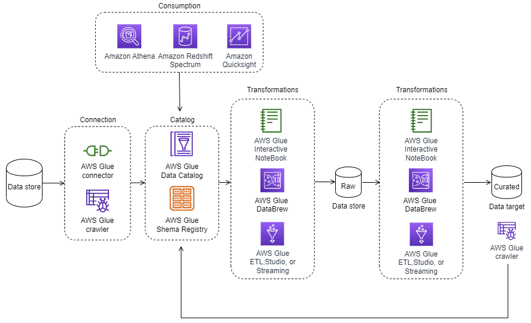

# A. Amazon Glue Getting Started
- [A. Amazon Glue Getting Started](#a-amazon-glue-getting-started)
  - [A.1 Introduction to AWS Glue](#a1-introduction-to-aws-glue)
  - [A.2 Which problems does AWS Glue solve?](#a2-which-problems-does-aws-glue-solve)
    - [A.3 What are the benefits of AWS Glue?](#a3-what-are-the-benefits-of-aws-glue)
  - [A.4 What is the data integration engine supported by AWS Glue?](#a4-what-is-the-data-integration-engine-supported-by-aws-glue)
  - [A.5 How much does AWS Glue cost?](#a5-how-much-does-aws-glue-cost)
  - [A.6 Architecture and Use Cases](#a6-architecture-and-use-cases)
    - [A.6.1 How is AWS Glue used to architect a cloud solution?](#a61-how-is-aws-glue-used-to-architect-a-cloud-solution)
    - [A.6.2 What are the basic technical concepts of AWS Glue Studio?](#a62-what-are-the-basic-technical-concepts-of-aws-glue-studio)
    - [A.6.3 What are the basic technical concepts of AWS Glue DataBrew?](#a63-what-are-the-basic-technical-concepts-of-aws-glue-databrew)
    - [A.6.4 What are typical use cases for AWS Glue?](#a64-what-are-typical-use-cases-for-aws-glue)
  - [A.7 What else should I keep in mind about AWS Glue?](#a7-what-else-should-i-keep-in-mind-about-aws-glue)

## A.1 Introduction to AWS Glue
``AWS Glue`` is a **serverless data integration service, which means that you only pay for usage and don't pay for idle time**. With AWS Glue, data scientists, analysts, and developers can **discover, prepare, and combine data for various purposes**. Examples include analytics, machine learning (ML), and application development. ``AWS Glue`` provides visual and code-based interfaces for data integration activity and transforms data using built-in transformations. 

[AWS Glue Documentation](https://docs.aws.amazon.com/glue/index.html)
To learn more about AWS Glue, choose the following button.

## A.2 Which problems does AWS Glue solve?

* **Provisions and manages the lifecycle of resources**: ``AWS Glue`` **provisions the requested resources like servers, storage, and runtime environment that ETL jobs need**. It also **manages the lifecycle of these resources and removes them when they are not being used.** ``AWS Glue`` maintains the resource pool from where requested capacity is allocated.

* **Provides interactive tools**: ``AWS Glue`` has tools for each persona for performing development activities that include no-code, low-code, and interactive tools, so it reduces development time.

* **Auto-generated code**: ``AWS Glue`` auto-generates code when built-in transformations are used, which is optimized for runtime and cost-effectiveness. It also provides features to upload the scripts to make migration more straightforward.

* **Connects to hundred of data stores** : ``AWS Glue`` connects to hundreds of data stores, including Amazon Redshift, relational databases, MongoDB, and software as a service (SaaS) providers like Salesforce. It also exposes APIs to conveniently build your own connectors.

* **Create a data catalog for various dat sources**: ``AWS Glue`` provides the opportunity to create a data catalog for various data sources that could help search metadata and classify data. AWS Glue Data Catalog is used by multiple analytics services to work on the data.

* **Identifies sensitive data using ML rekognition patterns for PII**: ``AWS Glue`` helps in identifying sensitive data using ML recognition patterns for personally identifiable information (PII). After identification, you can remediate them by redacting through string or cryptographic hashing.

* **Menage and enforce schemas on data-streaming application**: Using ``AWS Glue``, you can also manage and enforce schemas on data-streaming applications. Integrations with Apache Kafka and Amazon Kinesis help ensure that downstream systems are not affected by semantic changes in upstream systems.

* **Offers data quality and automatic data scalling**: ``AWS Glue`` offers data quality for creating and applying built-in rule types or custom rule types to clean and normalize your data. AWS Glue automatically scales as the volume of data increases, and it is integrated with Amazon CloudWatch for monitoring.

### A.3 What are the benefits of AWS Glue?

* **Faster data integration**: With ``AWS Glue``, developers have the flexibility to choose their preferred tool for data preparation and processing. This makes it possible to quickly deliver data for analytics, ML, and application development. By creating repeatable and reusable workflows, developers can streamline data integration and ETL processes, making collaboration on these tasks more efficient. 

* **Automate data integration at scale**: ``AWS Glue`` uses crawlers to scan data sources, identify data format and metadata, register the data's schema, and generate code for transformations. It also provides workflows that developers can use to create streamlined and advanced pipelines for ETL tasks.

* **No Infrastructure to manage**: ``AWS Glue`` helps you prepare and work on data without users needing to provision and maintain any infrastructure. This makes AWS Glue serverless, because AWS will manage and provision servers from a warm pool. It automatically scales resources up and down as required by AWS Glue jobs. By doing this, data engineers and developers can focus on writing business logic and creating complex workflows. AWS Glue works with continuous integration and continuous delivery (CI/CD) and also with alerting or monitoring services to make their workload self-service.

* **Create, run, and monitor ETL jobs without coding**: ``AWS Glue`` Studio provides straightforward creation, running and monitoring of ETL tasks for data transformation through a user-friendly drag-and-drop interface. It automatically generates code and offers built-in transformations from AWS Glue DataBrew that can assist with data cleaning and standardization. The processed data can then be used for analytical and ML purposes.

* **Pay only for what you use**: With ``AWS Glue``, users pay only for the resources they consume. There's no upfront cost, and users are not charged for a start-up or shutdown time.

## A.4 What is the data integration engine supported by AWS Glue?

* **AWS Glue for Apache Spark**: ``Apache Spark`` is an open-source distributed framework that makes it possible to write transformations for batch and streaming data in Python and Scala. With Spark SQL, developers can write SQL-like queries on big data. Apache Spark also provides ML libraries that run in distributed platforms.

* **AWS Glue for Python**: AWS Glue for Python`` gives analytics users a Python shell environment to run their Python scripts with the latest Python version.

* **AWS Glue for RAY**: Ray (ray.io) is a new open-source compute framework that helps you scale Python workloads. ``AWS Glue`` for Ray facilitates the distributed processing of Python code over multi-node clusters. Users can create and run Ray jobs without trying to learn any big-data framework. Ray is a popular tool being used to parallelize complex transformations that are common among ML workloads.

## A.5 How much does AWS Glue cost?

* [AWS Glue pricing](https://aws.amazon.com/glue/pricing/)
For more information on AWS Glue pricing, choose the following button.

* [AWS Glue pricing calculator](https://calculator.aws/#/createCalculator/Glue)
To access the AWS Glue pricing calculator, choose the following button.

## A.6 Architecture and Use Cases
### A.6.1 How is AWS Glue used to architect a cloud solution?
With ``AWS Glue``, **you can identify and build a technical data catalog for various data storage locations**. You can use this data catalog as input and then carry out ETL or extract, load, transform (ELT) processes based on their requirements. The following architecture displays the typical pattern of connecting to data sources using connectors. Later, crawl the data to identify the schema, clean and standardize, and author the ETL process to generate raw data. Then, use the same ETL utilities provided by ``AWS Glue`` to create refined data. This data can finally be consumed through analytical query engines like Amazon Athena, Amazon Redshift, and Amazon QuickSight.

### A.6.2 What are the basic technical concepts of AWS Glue Studio?
* **Connection**: An **AWS Glue** connection is an object in the Data Catalog that holds information such as login credentials, URI strings, VPC details, and more for a specific data store.

* **Crawlers**: An **AWS Glue crawler** can connect to various sources, identify their schema, and categorize them into data formats. They can also create metadata tables in the Data Catalog by using built-in data classifiers.

* **Datastore, data source, data target**: A **data store** refers to physical storage where data is meant to persist permanently. An example of data stores in AWS would be Amazon S3 buckets and relational databases like Amazon Relational Database Service (Amazon RDS) for MySQL. These can serve as the input for processing or transformation. A **data target** refers to a data store where a process or transformation is output-written.

* **AWS Glue interactive sessions**: With **AWS Glue interactive sessions**, users can build and test data preparation needed for analytics applications. These sessions provide self-managed notebooks, which help developers write one-time queries or transformations that can be used to prepare data for ML. **AWS Glue interactive sessions** offer notebook editors, which can be deployed locally or remotely. Doing it this way can assist developers with quick development and testing time. **AWS Glue** integrates with **AWS Glue Studio** and **Amazon SageMaker Studio** for notebook management.

* **DynamicFrame**: A DynamicFrame is a distributed table that facilitates the storage of nested data, such as structures and arrays. It does this by cleaning and reorganizing semi-structured datasets like JSON, Avro, and Apache logs. With DynamicFrame, there is no need for an upfront schema. The schema can be inferred without interruption so that transformations occur in a single pass. It is not difficult to handle unexpected changes because it tracks new fields and inconsistent changes in data types with choices, automatically marking and separating error records.

* **Job** : 

* **File formats** : 

* **Table** :

* **Transform** : Transform is the code logic that is used to manipulate data into a different format and translate that into business logic.

* **AWS Glue Triggers**: A trigger, which initiates or starts an ETL job, can be defined based on a scheduled time or an event.

### A.6.3 What are the basic technical concepts of AWS Glue DataBrew?

* **Dataset:** In ``DataBrew``, a dataset refers to data that can be obtained from various sources, such as an Amazon S3 file, a supported JDBC data source, or the Data Catalog. The dataset also includes information on how DataBrew can access the data if it is not directly uploaded.

* **Profiling:** ``DataBrew`` validates data by running a series of evaluations to identify trends and spot any irregularities by accessing data directly from the data lake, data warehouses, and databases.

* **Data Lineage**: ``Data lineage`` is a visual representation of all the data transformations, from origin to target.

* **Data quality**:

* **Recipes**: In ``DataBrew``, **a recipe is a sequence of operations used to transform the data**. The steps in a recipe can be tested on a data sample before being applied to the entire dataset.

* **Project**: 

* **Jobs**:

* **File type**: ``DataBrew`` supports specific file types and formats, including comma-separated values (CSV), Microsoft Excel workbook, JSON documents and JSON lines, Apache Optimized Row Columnar (ORC), and Apache Parquet format.

* **Transform**: Transform is the set of instructions or algorithms used to transform your data into a different format.

[AWS Glue DataBrew](https://aws.amazon.com/glue/features/databrew/)
To learn more about AWS Glue DataBrew, choose the following button.

### A.6.4 What are typical use cases for AWS Glue?

* Streamlined ETL development
* **Technical data catalog to find data across multiple data sources:** Users can use Data Catalog to quickly discover and search across multiple AWS datasets without moving the data. After the data is cataloged, it is immediately available for search and query using Athena, Amazon EMR, and Amazon Redshift Spectrum.
 
* **Data quality, data preparation, and data profiling coding**: AWS Glue offers flexibility by providing users the opportunity to create custom data quality rules or use a set of recommended rules for quick data quality checks. Data quality in AWS Glue is integrated with CloudWatch for monitoring and alerting, in case of messy data. 

*  **Quick job orchestration and visualization with drag and drop**: 
  
* **Real-time data processing**: 

## A.7 What else should I keep in mind about AWS Glue?

``AWS Glue`` is a **scalable data integration service that streamlines the ETL process using built-in connectors**. You can design complex workflows using crawlers, jobs, and initiations, and choose to author the jobs using code or visual transformations. The jobs can be deployed using AWS CloudFormation, which acts as infrastructure as code in JSON or YAML, and can be version-controlled in Bitbucket or GitHub. ``AWS Glue`` also offers centralized monitoring through a single pane of glass. This helps you check the status of your ETL pipeline and start, stop, and rerun jobs they have created. 

* **Partitioning**: Partitioning is a technique that organizes related data together to minimize the amount of data scanned, thus improving query speed. By partitioning data in the Amazon S3 data lake, ``AWS Glue`` can scan only the data that matches the transformation logic. The ``AWS Glue crawler`` or jobs determine which data to process based on the underlying schema and partitioning strategy. 

* **Run locally first**: Experienced developers believe **developing and testing ETL code for their business logic locally is fast and cost-effective**, even in present time. ``AWS Glue`` provides options for local development through a Docker image and the ``AWS Glue Studio ETL libraries``. Additionally, **users can test their scripts remotely using AWS Glue interactive sessions in AWS Glue Studio**.

* **Using Auto Scalling for AXS Glue**: With the ``AWS Glue Auto Scaling feature``, **ETL jobs can dynamically adjust the number of workers based on the processing demand for complex transformations**. When the demand decreases, the number of workers returns to its original state. By doing this, developers don’t have to hardcode workers needed for their jobs. **This feature is available in AWS Glue version 3.0 or higher.**

* **Compression and file format**: **Compressing your data conserves storage space and enhances the performance** of distributed processing by minimizing network traffic between ``Amazon S3``, ``AWS Glue``, and other AWS services. Choosing a file format that supports compression, such as the columnar ``Parquet format``, can improve performance. **It is usually more efficient to work with fewer larger files, rather than multiple smaller files**, when querying data stored in Amazon S3.

* **Use Job Bookmarks: Incremental processing**: ``AWS Glue`` has a mechanism for tracking the records processed in each job, known as job **bookmarks**. These bookmarks persist state information from previous job runs and help prevent reprocessing of old data. Using job bookmarks, developers can efficiently process only new or incremental files when rerunning a job. This provides efficient maintenance of state information and optimized processing.

* **Security and encryption of data**:

* **Job monitoring**: Monitoring production in ``AWS Glue`` jobs is an important part of maintaining the reliability, availability, and performance of ``AWS Glue``. You can use the following automated monitoring tools to watch ``AWS Glue``.

* **Amazon Codewhisperer**: ``AWS Glue`` can be integrated with ``Amazon CodeWhisperer``, a coding companion. With this integration, you can develop code quickly and conveniently, which can help speed up your data preparation for analytics and ML.

* **Transactional data lake**: ``AWS Glue for Apache Spark`` **now supports three open-source data lake storage frameworks**: ``Apache Hudi, Apache Iceberg, and Linux Foundation Delta Lake``. These frameworks provide consistent reading and writing of data in Amazon S3. 

[AWS Glue features](https://aws.amazon.com/glue/features/)
To learn more about features for AWS Glue, choose the following button.