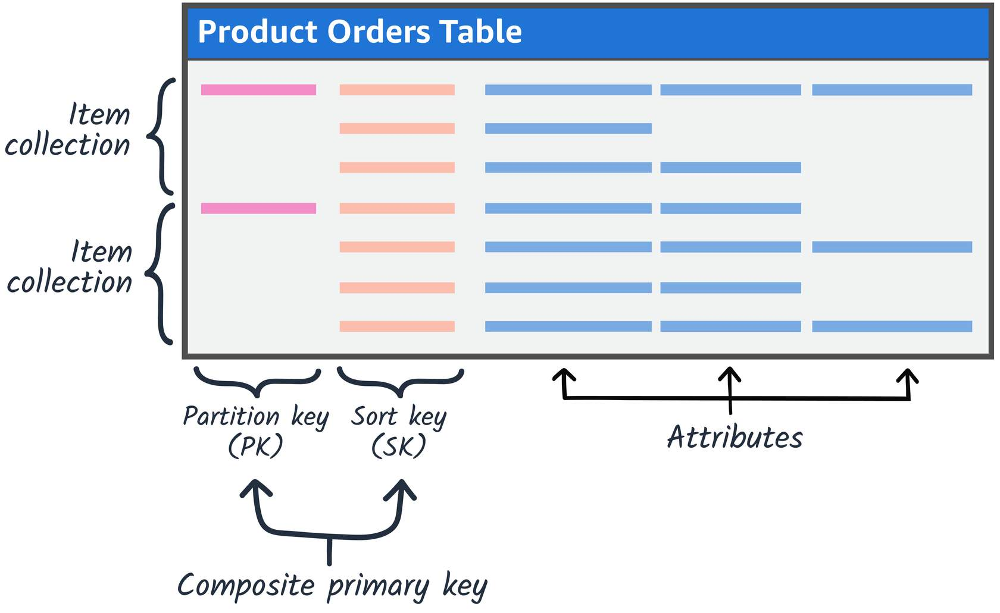
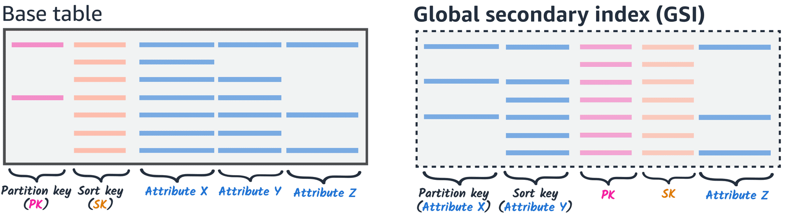

# A. Amazon DynamoDB - Data Modeling Techniques
- [A. Amazon DynamoDB - Data Modeling Techniques](#a-amazon-dynamodb---data-modeling-techniques)
- [B. Basics concepts](#b-basics-concepts)
  - [B.1 Denormalization](#b1-denormalization)
  - [B.2 Item Collections](#b2-item-collections)
    - [B.2.1 Vertical partitioning](#b21-vertical-partitioning)
    - [B.2.2 Single table versus multiple table design](#b22-single-table-versus-multiple-table-design)
  - [B.3 Adjacency Lists](#b3-adjacency-lists)
  - [B.4 Global Secondary Indexes](#b4-global-secondary-indexes)

``Data modeling`` is **the process of effectively organizing your data to handle your application's access patterns**. Following are the three steps of the Amazon DynamoDB data modeling process.
* **Create your entity-relationship diagram(ERD)**
* **List your write and read access patterns**
* **Design your primary keys to handle your access patterns**

> In ``DynamoDB``, **defining your application's data access patterns up front is essential**. You design your schema specifically to make the most common and important queries as fast and as inexpensive as possible. 

**If data is unevenly distributed across partitions**, it can result in hot partitions—where some partitions receive significantly more traffic than others. **This can lead to throttling of requests to the hot partitions and under-utilization of capacity in other partitions, resulting in decreased throughput and increased latency.**

For information about ``DynamoDB`` quotas, see Service, account, and table quotas in [Amazon DynamoDB](https://docs.aws.amazon.com/amazondynamodb/latest/developerguide/ServiceQuotas.html).

# B. Basics concepts
## B.1 Denormalization
``Denormalization``, opposite of the normalized model, **is where redundancy is implemented intentionally and data is combined to have everything in a single table**. Unlike a tightly woven relational schema, **denormalized data can scale to millions of requests because users only need to query sections of a single table**.

With a ``denormalized schema``, **it is more convenient to scale and develop your modern applications and [microservice architectures](https://aws.amazon.com/microservices/). 
> **This is because each service typically stores and processes data for a single business function**.

>> As a general rule, **you should maintain as few tables as possible in a ``DynamoDB`` application**. 

Having fewer tables keeps things more scalable, requires less permissions management, and reduces overhead for your ``DynamoDB`` application.

>> **``DynamoDB`` has an item size limit of 400 KB.**

* Denormalizing can make some operations more complex. For example, if you choose to store a user’s phone number redundantly with every item that composes their order history, updating that user’s phone number requires updating multiple items.

* For more information, see [Best practices for modeling relational data in DynamoDB](https://docs.aws.amazon.com/amazondynamodb/latest/developerguide/bp-relational-modeling.html).

## B.2 Item Collections

> **Item collections** are the primary mechanism to model one-to-many relationships in ``DynamoDB``. 

* The **primary key** that uniquely identifies each item in a ``DynamoDB`` table can be **simple (a partition key only)** or **composite (a partition key combined with a sort key)**.

* An **item collection** is **a set of items with the same partition key value, but different sort key values**. 
  >>>> **The partition key is used for grouping, and the sort key is used for ordering.**

By storing items with the same partition key (item collection), it helps eliminate the need for maintaining multiple tables and complex relationships between them. With **item collections, the goal is to design the table's key structure in a way that can satisfy all or most of your application's access patterns**.

* For more information, see [Working with Item Collections](https://docs.aws.amazon.com/amazondynamodb/latest/developerguide/WorkingWithItemCollections.html)

### B.2.1 Vertical partitioning
**Item collections aren’t just useful for reducing the need to duplicate data, they are also the core of another common data modeling practice in DynamoDB—vertical partitioning**.

``Vertical partitioning`` **takes large items or documents and breaks them into a collection of multiple smaller items**. It often makes sense to further decompose documents such as a user’s profile or their shopping cart’s contents into a collection of small items. 
> **Usually, the goal is to segregate mutable or frequently updated data from immutable or infrequently changing information**.

``DynamoDB`` **is optimized for uniform distribution of items across a table's partitions, no matter how many partitions there may be**. 
> **We recommend that you choose a partition key that can have a large number of distinct values relative to the number of items in the table.**

### B.2.2 Single table versus multiple table design

Single table design is the recommended design pattern for most ``DynamoDB`` use cases. Following are advantages and disadvantages of single and multiple table designs.

| **Design type**  | **Advantages**  | **Disadvantages**  |
|---|---|---|
| **Single table design**  | Single table design  | Learning curve can be steep due to paradoxical design compared to relational databases  |
|   | Supports queries for multiple entity types in a single database call  | Data requirements must be consistent across all entity types.  |
| Multiple table design  | A good option when your application’s access patterns do not have the need to query multiple entities together.  | For access patterns that require data across multiple tables, multiple reads from DynamoDB will be required and data may need to be processed or joined on the client code.  |
|   | Straightforward to design for those who aren't used to working with single table design.  | Operations and monitoring of multiple tables requires more CloudWatch alarms and each table must be scaled independently.  |
|   | Straightforward implementation of GraphQL resolvers(opens in a new tab) due to each resolver mapping to a single entity (table).  | Each table's permissions will need to be managed separately. The addition of tables in the future will require a change to any necessary AWS Identity and Access Management (IAM) roles or policies.  |
|   | Allows for unique data requirements across different entity types.  |   |
|   | Each table can have its own change data stream(opens in a new tab). This allows a dedicated Lambda function for each type of item, rather than a single monolithic processor.  |   |

* For more information, see [Data modeling for DynamoDB tables](https://docs.aws.amazon.com/amazondynamodb/latest/developerguide/data-modeling.html).

## B.3 Adjacency Lists
> **When different entities of an application have a many-to-many relationship between them, the relationship can be modeled as an adjacency list.**

In an ``adjacency list``, **all top-level entities are represented as items or item collections using the partition key**. Relationships to other entities are represented as items within those collections, pointing to the target identity ID. Looking at an example schema can help clarify this design.

* For more details, see Best practices for [managing many-to-many relationships](https://docs.aws.amazon.com/amazondynamodb/latest/developerguide/bp-adjacency-graphs.html).

## B.4 Global Secondary Indexes

**To ensure efficient queries on non-key attributes, you can support alternate access patterns using ``global secondary indexes (GSI)``**.

Some of your applications will need to perform queries using attributes that are not part of your base table's primary key (non-key attributes). To support these alternate access patterns, you can create one or more indexes and issue query requests against them. 

With ``GSIs``, **you only write to your base table**. ``DynamoDB`` handles copying data into the index for you. Further, data is copied asynchronously, so GSIs only support eventual consistency reads.