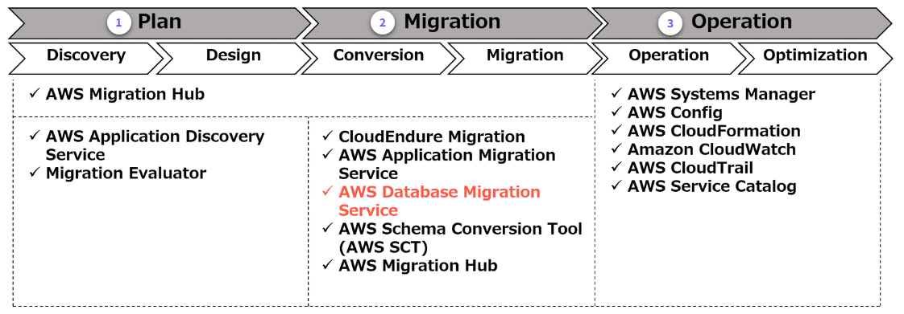
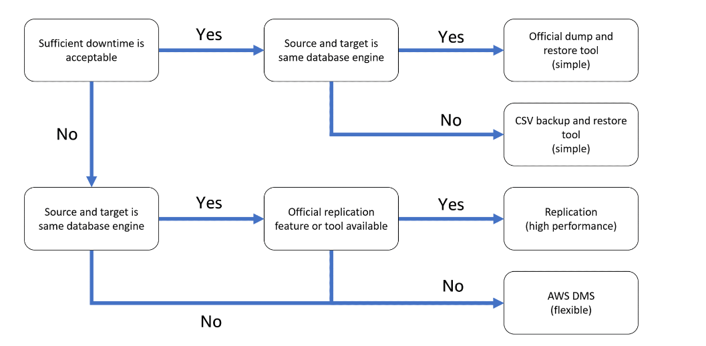
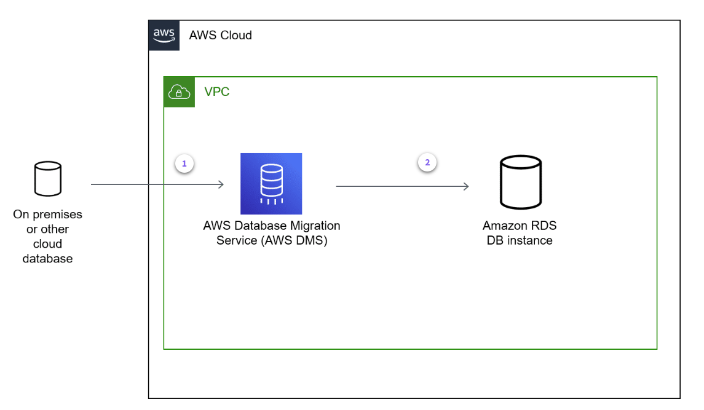

# A. AWS Database Migration Service (AWS DMS) Getting Started

- [A. AWS Database Migration Service (AWS DMS) Getting Started](#a-aws-database-migration-service-aws-dms-getting-started)
  - [A.1 Introduction to AWS DMS](#a1-introduction-to-aws-dms)
  - [A.2 What problems does AWS DMS solve?](#a2-what-problems-does-aws-dms-solve)
  - [A.3 How do I determine if AWS DMS is the right tool?](#a3-how-do-i-determine-if-aws-dms-is-the-right-tool)
  - [A.4 What are some key features of AWS DMS?](#a4-what-are-some-key-features-of-aws-dms)
  - [A.5 What are the benefits of AWS DMS?](#a5-what-are-the-benefits-of-aws-dms)
  - [A.6 Architecture and Use Cases](#a6-architecture-and-use-cases)
    - [A.6.1 How is AWS DMS used to architect a cloud solution?](#a61-how-is-aws-dms-used-to-architect-a-cloud-solution)
  - [A.6.2 What are the basic technical concepts of AWS DMS?](#a62-what-are-the-basic-technical-concepts-of-aws-dms)
    - [A.6.3 What are typical use cases for AWS DMS?](#a63-what-are-typical-use-cases-for-aws-dms)
  - [A.7 How do I use AWS CLI with AWS DMS?](#a7-how-do-i-use-aws-cli-with-aws-dms)
    - [A.7.1 Create a replication subnet group](#a71-create-a-replication-subnet-group)
    - [A.7.2 Create a replication instance](#a72-create-a-replication-instance)
    - [A.7.3 Create a source endpoint](#a73-create-a-source-endpoint)
    - [A.7.4 Create a target endpoint](#a74-create-a-target-endpoint)
    - [A.7.5 Create a replication task](#a75-create-a-replication-task)
  - [A.8 How Do I Use AWS CloudFormation with AWS DMS?](#a8-how-do-i-use-aws-cloudformation-with-aws-dms)
    - [A.8.1 How do I create an AWS DMS replication subnet group?](#a81-how-do-i-create-an-aws-dms-replication-subnet-group)
    - [A.8.2 How do I specify an AWS DMS endpoint?](#a82-how-do-i-specify-an-aws-dms-endpoint)
    - [A.8.3 How do I create an AWS DMS replication task?](#a83-how-do-i-create-an-aws-dms-replication-task)
  - [A.9 How Do I Use AWS DMS with a Programming Language?](#a9-how-do-i-use-aws-dms-with-a-programming-language)
  - [A.10 How can I learn more about AWS DMS ?](#a10-how-can-i-learn-more-about-aws-dms-)

## A.1 Introduction to AWS DMS

> **AWS  DMS is a web service that automates the process for online data migration.**

``AWS DMS`` is a managed migration and replication service that helps move your databases to AWS quickly, securely, and with minimal downtime and zero data loss. You can use this service for both homogeneous (x to x) or heterogeneous (x to y) migration.

* ``AWS DMS`` supports the migration of most commercial relational database management systems (RDBMSs) such as Oracle, PostgreSQL, MySQL, SQL Server, Sybase, Db2, and so on. 

* It also supports data warehouse services such as ``Amazon Redshift`` and ``NoSQL`` database services such as ``Amazon DynamoDB`` and ``MongoDB``. 
  
* ``AWS DMS`` supports object storage services such as ``Amazon Simple Storage Service (Amazon S3)`` and several ``AWS stream services``, such as ``Amazon Kinesis`` and ``Amazon Managed Streaming for Apache Kafka (Amazon MSK)``.

[AWS DMS](https://docs.aws.amazon.com/dms/latest/userguide/Welcome.html) To learn more about ``AWS DMS``

> With ``AWS DMS``, **database administrators can migrate a wide range of data store types from any data source.**

## A.2 What problems does AWS DMS solve?

In general, **database migration is a process of moving data between same data store formats (homogeneous migration) or between different data store formats (heterogeneous migration)**. Data migration can be a difficult and challenging process. The challenges of data migration can vary depending on the data size and complexity of data structure, time constraints for migration, and availability of skilled resources. It sometimes requires a lot of time to estimate efforts, convert, and migrate data. Data migration is typically part of an entire system migration. 



``AWS DMS`` supports the design and implementation of data migration in system migration. ``AWS DMS`` specializes in migrating data and has minimal functionality to migrate the schema, which is the container in which data is stored. 
> If you need to migrate your schema, you can use ``AWS Schema Conversion Tool (AWS SCT)``.

## A.3 How do I determine if AWS DMS is the right tool?

``AWS DMS`` is a powerful tool, but there are many ways to migrate data. It's important to understand them and choose the right tool. 
* If **the source and target data stores use the same database management system, such as Oracle to Oracle or MySQL to MySQL, you can typically migrate data using the features and tools of the data store**. For example, MySQL has the ``mysqldump`` tool to import and export data and the ``binlog`` replication function to replicate data between MySQL. 
* For **the homogeneous migration, using the official tools can be the most high-performing and cost-effective solution**, especially for open-source data stores such as MySQL and PostgreSQL because there are no additional software costs to configure backups or replication.

However, 
* if **you want to migrate data between different data stores, it can be challenging as they have data stored in different formats**. 
* > **You cannot import data from one data store into a different type of data store, unless that data store supports the first data store's format**. 
It is also true between ``RDBMS`` databases, such as Oracle and MySQL. ``RDBMS`` and its manipulate language, SQL, have been partially standardized over a long history. Some are common among different ``RDBMSs``, but there are also many unique features for each database engine. Furthermore, when comparing ``RDBMS`` and ``NoSQL`` or other data stores, they fundamentally differ in the form and method of storing data. For such heterogeneous migrations, ``AWS DMS`` is a good option.

* **Physical data migration** involves migrating data files from the source data store to target the data store directly (**often without format conversion**). These methods are typically used for homogeneous migration. 

* **Logical data migration** methods migrate data logically retrieved from a data store, for example, with a SELECT statement, and write it to a target data store. These methods are used for both homogeneous and heterogeneous migration. 

* **Online data migration** methods **incur zero or minimal downtime** and can use either physical or logical migration methods.

* **Offline data migration** methods will **incur downtime on the source database as part of the migration process**. It can use either physical or logical migration methods.

> **When planning your migration, think about what's important to your project and choose the right tools. The following flowchart can help determine which tool to use.**



> **``AWS DMS`` is a powerful tool, which supports both online and offline migrations.**

## A.4 What are some key features of AWS DMS?

* **Migration**: Perform one-time or continuous homogeneous and heterogeneous migrations between various types of data stores.

* **Filter data**: Selection rules specify what tables, views, and schemas you want to work with by using selection rules and actions.

* **Transform schema and data types**: Transformation rules specify any transformations you want to apply to the selected schema, table, or view.

* **Pre-migration assessment**: Preflight evaluates specified components of a database migration task to help identify any problems that might prevent a migration task from running as expected.

* **Validate data**: Validation compares data between source and target to ensure that your data was migrated accurately from the source to the target.

* **Improve availability**: Choosing a Multi-AZ instance can protect your migration from storage failures. Most migrations are transient and aren't intended to run for long periods of time. If you use ``AWS DMS`` for ongoing replication purposes, **choosing a ``Multi-AZ`` instance can improve your availability should a storage issue occur**.

## A.5 What are the benefits of AWS DMS?

**Minimal downtime**
With ``AWS DMS``, **changes to your source database are continuously replicated**. This occurs while your source database remains operational. Then when ``AWS migration`` is complete, **you can switch over at any time without shutting down either database**.

**Low cost**
``AWS DMS`` pricing is based on the amount of log storage you require and the computational power needed to perform the transfer.

**Reliability**
``AWS DMS`` **includes continuous monitoring of your target and source databases, replication instances, and network connectivity**. The service is also self-healing and will automatically restart if an interruption occurs. You also have the option of setting up a ``Multi-AZ replication`` for disaster recovery.

[Benefits of using AWS DMS](https://aws.amazon.com/dms/features/) to learn about the features and benefits of ``AWS DMS``.

[AWS Pricing Calculator](https://calculator.aws/#/) to estimate the cost for your architecture solution

[AWS DMS Pricing](https://aws.amazon.com/dms/pricing) For more information about ``AWS DMS`` pricing

> **With ``AWS DMS``, changes to your source database are continuously replicated while your source database remains operational.**

## A.6 Architecture and Use Cases

### A.6.1 How is AWS DMS used to architect a cloud solution?

An ``AWS DMS`` **replication instance is a resource where replication tasks run**. It is based on ``Amazon Elastic Compute Cloud (Amazon EC2)``, which hosts the ``AWS DMS`` application. **It is called a replication engine**.

**Tasks running on a replication instance connect to sources and targets through ``Amazon Virtual Private Cloud (Amazon VPC)``**. This is similar to how your application or database client software connects and communicates with the database. From the database point of view, **a connection from ``AWS DMS`` can be treated as one of the application sessions that are connected remotely**. All connection sessions between ``AWS DMS`` and a source or target are always initiated by ``AWS DMS``.



**Connection to source data store**: ``AWS DMS`` uses **a replication instance to connect to your source data store, read the source data, and format the data for consumption by the target data store**

**Connection to the target data store**: A **replication instance also load the data to the target data store. Most of this processing happens in memory**. However, large transaction might require buffering on disk. Cached transactions and logs files are also writes on disk.

The **replication instance, source, and target endpoints are connected in any form of network configuration if they can communicate with TCP/IP**. You can connect over the internet or use ``AWS Site-to-Site VPN`` or ``AWS Direct Connect``. Even when the ``Amazon VPC`` in which ``AWS DMS`` exists and the ``Amazon VPC`` in which the target exists are different, you can satisfy the communication requirements of ``AWS DMS``. This is achievable as long as one ``Amazon VPC`` can communicate with the other ``Amazon VPC`` using ``VPC peering connection``.

> **To achieve better migration performance, you should use a network configuration with as much bandwidth as possible and low latency.**

## A.6.2 What are the basic technical concepts of AWS DMS?
When using ``AWS DMS``, you connect the service to your source database. The service then reads the data, formats it to match the requirements of your target database, and transfers the data according to the migration task you have defined. These processes occur primarily in-memory for greater performance. However, large transfers, logs, and cached transactions require disk storage or buffering.

After replication from source to target begins, ``AWS DMS`` `**begins monitoring your database for changes**. This is done with ``change data capture (CDC)`` processes. ``CDC`` ***ensures that your data remains consistent between databases during the transfer process**. **It does this by caching changes made during migration and processing the changes after the primary migration task is over**.

* **The full load** option **migrates the data that currently exists in your database when the task is started**. It does not account for changes made after data has been replicated.

This is a good option when you can pause workloads for migration or if it is acceptable to not capture changes. For example, if you are creating a test migration.

* **The full load and change data capture** option **migrates data at the time of task start and caches data changes for later replication**. After changes are replicated, this option continues to monitor your database until the task ends.

This is a good option when you have large databases to transfer and cannot afford to, or simply don't want to, pause workloads. Using this option, you can migrate your database well in advance of when you shift your workloads over, giving you greater flexibility in your migration.

* **The CDC-only** option **only migrates changes made to the database since the task was started**. It does not perform any initial transfer of data.

This option is useful when you are using another method to transfer databases, but still need to capture changes to keep databases synced. For example, if you can start a ``CDC-only`` task immediately after exporting a database copy, you can then import your copy into your target database while collecting changes with the ``AWS DMS`` task.

After the initial transfer is complete, ``AWS DMS`` **works through any cached items, applying changes to the target as needed**. The service continues to monitor for and cache changes during this time and until you transfer your workloads and shut down your source database.

When operating AWS DMS, you should be familiar with the following components:
* **Replication instance**: A **replication instance is a managed ``Amazon EC2`` instance that is used to host replication tasks. There are multiple replication instance types you can choose from, including the following:

  * **T2/T3** – These instances are designed to develop, configure, and test database migration processes. These instances are also suitable for periodic migration tasks. 
  * **C4** – These performance-optimized instances are designed for compute-intensive workloads. These instances are well suited for heterogeneous migration. 
  * **R4/R5** – These memory-optimized instances are suitable for ongoing migrations and high-throughput transactions.
  
* **Endpoints**: To transfer data, ``AWS DMS`` **uses an endpoint to connect to your target and source databases**. The type of endpoint varies according to your database type, but all endpoints generally require the same information. This includes endpoint type, engine type, server name, port number, encryption protocols, and credentials.

* **Database replication tasks**: **Replication tasks define what data is moved between your target and source database and when**. When creating a replication task, you need to define which replication instance to use, your target and source endpoints, and your migration type option.
  
### A.6.3 What are typical use cases for AWS DMS?

* **Moved to managed databases**
* **Eliminates licence costs and accelerate business growth**
* **Replicates changes to other data stores**
* **Improve integration with data store**


## A.7 How do I use AWS CLI with AWS DMS? 
### A.7.1 Create a replication subnet group 

````sh
aws dms create-replication-subnet-group \
--replication-subnet-group-identifier my-subnet-group \
--replication-subnet-group-description "my subnet group" \
--subnet-ids <yourSubnetID> <yourSubnetID> <yourSubnetID>
````

The command will return the following output. Note, this output has been truncated.

````JSON
{
    "ReplicationSubnetGroup": {
        "ReplicationSubnetGroupIdentifier": "my-subnet-group",
        "ReplicationSubnetGroupDescription": "my subnet group",
        "VpcId": "vpc- 1234567890abcdef0",
        "SubnetGroupStatus": "Complete",
        "Subnets": [
            {
                "SubnetIdentifier": "subnet- abcdef01234567890",
                "SubnetAvailabilityZone": {
                    "Name": "us-east-1c"
                },
                "SubnetStatus": "Active"
            },
            {
                "SubnetIdentifier": "subnet- 021345abcdef6789",
                "SubnetAvailabilityZone": {
                    "Name": "us-east-1a"
                },
                "SubnetStatus": "Active"
            },
            {
                "SubnetIdentifier": "subnet-a1b2c3d4567890ab ",…
````

### A.7.2 Create a replication instance
````sh
aws dms create-replication-instance \
--replication-instance-identifier my-repl-instance \
--replication-instance-class dms.t2.medium \
--allocated-storage 50
````

````JSON
{
    "ReplicationInstance": {
        "ReplicationInstanceIdentifier": "my-repl-instance",

        "ReplicationInstanceClass": "dms.t2.medium",
        "ReplicationInstanceStatus": "creating",
        "AllocatedStorage": 50,
        "VpcSecurityGroups": [
            {
                "VpcSecurityGroupId": "sg- 021345ab",
                "Status": "active"
            }
        ],
        "AvailabilityZone": "us-west-1a",
        "ReplicationSubnetGroup": {
            "ReplicationSubnetGroupIdentifier": "default",
            "ReplicationSubnetGroupDescription": "default",
            "VpcId": "vpc- abcdef01",
            "SubnetGroupStatus": "Complete",…
````

### A.7.3 Create a source endpoint
````sh
aws dms create-endpoint \
--endpoint-identifier <my-oracle-source-endpoint> \
--endpoint-type source \
--engine-name oracle \
--database-name ORCL \
--username ADMIN \
--password Password \
--server-name myoracleinstance.com \
--port 1521
````

### A.7.4 Create a target endpoint
````sh
aws dms create-endpoint \
--endpoint-identifier <my-postgres-target-endpoint> \
--endpoint-type target \
--engine-name postgres \
--database-name postgres \
--username postgres \
--password Password \
--server-name mypostgresinstance.com \
--port 5432
````

### A.7.5 Create a replication task

To create a replication task in your account, review the code sample provided at the [creating a replication task](https://aws-tc-largeobjects.s3.us-west-2.amazonaws.com/Curation/GettingStarted/AWS+DMS/replicationTask.txt) link.

## A.8 How Do I Use AWS CloudFormation with AWS DMS?
### A.8.1 How do I create an AWS DMS replication subnet group?

The ``AWS::DMS::ReplicationSubnetGroup`` resource creates an ``AWS DMS`` replication subnet group. **Subnet groups must contain at least two subnets in two different Availability Zones in the same AWS Region**. 
````yaml
ReplicationSubnetGroup:
    Type: AWS::DMS::ReplicationSubnetGroup
    Properties:
        ReplicationSubnetGroupDescription: !Sub Created by CloudFormation stack ${AWS::StackName}.
        SubnetIds:
        - !Ref Subnet1
        - !Ref Subnet2
        Tags:
        - Key: Name
            Value: !Ref AWS::StackName
````

### A.8.2 How do I specify an AWS DMS endpoint?

The ``AWS::DMS::Endpoint`` resource specifies an ``AWS DMS`` endpoint. 
````yaml
SourceEndpoint:
  Type: AWS::DMS::Endpoint
  Properties:
    DatabaseName: ORCL
    EndpointIdentifier: !Sub ${AWS::StackName}-source
    EndpointType: source
    EngineName: oracle
    Password: !Ref SourcerUserPassword
    Port: !GetAtt
      - OracleSourceDBInstance
      - Endpoint.Port
    ServerName: !GetAtt
      - OracleSourceDBInstance
      - Endpoint.Address
    Username: !Ref SourceMasterUsername
    ExtraConnectionAttributes: ""
    Tags:
      - Key: Name
        Value: !Ref AWS::StackName
TargetEndpoint:
  Type: AWS::DMS::Endpoint
  DependsOn: PostgreSQLTargetDBInstance
  Properties:
    EndpointIdentifier: !Sub ${AWS::StackName}-target
    EndpointType: target
    EngineName: postgres
    Password: !Ref TargetMasterUserPassword
    Port: !GetAtt
      - PostgreSQLTargetDBInstance
      - Endpoint.Port
    ServerName: !GetAtt
      - PostgreSQLTargetDBInstance
      - Endpoint.Address
    DatabaseName: postgres
    Username: !Ref TargetMasterUsername
    ExtraConnectionAttributes: ""
    Tags:
      - Key: Name
        Value: !Ref AWS::StackName
````

### A.8.3 How do I create an AWS DMS replication task?

The ``AWS::DMS::ReplicationTask`` resource creates an ``AWS DMS`` replication task.
````yaml
ReplicationTask:
  Type: AWS::DMS::ReplicationTask
  Properties:
    ReplicationTaskIdentifier: !Sub ${AWS::StackName}-task
    MigrationType: full-load-and-cdc
    ReplicationInstanceArn: !Ref ReplicationInstance
    SourceEndpointArn: !Ref SourceEndpoint
    TargetEndpointArn: !Ref TargetEndpoint
    TableMappings: >-
      {
        "rules": [
          {
            "rule-type": "transformation",
            "rule-id": "1",
            "rule-name": "1",
            "rule-target": "column",
            "object-locator": {
              "schema-name": "%",
              "table-name": "%",
              "column-name": "%"
            },
            "rule-action": "convert-lowercase",
            "value": null,
            "old-value": null
          },
          {
            "rule-type": "transformation",
            "rule-id": "2",
            "rule-name": "2",
            "rule-target": "table",
            "object-locator": {
              "schema-name": "%",
              "table-name": "%"
            },
            "rule-action": "convert-lowercase",
            "value": null,
            "old-value": null
          },
          {
            "rule-type": "transformation",
            "rule-id": "3",
            "rule-name": "3",
            "rule-target": "schema",
            "object-locator": {
              "schema-name": "ADMIN",
              "table-name": "%"
            },
            "rule-action": "convert-lowercase",
            "value": null,
            "old-value": null
          },
          {
            "rule-type": "selection",
            "rule-id": "4",
            "rule-name": "4",
            "object-locator": {
              "schema-name": "ADMIN",
              "table-name": "%"
            },
            "rule-action": "include",
            "load-order": 100,
            "filters": [
            ]
          }
        ]
      }
    ReplicationTaskSettings: >-
      {
        "TargetMetadata": {
          "TargetSchema": "",
          "SupportLobs": true,
          "FullLobMode": false,
          "LobChunkSize": 0,
          "LimitedSizeLobMode": true,
          "LobMaxSize": 32,
          "InlineLobMaxSize": 0,
          "LoadMaxFileSize": 0,
          "ParallelLoadThreads": 0,
          "ParallelLoadBufferSize": 0,
          "BatchApplyEnabled": false,
          "TaskRecoveryTableEnabled": false,
          "ParallelLoadQueuesPerThread": 0,
          "ParallelApplyThreads": 0,
          "ParallelApplyBufferSize": 0,
          "ParallelApplyQueuesPerThread": 0
        },
        "FullLoadSettings": {
          "TargetTablePrepMode": "TRUNCATE_BEFORE_LOAD",
          "CreatePkAfterFullLoad": false,
          "StopTaskCachedChangesApplied": false,
          "StopTaskCachedChangesNotApplied": false,
          "MaxFullLoadSubTasks": 8,
          "TransactionConsistencyTimeout": 600,
          "CommitRate": 10000
        },
        "Logging": {
          "EnableLogging": false,
          "LogComponents": [
            {
              "Id": "TRANSFORMATION",
              "Severity": "LOGGER_SEVERITY_DEFAULT"
            },
            {
              "Id": "SOURCE_UNLOAD",
              "Severity": "LOGGER_SEVERITY_DEFAULT"
            },
            {
              "Id": "IO",
              "Severity": "LOGGER_SEVERITY_DEFAULT"
            },
            {
              "Id": "TARGET_LOAD",
              "Severity": "LOGGER_SEVERITY_DEFAULT"
            },
            {
              "Id": "PERFORMANCE",
              "Severity": "LOGGER_SEVERITY_DEFAULT"
            },
            {
              "Id": "SOURCE_CAPTURE",
              "Severity": "LOGGER_SEVERITY_DEFAULT"
            },
            {
              "Id": "SORTER",
              "Severity": "LOGGER_SEVERITY_DEFAULT"
            },
            {
              "Id": "REST_SERVER",
              "Severity": "LOGGER_SEVERITY_DEFAULT"
            },
            {
              "Id": "VALIDATOR_EXT",
              "Severity": "LOGGER_SEVERITY_DEFAULT"
            },
            {
              "Id": "TARGET_APPLY",
              "Severity": "LOGGER_SEVERITY_DEFAULT"
            },
            {
              "Id": "TASK_MANAGER",
              "Severity": "LOGGER_SEVERITY_DEFAULT"
            },
            {
              "Id": "TABLES_MANAGER",
              "Severity": "LOGGER_SEVERITY_DEFAULT"
            },
            {
              "Id": "METADATA_MANAGER",
              "Severity": "LOGGER_SEVERITY_DEFAULT"
            },
            {
              "Id": "FILE_FACTORY",
              "Severity": "LOGGER_SEVERITY_DEFAULT"
            },
            {
              "Id": "COMMON",
              "Severity": "LOGGER_SEVERITY_DEFAULT"
            },
            {
              "Id": "ADDONS",
              "Severity": "LOGGER_SEVERITY_DEFAULT"
            },
            {
              "Id": "DATA_STRUCTURE",
              "Severity": "LOGGER_SEVERITY_DEFAULT"
            },
            {
              "Id": "COMMUNICATION",
              "Severity": "LOGGER_SEVERITY_DEFAULT"
            },
            {
              "Id": "FILE_TRANSFER",
              "Severity": "LOGGER_SEVERITY_DEFAULT"
            }
          ]
        },
        "ControlTablesSettings": {
          "historyTimeslotInMinutes": 5,
          "ControlSchema": "",
          "HistoryTimeslotInMinutes": 5,
          "HistoryTableEnabled": false,
          "SuspendedTablesTableEnabled": false,
          "StatusTableEnabled": false,
          "FullLoadExceptionTableEnabled": false
        },
        "StreamBufferSettings": {
          "StreamBufferCount": 3,
          "StreamBufferSizeInMB": 8,
          "CtrlStreamBufferSizeInMB": 5
        },
        "ChangeProcessingDdlHandlingPolicy": {
          "HandleSourceTableDropped": true,
          "HandleSourceTableTruncated": true,
          "HandleSourceTableAltered": true
        },
        "ErrorBehavior": {
          "DataErrorPolicy": "LOG_ERROR",
          "DataTruncationErrorPolicy": "LOG_ERROR",
          "DataErrorEscalationPolicy": "SUSPEND_TABLE",
          "DataErrorEscalationCount": 0,
          "TableErrorPolicy": "SUSPEND_TABLE",
          "TableErrorEscalationPolicy": "STOP_TASK",
          "TableErrorEscalationCount": 0,
          "RecoverableErrorCount": -1,
          "RecoverableErrorInterval": 5,
          "RecoverableErrorThrottling": true,
          "RecoverableErrorThrottlingMax": 1800,
          "RecoverableErrorStopRetryAfterThrottlingMax": false,
          "ApplyErrorDeletePolicy": "IGNORE_RECORD",
          "ApplyErrorInsertPolicy": "LOG_ERROR",
          "ApplyErrorUpdatePolicy": "LOG_ERROR",
          "ApplyErrorEscalationPolicy": "LOG_ERROR",
          "ApplyErrorEscalationCount": 0,
          "ApplyErrorFailOnTruncationDdl": false,
          "FullLoadIgnoreConflicts": true,
          "FailOnTransactionConsistencyBreached": false,
          "FailOnNoTablesCaptured": false
        },
        "ChangeProcessingTuning": {
          "BatchApplyPreserveTransaction": true,
          "BatchApplyTimeoutMin": 1,
          "BatchApplyTimeoutMax": 30,
          "BatchApplyMemoryLimit": 500,
          "BatchSplitSize": 0,
          "MinTransactionSize": 1000,
          "CommitTimeout": 1,
          "MemoryLimitTotal": 1024,
          "MemoryKeepTime": 60,
          "StatementCacheSize": 50
        },
        "PostProcessingRules": null,
        "CharacterSetSettings": null,
        "LoopbackPreventionSettings": null,
        "BeforeImageSettings": null,
        "FailTaskWhenCleanTaskResourceFailed": false,
        "TTSettings": {
          "EnableTT": false,
          "FailTaskOnTTFailure": false,
          "TTS3Settings": null,
          "TTRecordSettings": null
        }
      }
````

## A.9 How Do I Use AWS DMS with a Programming Language?

* **Import boto3**

Boto3 is the AWS software development kit (SDK) for Python, which Python developers can use to write software that makes use of services like Amazon S3 and Amazon EC2. 

````python
import boto3
client = boto3.client('dms') 
````

* **Creates a replication subnet group**

This example creates a replication subnet group given a list of the subnet IDs in a VPC.
````python
response = client.create_replication_subnet_group(    
    ReplicationSubnetGroupDescription='US West subnet group',
    ReplicationSubnetGroupIdentifier='us-west-2ab-vpc-215ds366',    
    SubnetIds=[        
        'subnet-e145356n',        
        'subnet-58f79200',    
    ],    
    Tags=[        
        {            
            'Key': 'Acount',            
            'Value': '145235',        
        },    
    ],
)
````

* **Creates a replication instance**
  
This example creates the replication instance using the specified parameters.
````python
response = client.create_replication_instance(
    AllocatedStorage=123,
    AutoMinorVersionUpgrade=True,
    AvailabilityZone='',
    EngineVersion='',
    KmsKeyId='',
    MultiAZ=True,
    PreferredMaintenanceWindow='',
    PubliclyAccessible=True,
    ReplicationInstanceClass='',
    ReplicationInstanceIdentifier='',
    ReplicationSubnetGroupIdentifier='',
    Tags=[
        {
            'Key': 'string',
            'Value': 'string',
        },
    ],
    VpcSecurityGroupIds=[
    ],
)
````

* **Create an endpoint**
  
This example creates an endpoint using the provided settings.
````python
response = client.create_endpoint(
    CertificateArn='',
    DatabaseName='testdb',
    EndpointIdentifier='test-endpoint-1',
    EndpointType='source',
    EngineName='mysql',
    ExtraConnectionAttributes='',
    KmsKeyId='arn:aws:kms:us-east-1:123456789012:key/4c1731d6-5435-ed4d-e13-d53411a7cfbd',
    Password='<YOUR_DATABASE_PASSWORD>’,
    Port=3306,
    ServerName='<YOUR_DATABASE_ENDPOINT>',
    SslMode='require',
    Tags=[
        {
            'Key': 'Acount',
            'Value': '143327655',
        },
    ],
    Username='<YOUR_DATABASE_USERNAME>',
 )
 ````

 * **Create a replication task**
* This example creates a replication task using the specified parameters.

````python
response = client.create_replication_task(
    CdcStartTime=datetime(2016, 12, 14, 18, 25, 43, 2, 349, 0),
    MigrationType='full-load',
    ReplicationInstanceArn='arn:aws:dms:us-east-1:123456789012:rep:6UTDJGBOUS3VI3SUWA66XFJCJQ',
    ReplicationTaskIdentifier='task1',
    ReplicationTaskSettings='',
    SourceEndpointArn='arn:aws:dms:us-east-1:123456789012:endpoint:ZW5UAN6P4E77EC7YWHK4RZZ3BE',
    TableMappings='file://mappingfile.json',
    Tags=[
        {
            'Key': 'Acount',
            'Value': '24352226',
        },
    ],
    TargetEndpointArn='arn:aws:dms:us-east-1:123456789012:endpoint:ASXWXJZLNWNT5HTWCGV2BUJQ7E',
)
````

## A.10 How can I learn more about AWS DMS ?
To learn more information about ``AWS DMS``, choose from the following links.

* [AWS Database Migration Service User Guide](https://docs.aws.amazon.com/dms/latest/userguide/Welcome.html) to access the official AWS Database Migration Service User Guide

* [Database Migration Walkthroughs](https://docs.aws.amazon.com/dms/latest/sbs/dms-sbs-welcome.html) to access the documentation for step-by-step database migration walkthroughs

* [Oracle to Amazon Aurora PostgreSQL](https://docs.aws.amazon.com/dms/latest/oracle-to-aurora-postgresql-migration-playbook/chap-oracle-aurora-pg.html) for more information on performing an Oracle Database 19c to Amazon Aurora PostgreSQL migration

* [SQL Server to Aurora PostgreSQL Migration](https://docs.aws.amazon.com/dms/latest/sql-server-to-aurora-postgresql-migration-playbook/chap-sql-server-aurora-pg.html) for more information on performing an SQL Server to Aurora PostgreSQL migration

* [SQL Server to Aurora MySQL Migration](https://docs.aws.amazon.com/dms/latest/sql-server-to-aurora-mysql-migration-playbook/chap-sql-server-aurora-mysql.html) for more information on performing an SQL Server to Aurora MySQL migration

* [Oracle to Aurora MySQL Migration](https://docs.aws.amazon.com/dms/latest/oracle-to-aurora-mysql-migration-playbook/chap-oracle-aurora-mysql.html) for more information on performing an Oracle to Aurora MySQL migration