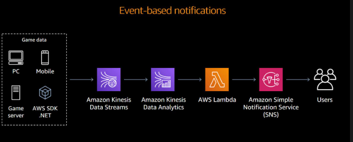
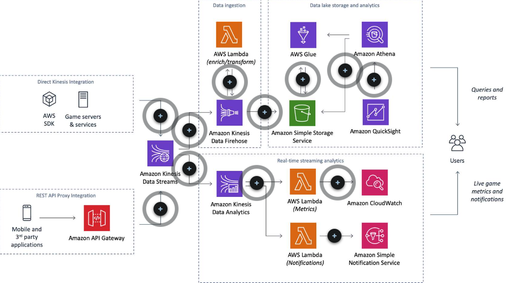
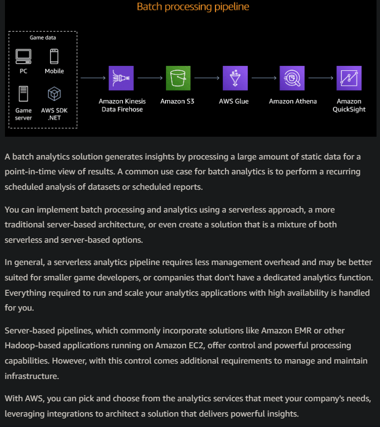

# A. Building an Analytics Pipeline for Games
- [A. Building an Analytics Pipeline for Games](#a-building-an-analytics-pipeline-for-games)
  - [A.2 Stages of an analytics pipeline](#a2-stages-of-an-analytics-pipeline)
    - [A.2.1 Analytics pipeline: Ingest](#a21-analytics-pipeline-ingest)
      - [A.2.1.1 Methods of collecting data](#a211-methods-of-collecting-data)
      - [A.2.1.2 Batch data load](#a212-batch-data-load)
      - [A.2.1.3 Stream data load](#a213-stream-data-load)
    - [A.2.2 Analytics pipeline: Store](#a22-analytics-pipeline-store)
    - [A.2.3 Analytics pipeline: Process/Analyze](#a23-analytics-pipeline-processanalyze)
    - [A.2.4 Attributes of batch and stream processing](#a24-attributes-of-batch-and-stream-processing)
    - [A.2.5 Analytics pipeline: Consume](#a25-analytics-pipeline-consume)
  - [A.3 Batch processing and analytics](#a3-batch-processing-and-analytics)
    - [A.3.1 Architectural patterns for batch analytics](#a31-architectural-patterns-for-batch-analytics)
    - [A.3.2 Ingest](#a32-ingest)
      - [A.3.2.1 ``Amazon EMR`` Data Firehose](#a321-amazon-emr-data-firehose)
      - [A.3.2.1 ``Amazon EMR`` Data Streams](#a321-amazon-emr-data-streams)
    - [A.3.3 Store](#a33-store)
  - [A.4 Serverless data processing](#a4-serverless-data-processing)
    - [A.4.1 Server-based data processing](#a41-server-based-data-processing)
    - [A.4.2 Deciding between processing services](#a42-deciding-between-processing-services)
      - [A.4.2.1 AWS Glue](#a421-aws-glue)
      - [A.4.2.2 AWS Lambda](#a422-aws-lambda)
      - [A.4.2.3 Amazon EMR](#a423-amazon-emr)
    - [A.4.3 Analyzing data](#a43-analyzing-data)
      - [A.4.3.1 Amazon Athena](#a431-amazon-athena)
      - [A.4.3.2 Amazon Redshift](#a432-amazon-redshift)
  - [A.5 Deciding between Athena and Amazon Redshift](#a5-deciding-between-athena-and-amazon-redshift)
  - [A.6 Consume](#a6-consume)
  - [A.7 Additional resources](#a7-additional-resources)
- [B. Near real-time processing and analytics](#b-near-real-time-processing-and-analytics)
  - [B.1 Near real-time analytics architecture](#b1-near-real-time-analytics-architecture)
  - [B.2 Ingest](#b2-ingest)
    - [B.2.1 Comparing AWS services for collecting data](#b21-comparing-aws-services-for-collecting-data)
    - [B.2.1  Amazon Kinesis Data Firehose](#b21--amazon-kinesis-data-firehose)
    - [B.2.2 Amazon Kinesis Data Streams](#b22-amazon-kinesis-data-streams)
  - [B.3 Store](#b3-store)
  - [B.4 Processing](#b4-processing)
  - [B.5 When does Lambda stream processing not make sense?](#b5-when-does-lambda-stream-processing-not-make-sense)
  - [B.6 Stream data processing on Amazon EMR](#b6-stream-data-processing-on-amazon-emr)
  - [B.7 Analyzing streaming data](#b7-analyzing-streaming-data)
  - [B.8 Which stream analysis technology should I use?](#b8-which-stream-analysis-technology-should-i-use)
- [C. Putting it all together](#c-putting-it-all-together)
  - [C.1 Why integrate pipelines for combined processing architecture?](#c1-why-integrate-pipelines-for-combined-processing-architecture)
  - [C.2 Introduction](#c2-introduction)
    - [C.2.1 Batch processing pipeline](#c21-batch-processing-pipeline)
    - [C.2.2 Near real-time processing pipeline](#c22-near-real-time-processing-pipeline)
    - [C.2.3 Integrating using Kinesis delivery](#c23-integrating-using-kinesis-delivery)
    - [C.3.4 Other integrations](#c34-other-integrations)
  - [C.4 Integrating AWS into your game](#c4-integrating-aws-into-your-game)
  - [C.5 Serverless real-time analytics pipelines for mobile games](#c5-serverless-real-time-analytics-pipelines-for-mobile-games)
- [D. Extending the pipeline](#d-extending-the-pipeline)
  - [D.1 Include additional data sources for greater insights](#d1-include-additional-data-sources-for-greater-insights)
  - [D.2 AWS Database Migration Service (DMS)](#d2-aws-database-migration-service-dms)
  - [D.3 Enable Live Ops monitoring](#d3-enable-live-ops-monitoring)
  - [D.4 Create event-driven architectures](#d4-create-event-driven-architectures)
    - [D.4.1 Event-based fanout and notification using SNS](#d41-event-based-fanout-and-notification-using-sns)
    - [D.4.2 Event-based communication and backend](#d42-event-based-communication-and-backend)
    - [D.4.3 Event-based processing with Amazon CloudWatch Events](#d43-event-based-processing-with-amazon-cloudwatch-events)
  - [D.5 Automate workflows or derive predictive insights with machine learning](#d5-automate-workflows-or-derive-predictive-insights-with-machine-learning)
    - [D.5.1 More engaging games](#d51-more-engaging-games)
    - [D.5.2 Anomaly detection](#d52-anomaly-detection)
    - [D.5.3 Revenue generation](#d53-revenue-generation)
    - [D.5.4 Better analytics and operations](#d54-better-analytics-and-operations)
  - [D.6 Detect player fraud with ML](#d6-detect-player-fraud-with-ml)
  - [D.7 Game Analytics Pipeline solution](#d7-game-analytics-pipeline-solution)
- [E. Summary](#e-summary)
- [F Let's review](#f-lets-review)
  - [F.1 Stages of an analytics pipeline](#f1-stages-of-an-analytics-pipeline)
  - [F.2 Batch processing and analytics](#f2-batch-processing-and-analytics)
  - [F.3 Near real-time processing and analytics](#f3-near-real-time-processing-and-analytics)
  - [F.4 Putting it all together](#f4-putting-it-all-together)

## A.2 Stages of an analytics pipeline
An analytics solution requires that multiple components work together to convert raw telemetry events into meaningful metrics and insights. **This set of components is called an analytics pipeline.**


|   |   |  
|---|---|
|   | An analytics pipeline ingests telemetry data from your applications and systems to drive business insights. Depending on the questions you have and the answers you are looking for, you may need to analyze data at different speeds. Your pipeline design should be flexible to account for this.  |   
  

  

  ### A.2.1 Analytics pipeline: Ingest

**The first stage in an analytics pipeline is focused on getting data out of your game and into the cloud—ingesting the raw data so that it can be ultimately turned into answers**.

The data sources for game analytics frequently fall into three common categories:
* **Games clients**: You can capture data directly from the end-user applications and devices that your players are using to play your games. This includes clients such as PC, mobile devices, web browsers, or console platforms.

* **Games servers**: If your game has multiplayer components, it may operate game servers in addition to the game clients. 
Game servers run processes that maintain a shared representation of state across all connected game clients in a match. You can generate data from the game server that can be useful for analytics purposes.

* **Backend services**: Most games also have one or more associated backend services that provide functionality in the game such as a user profiles service, inventory, payments, friends and social services, player authentication, anti-cheat processes, and more. You can capture data from these systems for analytics as well.

#### A.2.1.1 Methods of collecting data
There are two ways to collect game data from the sources identified above:

* In **batches** 
* In a **stream process**
The approach you use depends on the type of data you want to analyze and the analytics questions you need to answer.

#### A.2.1.2 Batch data load
A basic, but **effective, approach to ingesting game data collected over a period of time is to generate log files on game clients that are then periodically offloaded or flushed to storage**. 

For example, your game may generate JSON records of game telemetry events, such as the location of player deaths. These JSON events can be written to a local file on the game client or game server. Then, on a recurring interval that could be time based or file size based, these files are then flushed to storage.

The suitability of this approach depends on what type of data you need to ingest and how quickly you need to derive insights. For example, metrics such as ``daily active users (DAU)`` or ``monthly active users (MAU)`` draw from data that is compiled over a day or calendar month. A **batch data load process satisfies that requirement**.  

#### A.2.1.3 Stream data load

A streaming data load is another approach to ingesting telemetry data from your game. With a ``streaming process``, **game data is offloaded from game clients and servers more rapidly and sent to a system that is continuously loading data into data stores**.  

A **common approach is to run an application that is configured to accept incoming telemetry data, batch the raw data into preconfigured batch sizes, and persist this data to one or more data stores**. You can configure how frequently the data is batched and sent to storage, either based on file size or time.  

When the data is ingested quickly, you have the option of analyzing at whatever rate your insights require. For situations in which you want to conduct real-time monitoring of game health, you can ingest the data more rapidly.  

Consider a scenario such as a recent enhancement you've introduced to your game, perhaps a new weapon or downloadable content (DLC) like a new game level. You'd want to quickly assess if players react positively. If you are quickly ingesting game event data, you can achieve these fast insights.  


### A.2.2 Analytics pipeline: Store

After raw data is collected, either through a batch or stream process, it needs to be stored in a repository. **The storage repository should be secure, scalable, durable, and capable of storing structured, semi-structured, and unstructured data.**

The method of storage you use for your analytics pipeline depends on the type of data you are storing and how you intend to analyze it.  

In general, **an object store like ``Amazon EMR`` Storage Service (``Amazon EMR``) is a versatile method of storing objects or files**, which accounts for a range of different types of game data.  

### A.2.3 Analytics pipeline: Process/Analyze

After data is stored in a storage solution, such as ````Amazon EMR````, it can be processed and analyzed. **Data processing and analysis is the process of inspecting, cleaning, transforming, and modeling data to discover useful information, draw conclusions, and support decision-making**. Processing and analyzing data is done at several different stages and is an iterative process. 
> **Depending on the questions you are trying to answer, the data can be analyzed quickly to obtain near real-time insights, or analyzed more slowly over time or at a predefined time interval.**

### A.2.4 Attributes of batch and stream processing
The following table highlights differences between batch and stream processing:

|   | **Batch Data Processing**  | **Stream Data Processing**  |
|---|---|---|
| **Data scope**  | Queries or processing over all or most of the data, or data collected over a certain time period  | Queries or processing over data within a rolling time window, or on just the most recent data record  |
| **Data size**   | Large batches of data  | Individual records or micro batches consisting of a few records  |
| **Latency**     | Minutes to hours  | Seconds or milliseconds  |
| **Analysis**    | Complex analytics  | Simple response functions, aggregates, and rolling metrics  |

### A.2.5 Analytics pipeline: Consume

After data has been processed and analyzed into curated datasets, it can be consumed and visualized in a wide variety of ways, using a wide variety of tools. Often, the tools for consuming and visualizing the data are the same. 

The two most common methods of consuming data for game development use cases are direct querying or visualizing using business intelligence tools. 
* **Querying** produces results that can be used for quick analysis to answer. 

For example, you could run an ad hoc query to obtain insights into questions such as who are the top 10 players for your first-person shooter (FPS) game. Or, you could use a query to calculate the daily active users (DAU) for your game. 

* **Business intelligence tools**
You can also use business intelligence tools to produce visualizations of your data, such as reports and dashboards that enable users to explore data further. 

**BI tools** like ````Amazon EMR```` make it easier for all employees—regardless of skill level—to build and render rich visualizations of underlying data, point and click at data, perform ad hoc analysis, and quickly get business insights.

## A.3 Batch processing and analytics
A ``batch analytics`` **solution generates insights by processing a large amount of static data for a point-in-time view of results** . A common use case for batch analytics is to perform recurring scheduled analysis of datasets or scheduled reports.

For example, you ingest data from your game that represents players' actions. You want to understand how player activity changes over time. A batch analytics solution processes a large dataset of player activity events from the last hour, day, week, or longer. It generates a report that can be visualized and presented to stakeholders. 

### A.3.1 Architectural patterns for batch analytics

You can implement batch processing and analytics using a serverless approach, a more traditional server-based architecture, or even create a solution that is a mixture of both serverless and server-based options. AWS services integrate nicely with each other and can be very plug-and-play when creating an architecture.

A **serverless architecture** is a good entry point into analytics (game companies, ...) **because you don’t have to worry about the undifferentiated heavy lifting that comes with managing servers**. With a serverless analytics pipeline, everything required to run and scale your application with high availability is handled for you. 
* **No provisioning, no management**
* **Automatic scalling**
* **Pay for value**
* **Highly available and secure**


This architecture uses a serverless approach for all stages of the analytics pipeline—Collect through Consume. 

A **Server-based analytic pipelines** require your team **to manage infrastructure and potentially possess more advanced data processing skills**. However, the trade-off is that you can perform very powerful and complex analysis of massive amounts of data (as much as petabytes). 

While **serverless analytics solutions offer the benefit of being able to quickly build out an analytic pipeline without having to manage infrastructure, you might still prefer a server-based solution to address your analytics needs**. This depends on a variety of factors. 

* **Teams capabilities**: If your company has a dedicated team of data scientists, they may already have a preferred big data analytics tool, such as Apache Hadoop. In those cases, it may be preferable to continue using the tools and technology with which your team is proficient.
  
* **Technologies preferences**: Perhaps your studio is part of a larger game publisher that has a predisposition to an analytics solution, or expects your company to adopt practices that are already in place. In that case, a server-based approach that complements their existing methods may be the preferred approach. 

* **Management and control**: Your team might prefer to have more control over their approach to processing and analyzing data. For example, with server-based solutions, you can connect to the server directly using SSH to perform maintenance or updates, or even configure underlying resources like memory and CPU to your liking. These needs can be addressed using AWS services that run on ``Amazon EMR`` Cloud Compute (EC2) servers. 

* **Extensibility**: The flexibility of a server-based approach enables you to configure your analytics solution to meet your specific business requirements. This also opens opportunities to extend your solution. For example, ``Amazon EMR`` is not only a powerful processing tool, it is also widely used for machine learning. 


Despite the benefits of serverless approaches, such as reduced management overhead, scalability, and high availability, there are several reasons why you might want to incorporate server-based services. For example, **thinking back to the initial checklist in this module, you might have legacy analytics solutions already in place, or a dedicated data analysis team that is proficient with powerful tools like Apache Hadoop**. 

### A.3.2 Ingest
As discussed in the previous module, you can collect your game data in large batches or in a stream process. For the purpose of this module, we will explore a few services you can use to more easily ingest your data as a stream.

````Amazon EMR```` **enables developers to ingest and aggregate data and logs that might have previously gone uncollected or unused**. By using ``Kinesis`` to stream in data, companies are able to accelerate the time to results of batch processing logs. For example, by using Kinesis, a developer could reduce the delivery of gaming metrics from what might have occurred every 48 hours to a much shorter interval, such as every 10 minutes. With Kinesis, you can stream in data for batch analysis, or for near real-time analysis, of game data from an array of sources—be it clients or hundreds of game servers across the world.

#### A.3.2.1 ``Amazon EMR`` Data Firehose
* ````Amazon EMR`` Data Firehose`` **is ideal for use cases that require zero administration**. It is designed for **ingesting large volumes of data targeted for data stores**. You can write directly to ````Amazon EMR````, as well as ````Amazon EMR``, ``Amazon EMR`` Service``, and ``Splunk`.

* ``Kinesis Data Firehose`` is a good choice for game developers because you do not need to write applications or manage resources. You **configure your data producers (which can include game clients and game servers) to send data to ``Kinesis Firehose`` and it automatically delivers the data to the AWS destination that you specified**. 

* You can also configure ``Kinesis Data Firehose`` 
  * **to transform your data before data delivery**. 
  * It is a **fully managed service that automatically scales to match the throughput of your data and requires no ongoing administration**. 
  * It can also batch, compress, and encrypt the data before loading it, minimizing the amount of storage used at the destination and increasing security.

#### A.3.2.1 ``Amazon EMR`` Data Streams
````Amazon EMR`` Data Streams`` **enables you to use custom applications that process or analyze streaming data**. With this flexibility comes more administrative oversight because you will need to develop an application to consume the data and monitor it to ensure continuity of operations. 

If you already have custom applications built, you need to instrument the applications to work with ``Kinesis Data Streams`` using the ``Kinesis Producer Library (KPL)`` and ``Kinesis Consumer Library (KCL)``. However, this offers the benefit of being able to continuously capture and store terabytes of data per hour from hundreds of thousands of sources, including game clients and game servers.

You can also emit data from ``Kinesis Data Streams`` to other AWS services such as ````Amazon EMR`` Storage Service (``Amazon EMR``), ``Amazon EMR``, ``Amazon EMR`` MapReduce (``Amazon EMR``), and AWS Lambda``, as well as any custom consumer applications you might want to use, which provides greater flexibility.

With ``Kinesis Data Streams``, **the delay between the time a record is put into the stream and the time it can be retrieved (put-to-get delay) is typically less than 1 second**. In other words, a ``Kinesis Data Streams`` **application can start consuming the data from the stream almost immediately after the data is added**.

``Kinesis Data Streams`` are a good choice for situations where you want to:
* **Persist streaming data before loading it into storage**. This enables you to consume records in the same order a few hours later or days later. For example, if you have an application that handles recording in game purchases, and an auditing application to ensure you are staying compliant and secure when handling purchasing data, you can run the audit application up to seven days after the purchases are recorded.

* **Deliver your data stream to a destination** other than ``Amazon EMR``, ``Amazon EMR``, ``Amazon EMR`` Service, or Splunk.

* **Deliver your data to custom consumer applications**.
  
Both ``Kinesis Data Firehose`` and ``Kinesis Data Streams`` **are managed services**, meaning that much of the heaving lifting of managing the infrastructure layer and administration are abstracted from your control. If you have requirements around minimizing administration or lack expertise or resources in this area, Kinesis is a good choice for ingesting content.


| **Kinesis Data Firehose**  | **Kinesis Data Streams**  |   
|---|---|
| Simplifies the use case of transforming and storing streaming data  | Write custom consumers, more targets  |   
| You set the data buffer size and buffer interval and the service handles scaling  | You set the number of shards  |   
| Stream destination can be one of four built-in options  | Multiple consumers and multiple types of consumers  |   
| Data is not persisted by the service | By default, data is retained for 24 hours, and you can extend the retention period by up to 7 days.  |   
| Can only send data to ``Amazon EMR``, ``Amazon EMR``, ``Amazon EMR``, or Splunk  | Can send data to custom consumer applications or other services  |   

``Kinesis Data Streams`` **offers benefits such as the ability to deliver data to multiple consumers and persist data for up to seven days**. However, this requires additional management oversight, particularly around managing shards. To understand what this means, let's first take a look at the anatomy of a Kinesis data stream.


* A ``Kinesis stream`` **is an ordered sequence of data records**. 
  * **Each record in the stream has a sequence number**. 
  * The **data records in the stream are distributed into shards**.

* A **shard is a uniquely identified group of data records in a stream**. 
  * A **stream is composed of one or more shards**, each of which provides a fixed unit of capacity. 
  * Each **shard can support up to 5 transactions per second for reads, up to a maximum total data read rate of 2 MB per second and up to 1,000 records per second for writes, up to a maximum total data write rate of 1 MB per second** (including partition keys).

* A **partition key is used to group data by shard within a stream**. ``Kinesis Data Streams`` then **segregates the data records belonging to a stream into multiple shards, using the partition key associated with each data record to determine which shard a given data record belongs to**. 

* The consumers on the right side of the image get records from ````Amazon EMR`` Data Streams`` and process them. These can then be stored in ````Amazon EMR``, DynamoDB, or ``Amazon EMR````, or passed on to another ``Kinesis Stream``.

**Note**: As mentioned previously, ``Kinesis Data Streams`` **stores streaming data**. However, **it is not suited for long-term data storage**. By default, ``Kinesis Data Streams`` retains data for 24 hours and the retention period can be extended up to a maximum of 7 days. Any data that needs to be stored for longer than 7 days should be moved into a durable storage service such as ````Amazon EMR``, ``Amazon EMR``, or DynamoDB``.


### A.3.3 Store
For batch processing use cases, ````Amazon EMR```` is an ideal method of storing the data collected by your analytics pipeline. ````Amazon EMR```` **enables you to decouple storage from compute, allowing you to scale both independently**. This means that as you scale your game to thousands or even millions of players, the storage for the data you collect from these players and their game events can grow without limit and you can scale compute resources separately, as needed.

* **Durable**: ````Amazon EMR```` is designed to provide 99.999999999% durability of objects over a given year.
* **Available**: ````Amazon EMR```` is highly available, designed for 99.99% availability.
* **Performant**: With ````Amazon EMR````, you can take advantage of **multi-part upload, range GETs**, and other ways to optimize performance when uploading or retrieving data from ````Amazon EMR````. 
* **Integrated**: ````Amazon EMR```` integrates very nicely with other AWS services. You can use the data in ````Amazon EMR```` with analytics services like ````Amazon EMR``, ``Amazon EMR``, ``Amazon EMR``, ``Amazon EMR````, and more.
* **Flexible**: You can store all different types of data in ````Amazon EMR````, including structured, semi-structured, and unstructured data, which might include things like game events, telemetry data, images, audio files, videos, and more.
> These benefits make ````Amazon EMR```` **well-suited for use as a data lake, which offers game developers an option to apply different analytics tools or processing frameworks on the same data.**

**Data lake overview**

A ``data lake`` **stores relational data from line of business applications, and non-relational data from mobile apps, IoT devices, and social media**. The structure of the data or schema is not defined when data is captured. This means you can store all your data without careful design or the need to know what questions you might need answers for in the future. You can use different types of analytics on your data, such as **SQL queries, big data analytics, full text search, real-time analytics, and machine learning** to uncover insights.

**Processing data**


As mentioned in the previous module, **processing and analyzing data is done at several different stages and is an iterative process**. There is the initial processing and cleansing that data will go through. The data will then be placed into an analytic data store. This can be at an object or record level. It is not uncommon for data to be reprocessed and analyzed from the analytic data store.

## A.4 Serverless data processing
Two of the primary serverless options for processing game data are ``AWS Glue`` and ``AWS Lambda``. 

* ``AWS Glue`` is a **fully managed extract, transform, and load (ETL) service that makes it easy to prepare and load data for analytics**. ``AWS Glue`` offers:
    * Easy administration and low cost
    * Real-time, elastic performance
    * Secure, durable storage
    * Availability to multiple real-time analytics applications
* ``AWS Lambda`` **lets you run code without provisioning or managing servers**. Use **Lambda to run code that transforms data and loads that data from one data repository to another**
  
### A.4.1 Server-based data processing

``Server-based services`` **offer greater flexibility of configuration, as well as powerful processing**. In instances where you need to process larger datasets, or analyze more complicated questions to derive insights, a sever-based solution such as ````Amazon EMR```` might be a better fit.

### A.4.2 Deciding between processing services
#### A.4.2.1 AWS Glue
``AWS Glue`` is a **fully managed extract, transform, and load (ETL) service that you can use to catalog, clean, enrich, and move data reliably between data stores**. With ``AWS Glue``, you can significantly reduce the cost, complexity, and time spent creating ETL jobs. 

``AWS Glue`` is serverless, so there is no infrastructure to set up or manage. You can get started with Glue very quickly instead of spending time configuring servers with a server-based solution like ````Amazon EMR````. You pay only for the resources consumed while your jobs are running, so from a cost perspective, you don't have to pay for idle resources.

``AWS Glue`` also offers integration with services like ````Amazon EMR``, ``Amazon EMR``, and ``Amazon EMR````, enabling you to easily analyze data using your analytic tool of choice. ``AWS Glue`` **is a great fit for situations in which you require a consistent metastore that is cataloged from different locations**. For example, Glue offers the flexibility to process data stored in relational, non-relational, object, and custom data sources like ````Amazon EMR`` Logs, ``Amazon EMR``, ``Amazon EMR``, and ``Amazon EMR`` Database Service (``Amazon EMR``)``. 

| **If you require:**  | **Then:**  |   
|---|---|
| Fast, relatively easy implementation and No servers to manage or configure | AWS Glue is a great extract, transform, and load (ETL) solution.  |   
| More flexibility and control over your configuration (despite administrative overhead)  | Consider a more configurable solution.  | 

**Note:** Even if you use a more flexible service like ````Amazon EMR````, **you can still use Glue as a persistent data metadata store that EMR can integrate with**.

#### A.4.2.2 AWS Lambda 

``AWS Lambda`` **enables you to run code in response to triggers such as changes in data, shifts in system state, or actions by users**. 

``Lambda`` **can be directly triggered by AWS services such as ````Amazon EMR````, meaning that as game data is collected in your ````Amazon EMR```` bucket, `**it can trigger Lambda to run code that transforms data and loads that data into one data repository to another**.

Using this functionality to orchestrate workflows is beneficial for both batch and near real-time processing uses. 

``Lambda`` is useful in both batch and real-time pipelines because **it can handle data validation, enrichment, and transformation at scale**. Because each shard in a ``Kinesis stream`` gets its own Lambda, it can scale linearly to handle incredible throughput. 

**Note:** ``Lambda`` **functions time out after 15 minutes**. Given this, it is better suited for small or "light" extract, transform, and load (ETL) jobs where you are not processing a lot of data. 

#### A.4.2.3 Amazon EMR
``Amazon EMR`` is a **highly distributed computing framework to easily process and store data quickly in a cost-effective manner**. ``Amazon EMR`` uses Apache Hadoop, an open source framework, to distribute your data and processing across a resizable cluster of ``Amazon EMR`` instances. It enables you to use the most common Hadoop tools such as Hive, Pig, Spark, and so on. 

``Amazon EMR`` does all the work involved with provisioning, managing, and maintaining the infrastructure and software of a Hadoop cluster. ``EMR`` runs on ``EC2 instances``, **which means that you have more visibility, flexibility, and control of processing operations, as well as more ability to customize what is going on behind the scenes.**

``Amazon EMR`` **reduces large processing problems and datasets into smaller jobs and distributes them across many compute nodes in a Hadoop cluster**. This capability lends itself to many usage patterns with big data analytics. Here are a few examples:

* Log processing and analytics
* Large extract, transform, and load (ETL) data movement
* Predictive analytics using machine learning (discussed in Module 6, Extending the Pipeline).
* Ad hoc data mining and analytics

This platform can process vast amounts of data quickly, cost-efficiently, and at scale. This is beneficial to developers because they can run petabyte-scale analysis of game data to better understand player purchasing behavior or explore causes of player churn.

| **If you require:**  | **Then:**  |   
|---|---|
| More control over configuration (for example, things like memory) or Extensibility and flexibility to use other tools beyond just Spark  | Amazon EMR is a good fit.  |   
| Fast, relatively easy implementation or No servers to manage or configure  | Consider a serverless service like AWS Glue.  | 

### A.4.3 Analyzing data
After your data has been processed, you can analyze it using batch or interactive methods to derive insights about your game, players, and more. As you saw previously, there is an array of tools to analyze data. For the purpose of this course, we're going to focus on two: ``Amazon Athena`` and ````Amazon Redshift````.

#### A.4.3.1 Amazon Athena
Because ``Amazon Athena`` is serverless, there is no infrastructure or administration and zero spin up time. You can quickly and easily begin analyzing data directly from ``Amazon S3`` using SQL queries. With ``Athena``, `**you pay only for the queries you run, which makes it a very effective choice for ad hoc queries and analysis**.

To get started, you can point the ``Amazon Athena`` service to an ``Amazon S3`` bucket containing your ingested data, or use it with ``AWS Glue`` to catalog your data. Then, you can run simple SQL queries against this data. The results of your queries are displayed directly in the console for you to see and stored in an ``Amazon S3`` bucket.

``Athena`` **parallelizes queries that you run to offer better performance**. You can **also further optimize your data to improve your query performance and reduce your costs**. For example, using a more **columnar data type** like Parquet will offer better performance and cost efficiency because Athena does not need to scan through many rows of extraneous data.

#### A.4.3.2 Amazon Redshift

``Amazon Redshift`` **is a fast, scalable data warehouse that makes it simple and cost-effective to analyze all your data across your data warehouse and data lake**. ``Amazon Redshift`` delivers 10 times faster performance than other data warehouses by using machine learning, massively parallel query execution, and columnar storage on high-performance disk. You can set up and deploy a new data warehouse in minutes and run queries across petabytes of data in your ``Amazon Redshift`` data warehouse and exabytes of data in your data lake built on ``Amazon S3``.

Data in ``Amazon Redshift`` **must be structured by a defined schema**. If your data is unstructured (for example, perhaps it is JSON telemetry data or text-based player comments), **you can perform extract, transform, and load (ETL) on ``Amazon EMR`` to get the data ready for loading into** ``Amazon Redshift``.

Looking at the needs of game developers, ``Amazon Redshift`` offers high performance and scalability. However, with this comes the need to perform additional infrastructure management activities. 

Consider the following:
* To get started with ``Amazon Redshift``, **you need to configure and spin up a cluster**, which is more time consuming than using a serverless service like ``AWS Glue``. 

* You will have to perform ongoing management of that cluster—manually adding or removing clusters and nodes—to ensure that it scales with your needs.

* ``Amazon Redshift``, **though cost-effective when compared to other data warehouse solutions, is still a large expense when compared to other AWS analytics services**. You'll want to ensure that this investment is aligned with your business aims and analytics needs.

## A.5 Deciding between Athena and Amazon Redshift

Refer to the following table for considerations as to when to use Athena or another analytics service such as Amazon Redshift.

| **Consider Athena if you:**  | **Consider Amazon Redshift if you:**  |   
|---|---|
| Want to quickly run queries without setting up infrastructure  | Want to run complex queries like performing aggregations, complex joins, and inner queries and you need very high performance  |   
| Don't routinely know what data is stored in your data lake or Amazon S3 buckets  | Want more visibility, flexibility, and control of your analytics solution  |   
| Don't know the format or structure of your data  | 	Want the ability to customize what is going on behind the scenes  |   
| Want to scan or query data infrequently for insights as needed, rather than all day every day  | Want to extend your analytics pipeline in the future (for example, machine learning and anomaly detection)  |   
| Don’t have in-house data engineering capabilities  | Have in-house data engineering capabilities  |   
| Don’t know how successful your game will be or the frequency with which you will query  | Want to analyze a large amount of data daily  | 

## A.6 Consume

Depending on the insights you want and how you intend to use this information, there are a variety of solutions you can choose from to visualize your insights. For the purpose of this module, we will focus on using ``Amazon QuickSight``.

``Amazon QuickSight`` can be used to do the following:

* Perform quick interactive ad hoc exploration and optimized visualization of data.
* Create and share dashboards and KPIs to provide insight into your data.
* Analyze and visualize data coming from logs and stored in ``Amazon S3``.
* Analyze and visualize data in various AWS resources (for example, ``Amazon RDS databases, Amazon Redshift, Amazon Athena, and Amazon S3``).

* **Performance:** ``Amazon QuickSight`` is built with ``SPICE, a Super-fast, Parallel, and In-memory Calculation Engine``. Built from the ground up for the cloud, ``SPICE`` uses a combination of columnar storage, in-memory technologies enabled through the latest hardware innovations, and machine code generation to run interactive queries on large datasets and get rapid responses.
  
* **Durability and availability:** ``SPICE`` **automatically replicates data for high availability and enables ``Amazon QuickSight`` to scale to hundreds of thousands of users who can all simultaneously perform fast interactive analysis across a wide variety of AWS data sources**.

* **Scalability and elasticity:** ``Amazon QuickSight`` is a fully managed service that takes care of scaling to meet the demands of your end users. With ``Amazon QuickSight``, you don’t need to worry about scale. You can seamlessly grow your data from a few hundred megabytes to many terabytes of data without managing any infrastructure.
  
In addition to QuickSight, you might consider using third-party business intelligence tools such as Tableau or Kibana. 

## A.7 Additional resources

**Amazon EMR**
* [Documentation](https://docs.aws.amazon.com/emr/latest/ManagementGuide/emr-what-is-emr.html) 
What EMR is and how to get started
* [Self-paced lab](https://amazon.qwiklabs.com/catalog?keywords=Analyze%20Big%20Data%20with%20Hadoop)
Analyze big data with Hadoop on EMR

**Amazon Redshift**
* [Learn more about Amazon Redshift](https://docs.aws.amazon.com/redshift/latest/mgmt/welcome.html)
What Amazon Redshift is and how to get started 
* [Self-paced lab](https://amazon.qwiklabs.com/catalog?keywords=Working%20with%20Amazon%20Redshift)
Working with Amazon Redshift

# B. Near real-time processing and analytics
**Near real-time analytics solutions help you derive insights within seconds or minutes of in-game events occurring**. Also known as a streaming analytics solution, this approach to analytics enables you to process data immediately.

In a **near real-time analytics solution**, streaming data is generated continuously by thousands of data sources, which typically send in data records simultaneously in small sizes (order of kilobytes). These data sources can include game clients and servers distributed globally. 
> **The records they produce could range from something as simple as in-game player activity, or perhaps data that represent the perceived network latency of your game clients and servers**. 

In a **near real-time analytics pipeline**, the **streaming data is processed sequentially and incrementally on a record-by-record basis, or over sliding time windows, to develop real-time analytics applications**. It is used for a variety of analytics, including correlations, aggregations, filtering, and sampling. 

> **Use near real-time analytics when you need a live look into events in your game, when you want to understand...**``What is happening right now?``
>
## B.1 Near real-time analytics architecture

**Near real-time analytics pipelines use similar services as batch analytics.** However, **in terms of approach, there are more serverless options available than server based.**


* This diagram shows a **serverless architecture that begins with ``Kinesis Data Streams`` ingesting game data. 
* ``Kinesis Data Analytics`` analyzes the data using SQL queries and sends the queried, filtered data to ``Amazon S3`` where it is available for future interactive analysis. 
* An ``AWS Lambda`` function consumes data from the ``Kinesis Data Analytics stream`` and runs code to turn the data into a custom metric that is published to an ``Amazon CloudWatch`` dashboard.

## B.2 Ingest

Similar to the batch analytics pipelines we looked at previously, ``Kinesis Data Firehose`` and ``Kinesis Data Streams`` offer two managed solutions for ingesting game data. Let's take a look at these services in more detail.
* ``Amazon Kinesis Data Firehose`` **enables you to deliver real-time streaming data to AWS destinations such as ``Amazon S3, Amazon Redshift, Amazon Kinesis Analytics, and Amazon Elasticsearch Service``.

* ``Amazon Kinesis Data Streams`` **enables you to ingest streaming data with custom producer and consumer applications**.

### B.2.1 Comparing AWS services for collecting data

``Kinesis Data Firehose`` and ``Kinesis Data Streams`` **both ingest streaming data**; however, they have different methods of delivering data, which influences how quickly you can consume data in your analytics pipeline.

### B.2.1  Amazon Kinesis Data Firehose
``Amazon Kinesis Data Firehose`` **is ideal for use cases that require zero administration**. It is often a good choice for game developers because you do not need to write applications or manage resources. 

However, **when working with near real-time analytics, you might have requirements as to how fast you derive insights**. And this could be a critical factor in determining which solution you use to ingest and deliver game data. 

``Kinesis Data Firehose`` **buffers and batches data that is streamed in, with the smallest processing latency being 60 seconds**. If you require faster processing—within seconds, rather than a minute or more—``Kinesis Data Firehose`` might not be the ideal method of ingesting data.

**Note:** ``Kinesis Data Firehose`` might deliver data faster than 60 seconds if the data stream reaches the batch size you configure first. However, even in that case, the data is still delivered in batches.

### B.2.2 Amazon Kinesis Data Streams
``Amazon Kinesis Data Streams`` **enables you to use custom applications that process or analyze streaming data**. With this flexibility comes more administrative oversight because you will need to develop an application to consume the data and monitor it to ensure continuity of operations. 

With ``Kinesis Data Streams``, **the delay between the time a record is put into the stream and the time it can be retrieved (put-to-get delay) is typically less than 1 second**. In other words, a ``Kinesis Data Streams`` **application can start consuming the data from the stream almost immediately after the data is added**. 

For situations in which you require less than 1-second processing latency on incoming records, or records to be delivered individually rather than as a batch, you might want to use ``Kinesis Data Streams``.


## B.3 Store

With near real-time analytics, you can process data as it is streaming into your pipeline to produce time-sensitive insights. However, you will still likely want to persist that data in a storage repository to ensure that it is available for further analysis over time. After data is ingested with ``Kinesis``, you can load data into ``Amazon S3`` or a data warehouse like ``Amazon Redshift`` with zero operational overhead. 

This approach enables you to capture large streams of real-time data, while handling further processing asynchronously. The details and variations of how you implement this pattern depend on the nature of the data you are streaming, how the data is processed, and where the data should be stored.

## B.4 Processing

For near real-time data processing, **two recommended options are similar to what we explored in the previous module**: ``AWS Lambda`` and ``Amazon EMR``.

* ``AWS Lambda``: Lambda runs code that you write in a serverless fashion. This enables ``Lambda`` **to be a flexible solution for many applications, especially data analytics**. For example, ``Lambda`` can run code that transforms data and loads that data from one data repository to another. 

If the data in your stream needs format conversion, transformation, enrichment, or filtering, you can preprocess the data using an ``AWS Lambda`` function. You can do this before your application SQL code runs, or before your application creates a schema from your data stream.

``Lambda`` **can be directly triggered by AWS services such as ``Amazon S3``**, meaning that as streaming game data is collected from ``Kinesis Data Firehose`` in an ``Amazon S3`` bucket, it can trigger ``Lambda`` to run code that transforms data and loads that data into a ``CloudWatch`` dashboard. This is a common method of visualizing near real-time game data without having to manage servers or infrastructure.

Another data processing use case for ``AWS Lambda`` **is using it to forward alert and anomaly notifications to an ``Amazon Simple Notification (Amazon SNS)`` topic for delivery to users and applications**.

With ``Lambda``, you write your own code using common programming languages, which makes it a more familiar tool for game developers who don't have a depth of analytics experience.

* ``Amazon EMR`` `**is a highly distributed computing framework to easily process and store data quickly in a cost-effective manner**.
``Amazon EMR`` does all the work involved with provisioning, managing, and maintaining the infrastructure and software of a Hadoop cluster. ``EMR`` runs on EC2 instances, **which means that you have more visibility, flexibility, and control of processing operations, as well as more ability to customize what is going on behind the scenes``.

When processing streaming data on ``EMR``, **you can write your own applications using common Hadoop tools such as Hive, Pig, Spark, and so on**.

## B.5 When does Lambda stream processing not make sense?

While ``Lambda`` offers a cost-effective approach to serverless data processing, **there are some situations in which it might not be the best solution.**
* **Stateful stream processing, such as windowed aggregations**: ``AWS Lambda`` is **stateless**. A ``Lambda function`` **spins up in a containerized environment, executes in response to each individual record, and then spins down**. You can't persist data unless you store it elsewhere. 

Because of this, ``Lambda`` **isn't a good option for performing stateful analytics (windowed aggregations such as counts, sums, minimums, maximums, etc.) over all the data you collect**. Instead, **you should consider ``Kinesis Data Analytics``, which natively supports functions such as windowed aggregations**.

Other options include building your own custom applications and integrating them with ``Kinesis`` using the ``Kinesis Client Library (KCL)`` application, or using other tools built for this use case, like ``Apache Flink``.

* **Buffering large volumes of streaming data**: For situations in which you need to buffer large volumes of streaming data (such as tens of MBs or even larger objects) before writing elsewhere, consider using ``Kinesis Data Firehose``. 

``Kinesis Data Firehose`` **has a built-in buffer with functionality that enables you to do this easily**. You can control the buffer size and buffer interval. This is a more effective approach than keeping a ``Lambda`` function continuously running in the backend.

## B.6 Stream data processing on Amazon EMR

Another option for processing streaming data is deploying and managing your own streaming data solution in the cloud on ``Amazon EC2`` or ``Amazon EMR``. For example, with this approach, you can run other streaming data platforms such as Apache Kafka, Apache Flume, Apache Spark Streaming, and Apache Storm. 


> Compared to ``Lambda``, ``Amazon EMR`` **is a more involved analytics tool**. If your team has a dedicated data engineering team or strong analytics capabilities it is a logical choice. If not, a serverless approach using AWS Lambda might be preferable.
>
## B.7 Analyzing streaming data

To analyze your streaming data in near real time, you can use ``Amazon Kinesis Data Analytics`` for a managed, serverless approach. ``Amazon Kinesis Data Analytics`` **works with the other ``Kinesis`` services to process data streams in real time with SQL or Java**. 

Alternatively, if you are already using ``EMR`` for your game analytics, or have in-house data analytics capabilities, **you might want to explore using ``Spark Streaming`` on ``Amazon EMR``.

* ``Amazon Kinesis Data Analytics`` **is the easiest way to process and analyze real-time, streaming data.** 

With ``Kinesis Data Analytics`` **you use standard SQL to process your data streams, so you don’t have to learn any new programming languages**. Connect ``Kinesis Data Analytics`` to an existing ``Kinesis`` stream, write your ``SQL`` queries, and specify where you want to load the results. ``Kinesis Data Analytics`` takes care of running your SQL queries continuously on data while it’s in transit and sending the results to the destinations.

``Kinesis Data Analytics`` accepts data from ``Kinesis Data Firehose`` or ``Kinesis Data Streams`` in a variety of input formats including JSON, CSV, variable column, or unstructured text.

``Amazon Kinesis Data Analytics`` **is serverless and fully managed, so you don't need to dedicate effort to managing your infrastructure**.

* ``Spark streaming on Amazon EMR`` Another approach for processing streaming analytics is using your own ``Spark Streaming application``, written in Java, Scala, or Python, running on ``Amazon EMR``. **This is a powerful solution; however, it requires that your team knows ``Spark``, is familiar with ``EMR``, and **has the requisite skills to create its own ``Spark`` applications to process datasets and generate output results**.

``Spark Streaming on EMR`` **might not be the preferred method of implementing near real-time processing for smaller-sized game developers who lack dedicated data engineering capabilities or are otherwise resource constrained**.

## B.8 Which stream analysis technology should I use?

Now let's compare Kinesis Data Analytics with Amazon EMR.


While there are many similarities between ``Kinesis Data Analytics`` and ``Spark Streaming on EMR``, there are notable differences. 

``Kinesis Data Analytics`` **is serverless**, so there is less management oversight of resources. It has **Multi-Availability** Zone support, **so it has built-in durability and reliability**, whereas ``Spark Streaming`` **has only Single-AZ availability**. 

``Kinesis Data Analytics`` **supports SQL queries**, whereas ``Spark`` **supports Java, Python, and Scala**. Depending on the type of analysis you want to perform and the capabilities of your team, one option might be a better fit than another.


# C. Putting it all together
Now that we've seen approaches to implementing batch and near real-time analytics for games, let's look at how you can integrate these two pipelines for a unified view of game play.

## C.1 Why integrate pipelines for combined processing architecture?

While **near real-time analytics are effective at producing fast insights that enable quick decisions, it is important to remember that you are limited to simple analytics such as aggregating and filtering the data**. Because of this, **many game developers incorporate batch analytics with their near real-time pipelines to produce deeper insights into the data before producing dashboards and reports on the data**.

## C.2 Introduction
When using a service like ``Kinesis``, **you can ingest, move, process, and analyze data at different speeds and derive different insights**. The batch and near real-time pipelines we've looked at up to this point both use ``Kinesis``. This simplifies the process of using one ingestion stream for different types of analysis.

Let's look at how you can integrate batch and speed processing layers into one analytics solution.


### C.2.1 Batch processing pipeline


Here you can see an **example serverless batch processing architecture***, similar to what we explored previously. 
* ``Kinesis Data Streams`` ingests data, which ``Kinesis Data Firehose`` delivers to ``Amazon S3`` for storage. 
  
* ``Glue`` **crawls through the data** in ``Amazon S3``, inferring the schema. 
  
* ``Athena`` **queries the data** and ``QuickSight`` is used to **visualize insights**.

### C.2.2 Near real-time processing pipeline


In our example **near real-time processing pipeline**, you will notice that **two services from the batch processing pipeline play a role here too**. For example, 
* ``Kinesis Data Streams`` **remains the method of ingesting data**. 

* And ``Amazon S3`` is used **to persist data in storage**. 
  
* However, ``Kinesis Data Analytics`` is **used to run SQL queries over streaming data**.

* Then, ``Lambda`` **transforms the data so that it can be visualized** in a ``CloudWatch`` dashboard in real time.

So how can the common elements of these two pipelines be used to create a unified analytics solution?


### C.2.3 Integrating using Kinesis delivery


> The key to bringing these two speeds of analytics together is using **AWS integrations**.

Here you can see **an architecture that brings the batch and near real-time pipelines together**. 
* The ``Kinesis Data Stream`` **that was present in both architectures is used to ingest data**. 

* ``Amazon S3``, **which was also used in both examples, persists the raw data so that it is available for interactive analysis over time**. 

* The **other services used in the batch and near real-time analytics pipeline remain unchanged**.

### C.3.4 Other integrations


You've seen how you can use ``Kinesis`` **as the integration point to bring together two different AWS pipelines**. 
> In fact, most ``AWS services`` **are flexible and integrate nicely with each other**. 

Because of how flexible ``AWS services`` are, **there are many different ways you can build out an analytics pipeline to best fit your use case**. For example, referencing the diagram depicted here, maybe you want to:

* Use ``EMR`` instead of ``Glue`` and ``Athena``.
  
* Use another visualization tool such as ``Tableau`` instead of ``QuickSight``.

* Send data from ``Amazon S3`` directly to ``Amazon Redshift`` **because you don’t need to perform extract, transform, and load (ETL) first.**
  
These are some of the many possible integrations you can use to design flexible analytics solutions. 


## C.4 Integrating AWS into your game

Now that you know what different ``AWS services`` you can use to build out a data analytics pipeline, there is one last step you need to take—integrating the pipeline into your game! There are a few different ways to integrate AWS into your game depending on your use case. The following are some recommendations:

1. Minimize the number of ``AWS resources`` accessed directly from your game client.

It introduces a security risk when you expose a lot of ``API calls`` from your client. It also makes your implementation brittle, forcing you to create client updates every time you need to make a change. 

2. Use a **front door** to your ``AWS resources``, such as ``Amazon API Gateway`` or a ``Load Balancer``. 

* ``API Gateway``: Make authenticated calls to send and retrieve data from API Gateway. You can authenticate calls using Lambda authorizers or Cognito authorizers and make SDK calls from a backend, which could be a server, a Lambda function, or even containers.
  
* ``Load Balancer``: An ``Elastic Load Balancer``, such as ``Application Load Balancer``, **is ideal for applications that need advanced routing capabilities, microservices, and container-based architectures**.

Let's take a look at another example of a serverless architecture that incorporates the concept of an API Gateway front door.


## C.5 Serverless real-time analytics pipelines for mobile games


Similar to other examples we've looked at, **this architecture collects events from mobile games, analyzes them in real time, and stores them for further processing**. However, it also contains elements that support an **event-driven architecture**. 

For example, 
* **it can be used to provide real-time flash offers**, 
* monitor user acquisition campaigns efficiency in near real time, 
* detect abusive players, 
* quickly see deficiencies and anomalies during A/B testing of game balance changes, or build online dashboards for metrics like **currently connected users (CCU)** and crashes.

1. **Ingestion by** ``AWS Mobile SDK``: The are two ways to ingest events for mobile games, the first approach represented in steps 1 and 2, is the most cost effective.

2. **Ingestion by** ``API Gateway``: Another method od ingesting gane events, represented in step 3, doesn't require the use of the ``AWS Mobile SDK``.

3. **Ingesting  via game/backend**: Game servers also submit events that are ingested.


# D. Extending the pipeline

At this point, you've seen **how to architect batch and streaming pipelines for game use cases**. And, you've seen how ``AWS data movement`` services like ``Amazon Kinesis`` enable you to easily take data ingested from your game and use it to build a unified solution that produces insights at various speeds. Now, let's look at other ways you can expand that pipeline to derive even greater insights.

Thinking back to the architectures reviewed in previous modules, **you've seen that using ``data lakes`` for ``batch`` or interactive analytics can be easily paired with a near real-time solution to derive more complete insights about your game**. 

However, combining batch and speed layers is just the beginning of how you can evolve your analytics solution. **You can further build upon this framework to include additional business systems, develop event-driven applications based on in-game events, use machine learning for predictive analytics or sentiment analysis, provide Live Ops monitoring of game activity, and more**.

* **Move data source** : Incorporate data from your CRM or ERP systems to gain a broader view of player profile, purchase history, and more. 

* **Live Ops monitoring** : Use real-time analytics to monitor and respond to in-game player behavior to drive engagement or influence gameplay.

* **Entitlements:** Use event-based processing to reward players for achieving milestones in your game (for example, more XP or credits).

* **Machine Learning:** Use machine learning to predict player behavior, test your game, or even find bugs.

## D.1 Include additional data sources for greater insights

After you have an analytics pipeline in place, you can incorporate other data sources to generate a broader view of your players, purchases, and more.


For example, you might want to incorporate data from a ``CRM`` application managing customer profiles to create a more complete view of your players. Or, perhaps consolidate data from an ERP system to track purchases. In those instances, you could batch up extracts of data and load it into your analytics pipeline for additional analysis.


## D.2 AWS Database Migration Service (DMS)

Rather than trying to expand your dataset, perhaps your current data needs have outgrown your current on-premise or third-party provided solution. In those instances, you might need to migrate your data and systems to a solution that has the breadth of services to accommodate your needs, handle your scale, and be reliable.

In these instances, you could use a service like ``AWS Database Migration Service (DMS)`` **to make periodic snapshots of database data to store backups** in ``Amazon S3``.

With ``DMS``, **you can consolidate data from different databases into one centralized location**. Then, with your data in an ``Amazon S3 data lake``, you can use a service like ``AWS Glue`` **to detect the schema on the extract and analyze it** using a service like ``Athena``—similar to the batch processing and analytics approach we explored in previous Module.

* [Building a Lake of Wisdom (GAM306)](https://www.youtube.com/watch?v=pmfIi-adXcM)

## D.3 Enable Live Ops monitoring

Using analytics, **you can track the metrics of a game in real time**. This **allows you to monitor in-game player behavior and then make adjustments to a game to influence and change the player behavior to align with the goals of the game developer**.

As you collect and analyze real-time data, you can begin to diagnose and respond to operational problems within your game. For example, you can provide this data to your Live Ops and DevOps teams to answer questions like: 


``Live Ops`` is **the ability to create an event-driven architecture that helps you monitor and manage your infrastructure to support three main areas**: 

* Community building
* Measuring and responding to player behavior
* Adding new content and features to your game

**Example: Foster a community!** With Live Ops, you can better foster a community by making sure your infrastructure is well equipped to handle live events or social campaigns. Using real-time analytics, you can monitor these events. And, by creating an event-driven architecture, you can more effectively respond to these events in real-time. 

**Example: Deploy new content to increase engagement:** Another important component of Live Ops is the ability to push new content to your game to increase player engagement. This is where a Continuous Integration/Continuous Deployment (CI/CD) pipeline is helpful so that you can take what you have built, distribute it to your players quickly, and monitor the entire process along the way.


> **Note:** It is important that **with an analytics pipeline, Live Ops, or even CI/CD, you should have this infrastructure in place before the release of your game**.

## D.4 Create event-driven architectures

After you have real-time analytics in place, **you can also take action based on specific events happening in your game and send these events to downstream applications for further processing**.


### D.4.1 Event-based fanout and notification using SNS


Upon detection of specific events in your game, **you can use a service like ``Amazon Simple Notification Service (SNS)`` to share this with users or relevant applications for additional processing**. 

``Amazon SNS`` **is a highly available, durable, secure, fully managed pub/sub messaging service that enables you to decouple microservices, distributed systems, and serverless applications**. ``Amazon SNS`` provides topics for high-throughput, push-based, many-to-many messaging. 

Using ``Amazon SNS topics``, **you can push messages to a large number of subscriber endpoints for parallel processing**, including ``Amazon SQS`` queues, ``AWS Lambda`` functions, and ``HTTP/S`` webhooks. Additionally, ``SNS`` **can be used to push notifications to end users using mobile push, SMS, and email**.

For example, you can configure your pipeline to publish messages to ``SNS`` `**to publish alerts and anomalies** to an ``Amazon Simple Notification Service (Amazon SNS)`` topic, which is used to notify users and other applications. 

Imagine that you detected fraudulent activity in your game. You could use events to block a player's account, update firewall rules, or send a notification to an administrator for review.


### D.4.2 Event-based communication and backend
Another service you can use to create an event-based architecture to support ``Live Ops`` is ``Amazon Simple Queue Service (SQS)``.

In this example, ``SQS`` **serves as a buffer queue between services**. This can reduce load on compute and databases as well. For example, **if there are 200,000 write requests to a database all at once, that database might get overloaded**. However, if you had an ``SQS`` queue, **it would buffer those requests to help avoid overloading the database and to better scale**.

A potential use case for this architecture is using ``SQS`` to update a leaderboard. For example, 
* **as a player achieves a certain level, it triggers a notification to an ``SNS`` topic**. 
* The topic **then triggers a ``Lambda function`` to send data to an ``SQS`` queue that pushes data to a ``DynamoDB`` table to update that player's new level**.

### D.4.3 Event-based processing with Amazon CloudWatch Events
In addition to using ``CloudWatch`` **to display live metrics on a dashboard, you can configure it to create events in response to certain thresholds of metrics being exceeded.** 

For example, 
* **you can configure ``CloudWatch`` to monitor CPU utilization of your game servers and spin up additional instances if a target threshold is reached**. 
* If **CPU utilization exceeds your target of 85%**, for instance, ``CloudWatch`` then sends a notification and scales out to include additional servers.

## D.5 Automate workflows or derive predictive insights with machine learning
Another way you can extend your analytics capabilities is through the use of ``machine learning (ML)``. From detecting fraud and predicting player behavior, to automating playtesting, ``ML`` can make your game development processes faster and smarter. 

``ML`` **helps you find patterns in your data and use these patterns to make predictions**. These predictive insights into user behavior and gameplay can help you deliver personalized user experiences.

### D.5.1 More engaging games
Games today are “live games” and are continuously updated with fresh content to keep players engaged. 
To do this, you need to understand and even predict player behavior and what changes to the game will bring about the most player engagement or re-engagement. You need to understand things such asas:
* **how to increase player retention over time**, 
* **which players are likely to churn out**, and 
* **how to find and deal with cheaters to ensure the game remains fun for everyone**. 

All of this (and more) needs to be done while the game is live, which becomes hard to manage as a manual process at scale.

### D.5.2 Anomaly detection
Detecting and responding to players cheating or hacking your game are ongoing concerns. If cheaters are not detected and banned from the game, other players may become frustrated and ultimately stop playing. You want to address this before your game is negatively impacted. With ``ML``, **you can identify abusers through anomaly detection**. 

For example:
* You can create a **custom SageMaker model** that can **detect if a human is playing your game inhumanely well**, defying the laws of physics, etc.
* You can also **use anomaly detection for churn detection** – can you tell if a player is going to stop playing your game in a month from now? If so, what can you do to keep them more engaged?

### D.5.3 Revenue generation
You can better monetize your game by incorporating personalized content recommendations. With ``ML``, **you can identify players that are likely to make in-app purchases** and then show personalized content to the players to incentivize them to make purchases. 

For example:
* Use an ``ML model`` **that can recommend a relevant game item to a player who is stuck on a certain level**. This game item would be for purchase and will help them get through to the next level. 
* Show ads that recommend other popular games that are similar to the one the player is currently playing.

### D.5.4 Better analytics and operations
You can also **expand your data analytics to include things like sentiment analysis of user chats** with ``Amazon Comprehend``. 

For example, you can tell if user chat is positive or negative and audit it for inappropriate content as well.  

## D.6 Detect player fraud with ML
Fraud detection using machine learning enables you to execute automated transaction processing on a dataset, detecting potentially fraudulent activity and flagging that activity for review. The following diagram presents an architecture you can implement.  


* [How Call of Duty uses ML to increase player engagement](https://www.youtube.com/watch?v=ir33m9RJxs0)

Learn how Call of Duty engages millions of players each day by running real-time analytics and machine learning pipelines with the help of AWS Cloud services.

* [How Rovio teaches Angry Birds to fly in the cloud using ML](https://www.youtube.com/watch?v=U-NsVcDKU0Y)

Learn how Rovio uses machine learning to predict and deliver the perfect level of fun for players.

* [Read more about ML for games](https://aws.amazon.com/gametech/machine-learning/)

Now that you've seen examples of ways you can augment or extend your analytics pipeline, let's take a look at another example architecture that incorporates some of these practices.


## D.7 Game Analytics Pipeline solution
The game analytics pipeline architecture depicted below is designed to empower developers **to gain visibility into real-time KPIs**, **perform ad hoc analytic queries on historical data**, and **generate insightful visualizations and reports**.




This architecture uses 
* ``Amazon Kinesis Data Streams`` **to ingest the data**, 
* ``Kinesis Data Firehose`` and ``AWS Lambda`` to transform and deliver data, and 
* ``Amazon S3`` to cost-effectively store data as the source of truth. 
* ``Amazon Kinesis Data Analytics`` performs real-time streaming analytics, 
* ``AWS Glue`` performs extract, transform, and load (ETL) processing and data cataloging, and 
* ``Amazon Athena`` and ``Amazon QuickSight`` **provide serverless ad hoc querying and reporting**. 

As we reviewed in the previous module, **the solution also deploys an ``Amazon API Gateway REST API``, which can be used to submit data to the solution from game clients or other third-party applications that require custom API integration**.


# E. Summary

In this module, **you saw how you can modify your analytics pipeline to include additional datasets, implement event-based processing, and engage learners through automated entitlements**. We also discussed the role of machine learning in expanding your analytics solutions to derive predictive insights that can drive greater operational efficiency and delight and engage your players with personalized experiences.


# F Let's review

## F.1 Stages of an analytics pipeline


## F.2 Batch processing and analytics


## F.3 Near real-time processing and analytics


## F.4 Putting it all together


To follow

* Exam Prep Enhanced Course: AWS Certified Data Engineer - Associate (DEA-C01 - English)