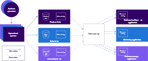

## About this learning plan
- [About this learning plan](#about-this-learning-plan)
- [A. Fundamentals of Analytics on AWS - Part 1](#a-fundamentals-of-analytics-on-aws---part-1)
  - [A.1 Definitions](#a1-definitions)
  - [A.2 Analytics types and techniques](#a2-analytics-types-and-techniques)
    - [A.2.1 Descriptive analytics](#a21-descriptive-analytics)
    - [A.2.2 Diagnostic analytics](#a22-diagnostic-analytics)
    - [A.2.3 Predictive analytics](#a23-predictive-analytics)
    - [A.2.4 Prescriptive analytics](#a24-prescriptive-analytics)
  - [A.3 Machine Learning](#a3-machine-learning)
    - [A.3.1 Generative AI on AWS](#a31-generative-ai-on-aws)
    - [A.3.2 What it does](#a32-what-it-does)
    - [A.3.3 Generative AI examples](#a33-generative-ai-examples)
  - [A.4 Amazon CodeWhisperer](#a4-amazon-codewhisperer)
    - [A.4.1 What it does](#a41-what-it-does)
    - [A.4.2 Features](#a42-features)
    - [A.4.3 Benefits](#a43-benefits)
  - [A.5  Vs of Big Data](#a5--vs-of-big-data)
    - [A.3.1 Volume](#a31-volume)
    - [A.5.2 Variety](#a52-variety)
    - [A.5.3 Velocity](#a53-velocity)
    - [A.5.4 Varacity](#a54-varacity)
    - [A.5.5.Value](#a55value)
  - [A.6 Data source types](#a6-data-source-types)
    - [A.6.1 Structured data includes the following:](#a61-structured-data-includes-the-following)
    - [A.6.2 Semistructured data includes the following:](#a62-semistructured-data-includes-the-following)
    - [A.6.3 Unstructured data](#a63-unstructured-data)
  - [A.7 Data storage methods](#a7-data-storage-methods)
    - [A.7.1 Structured data stores](#a71-structured-data-stores)
    - [A.7.2 Structured data storage methods](#a72-structured-data-storage-methods)
      - [A.7.2.1 Strengths of a relational database include the following:](#a721-strengths-of-a-relational-database-include-the-following)
      - [A.7.2.2 Weaknesses of a relational database include the following:](#a722-weaknesses-of-a-relational-database-include-the-following)
    - [A.7.3 Semistructured data stores](#a73-semistructured-data-stores)
  - [A.8 Data processing velocities](#a8-data-processing-velocities)
  - [A.9  AWS Services for Volume](#a9--aws-services-for-volume)
  - [A.10 AWS Services for Variety](#a10-aws-services-for-variety)
  - [A.11 AWS Services for Velocity](#a11-aws-services-for-velocity)
  - [A.12 AWS Services for Veracity](#a12-aws-services-for-veracity)
  - [A.13 AWS Services for Value](#a13-aws-services-for-value)
- [B. Fundamentals of Analytics on AWS - Part 2](#b-fundamentals-of-analytics-on-aws---part-2)
  - [B.1 Introduction to Data Lakes](#b1-introduction-to-data-lakes)
  - [B.3 Benefits of data lakes](#b3-benefits-of-data-lakes)
  - [B.3.1 Scalability](#b31-scalability)
    - [B.3.2 Cost-efficiency](#b32-cost-efficiency)
    - [B.3.3 Flexibility](#b33-flexibility)
    - [B.3.4 Faster Analysis](#b34-faster-analysis)
    - [B.3.5 Centralized View](#b35-centralized-view)
  - [B.4 Data lake functions](#b4-data-lake-functions)
  - [B.5 Challenges in building a data lake](#b5-challenges-in-building-a-data-lake)
  - [B.6 Introduction to Lake Formation](#b6-introduction-to-lake-formation)
    - [B.6.1 Key features](#b61-key-features)
    - [B.6.2 Lake Formation roles](#b62-lake-formation-roles)
  - [B.7 Introduction to Data Warehousing](#b7-introduction-to-data-warehousing)
  - [B.7 Challenges with on-premises data warehouses](#b7-challenges-with-on-premises-data-warehouses)
  - [B.8 Data warehouse modernization using Amazon Redshift](#b8-data-warehouse-modernization-using-amazon-redshift)
  - [B.8 Zero-ETL](#b8-zero-etl)
  - [B.9 Introduction to Modern Data Architecture](#b9-introduction-to-modern-data-architecture)
    - [B.9.1 Pillars of a modern data architecture](#b91-pillars-of-a-modern-data-architecture)
    - [B.9.2 Concepts of data movement](#b92-concepts-of-data-movement)
  - [B.10 Data mesh architecture for data sharing](#b10-data-mesh-architecture-for-data-sharing)
    - [B.10.1 Amazon DataZone](#b101-amazon-datazone)
  - [B.11 AWS Services for Modern Data Architecture](#b11-aws-services-for-modern-data-architecture)
    - [B.11.1 AWS services for scalable data lakes](#b111-aws-services-for-scalable-data-lakes)
    - [B.11.2 AWS services for purpose-built analytics](#b112-aws-services-for-purpose-built-analytics)
    - [B.11.3 AWS services for unified data access](#b113-aws-services-for-unified-data-access)
    - [B.11.4 AWS services for unified governance](#b114-aws-services-for-unified-governance)
    - [B.11.5 AWS services for performance and cost-effectiveness](#b115-aws-services-for-performance-and-cost-effectiveness)
  - [B.12 Modern data architecture on AWS](#b12-modern-data-architecture-on-aws)

The AWS Certified Data Engineer Associate Learning Plan (Partner) contains a comprehensive set of courses that are aligned to the certification.

AWS recommends that you also have hands-on experience as part of your exam preparation. Please review the:
1. [AWS Data Engineer Certification - Associate Exam Guide](https://d1.awsstatic.com/training-and-certification/docs-data-engineer-associate/AWS-Certified-Data-Engineer-Associate_Exam-Guide.pdf), 
2. ~[Sample Questions](https://explore.skillbuilder.aws/learn/course/external/view/elearning/16985/aws-certified-data-engineer-associate-official-practice-question-set-dea-c01-english) and 
3. when you’re ready, you can [Schedule the Certification Exam](https://www.aws.training/certification?src=deva).

 
[AWS Certified Data Engineer Associate Companion Learning Plan (Partner Subscription)](https://explore.skillbuilder.aws/learn/learning_plan/view/2072/aws-certified-data-engineer-associate-learning-plan-partner-subscription)

This companion learning plan is intended for AWS partner learners with an active AWS Skill Builder subscription who wish to dive deeper into the topics explored throughout the [AWS Certified Data Engineer Associate Learning Plan (Partner)](https://explore.skillbuilder.aws/learn/learning_plan/view/2071/aws-certified-data-engineer-associate-learning-plan-partner).

## A. Fundamentals of Analytics on AWS - Part 1

### A.1 Definitions

**Analytics:** The process of using specialized tools and techniques to find new value from raw data

**Data analysis**: The practice of interpreting data that leads to meaningful decisions

### A.2 Analytics types and techniques

There are various types of analytics, each serving different purposes and using different techniques.
#### A.2.1 Descriptive analytics
**Descriptive analytics** helps to answer what happened. It uses data visualization techniques, such as the following:

* **Pie charts**: A diagram that shows data as slices in a circular-shaped graph
* **Bar charts**: A diagram that shows data in rectangular bars horizontally or vertically
* **Line graphs**: A diagram that uses lines to connect single data points generally plotted over a period of time
* **Tables**: A diagram that shows data in rows and columns
* **Generated narratives**: You can ask questions about your data and receive answers with visualizations
#### A.2.2 Diagnostic analytics
**Diagnostic analytics** helps to answer why it happened. It uses techniques such as the following:

* **Drill-down**: Seeing an overview of the data, to a detailed view within the same dataset
* **Data discovery**: A process for gathering, cataloging, and classifying data from different databases for analytics
* **Data mining**: Using analytics against a large dataset to discover meaningful insights
* **Correlations**: A measure between two variables that shows how closely related they are without stating a cause-and-effect relationship

#### A.2.3 Predictive analytics
**Predictive analytics** helps to answer what might happen in the future. It uses techniques such as the following:

* **Machine learning (ML):** A technique that teaches software how to learn from data, find patterns, and make decisions with minimal human intervention
* **Forecasting**: Predicting future value by looking at unique trends
* **Pattern matching**: Finding pre-determined patterns in raw data
* **Predictive modeling**: Predicting future events by analyzing patterns with input data
* 
#### A.2.4 Prescriptive analytics
**Prescriptive analytics** recommends actions to the predicted outcome. It uses techniques, such as the following:

* **Graph analysis**: Analyzing relationships between objects in a network or graph
* **Simulation**: Modeling the behavior of a system by using the characteristics and relationships of system components
* **Complex event processing**: Deriving a conclusion through tracking and analyzing streaming data
* **Neural networks**: An ML model that copies the function of neurons in the human brain to learn and solve complex problems
* **Recommendation engines**: A system that uses ML recommends the most relevant items to a user, based on behavior patterns

### A.3 Machine Learning
#### A.3.1 Generative AI on AWS
**Generative AI** is a type of **ML model that creates new content and ideas from user prompts**. Generative AI is not just outputting data, but generating content like conversations, stories, images, videos, and music.

#### A.3.2 What it does
**Generative AI** learns from existing data and then uses that knowledge to create new, original content. 
> It is done through a type of **ML called deep learning**, which uses algorithms to mimic the structure of the human brain. These algorithms, called **artificial neural networks**, are inspired by the biological neurons of the human brain and are able to learn complex patterns from data.

Generative AI is powered by large, pre-trained models called foundation models. Generative AI models are trained on massive amounts of data, which can be anything from text to images to music. The model learns the patterns and structures of the data. It then uses that data to make predictions about what the content should look like, similar to the data it was trained on.

#### A.3.3 Generative AI examples
With the appropriate training, you can use generative AI models for the following:

* Use a generative AI model trained on a **corpus of text to generate new text**, such as news articles, blog posts, or poems.
* Use a generative AI model trained on a **dataset of images to generate new images**, such as paintings, photographs, or sketches.
* Use a generative AI model trained on a **dataset of music to generate new music**, such as songs, symphonies, or concertos.
  
### A.4 Amazon CodeWhisperer
**Amazon CodeWhisperer** is a code generation service that **analyzes your code and comments as you write code in your integrated development environment (IDE)**. It goes beyond code completion by leveraging natural language processing to write code by understanding the comments in the code.
#### A.4.1 What it does
By understanding English comments, **Amazon CodeWhisperer** generates complete functions and code blocks that align with your descriptions. Additionally, **Amazon CodeWhisperer** analyzes the surrounding code, ensuring the generated code matches your style, naming conventions, and seamlessly integrates into the existing context.

**Amazon CodeWhisperer** includes a security scanning feature that detects security vulnerabilities in both generated and developer-written code. It scans the code to identify potential vulnerabilities and provides suggestions for remediation. This includes scanning for hard-to-find vulnerabilities that may be overlooked. The security scan is compatible with popular IDEs such as Visual Studio Code (VS Code) and JetBrains. It supports over 15 programming languages. 

For a list of the latest supported programming languages, see [Language Support in Amazon CodeWhisperer(opens in a new tab)](https://docs.aws.amazon.com/codewhisperer/latest/userguide/language-ide-support.html).

**Amazon CodeWhisperer** has the potential to increase development speed, security, and the quality of software.
#### A.4.2 Features
Features of Amazon CodeWhisperer include the following:

* Uses natural language processing of English comments in your code
* Offers real-time code completion and code generation suggestions
* Suggests whole lines of code, complete functions, and logical blocks of code
* Reference tracker protects open source intellectual property
* Keeps codebase up to date with the latest security practices
#### A.4.3 Benefits
Benefits of Amazon CodeWhisperer include the following:

* Accelerates application development for faster delivery of software solutions
* Automates repetitive tasks to optimizes uses of developer time so they can focus on more critical aspects of the project
* Mitigates security vulnerabilities
* Enhances code quality and reliability to produce robust and efficient applications
* Provides efficient responses to evolving software threats
  
### A.5  Vs of Big Data
#### A.3.1 Volume
#### A.5.2 Variety
#### A.5.3 Velocity
#### A.5.4 Varacity
#### A.5.5.Value

### A.6 Data source types

Analytics begins with data sources. A data source can be a folder on a file server, database, web page, and even a wearable device. Data sources can come from within an organization and from outside of one. Data variety is about how the data source organizes various types of data.

**Structured data, semistructured data, and unstructured data** each have unique characteristics that form a recognizable pattern.

#### A.6.1 Structured data includes the following:

* Customer Relationship Management (CRM) system
* Online forms
* Network logs
* Event reservation system
#### A.6.2 Semistructured data includes the following:

* CSV
* JSON
* XML
#### A.6.3 Unstructured data
–
Unstructured data includes the following:

* Clickstream data
* Emails
* Documents
* PDFs
* Photos
* Videos

### A.7 Data storage methods

You can classify data source types based on the storage types that are used. Structured and semistructured data are stored in database management systems (DBMS). Unstructured data is stored in data lakes or object storage solutions. You will learn about unstructured object storage solutions in a later lesson and data lakes in the next course.

#### A.7.1 Structured data stores

**Structured data** is stored within a **relational database management system (RDBMS)**. A database is a structured set of data stored in a computer. 
> A **RDBMS** provides structure to the data, lifecycle maintenance, and management of interactions with other processes and systems.
>
#### A.7.2 Structured data storage methods

Relational databases store data in tables that are related to one another. Within the table, there are columns and rows, which are defined by a schema. The **schema** defines the design of the data and its relationship to one another. **The goal for relational databases is optimized storage**. For querying the data, relational databases use the structured query language (SQL). There are many types of databases to choose from. To choose the type of database, you must understand the data type you have and how you will be using it.
##### A.7.2.1 Strengths of a relational database include the following:

* Proven technology, widely adopted and understood
* Less risk involved
* Very good transactional latency
* Outstanding for relatively small data sets
##### A.7.2.2 Weaknesses of a relational database include the following:

* Scalability concerns
* Need to increase hardware capacities as data grows
* Fixed schema makes it difficult to make non-disruptive changes 
* Struggles with storing unstructured data
#### A.7.3 Semistructured data stores

Semistructured data are often stored in non-relational database systems, sometimes called NoSQL databases. This term can be confusing. Non-relational or NoSQL does not mean the data stored cannot be queried using SQL. A better way to think of it is not only SQL.
Non-relational databases are built to store semistructured data for rapid collection and retrieval. NoSQL databases store data as a collection of documents or key-value pairs. 

### A.8 Data processing velocities
* **Scheduled** : Scheduled batch processing represents data that is processed in a very large volume on a regularly scheduled basis. For instance, once a week or once a day. It is generally the same amount of data with each load, making these workloads predictable.
* **Periodic**: Periodic batch processing is a batch of data that is processed at irregular times. These workloads are often run after a certain amount of data has been collected. This can make them unpredictable and hard to plan around.
* * **Near real Time**: Near real-time processing represents streaming data that is processed in small individual batches.
The batches are continuously collected and then processed within minutes of the data generation.
* **Real Time**: Real-time processing represents streaming data that is processed in very small individual batches.
The batches are continuously collected and then processed within milliseconds of the data generation.

### A.9  AWS Services for Volume
* **Amazon Simple Storage Service (Amazon S3)**: Store any amounts of object storage with scalability, availability, and security.
AnyCompany Media uses Amazon S3 to store movies, television series, production photos, and all kinds of unstructured data. **With Amazon S3, AnyCompany Media can scale conveniently to keep up with huge spikes in volume and traffic across their distributed systems**.

* **AWS Lake Formation**: Build, manage, and secure data lakes faster and more conveniently. 
Using AWS Lake Formation, AnyCompany Media is able to store all their structured, semistructured, and unstructured data and run different types of analytics in real time. With a data lake on AWS combined with Amazon Redshift, they are able to collect, process, and analyze all their data in real time. They run analytics on user behavior on their streaming platform, social media interactions, and audience feedback. And, with new insights, they have been able to increase their customer satisfaction and lower customer complaints. 

* **Amazon Redshift**: Use cloud data warehousing with the best price performance.
Using Amazon Redshift, AnyCompany Media stores their structured content from all kinds of databases used throughout their many departments worldwide. With Amazon Redshift, they store, manage, and access all their structured data in a scalable way and run different types of analytics in real time.

### A.10 AWS Services for Variety
* **Amazon Relational Database Service (Amazon RDS)**
To solve its analytics challenges with structured data, AnyCompany Media uses Amazon RDS. The company overcame its challenges with multiple databases across its organizations by moving them to the cloud and using Amazon RDS. AnyCompany Media can scale much more conveniently and doesn't have to administer the databases.
* **Amazon DynamoDB**
They solved their analytics challenge with semistructured data with Amazon DynamoDB and Amazon OpenSearch Service. With Amazon DynamoDB, they solved their NoSQL analytics challenges. They are able to scale conveniently and experience high-performance analytics.
* **Amazon Redshift**
With Amazon Redshift, they can run analytics on all their structured data without overloading their databases. They set up and deployed their data warehouse within minutes and can scale effortlessly.
* **Amazon OpenSearch Service**
AnyCompany Media uses Amazon OpenSearch Service to deploy, operate, and scale OpenSearch clusters in the AWS Cloud. AnyCompany Media can perform interactive application analytics and website search at a lower cost compared to packaged solutions. With OpenSearch, their customers search their entire movie catalog and narrow down their results quickly, based on their desired attributes. Customers get high quality and personalized search results with Amazon OpenSearch Service.

### A.11 AWS Services for Velocity
* **Amazon EMR**
AnyCompany Media uses Amazon EMR to process and transform their raw data into a structured format that is suitable for analysis. Their data analysts can perform in-depth analysis, identify trends, and make data-driven decisions. Amazon EMR takes care of the infrastructure management, including provisioning, configuration, scaling and security. This relieves AnyCompany Media from the operational overhead and scalability issues associated with on-premises infrastructure. With Amazon EMR, AnyCompany Media can efficiently derive insights from their user interaction data.
* **Amazon Managed Streaming for Apache Kafka (Amazon MSK)**
AnyCompany Media uses Apache Kafka data-plane operations for producing and consuming data. AnyCompany Media captures events with Amazon MSK, and then expresses their stream processing logic within Apache Kafka to derive insights from data streams in milliseconds.  Without the administrative burden of self-managed Kafka clusters and maintaining Kafka infrastructure, AnyCompany Media focuses on extracting value from their data streams.
* **Amazon Kinesis**: 
AnyCompany Media can adjust their capacity to stream gigabytes per second of data with Kinesis Data Streams. There are no servers to manage and the on-demand mode eliminates the need to provision or manage capacity. They get automatic provisioning and scaling with the on-demand mode.

In conjunction with Amazon Kinesis Data Streams, AnyCompany Media also uses Amazon Kinesis Data Firehose. Kinesis Data Firehose is an ETL service that reliably captures, transforms, and delivers streaming data to data lakes, data stores, and analytics services. AnyCompany Media can then react to their streaming data in real time. 
* **AWS Lambda**:
AWS Lambda can process data as soon as it becomes available or as events occur, helping AnyCompany Media keep up with the velocity of incoming data. AWS Lambda events can be initiated rapidly in response to events that AnyCompany Media defines. Lambda also scales automatically and has the ability to handle multiple events in parallel. This ensures that data processing remains efficient even during high velocity periods. AWS Lambda can also be combined with other AWS services to implement batch processing for periodic data processing.

### A.12 AWS Services for Veracity
* **Amazon EMR**
Amazon EMR makes analysis of large data sets more efficient by distributing work across multiple compute clusters. Amazon EMR can also be used in serverless workflows where actions are initiated by changes or events.
* **AWS Glue**
AnyCompany Media uses AWS Glue for its convenient and streamlined approach to clean and normalize their data from all their internal and external data sources. They use AWS Glue to clean and transform clickstream data in-flight and run analytics and ML to gain additional insight about their customer preferences.
* **AWS Glue DataBrew**
AnyCompany Media can conveniently prepare data visually with AWS Glue DataBrew. They can map the lineage of their data to fully understand the data sources and all the transformations their data has gone through for analytics and ML. 
* **Amazon DataZone**
  Amazon DataZone makes it convenient for AnyCompany Media data consumers to discover, access, and consume the data they need. Amazon Datazone ensures that only the right data can be access by the right user for the right purpose with a governed workflow.

### A.13 AWS Services for Value
* **Amazon QuickSight**
Amazon QuickSight provides visibility into the performance of AnyCompany Media's advertising campaigns. QuickSight will consolidate data from different sources, and create interactive dashboards and visualization. AnyCompany Media can even add filters to drill down into the granular data from different campaigns. They can conveniently identify which campaigns are driving the highest engagement and conversions. With QuickSight's intuitive visualization and analytical tools, AnyCompany Media can make data-driven decisions and allocate more resources to the most effective strategies. 
* **Amazon SageMaker**
By using Amazon SageMaker, AnyCompany Media can develop ML models to predict user preferences based on historical data. They can integrate SageMaker's models to automate the process of delivering personalized recommendations to users. The data collected and analyzed by SageMaker provides insights into user behavior, preferences, and trends. SageMaker helps inform future content creation and distribution strategies. 
* **Amazon Athena**
Amazon Athena helps analyze petabyte-scale data where it lives with convenience and flexibility. AnyCompany Media can analyze data or build applications from an Amazon S3 data lake or other data sources, including on-premises or other cloud systems, using SQL or Python. Athena is serverless, so AnyCompany Media won't have to set up or manage their own infrastructure.

## B. Fundamentals of Analytics on AWS - Part 2
### B.1 Introduction to Data Lakes
A data lake is a centralized repository that an organization can use to store data at scale, **both structured and unstructured, in its original format**. Data lakes ingest raw data from various sources such as **d**atabases, sensors, social media, documents, and applications**. Prior to analysis, the raw data might undergo transformations such as cleansing, normalization, aggregation, and more. The large-scale and schema-on-read capabilities of a data lake provide opportunities for organizations to gain insights through big data analytics, machine learning, and artificial intelligence (AI).

### B.3 Benefits of data lakes
Data lakes on AWS help you break down data silos to maximize end-to-end value of your data.

### B.3.1 Scalability

* Store massive amounts of data
* Scale storage up or down as needed
* Store multiple types of data
#### B.3.2 Cost-efficiency

* Reduce costs with low-cost storage like Amazon Simple Storage Service (Amazon S3) or EMR File System (EMRFS)
* Develop schemas over time, which reduces modeling costs 
* Pay only for the storage used compared to the allocated capacity 

#### B.3.3 Flexibility

* Store structured, unstructured, and semi-structured data
* Apply schemas later as needed for analysis
* Conveniently load new data sources and types
#### B.3.4 Faster Analysis

* Avoid the extract-transform-load (ETL) and extract-load-transform (ELT) processes, run and queries in place for impromptu analysis
* Perform real-time and batch processing of data
#### B.3.5 Centralized View

* View your data repository in a single view
* Refer to a single source of truth instead of disparate systems
* Apply common governance and security policies
### B.4 Data lake functions
* **Ingest and store**
* **Catalog and search**
* **Secure and Protect**
* **Analytics and Insights**
### B.5 Challenges in building a data lake
A major challenge with building a data lake is implementing effective data governance practices. As data from disparate sources flows into the lake, metadata such as schemas and data definitions can be lost or incorrect. With diverse users across an organization querying the data, it can be difficult to maintain data quality, security, and compliance without strong governance. With a robust governance framework, you can establish policies, roles, processes, and tools to properly ingest, catalog, protect, and manage the use of the varied data.

Critical governance capabilities include lineage tracking, access controls, encryption, monitoring, auditing, and metadata management. Lacking governance can lead to poor data quality, uncontrolled access and queries, security risks, and the inability to properly use the data lake for your enterprise analytics needs.

### B.6 Introduction to Lake Formation
The challenges of building a data lake can be addressed using AWS Lake Formation. Lake Formation is a managed service that simplifies building, securing, and managing data lakes. It automates ingesting, cataloging, cleaning, and transforming data from diverse sources into a data lake on Amazon S3. 
> **Lake Formation uses machine learning and policies to automatically secure, organize, and catalog data**. 

It provides a governed data lake by integrating with AWS services like AWS Glue, Athena, AWS Identity and Access Management (IAM), and AWS CloudTrail. Lake Formation streamlines building a secure data lake, which creates faster time to insights.

Lake Formation provides features for three stages in the data lifecycle: **ingestion, data storage, and catalog and processing.**

Lake Formation provides the following key benefits:

* Fully managed serverless services
* Data lake developed in days, instead of weeks or months
* Low cost
* Streamlined permission management
* Monitored and audited access to verify compliance
* Data sharing
* Integration with many analytics and machine learning tools
#### B.6.1 Key features

The following are the key features of Lake Formation.
* **Automated build environment** 
* **Persistently store dataset metadata**
* **Orchestrate script and crawler**
* **Centralized access controls**
#### B.6.2 Lake Formation roles

The Lake Formation permissions model includes three security roles.
* **Lake formation Administrator**
* **DataBase creator**
* **Table creator**

With Lake Formation, 
* AnyCompany Media can enjoy the benefits of data lakes while also **overcoming the governance, quality, and security challenges** that come with it. 
* * AnyCompany Media can build scalable data lakes that support unlimited amounts of data from different sources in days at a low cost. 
* * AnyCompany Media can use Lake Formation for automated builds, to ensure high quality for data sharing and analytics, and for centralized permission management and access control. 
### B.7 Introduction to Data Warehousing
A data warehouse is a **central repository of information that is specially designed for analytics**. Data flows into a data warehouse from business applications, databases, and other sources. Data warehouse users access the data through business intelligence (BI) tools, SQL clients, and other analytics applications. 
> **It minimizes the input and output (I/O) of data and delivers query results quickly to hundreds and thousands of users concurrently.**

### B.7 Challenges with on-premises data warehouses
Organizations often begin implementing a data warehouse on-premises and run into many challenges.
* **High upfront costs**: On-premises data warehouses require large upfront investments in hardware, software licenses, and real estate among other expenses. This results in high fixed costs.
* * **Scalability issues**: It can be challenging to scale up or scale down an on-premises data warehouse because workload requirements change. Additional infrastructure and licenses might be needed to handle growth.
* **Maintenance overhead**: On-premises data warehouses require significant resources to maintain. This includes administrators, database administrators (DBAs), infrastructure management, and others. This adds to ongoing operational expenses. 
* **Limited flexibility**: On-premises data warehouses provide limited flexibility in expanding or adopting new technologies because they involve physical infrastructure. Moving or upgrading warehouses can be complex.
* **Skill set requirements**: On-premises data warehouses require specialized skill sets such as database administration and system engineering. Recruiting and retaining such talent can be difficult.
* **Lack of availability**: On-premises data warehouses are prone to downtime because of operational issues, outages, or disasters. Achieving high availability adds further complexity.
> **In summary, on-premises data warehouses involve major investment, ongoing maintenance costs, and inflexibility in scaling.**

### B.8 Data warehouse modernization using Amazon Redshift
Amazon Redshift can help organizations **set up and deploy a new data warehouse in minutes**. It’s built to store and query datasets ranging from gigabytes to petabytes in size. 
> **Amazon Redshift provides a cloud-based, scalable, secure environment for your data warehouse**. 
Many organizations deploy to Amazon Redshift to improve their query performance, reduce overhead, and lower the cost of analytics.

* **Scalability**: With Amazon Redshift, organizations can scale compute and storage separately. Therefore, they can add resources on-demand to handle spikes in workloads. Amazon Redshift can query exabytes of data with fast performance.
* **Agility**: Amazon Redshift rapidly spins up new data warehouses for new workloads. This provides flexibility to experiment and innovate quickly. Amazon Redshift integrates well with AWS data and analytics services.
* **Cost-efficiency**: With Amazon Redshift, organizations only pay for the resources provisioned. It is very cost-effective compared to on-premises data warehouses. Automated monitoring tools optimize utilization to reduce costs.
* **Performance:** Amazon Redshift provides fast query performance through columnar storage, running parallel queries, and advanced caching. Performance tuning features like workload management further boost throughput.
* **Durability:** Amazon Redshift replicates data across multiple nodes to protect against failures. Data is stored redundantly across multiple availability zones for high durability.
* **Security:** Amazon Redshift provides enterprise-grade security features like SSL encrypted connections, database encryption, virtual private clouds (VPCs), IAM policies, and audit logging. This helps meet strict regulatory requirements.
* **Serverless:** Amazon Redshift Serverless makes it easy to run analytics workloads of any size without having to manage data warehouse infrastructure. With Amazon Redshift, you pay for compute and storage separately. Serverless automates capacity management by making the rightsizing decisions and scales the capacity elastically and automatically based on the workloads. For data, you pay for data stored in the managed storage of Amazon Redshift at the existing fixed gigabit-per-month rate. 
* **Machine Learning**: Amazon Redshift makes building and deploying machine learning (ML) models remarkably easy. Through simple SQL commands, users can leverage built-in algorithms like random forest and logistic regression to explore data, engineer features, and train models with no coding required. Amazon Redshift integrates seamlessly with SageMaker to import external models directly into Amazon Redshift. 

With Amazon Redshift, users of all skill levels can harness the power of machine learning across petabytes of data by abstracting away the complexity. Whether you're an expert data scientist or just starting with ML, Amazon Redshift provides a user-friendly SQL interface to quickly go from data to insights. With Amazon Redshift ML, machine learning is made accessible and easy to apply within your data warehouse.
* **Automation:** Amazon Redshift self-regulates its data warehouse performance using ML. Amazon Redshift optimizes and automates administrative tasks like distributing physical data, designing the storage layer schema, and maintaining tables.
* **Data sharing:** With Amazon Redshift data sharing, organizations can securely share live read-only snapshots of Amazon Redshift data lakes with other accounts or within their business for real-time analytics and reporting. Amazon Redshift applies continuous delta updates to keep shared snapshots up-to-date while encrypting data in transit and at rest for security. Data consumers can directly query the live snapshots using SQL without moving any data. Amazon Redshift data sharing minimizes data duplication by sharing source datasets while still providing centralized control through integrated permissions and audit logging.

### B.8 Zero-ETL

Amazon Redshift has built-in support for zero-ETL. **Zero-ETL is a set of integrations that eliminates or minimizes the need to build ETL data pipelines**. Typical ETL processes are time-consuming and complex to develop, maintain, and scale. Traditionally, moving data from a transactional database into a central data warehouse always required a complex ETL solution. Instead, zero-ETL facilitates point-to-point data movement without the need to create ETL data pipelines.

Zero-ETL instantly duplicates data from the transactional database to the data warehouse. **The duplication mechanism uses change data capture (CDC) techniques built into the data warehouse**
> **Applications store data in the transactional database and analysts query the data from the warehouse seamlessly. Zero-ETL helps with querying across data silos without the need for data movement**.

**Zero-ETL helps you ingest data from multiple such streams and present it for analytics almost instantly**. There is no requirement to stage the streaming data for transformation on any other storage service.

* **Auto-copy from Amazon S3!** The Amazon Redshift auto-copy from Amazon S3 feature automates data ingestion into Amazon Redshift. This feature continuously ingests data as soon as new objects are created in Amazon S3 with no custom coding or manual ingestion activities.
* **Streaming ingestion**: The Amazon Redshift streaming ingestion feature ingests hundreds of megabytes of data per second from Amazon Kinesis Data Streams or Amazon Managed Streaming for Apache Kafka (Amazon MSK). **You can define a schema or choose to ingest semi-structured data with the SUPER data type to query data in real time**.
* **Aurora zero-ETL with Amazon Redshift**: Amazon Aurora now supports zero-ETL integration with Amazon Redshift to enable near real-time analytics and ML using Amazon Redshift on petabytes of transactional data from Aurora. Within seconds of transactional data being written into Aurora, the data is available in Amazon Redshift. You don’t have to build and maintain complex data pipelines to perform ETL operations.

With this zero-ETL integration, you can analyze data from multiple Aurora database clusters in the same new or existing Amazon Redshift instance. You can derive holistic insights across many applications or partitions. 

With near real-time access to transactional data, you can use capabilities of Amazon Redshift to derive insights from transactional and other data:
* **Built-in ML**
* **Materialized views**
* **Data sharing**
* **Federated access to multiple data stores and data lakes**
  
> With **Amazon Redshift**, AnyCompany Media can analyze all their data stored in Amazon Redshift, Amazon S3, and even Amazon Relational Database Service (Amazon RDS) using a federated query, and Aurora using zero-ETL. AnyCompany Media can create reports, dashboards, and run analytics workloads efficiently and deliver query results quickly to hundreds and thousands of users at scale.

### B.9 Introduction to Modern Data Architecture
#### B.9.1 Pillars of a modern data architecture

**Modern data architecture** aims to provide data insights, analytics, reporting, machine learning, and AI by efficiently processing large volumes of diverse data from multiple sources. It uses cloud infrastructure and modern big data tools like data lakes, stream processing, and cloud warehouses to ingest, store, process, and analyze data at scale. It also optimizes for speed, flexibility, and cost efficiency.

#### B.9.2 Concepts of data movement

Efficiently managing and analyzing data at scale requires thoughtful architecture strategies to avoid unnecessary data movement that can incur substantial costs and latency. Cloud platforms provide a variety of managed services that integrate to create innovative approaches for moving data only when needed. Key concepts include the following:

* Minimizing transit
* Using data gravity
* Using zero-ETL or minimal extract-load-transform (ELT) workflows
* Orchestrating pipelines
* Streaming for continuous data processing 

> **By architecting application and analytics workloads on the cloud using these best practices, organizations can optimize data movement to build responsive, cost-effective data platforms.**

Modern data architecture components are made up of **relational databases, non-relational databases, machine learning, log analytics, data warehousing, and big data processing**. 
> **These components share data in different ways. Common to all the data movement types is the data lake, in which all modern data architecture components store data and write data to.**
>
**Inside-out**:

* **Inside-out data movement** **keeps data in a central repository like a data lake and moves compute to it rather than transferring data across systems**. This approach minimizes unnecessary data movement. **Key enablers are technologies like serverless functions, query engines, and orchestration tools that collect processing workloads with the source data**. 
> **A shared data catalog provides metadata to enable querying in place**. 
By analyzing, transforming, and moving data only when necessary, this pattern reduces duplication and movement costs while optimizing processing performance.

* **Outside-in data movement** refers to the process of **bringing data from purpose-built systems into an organization's data lake**. An example is when a customer copies query results for regional product sales from their data warehouse into their data lake to run product recommendation algorithms against a larger dataset using ML. 
> **Data from a purpose-built data store moves into the data lake.**

* **Around the perimeter data movement** is moving data from one purpose-built data store to another. An example is when a customer copies the product catalog data stored in their database to their search service. This makes it easier to look through their product catalog and offload the search queries from the database.

* **Sharing across data movement** involves **the seamless transfer of data between different applications**. An example of sharing across data movement is using a data mesh architecture. Data as a product is a central design goal of data mesh. A business-aligned domain registers as a node in a mesh, publishes their data products to a central governance catalog, and discovers data products to consume through central governance services. The enterprise manages a central set of governance services to support enterprise-wide data discovery, reporting, and auditing.

**Data mesh**: A data mesh architecture **consists of data teams that build and run the platform. They build security controls, run the onboarding, and provide training**.

**Data producers**: Data producers **consist of business domain teams that want to share their data**. They have domain expertise and manage data ownership and governance. They ensure data quality and manage the metadata to make it easy to find their data.

**Data consumers**: Data consumers make use of the data mesh to fit their business function. They want to be able to find data easily. Data consumers use data to run business priorities and develop business analytics to find new insights.

> **Purpose-built databases and analytics services includes analytics services like Amazon Redshift, Amazon EMR, Amazon SageMaker, Amazon Athena, Amazon DynamoDB, Amazon Aurora, Amazon OpenSearch Service, and more.**
> 
### B.10 Data mesh architecture for data sharing
A data mesh is a decentralized data architecture and governance model that treats data as a product. A data mesh architecture consists of self-serve data platforms provisioned by domain or business unit teams.

These autonomous data platforms provide **domain-specific analytics, applications, and machine learning**, while infrastructure teams manage shared data utilities like **catalogs, observability, and platform services**. 

**Data is managed as products** with an emphasis on discoverability, quality, and collaboration between domains and central IT teams. The domain-oriented decentralization aims to increase organizational agility and analytical speed while maintaining enough consistency and governance through core infrastructure.

* A data mesh pattern **separates consumers, producers, and central governance**. 
* Data products are stored in their own data lake. 
* The data mesh **provides physical separation**. 
* Each data lake is cataloged and schematized. 
* Services that consume data are in a consumer application domain and are separate from each other and the data lakes. 
* When data consumers need data from one or more data lakes, cloud services make the data visible to consumers and queryable directly from the data lakes. 
* Data product-specific lakes that hold data and the application domains that consume lake data are interconnected to form the data mesh.
  
**A data product** in a data mesh is a curated set of data provided by a domain team to serve specific business needs. It encapsulates raw data with value-added content like cleaned data schemas, transformation code, and quality metrics to power analytics and applications. Data products provide discoverability and reusability of data across the organization.

**Central data governance** in a data mesh on AWS provides common infrastructure and policies while empowering domain teams to build data products. It manages core data services like catalogs, pipelines, and data quality tools. Domain teams are accountable for their data products within the overall governance standards set by central IT.

**Common access** provides consistent discovery and consumption of decentralized data products across domains. Standard tooling like catalogs and data portals provide unified access. Usage monitoring, access controls, and infrastructure are centrally governed however schema, APIs, and pipelines create a common interface to domain data products.

* Data **moves from business processes** to operational systems and is stored in unique domain lakes. 
* Data is cataloged and schematized in the individual lake's catalogs. 
* Consuming applications can get the data they need from one or more data lakes through the mesh catalog. 
* The mesh catalog provides central governance and connects consumers directly to data lakes to form a mesh pattern.
#### B.10.1 Amazon DataZone
**AWS implements the data mesh pattern through Amazon DataZone**. This service helps organizations manage, govern, and share data assets across AWS, on-premises sources, and third-party sources. It provides fine-grained access controls to ensure the right users can access the right data. Amazon DataZone also helps organizations discover, catalog, and collaborate around data to drive insights.

Amazon DataZone integrates with various AWS services. **It can publish data assets from sources like AWS Glue Data Catalog, Amazon Redshift, and Amazon S3 into the Amazon DataZone catalog.** 
> **Amazon DataZone supports querying data through Athena and Amazon Redshift**. It also uses **Lake Formation and Amazon EventBridge to control access to data assets and integrate with other services**.

Overall, **Amazon DataZone helps organizations get more value from data through governed access, discovery, and collaboration capabilities**. It builds on other AWS services to provide an integrated data management platform across an organization's various data sources and analytics tools. With Amazon DataZone, more users can securely find, understand, and use data.

AnyCompany Media's **current data architecture struggles to manage the growing volume, velocity, variety, veracity, and value of data today—the 5 Vs of big data**. By migrating to a modern cloud-based data architecture on AWS, AnyCompany Media **can adopt a data mesh to better address these challenges**. 
> **The data mesh breaks down data silos and provides data consumers self-service access to data producers' data through standardized interfaces**. With centralized governance, AnyCompany Media can ensure data quality while empowering domain teams to use the data for their needs. 

### B.11 AWS Services for Modern Data Architecture
With AWS services, you can quickly build modern data architectures that deliver analytics and insights. 

#### B.11.1 AWS services for scalable data lakes
A modern data architecture uses scalable data lakes that can handle growing amounts of data and workloads. Data lakes can expand effortlessly to store petabytes of data.

**Amazon S3** is a scalable, high-speed, web-based cloud storage service designed for online backup and archiving of data and applications. You can store large amounts of data in Amazon S3, and it can handle any amount of data.

**AWS Lake Formation**: Lake Formation is used to easily build a secure and scalable data lake. Lake Formation helps you centrally secure and manage your data lakes in the cloud.

**AWS Glue Data Catalog:** This is a centralized metadata catalog for all data assets across various data sources. Quickly discover and search multiple AWS datasets without moving the data.

#### B.11.2 AWS services for purpose-built analytics
AWS offers **purpose-built analytics services that provide capabilities for processing, exploring, visualizing, and building predictions** from data as part of a modern cloud-based analytics architecture. These services are all designed to help accomplish complex analytics goals.

**Amazon Managed Service for Apache Flink:** Query and analyze streaming data using Apache Flink. This managed service helps you get started with Apache Flink to quickly build and run real-time stream processing applications.

**Amazon QuickSight** is a business analytics service that makes it easy to build visualizations, perform targeted analysis, and provide business intelligence at any time on any device. Business analysts can use the Athena or Amazon Redshift interactive SQL interface to power QuickSight dashboards with data in modern data architecture storage.

**Amazon OpenSearch Service:** is a fully managed service you can use to deploy, operate, and scale OpenSearch, a popular open source search and analytics engine. It offers easy-to-use APIs and real-time analytics capabilities to deliver fast search, visualizations, and dashboards for log analytics, application monitoring, and operational data workloads.

**Amazon RRedshift:** is a cloud data warehouse. With federated queries, you can query and analyze data across operational databases, data warehouses, and data lakes. Amazon Redshift provides a powerful SQL capability designed for blazing-fast online analytical processing of very large datasets. Perform in-place querying of data in a data lake. You can also run Redshift SQL queries against massive amounts of data.

**Amazon EMR**: is a highly distributed computing framework used to process vast amounts of data using open source tools. With Amazon EMR, you can run big data applications and petabyte-scale data analytics faster and at less than half the cost of on-premises solutions.

**Amazon SageMaker:** A fully managed ML service, SageMaker provides features to build, train, and deploy ML models. Data scientists can connect SageMaker to the Lake House storage layer and access training feature sets.

**AWS services for AI:** AWS has deep expertise in AI and provides the most comprehensive set of services, tools, and resources for customers. AWS offers many AI services to build and scale your AI applications and for your use cases.

**AWS services for generative AI:** AWS makes it easy to build and scale generative AI with security, privacy, and responsible AI. Whether you are training your own models, customizing models, or running ML applications, AWS is the best place to train and run inference at scale with infrastructure purpose-built for machine learning.

**Amazon Athena:** Use Athena for interactive querying, analyzing, and processing petabytes of data where it resides. With Athena, you can analyze data directly in Amazon S3 using standard SQL.

**Amazon RDS** is a managed relational database service that provides resizable capacity while automating time-consuming administration tasks like hardware provisioning, database setup, patching, and backups. It offers high availability and failover support for popular database engines like PostgreSQL, MySQL, MariaDB, Oracle, and SQL Server.

**Amazon Aurora**: is serverless and scalable MySQL and PostgreSQL compatible OLTP database. It is high performance, highly available, and fully managed. It has many integrations with other AWS services to perform analytics and extract insights.

**Amazon DynamoDB:** is a serverless NoSQL key-value database. It is fast, scalable, and fully managed. It is highly integrated with many AWS services and you can export table data to performance analytics and gain insights.

#### B.11.3 AWS services for unified data access
A core capability of modern data architecture **is to combine, move, and replicate data across multiple data stores and your data lake.**

**AWS Glue**: is a fully managed ETL service that automates the difficult, time-consuming steps of data preparation for analytics. AWS Glue crawls data sources, identifies data formats, suggests schemas and transformations, and generates ETL code to run your data processing and loading jobs.

When you’re connecting to data sources and destinations, handling datasets, and initiating common transforms, AWS Glue on Ray is a straightforward methodology for using Ray to solve problems transforming Ray datasets.

**Amazon Kinesis Data Firehose:** is an ETL service that reliably prepares and loads streaming data into data lakes, data stores, and analytics services. You can stream data into Amazon S3 and convert data into required formats for analysis without building processing pipelines.

#### B.11.4 AWS services for unified governance
An important feature of modern data analytics architecture is to help customers authorize, manage, and audit access to data.

**Amazon DataZone** helps organizations break down data silos and derive more value from their data. It provides purpose-built solutions to discover data across silos, catalog and build context around distributed data, apply machine learning to enrich data, and activate and share data at scale through fine-grained access controls.

**AWS Lake Formation:** Use Lake Formation to centrally manage your security, access control, and audit trails. You can get fine-grained row-level security for your data.

#### B.11.5 AWS services for performance and cost-effectiveness
AWS provides the most comprehensive set of data, analytics, and machine learning services that are designed for optimal price performance. For almost every type of analytics needs, AWS has serverless options to help you focus on your application and not infrastructure.

### B.12 Modern data architecture on AWS
A modern data architecture on AWS solves analytics challenges, delivers analytics and insights, and is high performance and cost effective. The following AWS services can be used to support the modern data architecture. 

**AWS services that support scalable data lakes** are:

* Amazon S3 for scalable storage
* Amazon Glue for unified data access
* AWS Lake Formation for management and unified governance
* Amazon Athena for interactive analytics directly in S3 using SQL

AWS services for purpose-built analytics can be:

* Amazon Redshift for cloud data warehousing
* Amazon EMR for big data applications and petabyte-scale data analytics
* Amazon Aurora for MySQL and PostgreSQL compatible OLTP databases
* Amazon DynamoDB for NoSQL key-value databases
* Amazon OpenSearch Service for open source search and analytics
* Amazon Sagemaker for building, training, and deploying ML models

**Data governance**: Managing and governing huge volumes of disparate data from multiple sources is difficult. Establishing policies, access controls, data lineage tracking, and metadata management is critical but challenging.

**Data quality**: Ingesting raw data from multiple sources leads to issues with data quality, inconsistencies, duplications, and integrity. Performing extract-transform-load (ETL) and cleaning for huge data volumes is hard.

**Security**: Securing a data lake with large amounts of heterogeneous data is challenging. Implementing access controls, encryption, masking, and auditing at scale needs thoughtful planning.

The following services help to govern a data lake on AWS:

* **Amazon DataZone** is a service that helps organizations manage, govern, and share data assets across AWS, on-premises sources, and third-party sources.
* **AWS Lake Formation** is a managed service that simplifies building, securing, and managing data lakes.

**Amazon Redshift** self-regulates its data warehouse performance using ML. Amazon Redshift optimizes and automates administrative tasks like distributing physical data, designing the storage layer schema, and maintaining tables.

**Distributed governance** is not a key capability of modern data architecture. The key capability with a modern data architecture is **unified governance**. It ensures compliance in a unified way to secure, monitor, and manage access to data by streamlining the acquisition, processing, and transmission of data.

The five elements of a modern data architecture are scalable data lakes, purpose-built analytics services, unified data access, unified governance, and cost-effective performance.

The four types of data movement in a modern data architecture are inside-out, outside-in, perimeter, and sharing across.

The goals of a data mesh are data as a product, central data governance, and common access. Data products provide discoverability and reusability of data across the organization. Central data governance in a data mesh on AWS provides common infrastructure and policies while empowering domain teams to build data products. Common access provides consistent discovery and consumption of decentralized data products across domains. 

**Appendix of Resources**

Additional learning on analytics and machine learning topics are available at the following resources.**

* [Derive Insights from AWS Modern Data](https://docs.aws.amazon.com/whitepapers/latest/derive-insights-from-aws-modern-data/derive-insights-from-aws-modern-data.html)
AWS whitepaper on modern data architecture. To learn more, choose the following button.

* [Unleashing the full potential of your data](https://d1.awsstatic.com/AWS%20Cloud%20Storage/Unleashing-the-full-potential-of-your-data.pdf)
Ebook about data lakes as the foundation of a modern data strategy. To get the ebook, choose the following button.

* [Deploy data lakes on AWS](https://aws.amazon.com/solutions/implementations/data-lake-solution/?did=sl_card&amp;trk=sl_card)
See the data lake architecture on the AWS Cloud and access example code on GitHub. To learn more about a data lake on AWS, choose the following button.

* [Amazon Redshift FAQ](https://aws.amazon.com/redshift/faqs/)
Frequently asked questions about the AWS cloud data warehouse solution - Amazon Redshift. To learn more about Amazon Redshift, choose the following button.

* [Getting started guide for near-real time operational analytics with zero-ETL](https://aws.amazon.com/blogs/big-data/getting-started-guide-for-near-real-time-operational-analytics-using-amazon-aurora-zero-etl-integration-with-amazon-redshift/)
This blog post has step-by-step guidance on how to use the Amazon Aurora zero-ETL integration with Amazon Redshift. To learn more about this feature, choose the following button.

* [Designing a data mesh architecture using AWS Lake Formation and AWS Glue](https://aws.amazon.com/blogs/big-data/design-a-data-mesh-architecture-using-aws-lake-formation-and-aws-glue/)
This blog post covers how to design a data mesh using AWS native services, including AWS Lake Formation and AWS Glue. It also goes over the data mesh model benefits, data mesh design considerations, design goals, and user experience goals. To learn more about designing a data mesh using AWS native services, choose the following button.

* [Modern data analytics solutions on AWS](https://aws.amazon.com/blogs/training-and-certification/learn-how-to-build-modern-data-analytics-solutions-on-aws/)
This blog post covers on how to build Modern Data Analytics Solutions on AWS. To learn more, choose the following button.